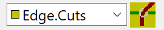
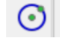
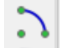
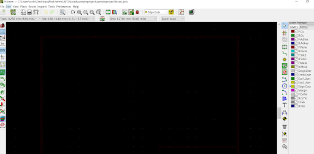
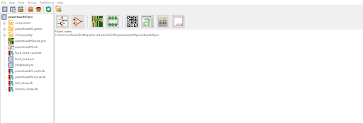
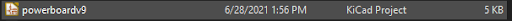
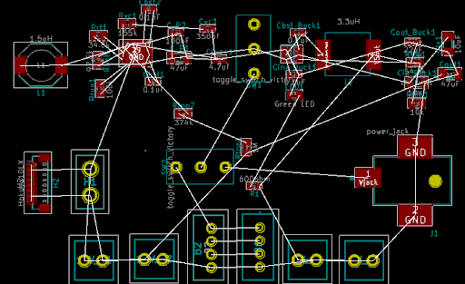
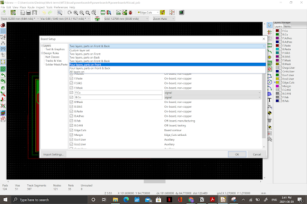

3 - Board Layout in PCBnew
======================

   
.. |glines| image:: ../_static/images/Board9.PNG
   :width: 3%
   

   

   
.. |gpolygon| image:: ../_static/images/board12.PNG
   :width: 3%
   
.. |grid| image:: ../_static/images/board13.png
   :width: 3%

PCBnew
------
After footprints have been assigned to all the components on the schematic, it's time to visualize how the board will look.

To get to PCBnew ; open the project tab and open the PCBnew icon PCBnew

    
If you closed the project tab, open the project file again.

Board Layout
------------

1. **Load netlist:** A netlist entails the electrical components and how they are connected in the circuit. Navigate to the left top corner to select tools >> update PCB from schematic to place the schematic in pcbnew. Importing the netlist will yield something like the image below, the white strings could look more tangled.

    
2. **Define board layers and thickness:** This is where you define whether you want a 2,3,4 or 6 layer board and the board thickness. Navigate to file on the top left corner. Select board Setup >> layers and select what layer you want from the dropdown. It's important you remember what side (front or back or front and back) your parts will be on.

    
3. **Board outline:** The board boundary has to be defined. If you have specific limitations to the size of your PCB, now is the time to figure them out. The board can be any shape from rectangles, circles, triangles, to non standard shapes. Ensure in the drop bar at the top toolbar, |ecuts| is selected then use either the graphic lines |glines|, graphic circle |gcircle|, graphic arc |gcircle|, or graphic polygon |gpolygon| icon to draw the board outline. 

   .. figure:: ../_static/images/board14.PNG
     :figwidth: 700px
     :target: ../_static/images/board14.PNG
      
* To add drilled holes to the board, just treat the holes as circles and place the graphic circles where you want the holes to be at. 
* Left click on the outline of the graphic to edit its properties such as length
* Reduce the grid size at the middle of the top toolbar |grid| to ensure straighter lines

