3D Printing in the Student Design Hub
=====================================

Welcome
-------

Welcome to Memorial University's Student Design Hub! Here you have access to multiple 3D printers where can 
bring your digital designs to life! 

Introduction
------------

3D printing or additive manufacturing is a process in which solid objects are made from a digital file. The 
most widely used technique is Fused Deposition Modeling (FDM) in which material is layered to create 
polymer-based parts, ranging from basic to complex geometrical shapes. These can be standalone parts 
and/or components of a bigger structure. The relative speed of creating these parts (a couple of hours 
depending on size, design, and infill) allows for proof of concepts to be developed rapidly, moving past 3D 
modeling, a very powerful tool tied to 3D printing. The end results used to be used exclusively for 
prototyping, however, due to the advancements of 3D printing technology and materials, 3D prints are 
being used more frequently as end products and parts.

For more detailed information please visit the sources used under Reference List

Materials
^^^^^^^^^

The most common materials for 3D printing are **Poly Lactic Acid (PLA)** and **Acrylonitrile Butadiene
Styrene (ABS)**. PLA filament is a biodegradable material that is easy to print due to its low heating 
requirements, however it does not possess a very high resilience to UV rays, its more suitable for parts 
used indoors and at around room temperature. ABS filament in the other hand requires a higher 
temperature to be printed, but it offers UV resilience as well as better mechanical properties in high 
temperature environments. There are many other materials available to print as well, depending on the 
printer you use. Some materials are:

* Polyethylene Terephthalate Glycol (PETG)
* Thermoplastic Polyurethane (TPU)
* High Impact Polystyrene (HIPS)
* Polycarbonate (PC)
* Thermoplastic Elastomer (TPE)
* Nylon
* Acrylonitrile Styrene Acrylate (ASA)
* Polypropylene (PP)
* Polyvinyl Alcohol (PVA)
* Glass Fiber or Carbon Fiber Infused
* Metal or Wood Fill
* Etc.

Modelling
^^^^^^^^^

One of the advantages of 3D printing is that very complex models can be achieved. However, when 
crafting your 3D model in a computer-aided design (CAD) software, such as SolidWorks, some design 
considerations can help ensure better results.

**Resoultion:** Similar to image resolution, a 3D printer has a minimum feature analogous to a pixel in 
picture, this is the smallest “dot” it can print, and it is dependent on the nozzle size. 
Resolution is divided into XY-resolution, dependent on the nozzle diameter and the smallest movement the 
stepper motor on the printer can achieve and the Z-resolution is dependent on the layer height. 
Each printer can have a different minimum layer height.

 
.. figure:: ../_static/images/3DPDG3.PNG
    :figwidth: 600px
    :target: ../_static/images/3DPDG3.PNG

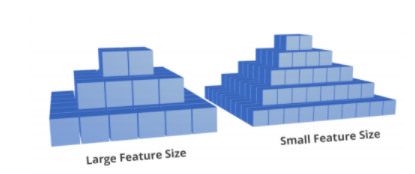

**Orientation:** Printing orientation of the 3D model can greatly 
improve the surface quality of the print. The figure displays the same 
3D model printed horizontally and vertically. The horizontally print 
would display a “staircase” pattern, while the on vertically print this 
patter would be greatly reduced achieving a smoother print. 
Conversely, when printing parts that would undergo a mechanical 
load, the former would support more force applied to it at the peak of 
the semi-dome than the latter. 

.. figure:: ../_static/images/3DPDG5.PNG
    :figwidth: 600px
    :target: ../_static/images/3DPDG5.PNG

**Size:** If you are making a display model, then this is less critical as you can scale your 
design before printing to be within the boundaries of the printing volume. This is determined 
by the building platform’s area and the height of the printing chamber. Each printer has its 
own unique printing volume.

**Wall Thickness:** A minimum wall thickness is required for the 
model to be able to print and be structurally sound. This dimension 
would be affected if the model needs to support any force, but as a 
rule of thumb for ABS it is recommended to use a minimum wall 
thickness of 1.2mm. Different materials and printers have their own configurations.

**Shrinkage and Assembly:** When printing parts that are design to 
be connected to each other, keep in mind the shrinkage that the 
prints will undergo. This deviation of the print from the model’s 
nominal size is also known as **dimensional accuracy** and is 
generally around 0.1% or ±0.2mm.

.. figure:: ../_static/images/3DPDG6.PNG
    :figwidth: 800px
    :target: ../_static/images/3DPDG6.PNG

**Embossed and Engraved Details:** Engraving refers to details added into the print (inwards), 
a minimum line thickness of 1 mm and a depth of 0.3 mm is recommended. By contrast, embossing 
are details that protrude from the printed model, a line thickness of at minimum 2.5 mm and a 
depth of at least 0.5 mm is advice. Engravings are usually preferred as they require much lower 
tolerances than embossing details.

.. figure:: ../_static/images/3DPDG7.PNG
    :figwidth: 800px
    :target: ../_static/images/3DPDG7.PNG

**Support Material:** To be able to achieve intricate designs most 3D printers employ support 
material. The most popular ones being soluble and breakaway ones. Both types of supports have their 
cons and pros, soluble support materials are easy to remove, since it dissolves on a solution, 
leaving behind a clean print, however some soluble support material such as PVA take up to 24hrs 
to fully dissolve. By contrast, breakaway support materials can be removed from the print as soon 
as the model is completed, but in certain complex geometries they tend to leave residue behind 
and/or are difficult to completely remove without damaging the print if the design possess 
deep channels or crevices in the inside faces of the model, especially if no exit hole is 
built into the design. This is very important to keep in mind when modeling your 3D design.

.. figure:: ../_static/images/3DPDG8.PNG
    :figwidth: 600px
    :target: ../_static/images/3DPDG8.PNG

**Moving Parts:** Support material allows for the printing of preassembled models 
with moving parts, for these to successfully print a minimum clearance of 0.4mm 
is advised, the greater the space that can be afford, the better chance the model has to print properly.

.. figure:: ../_static/images/3DPDG10.PNG
    :figwidth: 700px
    :target: ../_static/images/3DPDG10.PNG

STL Format
^^^^^^^^^^

After you have finished your design, save the SolidWorks model in the native format SolidWorks Part File 
(SLDPRT) as well as the Standard Triangle/Tessellation Language file format (STL) [1]. To save your 
model in STL format go to File>>Save as, and change the file format from SolidWorks Part (*.prt;*.sldprt) 
to STL (*.stl) in the prompted window, as shown in the image below:

.. figure:: ../_static/images/3DPDG11.PNG
    :figwidth: 600px
    :target: ../_static/images/3DPDG11.PNG

The SLDPRT file stores the part as a solid model, keeping the specified details of material, color, and 
texture. On the other hand, an STL file stores only the information of the 3D model surface, it represents 
this surface as small adjacent triangles.

.. figure:: ../_static/images/3DPDG12.PNG
    :figwidth: 700px
    :target: ../_static/images/3DPDG12.PNG

Printing
^^^^^^^^

The .STL file will be imported into a slicer, a software that produces a path for the 3D printer to 
follow to be able to print the model. This set of commands or language is known as G-code, and it 
tells the printer what movements to make from begging to end of the print.

.. figure:: ../_static/images/3DPDG13.PNG
    :figwidth: 700px
    :target: ../_static/images/3DPDG13.PNG

uPrint SE
---------

To have parts printed with the uPrint SE 3D Printer, please visit  :ref:`Requesting Parts From the Digital Design and Prototyping Lab`.

Eryone ER-20
------------

.. figure:: ../_static/images/Eryone1.PNG
    :figwidth: 350px
    :target: ../_static/images/Eryone1.PNG

How to Use the Eryone ER-20 Printer
^^^^^^^^^^^^^^^^^^^^^^^^^^^^^^^^^^^

There are a few steps involved before printing with the Eryone ER-20 printer. The first is to 
make sure your 3D model has been saved in STL format. Please review :ref:`STL Format` to learn how. 

The next step is selecting a material to use in this print. The Eryone ER-20 supports 3 different materials:
 
* **Poly Latic Acid (PLA):** PLA filament is a biodegradable material that is easy to print due to its low heating requirements, 
  however it does not possess a very high resilience to UV rays, its more suitable for parts used indoors and at around 
  room temperature.

* **Polyethylene Terephthalate Glycol (PETG):** PETG is a more durable filament then PLA. It has good chemical resistance, 
  flexibility, and impact resistance. As well as being good for clear prints, however this also means “post processing” such 
  as sanding or removing supports can be much more difficult. 

* **Thermoplastic Polyurethane (TPU):** TPU is a rubber like filament offering it flexibility and versatility, however it 
  can be more of a challenge to print. 

More information on each filament can be found `here <https://3dinsider.com/pros-and-cons-3d-printing-filaments/>`_

Once you have chosen a material, the next step is to upload your STL to a Slicer. In this case we will be using Simplify3D. 

There are two guides to using Simplify3D: A quick guide for very easy and simple PLA parts such as a chess piece and a detailed 
guide for more complex parts and different materials. 
 
Open up Simplify3D by double clicking the icon. 

.. figure:: ../_static/images/Eryone2.PNG
    :figwidth: 400px
    :target: ../_static/images/Eryone2.PNG

You should be brought to this page.

.. figure:: ../_static/images/Eryone3.PNG
    :figwidth: 700px
    :target: ../_static/images/Eryone3.PNG

If there is already an item(s) on the screen, please select the “Remove” button. Then click “Import”, this should bring you 
to file explorer where you will open up your STL.

.. figure:: ../_static/images/Eryone4.GIF
    :figwidth: 700px
    :target: ../_static/images/Eryone4.GIF

Here is where you can view your model from different angles. By left clicking and dragging you can rotate around the model, by 
right clicking and dragging you can change the point of rotation. The command bar on the right side of your screen is 
also available for quick changes to different viewing planes, similar to *SOLIDWORKS*.

This command bar also lets the user position, scale or rotate their model. You can also double click your model for 
precise numerical changes and the ability to reset any changes.

.. figure:: ../_static/images/Eryone6.GIF
    :figwidth: 700px
    :target: ../_static/images/Eryone6.GIF

The center and arrange button will automatically fix the orientation of your part(s) and make them fit on the bed. 

When arranging your part on the bed there is a few things to take into consideration. FDM printing is done by 
layering melted thermoplastic on top of itself, building from the ground up. You can not print something in thin 
air, there needs to be something to support it. Take a look at this bracket:

.. figure:: ../_static/images/Eryone7.PNG
    :figwidth: 700px
    :target: ../_static/images/Eryone7.PNG

The first arrangement does not work because it requires plastic to be laid down in thin air. The second arrangement will 
print however, you should also look at the largest **FLAT** surface of your model and print from there. This will 
assure good bed adhesion and a better chance at a successful print. The third option with a large **FLAT** surface to 
print from and no overhang is the best option for this model. 

Once your part(s) are arranged on the bed, click “Edit Process Settings”. This window should appear:

.. figure:: ../_static/images/Eryone8.PNG
    :figwidth: 700px
    :target: ../_static/images/Eryone8.PNG

This is the command center of Simplify3D, everything happens in here. In this quick guide we will not be going through all 
the settings but instead checking a few things to make sure everything is right before you print. If your model consists of 
any of the following features, then you may want to consider the :ref:`Advanced Workflow`.

* Non-PLA Material
* Large Overhang (Support structures needed)
* Thin Walls
* Fine Details
* No Large Flat Surface to Start Print From
* Needs to be Especially Dense or Strong
* Multiple Colours or Materials
* Electronic Enclosure (Threaded Holes)
* Troubleshooting

See here an example sheet.
:download:`pdf <Advanced Guide pdf.pdf>`

*Subject to change*

If your part is simple and does not fall under any of the above categories, then please follow the instructions below.

Once you select edit process settings this page should appear. Make sure everything is in the green boxes matches your 
screen. “Coast at End” and “Wipe Nozzle” should not be checked.

.. figure:: ../_static/images/Eryone9.PNG
    :figwidth: 700px
    :target: ../_static/images/Eryone9.PNG

Now click the layer tab and check these settings:

.. figure:: ../_static/images/Eryone10.PNG
    :figwidth: 700px
    :target: ../_static/images/Eryone10.PNG

Next the Additions Tab, only skirt/brim should be checked. Uncheck any other boxes if they are on. 

.. figure:: ../_static/images/Eryone11.PNG
    :figwidth: 700px
    :target: ../_static/images/Eryone11.PNG

Next is the infill tab. The offset boxes should rarely be touched but if it is not the same, use the add and remove angle 
buttons to navigate the boxes. 

.. figure:: ../_static/images/Eryone12.PNG
    :figwidth: 700px
    :target: ../_static/images/Eryone12.PNG

Nothing should be selected in the support tab.

For Overture PLA filament, these are the temperatures that should be used.

*Picture to be added*

For other PLA filament temperatures click :download:`pdf <PLA Temperature Brand Sheet.pdf>` 

Nothing should ever be touched in the G-Code tab, but just to be sure, check these settings:

.. figure:: ../_static/images/Eryone13.PNG
    :figwidth: 700px
    :target: ../_static/images/Eryone13.PNG

In the Scripts tab there are a few different windows. Layer Change, Retraction and Tool Change Scripts should all 
be blank. The Starting and Ending Scripts should look like this.

.. figure:: ../_static/images/Eryone14.PNG
    :figwidth: 700px
    :target: ../_static/images/Eryone14.PNG

.. figure:: ../_static/images/Eryone15.PNG
    :figwidth: 700px
    :target: ../_static/images/Eryone15.PNG

Next is the Speeds tab.

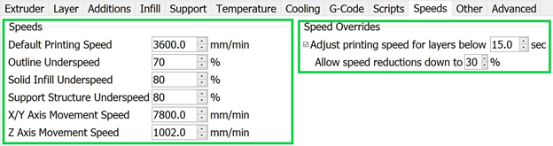

The Other tab. Filament Properties and Tool Change Retraction does not affect the print.

.. figure:: ../_static/images/Eryone17.PNG
    :figwidth: 700px
    :target: ../_static/images/Eryone17.PNG

*Bridging is subject to change*

And finally, the Advanced tab.

.. figure:: ../_static/images/Eryone18.PNG
    :figwidth: 700px
    :target: ../_static/images/Eryone18.PNG

These should all be the default settings under the “Eryone ER-20” profile however it is always good practice to check and make sure.

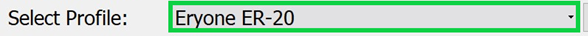

Select the “OK” button, the window should close. Now click “Prepare to Print!”. You should be brought to this screen where 
you can how the model will be printed layer by layer. 

.. figure:: ../_static/images/Eryone20.GIF
    :figwidth: 700px
    :target: ../_static/images/Eryone20.GIF

You can also view the different features that the print has. 

For a simple print there is nothing needed to do here. In the top left corner Simplify3D estimates the build time 
however, it is rarely accurate. A good practice is to add about 20% more time, but it may be more or less.
 
You now want to acquire the Micro SD card and plug it into the computer using the USB A adapter. Now click “Save 
Toolpaths to Disk” and transfer the SD card to the printer (Via Left side hole).

To prepare your printer and begin printing click :ref:`Preparing Printer`

Advanced Workflow
^^^^^^^^^^^^^^^^^

Welcome to the Advanced Workflow! Please expand the Eryone ER-20 tree on the left side of your screen to view all sections.

Changing and Inserting Material
^^^^^^^^^^^^^^^^^^^^^^^^^^^^^^^

Changing the material with the Eryone printer is a very simple process. The first thing you want to do is find your selected
material and bring it to the printer. 

Now, you want to grab the wire cutters and the end of the filament, being very careful not to let go of the filament so it does 
not flick back to the spool and get tangled up. Cut the end of the filament at a 45° angle and keep hold of the end or place 
it back in the side spool hole.

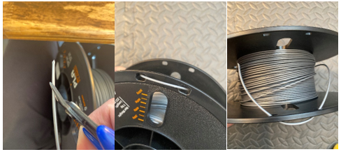

*Please read all instructions as you will need to do this even when replacing or changing filament that is already in the printer.*

If there is no filament in the printer already, place the spool onto the spool holder. Grab the end of the filament that you 
have cut and insert it into the orange tube. Keep pushing the filament in until it reaches the golden wheel. Now you want to pinch 
the back of the orange clamp that encases the golden wheel and push the filament through, so that it goes past the wheel and into
the next hole. If the filament goes into the next hole, continue to pinch the clamps, and push the filament all the way until it 
stops (hitting the start of the extruder).

.. figure:: ../_static/images/Filamentchange2.PNG
    :figwidth: 500px
    :target: ../_static/images/Filamentchange2.PNG

If the filament is not going into the next hole and is instead going upwards toward the top of the clamp, there is a simple 
fix. Pull the filament back so that it is before the hole. Grab a friend or some assistance and a thin tool, such as a 
knife (BE CAREFUL). You will want to pinch the orange clamp and push the filament down with the knife. At this time have your 
friend push the filament while you push the filament down so that it goes through the hole.
 
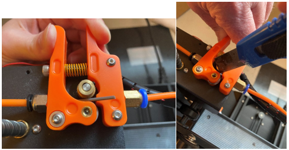

*If you are changing the filament you can skip this next step because the printer should do this by itself when changing filament.*

Once you have the filament pushed all the way until it hits the start of the hot end, you are going to want to heat up the hot end. 
Make sure the printer is turned on (via power switch on back), then click the scroll wheel. Navigate to Temperature-> Nozzle -> and 
then scroll up to 215 for PLA (245 for PETG and 215 for TPU) and click the wheel. Go back to the Info Screen and wait for the nozzle 
to reach the desired temperature. Once the nozzle is heated, click the scroll wheel again and navigate to Motion-> 
Move Axis-> Extruder-> Move 10 mm. Then scroll the wheel to 10 mm and watch filament exit through the hot end. If no filament 
comes out, then scroll another 10 mm until it does. 

Next grab the wire cutters and clean up the extruded filament by pulling the filament away. Be careful the nozzle is over 
200° right now. Once you have cleaned the nozzle, go back to the temperature setting and turn the nozzle back to 0.

Congratulations! Your filament is all set up. 

If the printer already has filament in it, changing/ replacing is even easier. The Eryone ER-20 has built in instructions, so all 
you need to do is get your new filament, cut the end at 45° and hold onto it. Then go to the printer, click the scroll wheel, 
and navigate to Change Filament. If you are changing PLA, click preheat PLA, if you are changing PETG or TPU, click preheat 
custom and set the temperature to 245 and 215, respectively.  Then follow the instructions on the Eryone’s screen. If you have 
trouble inserting the new filament go back and check the figures above. 

Large Overhang/ Support Material
^^^^^^^^^^^^^^^^^^^^^^^^^^^^^^^^

Supports are needed for 3D models that have large overhangs and unsupported areas. When 3D printing with the Eryone ER-20, it is 
best to avoid supports whenever possible. Printers with only 1 extruder are limited to just break-away supports which can lead to 
poor finishes and more post processing. Supports also increase printing time. Sometimes you can reorient your part or even edit 
the design to make it more 3D printing friendly.

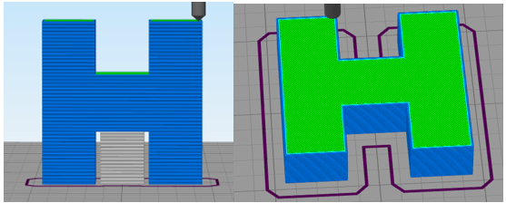

Take this H as an example. If the H were to be printed vertical, supports would be needed to print the middle section. By rotating 
the part on to its back, supports are no longer needed and there is also a larger flat surface to print from which is 
good for bed adhesion. 

That being said, sometimes avoiding supports is not an option and they must be used. Look at these pictures of a bracket. No matter 
what way it is oriented, supports will be needed for a successful print.

.. figure:: ../_static/images/Eryone39.PNG
    :figwidth: 700px
    :target: ../_static/images/Eryone39.PNG

Fortunately, Simplify3D has an automatic support structure system. With a few clicks you can generate automatic supports and even 
customize them to fit your part’s structural needs. 

Arranging your part with supports follows the same rules as normal. Try and find the largest flat surface of your part to print 
from. You also want to orient your part so that little support is needed. The best option for the bracket would be the second 
orientation, a large flat surface to print from and little support.

.. figure:: ../_static/images/Eryone35.PNG
    :figwidth: 400px
    :target: ../_static/images/Eryone35.PNG

Once your part is arranged on the print bed, click the “Customize Support Structures” icon on the command bar to the right.

.. figure:: ../_static/images/Eryone46.PNG
    :figwidth: 400px
    :target: ../_static/images/Eryone46.PNG

This window should appear.

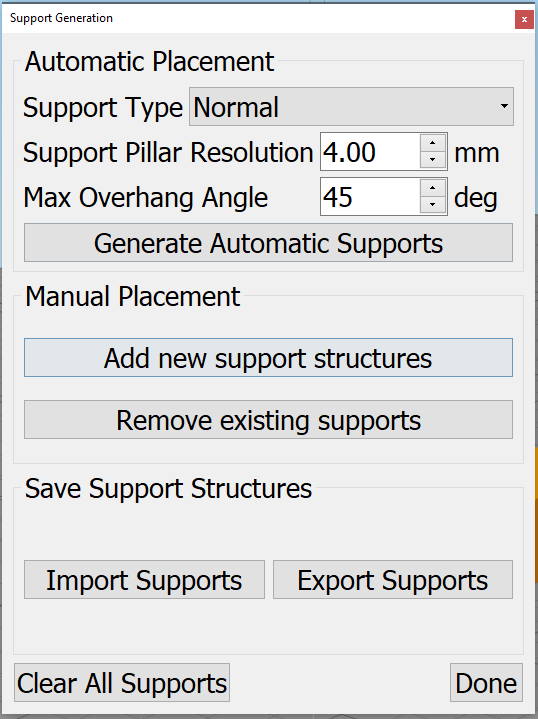

Select “Generate Automatic Supports”, then select “Done” and view the automatic supports created for your part. 

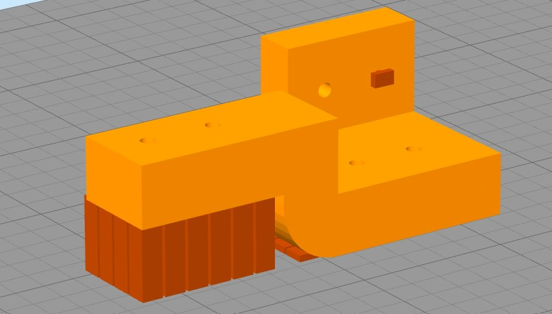

Simplify3D generally has pretty good support generation, however some adjustments may need to be made depending on your 
part. In our bracket example there are several holes. Vertical circular holes are usually not an issue for 3D printers, with 
each layer being so small, the printer can just slowly close the gap without supports. However, as you can see above, a support 
has been made for one of the holes.  This is where customizing your supports can come into play. 

Go back to the Customize Support tab and click “Remove existing supports”. Now click the individual red pillars that you 
would like to remove, in our case it is just the support in one of the holes.

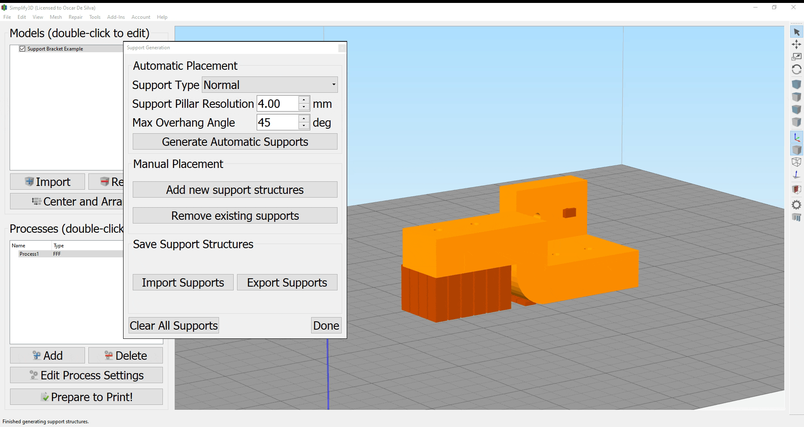

If you want to add support structures, select “Add new support structure” and place as desired. 

.. figure:: ../_static/images/Eryone45.GIF
    :figwidth: 700px
    :target: ../_static/images/Eryone45.GIF

When adding or removing support structures it is important to keep in mind one thing; are the supports necessary? You do no want 
to have excess supports, this will lead to a poorer finish and more post processing. So, when adding supports be careful, Simplify3D’s 
automatic supports should usually be enough. When removing, be careful as well and only remove unnecessary structures 
like the supports in this bracket’s vertical holes. 

Once you are happy with your supports, select “Done” and go to “Edit Process Settings”, then go to the “Support” tab. There 
are 5 boxes we need to go over. 

**Support Material Generation**

If you want to include your supports make sure the “Generate Support Material” box is checked. The “Support Extruder” should always 
be “Extruder 1” because the Eryone ER-20 only has a single extruder. “Support Infill Percentage” should be at 30% and is generally 
a good number unless you are dealing with fine details or small spaces that require support. You can increase this percentage 
but remember the more you increase the percentage the longer your print will take. Next is “Extra Inflation Distance”, this 
will make the supports “wider” depending on how big you set the number. It should be set to 0 however, may be useful if your 
support-needed area is really small and you need some extra space to build your part off of. “Support Base Layers” are a tool 
used to help create a better adhesion to the bed surface. If you are finding that your supports are coming loose from the bed, 
this tool will make the first X number of layers denser without making the entire support that dense to save 
time. *“Combining Support Layers” to be edited.*

**Dense Support**

Extruder 1 should always be selected. “Dense Support Layers” will add X number of layers in between the top of the support 
structure and the bottom of the actual print. This could be a useful tool if you want a larger surface area for the actual print 
to begin while saving time by not having the entire structure that dense. “Dense Infill Percentage” will determine how dense 
those top layers will be. 

**Automatic Placement**

This box only affects the automatic support generation feature and since we have already manually adjusted our supports usually 
do not need to touch anything here. However, it can be useful.

“Support Type” can be Normal or From Build Platform Only. Build platform will insure that supports only start from the bed 
surface and will not be added into things like our bracket’s vertical holes. This can be a quick tool to get rid of any 
unnecessary supports however since we already manually deleted the hole’s support, it does not need to be changed. As well 
sometimes you may need supports that start from a piec of your part.

.. figure:: ../_static/images/Eryone47.PNG
    :figwidth: 450px
    :target: ../_static/images/Eryone47.PNG

*This would not be the recommended orientation for this part but just used as an example.*

“Support Pillar Resolution” is how large the red pillars are. This can be increased to save time adding supports to large areas 
or decreased to add supports in smaller places.  “Max Overhang Angle” should be set at 45°. Changing this will determine where 
automatic support structures will be placed based on the angle of the print. 45° is the general rule of thumb for support 
structures but can be altered if you are having trouble with a smaller angle or do not need supports until a certain angle.
 
To reapply these settings to your automatic support generation feature. Go back to the customize support window, select 
“Clear All Supports” and then “Generate Automatic Supports”.

**Separation From Part**

“Horizontal Offset From Part” should be set at 0.30 mm. This is used to create some distance between the support and a 
vertical wall of your part. You may want to increase this if you find the support structures are interfering with vertical 
walls. 0.30 mm is usually fine. Upper and Lower Vertical Separation layers should be set at 1 and will create a distance between 
the support structure and your part. This makes the support structure easier to remove. If you are having trouble removing 
supports you can increase this number but be careful, increasing this too much may render the supports useless.
 
**Support Infill Angles**

This box will usually just say 0. Adding an angle of 30° (for example) will make the support structure switch back and 
forth between a straight line and a line at 30° for each layer. This tool can be used to create the look of a denser support 
structure, however, is not commonly used.

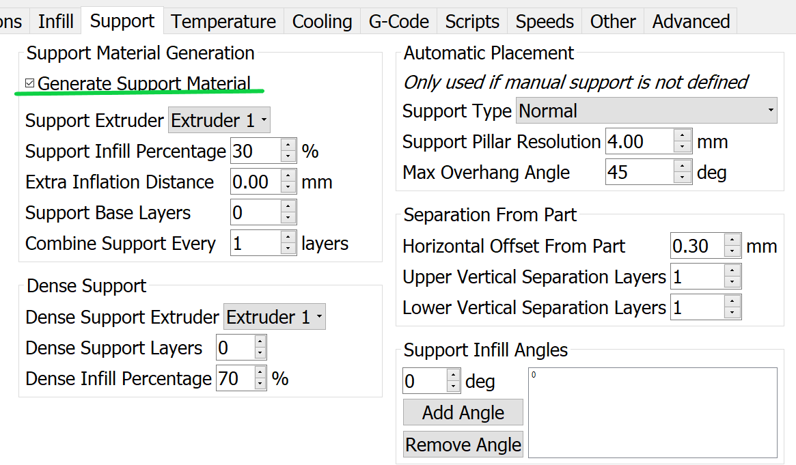

To view any of your changes to these settings you can exit the process settings and select “Prepare to print”. This will 
show how your support structures will be printed and you can judge your changes from this section.

No Large Flat Surface to Start Print From
^^^^^^^^^^^^^^^^^^^^^^^^^^^^^^^^^^^^^^^^^ 

When 3D printing, not all of your objects will have an ideal surface to print from. Fortunately, there are many settings in 
Simplify3D that can help with this and ensure a smooth print. Rafts and Brims are used in parts that have a flat surface to 
build from but not a large area. They are both used to help bed adhesion, but they do have some advantages over the other.
 
A raft is used to help keep the part stuck to the bed when there is not a lot of surface area to print from. Take this part as an 
example. The long skinny arm extruding from the base does not have a lot of surface area on the bottom and can create problems 
trying to stick to the bed. But using a raft will ensure that the part sticks to the bed and prints flat.

.. figure:: ../_static/images/Flatsurface1.PNG
    :figwidth: 600px
    :target: ../_static/images/Flatsurface1.PNG

There are some drawbacks when it comes to rafts though. Printing from a glass bed like the Eryone, gives a really smooth finish on 
the bottom. But if you use a raft your part is not starting from glass, it is starting from other plastic. This will make the 
bottom of your part rougher. Rafts also require post-processing, you will have to remove the raft after your print, and sometimes 
this can get challenging if parts of the raft will not come off.

Rafts are still very useful, here is how to use them in Simplify3D. The first step is to check the “Use Raft” box under the additions 
tab in “Edit Process Settings”. Extruder should always be Extruder 1. Next are the top and base layers, the sum of these will be how 
many layers your raft is. 3 layers for the top and 2 for the bottom is a good starting point for this. The top layers will be 
solid, and the bottom will not. Next is the offset from the part, this is how far your raft will extend. Typically, 3mm is a good 
number but if your raft is small, increasing it might be better for bed adhesion.  Separation Distance is how far apart the raft 
and the start of your part is, you want this to be at least 0.1 mm so the raft will come off. Top infill should be 100%, this is the 
infill of your top layers, 100% is good so that there is an even flat surface to start your part. Above raft speed is how fast the 
first layer of your part will be, this needs to be a low number below 50% so that the first layer can go down well and stick to the 
raft.

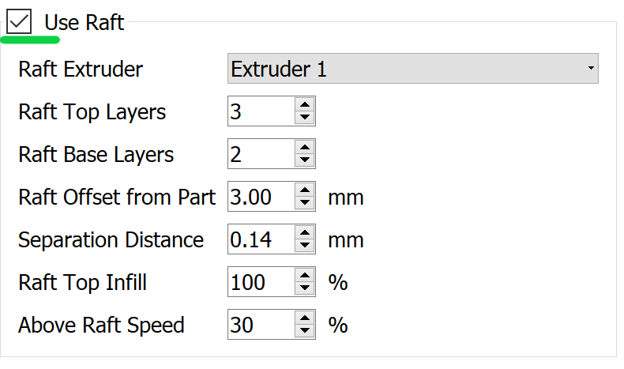

Brims are used to help keep your part suck down but also offer some stability in your parts in case it has something like legs. 

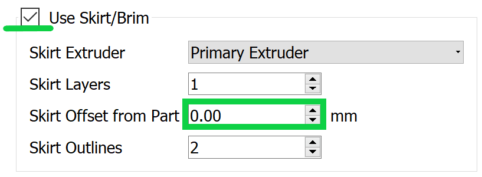

Brims also require some post-processing, however since the bottom of your part is still starting on the glass, the bottom will 
be smooth like normal. Brims and skirts are technically the same things, but to use a brim you just need to make sure that 
the **offset is set to 0**. The number of layers and outlines depends on how much stability is needed. Layers how many vertical 
layers there will be, 1-3 is usually okay but more can be added as desired. Just remember the more you add the more you 
will have to remove later. Outlines depend on how much stability/help with adhesion you need as well. 2-3 is a good number 
for this but also can be added as needed. Increasing this will not affect post-processing that much. 

Infill Percentage%
^^^^^^^^^^^^^^^^^^

3D Printing gives you the option of customizing the infill of your parts. Whether you want to make your part hollow, solid, or 
somewhere in between, Simplify3D has the tools to do it. 

The default infill percentage and pattern is 20% Rectilinear. 

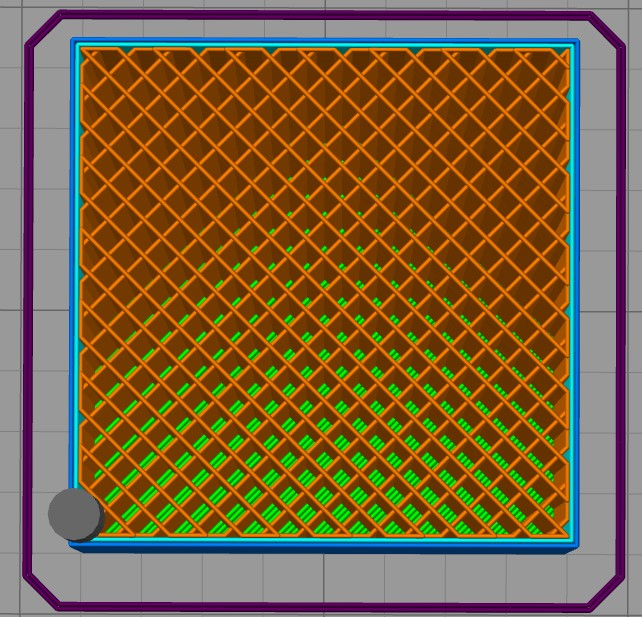

This combination offers good printing speed without compromising strength. A 20% rectilinear infill pattern is going to be perfect 
for most basic prints made with this printer. However, changing the pattern or percentage is very easy using Simplify3D.
 
The first step is to go to “Edit Process Settings”. You will notice in the “General Settings” box towards the top of the 
window, there is a bar that offers quick changes to the infill percentage. While this is a good tool, the “Infill” tab offers 
more detailed options.  

We will start in the “General” box under the infill tab. “Infill Extruder” should always be set to Extruder 1. There are 6 options 
for “Internal Fill Pattern”:

.. figure:: ../_static/images/Infill2.PNG
    :figwidth: 700px
    :target: ../_static/images/Infill2.PNG

`<https://the3dbros.com/3d-print-infill-patterns-explained/>`_

**Rectilinear:** Offers a good balance between speed and strength. This is the typical pattern you should use.

**Grid:** Offers a stronger structure, however, will increase print time and material use. Not necessary for normal parts.
 
**Triangular:** Offers even more strength but increases print time and material use further. Only for specific needs.

**Wiggle:** Is more used for aesthetic purposes. May increase print times and lower the strength of the over all part. Not recommended 
for general practical use. 

**Fast Honeycomb:** Is the same as Wiggle. Aesthetic purposes and lower strength.

**Full Honeycomb:** Offers a middle ground between Fast Honeycomb and Rectilinear. Better strength then fast while still having 
aesthetic applications. 

The next option is “External Fill Pattern” which is how the bottom and top layers will be laid out. The two options are Rectilinear 
and Concentric. Concentric is purely for Aesthetics and has no structural impact. Since it is only the top and bottom layers 
there will be no substantial change to print speed or material use.

.. figure:: ../_static/images/Infill3.PNG
    :figwidth: 500px
    :target: ../_static/images/Infill3.PNG

Next is “Interior Infill Percentage”. The typical range for this is 20%-50%, anything past 50% is more wasting time and material 
then providing structural advantages. That being said sometimes a solid print is needed. Going lower then 20% is also an option 
if you want to save time and are in a position where strength may not be compromised or necessarily needed. 

“Outline Overlap” is the amount the infill layer overlaps with the outline layer. This should be set at 15% and is a good 
starting point. If you find that there are gaps between your infill and outline you may want to increase this number.

.. figure:: ../_static/images/Infill4.PNG
    :figwidth: 500px
    :target: ../_static/images/Infill4.PNG

`<https://www.simplify3d.com/support/print-quality-troubleshooting/gaps-between-infill-and-outline/>`_

The next setting is “Infill Extrusion Width”, this tool can be used to increase the width on the individual lines of your 
infill. You may want to do this if you find that the infill is stringy, or you want to increase the strength of your part. Increasing 
the extrusion width does not increase the amount of material being used, it will just space out the infill more to keep the 
same amount of material, so increasing infill percentage at the same time is a good practice. 

“Minimum Infill Length” should be set at 5 mm and means any spaces under 5 mm will not have infill placed because it is so 
small, and infill would not have an affect.
 
“Combine Infill Every X layers”, if you are printing at a layer height of 0.2 mm and change this setting to “2 layers” then the 
printer will lay down two outlines of 0.2mm and then one infill of 0.4mm. This is a setting that can be used to save 
time where infill and strength is not the main priority. If you have a long print and can afford some decline in strength, then 
this might be a useful setting. 

The including solid diaphragm box should not be checked. This will print a solid layer every x number of layers you set it at. This 
setting can add some strength and if you have no top layers to your part this can prevent there being an opening all the way to the 
bottom of your part. Unless you need this setting for a specific need, it is not a recommended setting.
 
Next is the internal and external offset angles. Internal offset angles should be set to 45 and -45, if you click prepare to print 
you will notice how the infill gets laid out (at 45° angles). If your part is going to be used to withstand stress and you know 
exactly what direction it is coming from, you can manipulate this setting and the geometry of the infill so that your part will 
be more structurally sound if stress is applied on a certain side. External offset angles do the same as internal, however 
since its on the outside will more be for aesthetic purposes.
 
Please visit `<https://www.e-ci.com/3d-scoop/2020/6/18/infill-settings-in-simplify3d>`_ for more information on Simplify3D’s 
infill settings. 

Multi-Colour/Material Prints
^^^^^^^^^^^^^^^^^^^^^^^^^^^^

The Eryone ER-20 only has one extruder, so the user is limited to printing with only one material at a time. Fortunately, with the 
use of our slicer Simply3D, we have the ability to stop the print at a certain time, change the filament and resume the print 
with no issues.
 
Before we do that we first need to think about our part. As mentioned before 3D printing is done by laying down melted plastic 
layer by layer, this offers certain geometrical limitations in where you can have different colours or materials. For example, you 
would not be able to print this Benchy in these colours simply by switching out the material sometime during the print.

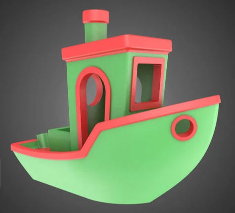

`<https://www.thingiverse.com/thing:763622>`_

As you can see, the colours switch back from red and green on different layers and are sometimes even on the same layer. Printing 
a part like is still possible with the Eryone ER-20, but it just involves some creativity.
 
If you need multiple materials or colours in your part, you can simply print out the different pieces individually and combine 
all together when you are done.

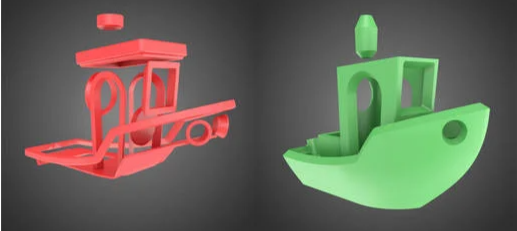

`<https://www.thingiverse.com/thing:763622>`_

In our Benchy example, all the red parts are printed out and then all the green parts are printed out. This is a good way to add more 
colour or materials to your designs without needed a larger printer with two extruders. So, if you need a part printed out like 
this, design your part in such a way that will allow different pieces to go together at the end. You can clip in the part, glue 
it together or add some fasteners like screws (For tips on threaded holes, visit “Electronic Enclosure”).
 
While you can print out different colours of your part separately, if your colour/material change only happens at a certain 
layer there is an easier way then having to assemble your part at the end.

Let us take this address plaque for an example.

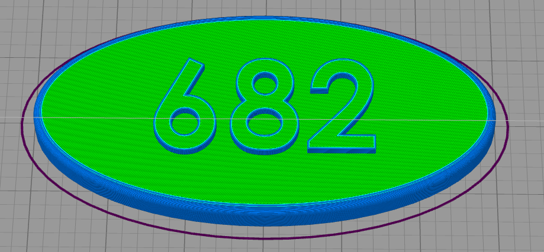

Let us say that you want to print the base white and the numbers black so that they are more visible. This is possible without having 
to print the numbers separate because the change happens at one layer. The first step is to make sure all your print settings 
are in check, we will need a layer number so having all the other settings complete is essential. Once you are happy with your 
settings, click prepare to print.
 
You now want to click through individual layer numbers and find the layer that you want to make the change. In our case it is 
layer 51.

.. figure:: ../_static/images/Multi4.GIF
    :figwidth: 700px
    :target: ../_static/images/Multi4.GIF

It is very important you select the correct layer. In our case if layer 50 was chosen instead of layer 51 then the whole top 
layer of our plaque base would be black too.

.. figure:: ../_static/images/Multi5.PNG
    :figwidth: 600px
    :target: ../_static/images/Multi5.PNG

Layer 50 is the top layer for the plaque base while layer 51 is the first outline for the numbers.
 
Once you have chosen your layer number, please visit the following website and follow the instructions. Your X and Y position does 
not necessarily have to be 0 and 0 but as long as the print head moves out of the printing area for our part. 

`Layer Change Website <https://budmen.com/support/user-guides/pause-print-at-layer/>`_

.. figure:: ../_static/images/Multi6.GIF
    :figwidth: 700px
    :target: ../_static/images/Multi6.GIF

*Please read all instructions on website and do not scroll through quick as shown in the GIF.*

Once you have copied to information to your clipboard go back to Simplify3D and paste it under the “Additional terminal commands for 
post processing” as shown in the GIF.
 
This will now stop your print at layer 51 giving you the ability to change filament and then resuming the print with no issues.
 
For filament changing tips please visit :ref:`Changing and Inserting Material`.
 
If you have done everything correct, proceed as normal to print your part just be ready with the filament for when the printer 
reaches the chosen layer.

You can do this process multiple times in one print, just go back to the website, chose the layer and put the code in the 
command box. 

Preparing Printer
^^^^^^^^^^^^^^^^^

Once you have saved your G-code to the micro-SD card and inserted it into the printer, it is time to prepare your printer.

Preparing the printer means, cleaning the bed and applying adhesion. If this is your first print of the day or you do not know 
when the last time the printer was used, it is a good idea to clean your print bed. The bed can become dirty by collecting things 
like dust, oils, plastic, and having old adhesion still on it. A dirty print bed leads to all kinds of problems when 
printing; your first layer might not go down correctly causing the part to break away mid-print, or your part might not be flat 
on the bottom which would not be good for assemblies.
 
Before you do anything, you want to make sure that the heated bed is turned off, you can leave the printer on but just make sure 
that the bed is not heated or being heating. This bottom number shows you what the temperature is right now and the top shows 
what it is being heated to. The top should say 0 and the bottom should say less than 30° before you touch it.

.. figure:: ../_static/images/PreP1.PNG
    :figwidth: 400px
    :target: ../_static/images/PreP1.PNG

The first step is to unscrew the clamps from the bed. Be careful not to lose these as they are very small but very important.

.. figure:: ../_static/images/PreP2.PNG
    :figwidth: 400px
    :target: ../_static/images/PreP2.PNG

Once the clamps are off and laid to the side take the glass plate off on the printer and lay it on the table. Be gentle and 
extra careful as the plate is glass and can break. Next, grab your cleaning supplies; you will need Windex, Isopropyl Alcohol, Two 
Microfiber Cloths, and your printer’s scraper.
 
*Picture to be added*

Take the scraper and scrape the bed, try to get off any large pieces of plastic that are stuck on and any visible dirt. Next, grab 
the Windex and spray the bed. It is important that the bed is off and away from the printer as Windex and Isopropyl Alcohol 
are dangerous to the printer's electronics.  Leave the Windex for about a minute and then grab one of the microfiber cloths and 
clean the bed. Here you are trying to get off any glue, hairspray, or other bed adhesion. If you are having trouble with getting
adhesive off you can unfold the cloth and use the scraper to clean. This will use the pressure of the scraper as well as the cleaning 
power of the Windex
 
.. figure:: ../_static/images/PreP4.PNG
    :figwidth: 400px
    :target: ../_static/images/PreP4.PNG

*Make sure glass bed is removed from printer when cleaning*

The bed should now be clean from any visible dirt, plastic, or adhesion. Now grab the Isopropyl Alcohol and spray it onto the 
bed, again wait a minute and then grab the other cloth and begin to wipe. The Isopropyl alcohol should clean any nonvisible dirt 
that is left on the bed. Once the bed is dry, place it back onto the printer and reattach the clamps. Dispose of the microfiber 
cloths and bring the cleaning products back to their original place. Your print bed should now be all clean and ready for perfect 
prints.
 
*Applying Bed Adhesion to be updated*

Once your bed is cleaned and your adhesion is applied it is time to start your print. Make sure the printer is turned on, there is a 
power switch on the back. As well, make sure sufficient filament is inserted into the hot end. To learn how to insert 
filament click visit :ref:`Changing and Inserting Material`.

When the printer is on you should be on the home page. Click the wheel and scroll to the bottom where it 
says, “Print from media”. Select the file you saved to the SD card and select print.

.. figure:: ../_static/images/Eryone27.GIF
    :figwidth: 300px
    :target: ../_static/images/Eryone27.GIF

If everything is okay, your model should print. It is a good idea to check on your print periodically to make sure nothing is 
going wrong. If you need to stop the print for whatever reason, click the button and scroll to “Stop Print”. A Successful print 
looks like this.

.. figure:: ../_static/images/Eryone21.GIF
    :figwidth: 300px
    :target: ../_static/images/Eryone21.GIF

Once the print is complete, let the bed cool down a little bit then peel your part off the bed. 

Congratulations! Your model should now be printed.
 

Troubleshooting
^^^^^^^^^^^^^^^

**Warping**

When 3D printing you may find that the bottom of your parts starts to warp mid-print. This warping can cause issues throughout your 
print and can result in a failed print. Sometimes your print may finish anyway, but your end part will not be as you designed 
it. If you notice your print start to warp, it is a good idea to stop the print and make some changes.

PICTURE
 
A few different things can cause a part to warp; dirty print surface, temperatures not being right, not enough adhesion, and 
so on. The first thing you should check is the print surface, remove your current print **(Make sure the bed has cooled down)** and 
inspect the bed, there should not be anything on the print bed besides the adhesive you applied beforehand. The adhesion you 
applied should be even, there should not be any clumps or areas missing adhesion. As well make sure that there is adhesion applied 
to the whole surface area from where your print is starting. If it does not seem like enough adhesion is applied, then adding 
some more might be helpful.
 
If everything is okay there, then you should have a look at your temperatures. Refer back to the temperature sheet in 
the :ref:`How to Use The Eryone ER-20 Printer` guide and make sure the temperatures are correct for the filament that you 
are using. Bed temperature is the most important number, the bed needs to stay warm for the filament to stick to it, you can 
try changing the bed temperature a few degrees either way to see if that makes a difference. If you notice the filament looks 
hard when it comes out of the extruder or is not coming out well then, your extruder might be too cold. If it seems like there is 
excess filament or the filament is a little melted then the extruder might be too hot. Changing the temperature just a few 
degrees can make a big difference.
  
Finally, if the warping is happening in a skinnier section of your part. See example below.

PICTURE
 
https://all3dp.com/2/3d-printing-raft-when-should-you-use-it/

Then a Raft or Brim can help hold your part down, visit :ref:`No Large Flat Surface to Print from` for tips on those settings.
 
**Blobs and Zits**

PICTURE

https://www.simplify3d.com/support/print-quality-troubleshooting/blobs-and-zits/

However, there are ways to minimize and control these blobs when 3D printing, with Simplify3D. The base setting in Simplify3D 
is to “Optimize start points for fastest printing speed”. This setting chooses a certain spot every time the extruder moves 
up a layer to start the next layer of the print as fast as possible, this is what is most likely causing any surface issues 
you have around your print. If you notice that there seem to be blobs in the same spot for a few layers and then it moves on 
to somewhere else for a few layers, you can try changing the “Start Points” under the Layer tab to “Use random start points for 
all perimeters”. This will make each layer start in a random area and hopefully reduce any blobbing patterns.
 
Another option is to “Choose Start Point closest to specific location” under the same section. This option will let you decide 
where you want each layer to begin, this is a useful feature if there is a certain section of the print where surface finish is 
not important. It can also be helpful if you are printing something for display like a bust where most people will not see the 
back, moving to start point to the back of the print will move any surface issues out of view. If you decide to use this setting 
you will need to enter an x and y coordinate. The measurements go off of the area of the print bed, from one edge to the other. The 
Eryone’s bed is 250mm in the x-direction, which means if your part is perfectly centered, and you want the seem to be at the back 
then you want to use 125mm as the x coordinate. The y coordinate then depends on how big your part is. Remember 
the setting says “closet to specific location” which means you don’t have to find the exact number of where you want the l
ayers to begin, just a number that is closest to where you want it to go.

PICTURE

Raise3D E2
----------

To be updated. 

