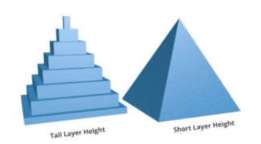
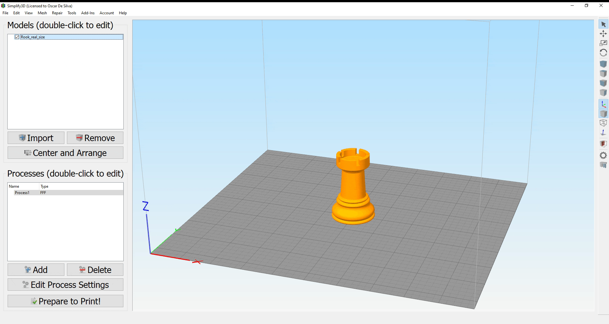
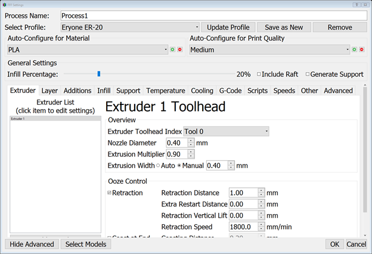
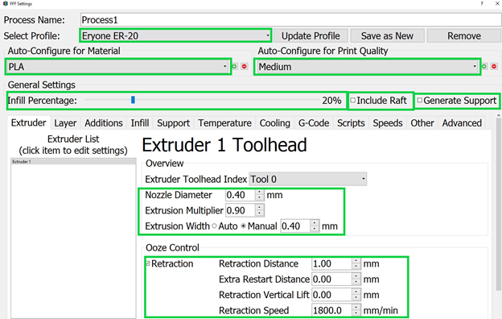
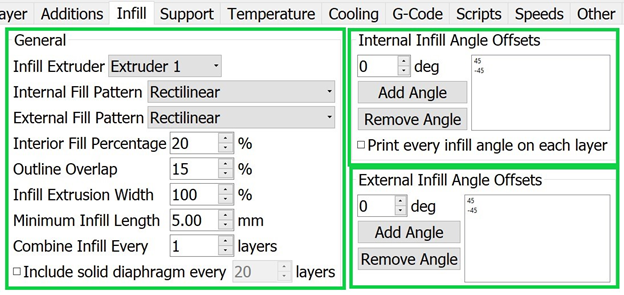
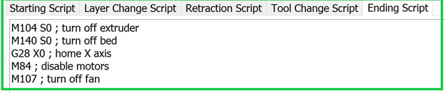
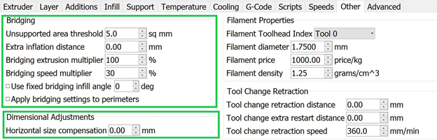
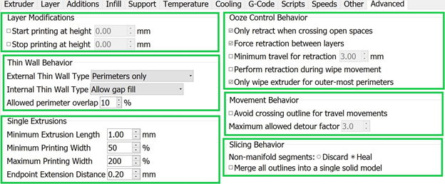
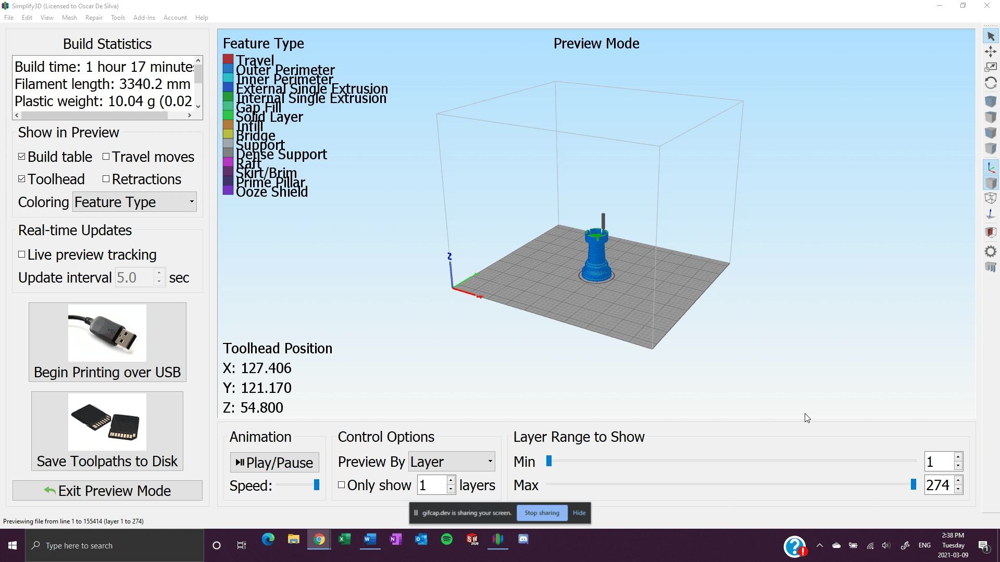

3D Printing in the Student Design Hub
=====================================

.. figure:: ../_static/images/3DPDG1.PNG
    :figwidth: 700px
    :target: ../_static/images/3DPDG1.PNG

Welcome
-------

Welcome to Memorial University's Student Design Hub! Here you have access to multiple 3D printers where can 
bring your digital designs to life! 

Introduction
------------

3D printing or additive manufacturing is a process in which solid objects are made from a digital file. The 
most widely used technique is Fused Deposition Modeling (FDM) in which material is layered to create 
polymer-based parts, ranging from basic to complex geometrical shapes. These can be standalone parts 
and/or components of a bigger structure. The relative speed of creating these parts (a couple of hours 
depending on size, design, and infill) allows for proof of concepts to be developed rapidly, moving past 3D 
modeling, a very powerful tool tied to 3D printing. The end results used to be used exclusively for 
prototyping, however, due to the advancements of 3D printing technology and materials, 3D prints are 
being used more frequently as end products and parts.

For more detailed information please visit the sources used under Reference List

Materials
^^^^^^^^^

The most common materials for 3D printing are **Poly Lactic Acid (PLA)** and **Acrylonitrile Butadiene
Styrene (ABS)**. PLA filament is a biodegradable material that is easy to print due to its low heating 
requirements, however it does not possess a very high resilience to UV rays, its more suitable for parts 
used indoors and at around room temperature. ABS filament in the other hand requires a higher 
temperature to be printed, but it offers UV resilience as well as better mechanical properties in high 
temperature environments. There are many other materials available to print as well, depending on the 
printer you use. Some materials are:

* Polyethylene Terephthalate Glycol (PETG)
* Thermoplastic Polyurethane (TPU)
* High Impact Polystyrene (HIPS)
* Polycarbonate (PC)
* Thermoplastic Elastomer (TPE)
* Nylon
* Acrylonitrile Styrene Acrylate (ASA)
* Polypropylene (PP)
* Polyvinyl Alcohol (PVA)
* Glass Fiber or Carbon Fiber Infused
* Metal or Wood Fill
* Etc.

Modelling
^^^^^^^^^

One of the advantages of 3D printing is that very complex models can be achieved. However, when 
crafting your 3D model in a computer-aided design (CAD) software, such as SolidWorks, some design 
considerations can help ensure better results.

**Resoultion:** Similar to image resolution, a 3D printer has a minimum feature analogous to a pixel in 
picture, this is the smallest “dot” it can print, and it is dependent on the nozzle size. 
Resolution is divided into XY-resolution, dependent on the nozzle diameter and the smallest movement the 
stepper motor on the printer can achieve and the Z-resolution is dependent on the layer height. 
Each printer can have a different minimum layer height.

 

.. figure:: ../_static/images/3DPDG4.PNG
    :figwidth: 600px
    :target: ../_static/images/3DPDG4.PNG

**Orientation:** Printing orientation of the 3D model can greatly 
improve the surface quality of the print. The figure displays the same 
3D model printed horizontally and vertically. The horizontally print 
would display a “staircase” pattern, while the on vertically print this 
patter would be greatly reduced achieving a smoother print. 
Conversely, when printing parts that would undergo a mechanical 
load, the former would support more force applied to it at the peak of 
the semi-dome than the latter. 

.. figure:: ../_static/images/3DPDG5.PNG
    :figwidth: 600px
    :target: ../_static/images/3DPDG5.PNG

**Size:** If you are making a display model, then this is less critical as you can scale your 
design before printing to be within the boundaries of the printing volume. This is determined 
by the building platform’s area and the height of the printing chamber. Each printer has its 
own unique printing volume.

**Wall Thickness:** A minimum wall thickness is required for the 
model to be able to print and be structurally sound. This dimension 
would be affected if the model needs to support any force, but as a 
rule of thumb for ABS it is recommended to use a minimum wall 
thickness of 1.2mm. Different materials and printers have their own configurations.

**Shrinkage and Assembly:** When printing parts that are design to 
be connected to each other, keep in mind the shrinkage that the 
prints will undergo. This deviation of the print from the model’s 
nominal size is also known as **dimensional accuracy** and is 
generally around 0.1% or ±0.2mm.

**Embossed and Engraved Details:** Engraving refers to details added into the print (inwards), 
a minimum line thickness of 1 mm and a depth of 0.3 mm is recommended. By contrast, embossing 
are details that protrude from the printed model, a line thickness of at minimum 2.5 mm and a 
depth of at least 0.5 mm is advice. Engravings are usually preferred as they require much lower 
tolerances than embossing details.

**Support Material:** To be able to achieve intricate designs most 3D printers employ support 
material. The most popular ones being soluble and breakaway ones. Both types of supports have their 
cons and pros, soluble support materials are easy to remove, since it dissolves on a solution, 
leaving behind a clean print, however some soluble support material such as PVA take up to 24hrs 
to fully dissolve. By contrast, breakaway support materials can be removed from the print as soon 
as the model is completed, but in certain complex geometries they tend to leave residue behind 
and/or are difficult to completely remove without damaging the print if the design possess 
deep channels or crevices in the inside faces of the model, especially if no exit hole is 
built into the design. This is very important to keep in mind when modeling your 3D design.

.. figure:: ../_static/images/3DPDG8.PNG
    :figwidth: 600px
    :target: ../_static/images/3DPDG8.PNG

.. figure:: ../_static/images/3DPDG9.PNG
    :figwidth: 600px
    :target: ../_static/images/3DPDG9.PNG

**Moving Parts:** Support material allows for the printing of preassembled models 
with moving parts, for these to successfully print a minimum clearance of 0.4mm 
is advised, the greater the space that can be afford, the better chance the model has to print properly.

.. figure:: ../_static/images/3DPDG10.PNG
    :figwidth: 700px
    :target: ../_static/images/3DPDG10.PNG

STL Format
^^^^^^^^^^

After you have finished your design, save the SolidWorks model in the native format SolidWorks Part File 
(SLDPRT) as well as the Standard Triangle/Tessellation Language file format (STL) [1]. To save your 
model in STL format go to File>>Save as, and change the file format from SolidWorks Part (*.prt;*.sldprt) 
to STL (*.stl) in the prompted window, as shown in the image below:

The SLDPRT file stores the part as a solid model, keeping the specified details of material, color, and 
texture. On the other hand, an STL file stores only the information of the 3D model surface, it represents 
this surface as small adjacent triangles.

.. figure:: ../_static/images/3DPDG12.PNG
    :figwidth: 700px
    :target: ../_static/images/3DPDG12.PNG

Printing
^^^^^^^^

The .STL file will be imported into a slicer, a software that produces a path for the 3D printer to 
follow to be able to print the model. This set of commands or language is known as G-code, and it 
tells the printer what movements to make from begging to end of the print.

.. figure:: ../_static/images/3DPDG13.PNG
    :figwidth: 700px
    :target: ../_static/images/3DPDG13.PNG

uPrint SE
---------

.. figure:: ../_static/images/3DPDG2.PNG
    :figwidth: 700px
    :target: ../_static/images/3DPDG2.PNG

To have parts printed with the uPrint SE 3D Printer, please visit  :ref:`Requesting Parts From the Digital Design and Prototyping Lab`.

Eryone ER-20
------------

.. figure:: ../_static/images/Eryone1.PNG
    :figwidth: 350px
    :target: ../_static/images/Eryone1.PNG

**How to Use the Eryone ER-20 Printer:**

There are a few steps involved before printing with the Eryone ER-20 printer. The first is to 
make sure your 3D model has been saved in STL format. Please review :ref:`STL Format` to learn how. 

The next step is selecting a material to use in this print. The Eryone ER-20 supports 3 different materials:
 
* **Poly Latic Acid (PLA):** PLA filament is a biodegradable material that is easy to print due to its low heating requirements, 
  however it does not possess a very high resilience to UV rays, its more suitable for parts used indoors and at around 
  room temperature.

* **Polyethylene Terephthalate Glycol (PETG):** PETG is a more durable filament then PLA. It has good chemical resistance, 
  flexibility, and impact resistance. As well as being good for clear prints, however this also means “post processing” such 
  as sanding or removing supports can be much more difficult. 

* **Thermoplastic Polyurethane (TPU):** TPU is a rubber like filament offering it flexibility and versatility, however it 
  can be more of a challenge to print. 

More information on each filament can be found `here <https://3dinsider.com/pros-and-cons-3d-printing-filaments/>`_

Once you have chosen a material, the next step is to upload your STL to a Slicer. In this case we will be using Simplify3D. 

There are two guides to using Simplify3D: A quick guide for very easy and simple PLA parts such as a chess piece and a detailed 
guide for more complex parts and different materials. 
 
Open up Simplify3D by double clicking the icon. 

.. figure:: ../_static/images/Eryone2.PNG
    :figwidth: 400px
    :target: ../_static/images/Eryone2.PNG

You should be brought to this page.

.. figure:: ../_static/images/Eryone3.PNG
    :figwidth: 700px
    :target: ../_static/images/Eryone3.PNG

If there is already an item(s) on the screen, please select the “Remove” button. Then click “Import”, this should bring you 
to file explorer where you will open up your STL.

.. figure:: ../_static/images/Eryone4.GIF
    :figwidth: 700px
    :target: ../_static/images/Eryone4.GIF

Here is where you can view your model from different angles. By left clicking and dragging you can rotate around the model, by 
right clicking and dragging you can change the point of rotation. The command bar on the right side of your screen is 
also available for quick changes to different viewing planes, similar to *SOLIDWORKS*.

.. figure:: ../_static/images/Eryone5.PNG
    :figwidth: 500px
    :target: ../_static/images/Eryone5.PNG

This command bar also lets the user position, scale or rotate their model. You can also double click your model for 
precise numerical changes and the ability to reset any changes.

The center and arrange button will automatically fix the orientation of your part(s) and make them fit on the bed. 

When arranging your part on the bed there is a few things to take into consideration. FDM printing is done by 
layering melted thermoplastic on top of itself, building from the ground up. You can not print something in thin 
air, there needs to be something to support it. Take a look at this bracket:

.. figure:: ../_static/images/Eryone7.PNG
    :figwidth: 700px
    :target: ../_static/images/Eryone7.PNG

The first arrangement does not work because it requires plastic to be laid down in thin air. The second arrangement will 
print however, you should also look at the largest **FLAT** surface of your model and print from there. This will 
assure good bed adhesion and a better chance at a successful print. The third option with a large **FLAT** surface to 
print from and no overhang is the best option for this model. 

Once your part(s) are arranged on the bed, click “Edit Process Settings”. This window should appear:

This is the command center of Simplify3D, everything happens in here. In this quick guide we will not be going through all 
the settings but instead checking a few things to make sure everything is right before you print. If your model consists of 
any of the following features, then you may want to consider the “Advanced Guide”:

* Non-PLA Material
* Large Overhang (Support structures needed)
* Thin Walls
* Fine Details
* No Large Flat Surface to Start Print From
* Needs to be Especially Dense or Strong
* Multiple Colours or Materials

See here an example sheet.
:download:`pdf <Advanced Guide pdf.pdf>`

*Subject to change*

If your part is simple and does not fall under any of the above categories, then please follow the instructions below.

Once you select edit process settings this page should appear. Make sure everything is in the green boxes matches your 
screen. “Coast at End” and “Wipe Nozzle” should not be checked.

Now click the layer tab and check these settings:

.. figure:: ../_static/images/Eryone10.PNG
    :figwidth: 700px
    :target: ../_static/images/Eryone10.PNG

Next the Additions Tab, only skirt/brim should be checked. Uncheck any other boxes if they are on. 

.. figure:: ../_static/images/Eryone11.PNG
    :figwidth: 700px
    :target: ../_static/images/Eryone11.PNG

Next is the infill tab. The offset boxes should rarely be touched but if it is not the same, use the add and remove angle 
buttons to navigate the boxes. 

Nothing should be selected in the support tab.

*Temperature tab to be updated*

Nothing should ever be touched in the G-Code tab, but just to be sure, check these settings:

.. figure:: ../_static/images/Eryone13.PNG
    :figwidth: 700px
    :target: ../_static/images/Eryone13.PNG

In the Scripts tab there are a few different windows. Layer Change, Retraction and Tool Change Scripts should all 
be blank. The Starting and Ending Scripts should look like this.

.. figure:: ../_static/images/Eryone14.PNG
    :figwidth: 700px
    :target: ../_static/images/Eryone14.PNG

Next is the Speeds tab.

.. figure:: ../_static/images/Eryone16.PNG
    :figwidth: 700px
    :target: ../_static/images/Eryone16.PNG

The Other tab. Filament Properties and Tool Change Retraction does not affect the print.

*Bridging is subject to change*

And finally, the Advanced tab.

These should all be the default settings under the “Eryone ER-20” profile however it is always good practice to check and make sure.

.. figure:: ../_static/images/Eryone19.PNG
    :figwidth: 600px
    :target: ../_static/images/Eryone19.PNG

Select the “OK” button, the window should close. Now click “Prepare to Print!”. You should be brought to this screen where 
you can how the model will be printed layer by layer. 

If all the settings have been correct up to this point, you now should transfer this G-code to the Mirco SD card
associated with your Eryone ER-20. Select "Save Toolpaths to Disk" and save it to the card.

Eject the Micro SD card from the computer and place it inside the printer, **Note the orienatation in the picture**. 

*Picture to be added*

Make sure the printer is on by using the power switch located on the back.

Please visit "Bed Adhesion" for the following steps, but once everything is complete a part being printed will look like this:

.. figure:: ../_static/images/Eryone21.GIF
    :figwidth: 300px
    :target: ../_static/images/Eryone21.GIF

 

  

  

 

Raise3D E2
----------

To be updated. 

 

