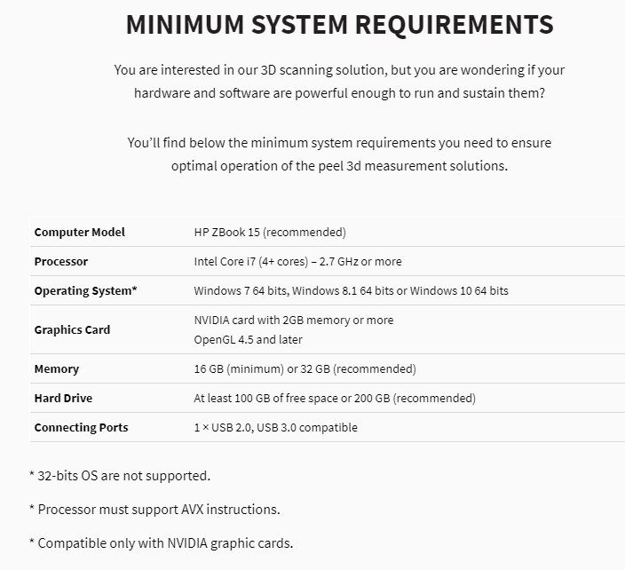

How to Use the Handheld Peel 1 3D Scanner
=========================================

On this page, you will find some ressources that will help with the operation of the Peel3D Peel 1 (that can be checked out from MUNMED3D). This scanner can be used to scan nearly object
that has a size of about 0.3 - 3.0 meters. Some important things to note before beginning with the scanner are:

* Make sure the object does not have a glossy surface. Glossy surfaces are harder to pick up by the scanner.
* You will need a good computer to run the included Peel3D software. Below is a list of the minimum system requirements:

* Surfaces with more geometry will scan much better than round and smooth surfaces. To scan surfaces that are found and smooth use the targets that are included in the case
* Do not tough the tragets on the calibration plate that is included in the case.

To begin setup of the Peel 1 scanner, please watch the following video. It will walk you through how to exactly set up the scanner along with installing the software on your device.
**For the calibration and license file, make sure you select 890139**.

.. raw:: html

   <iframe width="560" height="315" src="https://www.youtube.com/embed/o7RIFIGelp8" title="YouTube video player" frameborder="0" allow="accelerometer; autoplay; clipboard-write; encrypted-media; gyroscope; picture-in-picture" allowfullscreen></iframe>

The Peel 1 is very easy to use and the software is also very easy to learn. To begin, plesae watch the below video which will give you a detailed walk through on how to operate
the scanner along with how to clean up your scans using the Peel3D software:

.. raw:: html

   <iframe width="560" height="315" src="https://www.youtube.com/embed/3J7k1LNlhQQ" title="YouTube video player" frameborder="0" allow="accelerometer; autoplay; clipboard-write; encrypted-media; gyroscope; picture-in-picture" allowfullscreen></iframe>

The software that is included with the Peel3D has many features that allow you to clean up and edit your scans. Please navigate to `THIS LINK <https://www.youtube.com/playlist?list=PLX3IEnwqzeGcT_3r57VP2Z9pwM2EAdmyL>`_
where you will find a series of short videos going over every feature in the Peel3D software. You can simply watch whatever one is relevant to your current project.

Lastly, the Peel3D software allows you to export the mesh of the scan in a variety of file types such as obj, stl, zpr, ply, ma, x3d, fbx, and wrl. These files can be opened
using popular CAD software such as Solidworks or Fusion 360 where you can then obtain very precise measurements and use them in your designs.

