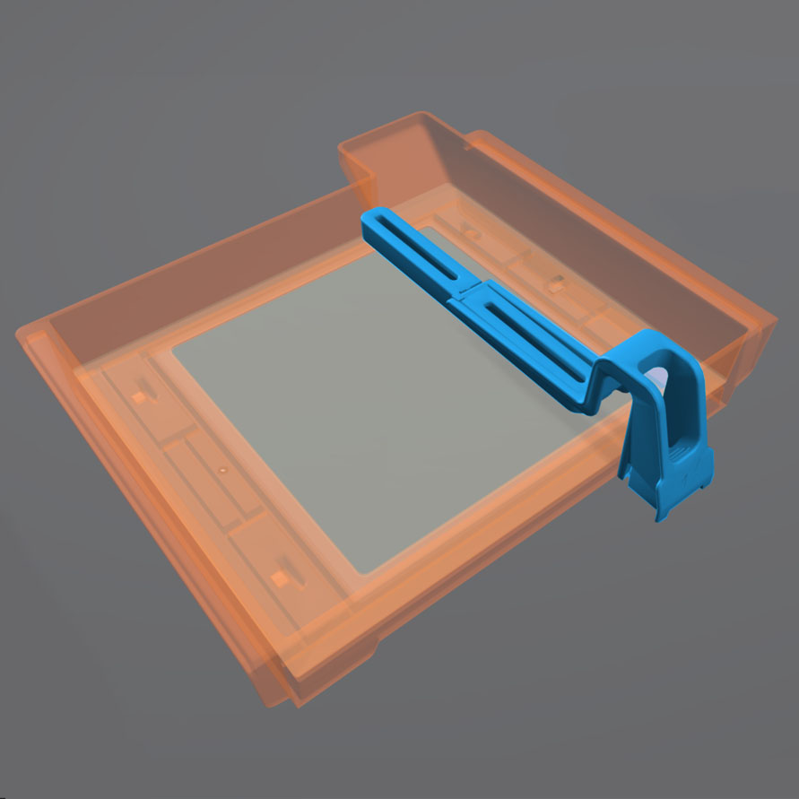

<<<<<<< HEAD
Supporting Your Part
====================

Preform has a built in auto-support setting that will give reliable results. Rafting works the same way it does on FDM printing 
but is used more frequently in resin printing. The support structures holding up your part all start from the raft. A thinner raft 
will provide less support while a thicker raft will increase the amount of force needed to remove the part from the build bed.

The number of supports (density) can be changed as well as the touchpoint size. The touchpoint size determines how much 
material from the support is physically making contact with the model. A small touchpoint size will reduce surface imperfection 
but will offer less support. 

Individual touchpoints can be modified, added or removed in the support settings tab. 

.. figure:: ../_static/images/RESINL.jpg
    :figwidth: 500px
    :target: ../_static/images/RESINL.jpg

Parts cannot print in mid-air, it is impossible! Thus, we must use supports to help print complex parts. The Preform slicer 
has a built in setting for finding unsupported minima (low points) and islands (pieces of the part printing in air. 
Click the < button and find the job info box. Enable the show minima setting from there.

This can also be done manually by dragging the print slider tool on the right hand side of the slicer. Each layer of the 
part can be viewed individually and inspected for unsupported pieces. 

.. figure:: ../_static/images/RESIN21.jpg
    :figwidth: 500px
    :target: ../_static/images/RESIN21.jpg

Part Orientation Advanced 
=========================

**Form 2 Wiper**
Orienting a model at an angle creates supports of varying lengths. If you are printing on a Form 2, you can place the 
longer supports closer to the wiper side. This decreases the distance the wiper travels during the final layers—reducing 
the cumulative time it takes for your part to print.

**Print Angle** 
In practice this means tilting surfaces 10 to 20 degrees and avoiding printing directly on the bed. If a part has a
 slight angle then there is less surface area per layer giving a lower chance of the part sticking to the 
 resin tank and ruining the print

.. figure:: ../_static/images/RESIN23.jpg
    :figwidth: 500px
    :target: ../_static/images/RESIN23.jpg

.. figure:: ../_static/images/RESIN23.1.jpg
    :figwidth: 500px
    :target: ../_static/images/RESIN23.1.jpg

**Overhangs and Islands**
An island is a section of the print that is printing without any support. An overhang is also a kind of island, 
but is generally above another piece of the part. It is impossible for a layer to print in mid-air
but it is possible to orientate the part to prevent the overhang in the first place. Overhangs should be avoided 
when possible by properly orienting the part. In the event the islands cannot be prevented, make sure to 
provide adequate support from the bottom of the island. Low points on the model will be indicated in red.

.. figure:: ../_static/images/RESIN24.jpg
    :figwidth: 500px
    :target: ../_static/images/RESIN24.jpg

**Lowest Point** 
 The lowest point of the part is considered to be the minima. All other layers of the part will be built on top of minima. 
 Ideally there should be one minima that is well supported. If there are multiple, try to reduce the amount and 
 make sure they are stable. 

 .. figure:: ../_static/images/RESIN25.jpg
    :figwidth: 500px
    :target: ../_static/images/RESIN25.jpg

**Intersection Integrity**
Parts with complex geometry are often printed on resin printers. To ensure integrity at joints and intersections 
it is best to have the intersecting features face down towards the build plate. This will ensure that the layers 
will separate into individual paths at the joint, instead of layers coming together at the joint. 

 .. figure:: ../_static/images/RESIN26.jpg
    :figwidth: 800px
    :target: ../_static/images/RESIN26.jpg

**Suction** 
If your part has an internal or enclosed hollow it is important that drainage holes are added to the part to 
minimize the suction force while printing. The hole must not be on the top of the print as this will not reduce 
suction during printing. The hollow can also be filled. This must be done in another 3D design package as 
Preform does not have the capabilities to do so. 

 .. figure:: ../_static/images/RESIN27.jpg
    :figwidth: 800px
    :target: ../_static/images/RESIN27.jpg

The drainage hole is placed correctly on the left model. The right drainage hole will not allow air to 
move freely during printing.
