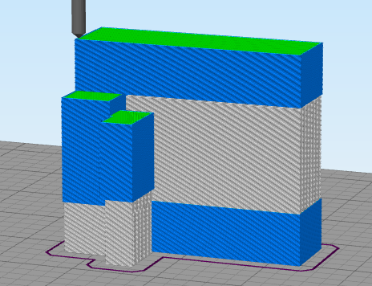
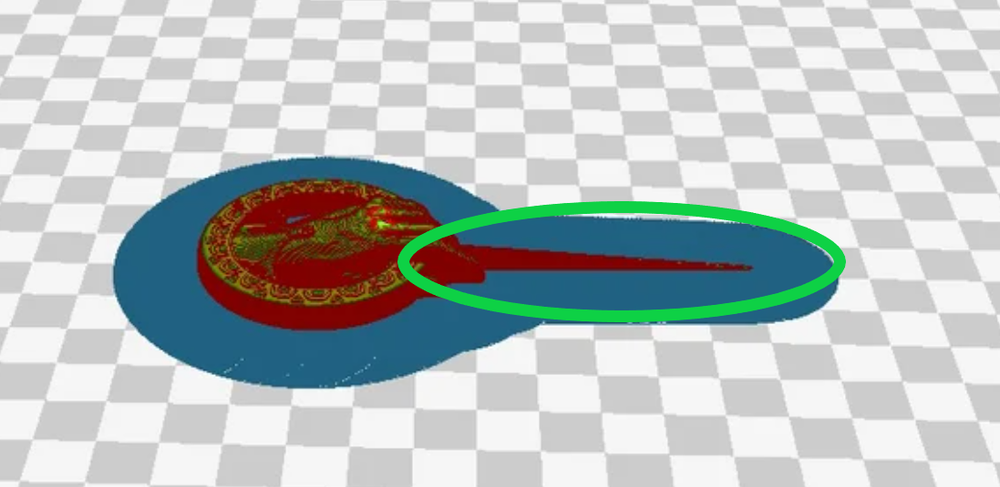
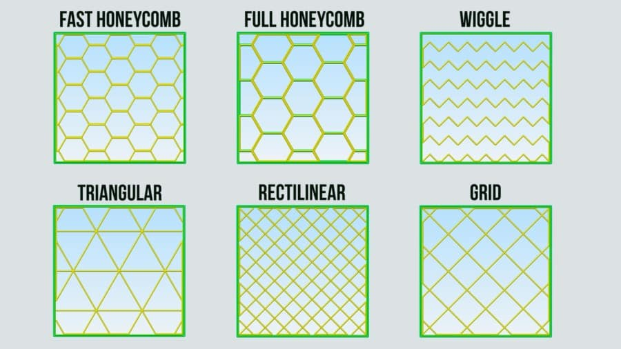
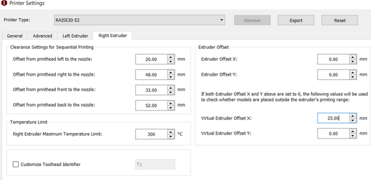

Advanced Workflow
=================

Changing and Inserting Material
-------------------------------

Changing the material with the Eryone printer is a very simple process. The first thing you want to do is find your selected
material and bring it to the printer.

Now, you want to grab the wire cutters and the end of the filament, being very careful not to let go of the filament so it does
not flick back to the spool and get tangled up. Cut the end of the filament at a 45° angle and keep hold of the end or place
it back in the side spool hole.

.. figure:: ../_static/images/Eryone37.PNG
    :figwidth: 500px
    :target: ../_static/images/Eryone37.PNG

*Please read all instructions as you will need to do this even when replacing or changing filament that is already in the printer.*

If there is no filament in the printer already, place the spool onto the spool holder. Grab the end of the filament that you
have cut and insert it into the orange tube. Keep pushing the filament in until it reaches the golden wheel. Now you want to pinch
the back of the orange clamp that encases the golden wheel and push the filament through, so that it goes past the wheel and into
the next hole. If the filament goes into the next hole, continue to pinch the clamps, and push the filament all the way until it
stops (hitting the start of the extruder).

.. figure:: ../_static/images/Filamentchange2.PNG
    :figwidth: 500px
    :target: ../_static/images/Filamentchange2.PNG

If the filament is not going into the next hole and is instead going upwards toward the top of the clamp, there is a simple
fix. Pull the filament back so that it is before the hole. Grab a friend or some assistance and a thin tool, such as a
knife (BE CAREFUL). You will want to pinch the orange clamp and push the filament down with the knife. At this time have your
friend push the filament while you push the filament down so that it goes through the hole.

.. figure:: ../_static/images/Filamentchange3.PNG
    :figwidth: 500px
    :target: ../_static/images/Filamentchange3.PNG

*If you are changing the filament you can skip this next step because the printer should do this by itself when changing filament.*

Once you have the filament pushed all the way until it hits the start of the hot end, you are going to want to heat up the hot end.
Make sure the printer is turned on (via power switch on back), then click the scroll wheel. Navigate to Temperature-> Nozzle -> and
then scroll up to 215 for PLA (245 for PETG and 215 for TPU) and click the wheel. Go back to the Info Screen and wait for the nozzle
to reach the desired temperature. Once the nozzle is heated, click the scroll wheel again and navigate to Motion->
Move Axis-> Extruder-> Move 10 mm. Then scroll the wheel to 10 mm and watch filament exit through the hot end. If no filament
comes out, then scroll another 10 mm until it does.

Next grab the wire cutters and clean up the extruded filament by pulling the filament away. Be careful the nozzle is over
200° right now. Once you have cleaned the nozzle, go back to the temperature setting and turn the nozzle back to 0.

Congratulations! Your filament is all set up.

If the printer already has filament in it, changing/ replacing is even easier. The Eryone ER-20 has built in instructions, so all
you need to do is get your new filament, cut the end at 45° and hold onto it. Then go to the printer, click the scroll wheel,
and navigate to Change Filament. If you are changing PLA, click preheat PLA, if you are changing PETG or TPU, click preheat
custom and set the temperature to 245 and 215, respectively.  Then follow the instructions on the Eryone’s screen. If you have
trouble inserting the new filament go back and check the figures above.

Large Overhang/ Support Material
--------------------------------

Supports are needed for 3D models that have large overhangs and unsupported areas. When 3D printing with the Eryone ER-20, it is
best to avoid supports whenever possible. Printers with only 1 extruder are limited to just break-away supports which can lead to
poor finishes and more post processing. Supports also increase printing time. Sometimes you can reorient your part or even edit
the design to make it more 3D printing friendly.

.. figure:: ../_static/images/Eryone38.PNG
    :figwidth: 400px
    :target: ../_static/images/Eryone38.PNG

Take this H as an example. If the H were to be printed vertical, supports would be needed to print the middle section. By rotating
the part on to its back, supports are no longer needed and there is also a larger flat surface to print from which is
good for bed adhesion.

That being said, sometimes avoiding supports is not an option and they must be used. Look at these pictures of a bracket. No matter
what way it is oriented, supports will be needed for a successful print.

.. figure:: ../_static/images/Eryone39.PNG
    :figwidth: 700px
    :target: ../_static/images/Eryone39.PNG

Fortunately, Simplify3D has an automatic support structure system. With a few clicks you can generate automatic supports and even
customize them to fit your part’s structural needs.

Arranging your part with supports follows the same rules as normal. Try and find the largest flat surface of your part to print
from. You also want to orient your part so that little support is needed. The best option for the bracket would be the second
orientation, a large flat surface to print from and little support.

Once your part is arranged on the print bed, click the “Customize Support Structures” icon on the command bar to the right.

.. figure:: ../_static/images/Eryone46.PNG
    :figwidth: 400px
    :target: ../_static/images/Eryone46.PNG

This window should appear.

.. figure:: ../_static/images/Eryone41.PNG
    :figwidth: 400px
    :target: ../_static/images/Eryone41.PNG

Select “Generate Automatic Supports”, then select “Done” and view the automatic supports created for your part.

.. figure:: ../_static/images/Eryone42.PNG
    :figwidth: 400px
    :target: ../_static/images/Eryone42.PNG

Simplify3D generally has pretty good support generation, however some adjustments may need to be made depending on your
part. In our bracket example there are several holes. Vertical circular holes are usually not an issue for 3D printers, with
each layer being so small, the printer can just slowly close the gap without supports. However, as you can see above, a support
has been made for one of the holes.  This is where customizing your supports can come into play.

Go back to the Customize Support tab and click “Remove existing supports”. Now click the individual red pillars that you
would like to remove, in our case it is just the support in one of the holes.

.. figure:: ../_static/images/Eryone43.GIF
    :figwidth: 700px
    :target: ../_static/images/Eryone43.GIF

If you want to add support structures, select “Add new support structure” and place as desired.

.. figure:: ../_static/images/Eryone45.GIF
    :figwidth: 700px
    :target: ../_static/images/Eryone45.GIF

When adding or removing support structures it is important to keep in mind one thing; are the supports necessary? You do no want
to have excess supports, this will lead to a poorer finish and more post processing. So, when adding supports be careful, Simplify3D’s
automatic supports should usually be enough. When removing, be careful as well and only remove unnecessary structures
like the supports in this bracket’s vertical holes.

Once you are happy with your supports, select “Done” and go to “Edit Process Settings”, then go to the “Support” tab. There
are 5 boxes we need to go over.

**Support Material Generation**

If you want to include your supports make sure the “Generate Support Material” box is checked. The “Support Extruder” should always
be “Extruder 1” because the Eryone ER-20 only has a single extruder. “Support Infill Percentage” should be at 30% and is generally
a good number unless you are dealing with fine details or small spaces that require support. You can increase this percentage
but remember the more you increase the percentage the longer your print will take. Next is “Extra Inflation Distance”, this
will make the supports “wider” depending on how big you set the number. It should be set to 0 however, may be useful if your
support-needed area is really small and you need some extra space to build your part off of. “Support Base Layers” are a tool
used to help create a better adhesion to the bed surface. If you are finding that your supports are coming loose from the bed,
this tool will make the first X number of layers denser without making the entire support that dense to save
time. *“Combining Support Layers” to be edited.*

**Dense Support**

Extruder 1 should always be selected. “Dense Support Layers” will add X number of layers in between the top of the support
structure and the bottom of the actual print. This could be a useful tool if you want a larger surface area for the actual print
to begin while saving time by not having the entire structure that dense. “Dense Infill Percentage” will determine how dense
those top layers will be.

**Automatic Placement**

This box only affects the automatic support generation feature and since we have already manually adjusted our supports usually
do not need to touch anything here. However, it can be useful.

“Support Type” can be Normal or From Build Platform Only. Build platform will insure that supports only start from the bed
surface and will not be added into things like our bracket’s vertical holes. This can be a quick tool to get rid of any
unnecessary supports however since we already manually deleted the hole’s support, it does not need to be changed. As well
sometimes you may need supports that start from a piec of your part.

*This would not be the recommended orientation for this part but just used as an example.*

“Support Pillar Resolution” is how large the red pillars are. This can be increased to save time adding supports to large areas
or decreased to add supports in smaller places.  “Max Overhang Angle” should be set at 45°. Changing this will determine where
automatic support structures will be placed based on the angle of the print. 45° is the general rule of thumb for support
structures but can be altered if you are having trouble with a smaller angle or do not need supports until a certain angle.

To reapply these settings to your automatic support generation feature. Go back to the customize support window, select
“Clear All Supports” and then “Generate Automatic Supports”.

**Separation From Part**

“Horizontal Offset From Part” should be set at 0.30 mm. This is used to create some distance between the support and a
vertical wall of your part. You may want to increase this if you find the support structures are interfering with vertical
walls. 0.30 mm is usually fine. Upper and Lower Vertical Separation layers should be set at 1 and will create a distance between
the support structure and your part. This makes the support structure easier to remove. If you are having trouble removing
supports you can increase this number but be careful, increasing this too much may render the supports useless.

**Support Infill Angles**

This box will usually just say 0. Adding an angle of 30° (for example) will make the support structure switch back and
forth between a straight line and a line at 30° for each layer. This tool can be used to create the look of a denser support
structure, however, is not commonly used.

.. figure:: ../_static/images/Eryone48.PNG
    :figwidth: 450px
    :target: ../_static/images/Eryone48.PNG

To view any of your changes to these settings you can exit the process settings and select “Prepare to print”. This will
show how your support structures will be printed and you can judge your changes from this section.

Bed Adhesion
-------------

Bed adhesion is the ability of the first layer of a 3D print to stick to the heatbed. When the first layer does not stick, it creates all sorts of problems like dimensional inaccuracy and warping which can all lead to a failed print.

3D printer heat beds are made of different materials that affect what type of filament can stick to it. This particular printer, Eryone, uses a glass heatbed. As such, there are a few things that can be done to improve adhesion:

1. **Cleaning the build plate:** good surface adhesion is increased by having a clean heatbed to stick to. Clean the heatbed with 99.9% isopropyl alcohol on a microfiber cloth or Windex glass cleaner for glass heatbeds. Ideally, isopropyl alcohol should be compatible for the majority of heatbeds.
#. **Adjust nozzle and heatbed temperature:** different filaments have ideal temperature ranges that are appropriate for printing the filament. Ensure that you are using the right temperatures for your particular filament. When there is a huge temperature difference between the heatbed and the extruded filament, warping occurs thus not allowing the print to stick to the heatbed. Tweaking the heatbed and nozzle temperatures can be beneficial when increasing bed adhesion.
#. **Using a raft:** rafts increase the surface area of the print. Larger surface areas mean increased bed adhesion as there is more holding force.

4. **Coat the bed with glue / hairspray:** If all else fails, coating the area of the heatbed where the print is to be printed on with a glue stick (preferred) or hairspray will help improve bed adhesion. Another popular choice is to use 
blue painters tape to improve bed adhesion. A guide for applying blue painters tape can be found here: https://tapemanblue.com/blogs/tips-tricks/blue-tape-for-3d-printing 

No Large Flat Surface to Start Print From
-----------------------------------------

When 3D printing, not all of your objects will have an ideal surface to print from. Fortunately, there are many settings in
Simplify3D that can help with this and ensure a smooth print. Rafts and Brims are used in parts that have a flat surface to
build from but not a large area. They are both used to help bed adhesion, but they do have some advantages over the other.

A raft is used to help keep the part stuck to the bed when there is not a lot of surface area to print from. Take this part as an
example. The long skinny arm extruding from the base does not have a lot of surface area on the bottom and can create problems
trying to stick to the bed. But using a raft will ensure that the part sticks to the bed and prints flat.

There are some drawbacks when it comes to rafts though. Printing from a glass bed like the Eryone, gives a really smooth finish on
the bottom. But if you use a raft your part is not starting from glass, it is starting from other plastic. This will make the
bottom of your part rougher. Rafts also require post-processing, you will have to remove the raft after your print, and sometimes
this can get challenging if parts of the raft will not come off.

Rafts are still very useful, here is how to use them in Simplify3D. The first step is to check the “Use Raft” box under the additions
tab in “Edit Process Settings”. Extruder should always be Extruder 1. Next are the top and base layers, the sum of these will be how
many layers your raft is. 3 layers for the top and 2 for the bottom is a good starting point for this. The top layers will be
solid, and the bottom will not. Next is the offset from the part, this is how far your raft will extend. Typically, 3mm is a good
number but if your raft is small, increasing it might be better for bed adhesion.  Separation Distance is how far apart the raft
and the start of your part is, you want this to be at least 0.1 mm so the raft will come off. Top infill should be 100%, this is the
infill of your top layers, 100% is good so that there is an even flat surface to start your part. Above raft speed is how fast the
first layer of your part will be, this needs to be a low number below 50% so that the first layer can go down well and stick to the
raft.

.. figure:: ../_static/images/Flatsurface2.PNG
    :figwidth: 600px
    :target: ../_static/images/Flatsurface2.PNG

Brims are used to help keep your part suck down but also offer some stability in your parts in case it has something like legs.

.. figure:: ../_static/images/Flatsurface3.PNG
    :figwidth: 600px
    :target: ../_static/images/Flatsurface3.PNG

Brims also require some post-processing, however since the bottom of your part is still starting on the glass, the bottom will
be smooth like normal. Brims and skirts are technically the same things, but to use a brim you just need to make sure that
the **offset is set to 0**. The number of layers and outlines depends on how much stability is needed. Layers how many vertical
layers there will be, 1-3 is usually okay but more can be added as desired. Just remember the more you add the more you
will have to remove later. Outlines depend on how much stability/help with adhesion you need as well. 2-3 is a good number
for this but also can be added as needed. Increasing this will not affect post-processing that much.

Infill Percentage
-----------------

3D Printing gives you the option of customizing the infill of your parts. Whether you want to make your part hollow, solid, or
somewhere in between, Simplify3D has the tools to do it.

The default infill percentage and pattern is 20% Rectilinear.

.. figure:: ../_static/images/Infill1.PNG
    :figwidth: 450px
    :target: ../_static/images/Infill1.PNG

This combination offers good printing speed without compromising strength. A 20% rectilinear infill pattern is going to be perfect
for most basic prints made with this printer. However, changing the pattern or percentage is very easy using Simplify3D.

The first step is to go to “Edit Process Settings”. You will notice in the “General Settings” box towards the top of the
window, there is a bar that offers quick changes to the infill percentage. While this is a good tool, the “Infill” tab offers
more detailed options.

We will start in the “General” box under the infill tab. “Infill Extruder” should always be set to Extruder 1. There are 6 options
for “Internal Fill Pattern”:

`<https://the3dbros.com/3d-print-infill-patterns-explained/>`_

**Rectilinear:** Offers a good balance between speed and strength. This is the typical pattern you should use.

**Grid:** Offers a stronger structure, however, will increase print time and material use. Not necessary for normal parts.

**Triangular:** Offers even more strength but increases print time and material use further. Only for specific needs.

**Wiggle:** Is more used for aesthetic purposes. May increase print times and lower the strength of the over all part. Not recommended
for general practical use.

**Fast Honeycomb:** Is the same as Wiggle. Aesthetic purposes and lower strength.

**Full Honeycomb:** Offers a middle ground between Fast Honeycomb and Rectilinear. Better strength then fast while still having
aesthetic applications.

The next option is “External Fill Pattern” which is how the bottom and top layers will be laid out. The two options are Rectilinear
and Concentric. Concentric is purely for Aesthetics and has no structural impact. Since it is only the top and bottom layers
there will be no substantial change to print speed or material use.

Next is “Interior Infill Percentage”. The typical range for this is 20%-50%, anything past 50% is more wasting time and material
then providing structural advantages. That being said sometimes a solid print is needed. Going lower then 20% is also an option
if you want to save time and are in a position where strength may not be compromised or necessarily needed.

“Outline Overlap” is the amount the infill layer overlaps with the outline layer. This should be set at 15% and is a good
starting point. If you find that there are gaps between your infill and outline you may want to increase this number.

.. figure:: ../_static/images/Infill4.PNG
    :figwidth: 500px
    :target: ../_static/images/Infill4.PNG

`<https://www.simplify3d.com/support/print-quality-troubleshooting/gaps-between-infill-and-outline/>`_

The next setting is “Infill Extrusion Width”, this tool can be used to increase the width on the individual lines of your
infill. You may want to do this if you find that the infill is stringy, or you want to increase the strength of your part. Increasing
the extrusion width does not increase the amount of material being used, it will just space out the infill more to keep the
same amount of material, so increasing infill percentage at the same time is a good practice.

“Minimum Infill Length” should be set at 5 mm and means any spaces under 5 mm will not have infill placed because it is so
small, and infill would not have an affect.

“Combine Infill Every X layers”, if you are printing at a layer height of 0.2 mm and change this setting to “2 layers” then the
printer will lay down two outlines of 0.2mm and then one infill of 0.4mm. This is a setting that can be used to save
time where infill and strength is not the main priority. If you have a long print and can afford some decline in strength, then
this might be a useful setting.

The including solid diaphragm box should not be checked. This will print a solid layer every x number of layers you set it at. This
setting can add some strength and if you have no top layers to your part this can prevent there being an opening all the way to the
bottom of your part. Unless you need this setting for a specific need, it is not a recommended setting.

Next is the internal and external offset angles. Internal offset angles should be set to 45 and -45, if you click prepare to print
you will notice how the infill gets laid out (at 45° angles). If your part is going to be used to withstand stress and you know
exactly what direction it is coming from, you can manipulate this setting and the geometry of the infill so that your part will
be more structurally sound if stress is applied on a certain side. External offset angles do the same as internal, however
since its on the outside will more be for aesthetic purposes.

Please visit `<https://www.e-ci.com/3d-scoop/2020/6/18/infill-settings-in-simplify3d>`_ for more information on Simplify3D’s
infill settings.

Thin Wall Printing Settings
---------------------------

The following data was taken from :ref:`Case Studies` and outlines important settings to adjust in your preferred slicer before thin-walled printing. For a complete guide read the thin wall printing section under the Building the Supermarine Spitfire Mk IX Plane.

* Retraction Distance: 0.5 mm
* Coasting Distance: 0.2 mm
* Printing Speed: 3400 mm/min
* Extra Restart Distance: 0

Multi-Colour/Material Prints with the Eryone ER-20
---------------------------------------------------

The Eryone ER-20 only has one extruder, so the user is limited to printing with only one material at a time. Fortunately, with the
use of our slicer Simply3D, we have the ability to stop the print at a certain time, change the filament and resume the print
with no issues.

Before we do that we first need to think about our part. As mentioned before 3D printing is done by laying down melted plastic
layer by layer, this offers certain geometrical limitations in where you can have different colours or materials. For example, you
would not be able to print this Benchy in these colours simply by switching out the material sometime during the print.

.. figure:: ../_static/images/Multi1.PNG
    :figwidth: 600px
    :target: ../_static/images/Multi1.PNG

`<https://www.thingiverse.com/thing:763622>`_

As you can see, the colours switch back from red and green on different layers and are sometimes even on the same layer. Printing
a part like is still possible with the Eryone ER-20, but it just involves some creativity.

If you need multiple materials or colours in your part, you can simply print out the different pieces individually and combine
all together when you are done.

.. figure:: ../_static/images/Multi2.PNG
    :figwidth: 600px
    :target: ../_static/images/Multi2.PNG

`<https://www.thingiverse.com/thing:763622>`_

In our Benchy example, all the red parts are printed out and then all the green parts are printed out. This is a good way to add more
colour or materials to your designs without needed a larger printer with two extruders. So, if you need a part printed out like
this, design your part in such a way that will allow different pieces to go together at the end. You can clip in the part, glue
it together or add some fasteners like screws (For tips on threaded holes, visit “Electronic Enclosure”).

While you can print out different colours of your part separately, if your colour/material change only happens at a certain
layer there is an easier way then having to assemble your part at the end.

Let us take this address plaque for an example.

.. figure:: ../_static/images/Multi3.PNG
    :figwidth: 700px
    :target: ../_static/images/Multi3.PNG

Let us say that you want to print the base white and the numbers black so that they are more visible. This is possible without having
to print the numbers separate because the change happens at one layer. The first step is to make sure all your print settings
are in check, we will need a layer number so having all the other settings complete is essential. Once you are happy with your
settings, click prepare to print.

You now want to click through individual layer numbers and find the layer that you want to make the change. In our case it is
layer 51.

.. figure:: ../_static/images/Multi4.GIF
    :figwidth: 700px
    :target: ../_static/images/Multi4.GIF

It is very important you select the correct layer. In our case if layer 50 was chosen instead of layer 51 then the whole top
layer of our plaque base would be black too.

Layer 50 is the top layer for the plaque base while layer 51 is the first outline for the numbers.

Once you have chosen your layer number, please visit the following website and follow the instructions. Your X and Y position does
not necessarily have to be 0 and 0 but as long as the print head moves out of the printing area for our part.

`Layer Change Website <https://budmen.com/support/user-guides/pause-print-at-layer/>`_

.. figure:: ../_static/images/Multi6.GIF
    :figwidth: 700px
    :target: ../_static/images/Multi6.GIF

*Please read all instructions on website and do not scroll through quick as shown in the GIF.*

Once you have copied to information to your clipboard go back to Simplify3D and paste it under the “Additional terminal commands for
post processing” as shown in the GIF.

This will now stop your print at layer 51 giving you the ability to change filament and then resuming the print with no issues.

For filament changing tips please visit :ref:`Changing and Inserting Material`.

If you have done everything correct, proceed as normal to print your part just be ready with the filament for when the printer
reaches the chosen layer.

You can do this process multiple times in one print, just go back to the website, chose the layer and put the code in the
command box.

Multi-Colour/Material Prints with the Prusa
--------------------------------------------

**PrusaSlicer Setup**

The first step is to run the installer and follow the instructions mentioned. If you already have the PrusaSlicer installed, you can skip this step, just ensure the slicer does not need any updates.

After finishing the installation process, PrusaSlicer needs to be configured to use the Prusa i3 MK3S with the MMU2S unit:

- From the side menu, click the settings button next to “Printer” drop-down menu.

  .. figure:: ../_static/images/prusa_settings_button.png
    :align: center

- Click “Add/Remove presets.” This will open a new window where all the Prusa 3D printer models are listed.

- Scroll to the “MK3 Family” section.

- Look for the “Original Prusa i3 MK3S & MK3S+ MMU2S” entry, and check the “0.4 mm nozzle” box under it.

  .. figure:: ../_static/images/prusa_select_mmu.png
    :align: center

- Click “Finish.”

- Make sure to select “Original Prusa i3 MK3S & MK3S+ MMU2S” from the “Printer” drop-down on the side menu.

- From the File menu, select Import → Import Config...

  .. figure:: ../_static/images/prusa_config.png
    :align: center

- Select the configuration file you downloaded.

The last step is to set the filament type and colors to better visualize your models. There are five drop-down lists on the right side menu under “Filament:” These lists set the filament setting for each of the five MMU2S filament channels.

- For PETG, choose the “Generic PETG New Settings” option for all drop-down lists. This is the setting imported from our configuration file.

- Click the small orange square next to each list to change the filament color.

**Note that the filament colors should match the order of the spools loaded to the MMU2S.**

Now the PrusaSlicer is ready for printing.

**Generating G-Code**

When exporting a multi-color CAD design to STL for printing, parts with different colors will be exported to separate STL files. These files should be imported together to PrusaSlicer for the print to align correctly. For example, the multi-color penguin model below consists of three STL files with different colors. To import that:

- Click Add.. from the top toolbar.

- Select all the STL files for the model together.

  .. figure:: ../_static/images/prusa_add_stl.png
    :align: center

- Click Ok.

The PrusaSlicer will recognize multi-color prints and will prompt a message asking whether the files should be treated as one model or separate parts.

- Select “Yes” to import the files as one model.

  .. figure:: ../_static/images/prusa_add_mmu.png
    :align: center

The model will then appear in the side menu, where every part is listed as a separate object.

- For each part, choose which filament you would like that part to be printed with. Double-click the colored rectangle under “Extruder” to select the filament number.

  .. figure:: ../_static/images/prusa_set_color.png
    :align: center

After assigning colors for all parts, click “Slice now” to generate the Gcode file. Copy that to the Prusa’s SD card.

You will notice that there is a non-removable rectangular block next to your model. This is called the “Wipe Tower.” Whenever the Prusa needs to switch from one filament to another, it extrudes some of the filament to the wipe tower to remove any remains of the last filament after loading a new color. This helps prime the filament before printing and cleans the nozzle to prevent colors from mixing.

**Loading the filament**

Before you begin printing, you need to load all the filament colors you need for the print. When a filament is loaded, it is not inserted all the way to the nozzle. “Loading” the filament means having it ready for the MMU2S to pull whenever it is needed. To load a filament:

- Click the black knob on the Prusa.

- Rotate the knob to reach the “Load Filament” option

- Select the number of the filament to load. Filament channels are numbered from left (number 1) to right (number 5).

  .. figure:: ../_static/images/prusa_channels.png
    :align: center

- If it is the first time loading, the MMU2S will make calibration moves before loading the filament.

- When calibration is done, the filament selector unit will move to the channel selected, and the red LED above that channel will start blinking.

- Insert the filament into the tube until it reaches the MMU2S. You will see the filament end when looking closely at the top of the MMU2S.

  .. figure:: ../_static/images/prusa_insert_filament.png
    :align: center

- The MMU2S will pull the filament. A sensor inside the selector tells the MMU2S whether the filament has successfully reached the selector. If so, the filament will be pulled back and rest on the idler. Loading is successful in this case, and the LED will turn green.

- Repeat the same procedure for all filaments.

After all filaments are loaded, go back to the main menu, select “Print from SD Card," and choose your Gcode.

**Now, you can start printing!**

**Troubleshooting**

The MMU2S sometimes has issues with loading/unloading filament. Fortunately, the LEDs on the MMU2S help diagnose and solve most problems. Whenever there is an issue, the LEDs will blink, and a message will show on the Prusa’s LCD screen. Below is a table of the most common issues we faced and how to solve them. Check `this link <https://help.prusa3d.com/en/article/mmu-needs-user-attention_2139>`_ for a more detailed description of each problem.

.. list-table::
  :widths: 20 20 60
  :header-rows: 1

  * - Indicator
    - Issue
    - Solution
  * - One of the MMU2S LEDs is blinking slowly in red
    - Problem loading filament at that channel
    - Make sure the filament is inserted all the way through the tube until it hits the idler pulley. You can see the filament end at the top of the MMU2S. After that, press the middle button on the MMU2S to re-load the filament. If loading is successful, the LED will blink red-green. Press the right button to resume printing.
  * - One of the MMU2S LEDs is blinking fast in red
    - Problem unloading filament at that channel
    - Unscrew the selector filament tube blue Festo fitting and manually pull the filament out of the extruder. Cut around 10 cm of the filament, leaving part of the filament inside the selector. Screw the Festo fitting back. After that, press the middle button on the MMU2S to re-unload the filament. If unloading is successful, the LED will blink red-green. Press the right button to resume printing.
  * - All MMU2S LEDs blinking
    - Problem with the selector or the idler
    - Make sure there is no filament inside the selector. Use an Allen key to push the reset button on the side of the MMU2S. After the MMU2S restarts, click the black knob to resume printing.
  * - “MMU loading failed” message on the LCD while the Prusa pulls the filament to the extruder and pushes it back again multiple times.
    - Problem with the extruder IR sensor not being calibrated
    - On the Prusa screen, scroll to Support → Sensor Info. Unscrew the extruder filament tube blue Festo fitting, and insert a size-1.5 Allen key into the extruder’s filament tube opening. Unscrew the extruder’s chimney screws and move the chimney to the left until the Prusa’s LCD screen shows “1” next to “IR Sensor” reading, then tighten the chimney screws. Remove the Allen key and screw the Festo fitting back to place.

      After that, press the middle button on the MMU2S to re-load the filament. If loading is successful, the LED will blink red-green. Press the right button to resume print.

      For more information and illustrations, check this `link <https://help.prusa3d.com/en/article/ir-filament-sensor-calibration-mmu2s_2245>`_.

Raise3D E2
----------

**Fixing Board Error Message**

Occasionally the Raise3D E2 will give a board error when attempting to start a print. This is due to a setting called "Virtual Extruder Offset" in Ideamaker being changed. To find this setting navigate to the printer settings in the toolbar at the top of the window. Make sure the extruder count is set to 2. Select the right extruder tab and change the value of the "Virtual Extruder Offset" to 25.00.

**Switching Extruders Mid Print with Raise3D E2 and Simplify3D**

Ideamaker is the Raise3D E2’s preferred slicer however with the limited time we had to work with, Simplify3D was chosen.

The first step is to open up Simplify3D and import your model. Next, you want to add two processes that are both using the Raise3D
E2 printer.

Open up the first process and select “Left Extruder Only”, this will choose the left extruder (and left spool) as the first
extruder used. If you wanted to switch this, you can do these steps in reverse.

Once the left extruder has been selected, you can go throughout Simplify3D and change the necessary settings for your print and
filament. Throughout these settings, there will be times where it selects an extruder. If you selected “Left Extruder Only” at the
start then these settings should all be left. **Nothing should say right extruder**.

In the temperature tab, the extruder that is not in use should automatically be set to 0.

Under the additions tab, check the prime tower box.

This will ensure a smooth flow for the extruders when they switch. Location does not matter and the width should be at least
10mm so it can stick to the bed. **All Extruders must be selected**.

When all of your preferred settings have been arranged, exit out of the process settings and click Prepare to print. You will be
prompted by this pop-up. Select only Process 1 for now.

Once you are in the preview screen, find the layer that you wish to switch extruders on similar to the Multi Colour section of the
Eryone guide, except this time we will not need a custom code.

Once you have found the layer, **make sure it is the right one**, exit out of the preview screen, and go back into edit process
settings. Go to the advanced tab;

Selected both boxes. The first box should say 0mm and the second box depends on what layer you want the first extruder to
stop at. If you are using a 0.2mm layer height and want to stop at layer 35. Then you times the layer height by the layer
number. For this example 35x0.2mm = 7mm. It is important to remember your layer number.

Now go back to the cooling settings and turn off the fan at your final layer. This will keep that layer hot making it
easier to adhere to the next one.

Navigate using the add and remove setpoint buttons.

This process is now complete. Exit out and click on the next process. This time click “Right Extruder Only”.

This should automatically switch all the extruders in the process.

Go through the same process again, changing all your settings so that they are the same as the first process, making sure
that they say right extruder this time instead of left. The left extruder temperature should be 0 this time. **Check
prime pillar again**, it should still say all extruders.

When this is done, go to the advanced tab again and select start printing at height, whatever you left off on at the first process.

No need to select the stop height box. Now go back to the layer tab and change layer width to 150%. This will create a wider first
layer for this process, helping with adhesion.

Next, go to the cooling settings and make sure the fan does not get turned on until at least the second layer. This will again help
keep the layers hot, resulting in better adhesion.

.. figure:: ../_static/images/Raise11.PNG
    :figwidth: 600px
    :target: ../_static/images/Raise11.PNG

Now that all of your settings are complete, exit out of the process and click prepare to print. This time select all of the processes.

Congratulations, your extruders will now switch at that height. Theoretically, you can do this as many times as you want as long as
you keep creating processes and switching the extruders.
