AnalyzingResults
=================

The simulation should have some produced plots for stress, strain and displacement by default and have the option to add 
plots by right-clicking the results option in the design tree and selecting the desired plot, as seen in the von Mises 
stress distribution plot shown below. This plot shows the ranging values on von mises stresses with values dictated by their 
corresponding value in the plot. We can also see that the given material yield strength, the stress value at which part 
deformation will start to occur, has been indicated in the plot legend as well as the location and for all von Mises stress 
values above the yield strength. This array of values above the yield strength signifies areas on the bracket where it is 
predicted to fail, with the bracket assumed to fail first along the joint for the arm and the mount, since von Mises stress 
values are highest along that fillet.

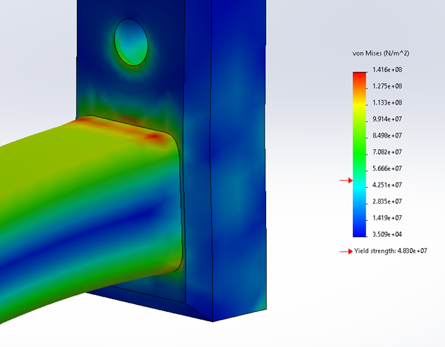

As seen in the plot, the bracket is subjected to a wide range of stress values greater than the given material yield stress, 
partucularly along the top corner where the bracket arm meets the bracket face as seen in the figure above. This means 
that at 200 lb the bracket will most likely fail.

Factor of Safety & FoS Plot
^^^^^^^^^^^^^^^^^^^^^^^^^^^

When examining a model in a static study an additional plot that can prove useful in an analysis would be the Factor of 
Safety plot. The Factor of Safety is the ratio of the model's ultimate strength (stress value at which the part will fail) 
to the applied stress from a load on the bracket. Safety factors are crucial in part design for increasing safety and 
reducing the risk of failure and are used universally in the design process. For example, elevator cables responsible for 
bearing elevator & passenger loads during travel typically have a safety factor of 11, meaning that the elevator can hold 
11 times its recommended “allowable” load. This is because elevators are not designed to operate at their ultimate strength, 
but at an allowable stress instead that’s directly proportional to the assigned FoS. This allowable stress is the actual 
maximum operating values that manufacturers will recommend their products be used at (in the case for the elevator, the 
maximum number of people/weight).

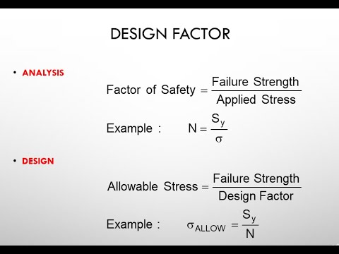
 
Therefore, if the elevator were ever to be “at full capacity” there is virtually no risk of the cable failing while in 
operation. If the cables were to have been designed so that the safety factor was 1-to-1, the risk of the cable failing when 
the elevator was at capacity would be almost inevitable with dire consequences to follow. Safety factors are implemented for 
this reason to provide a safe leeway and a certain level of confidence to ensure that a product can still operate safely 
within its maximum “allowable” load with minimal risk.

In the case of the bracket, we want to observe the factor of safety distribution across the whole to see what the actual 
allowable stress would be at specific sections, mainly our most concerning areas. To create an FoS plot, right click on the 
Results tab in the Simulation designer tree and select “Define Factor of Safety Plot”.

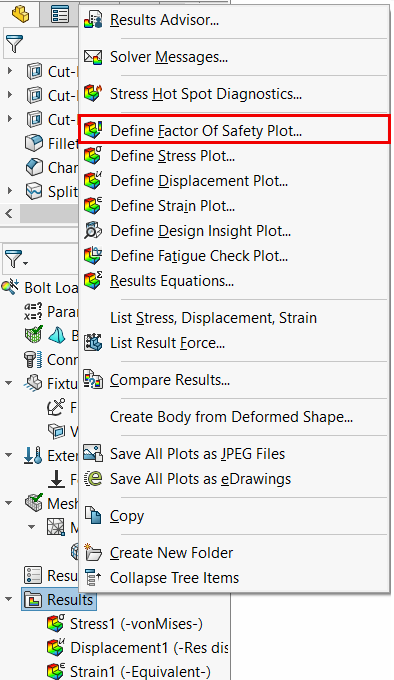
 
Selecting this option will open up the plot property menu:

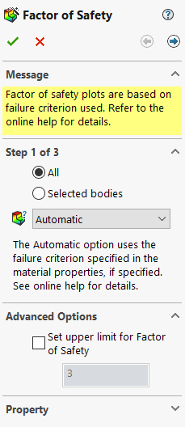
 
Since we are interested in the FoS plot related to the maximum von Mises stresses & maximum allowable stresses, the 
criterion will be changed to “Max von Mises Stresses” in the “Criterion” section. As well, an upper limit for the FoS plot 
can be selected in the “Advanced Options”. This upper limit should be selected based on the material properties, application 
& environment of the product. Since our environmental conditions are not severe and our part is to experience some non-severe 
loading, we can leave our upper limit at 3 as it was at default (see the link `here <https://www.engineeringtoolbox.com/factors-safety-fos-d_1624.html>`_  for a general recommendation table).  
 
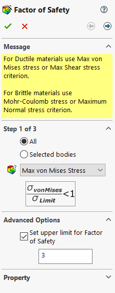
 
Next, we want to select the right arrow at the top right of the box to move to the step 2 of plot creation:

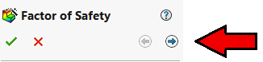
 
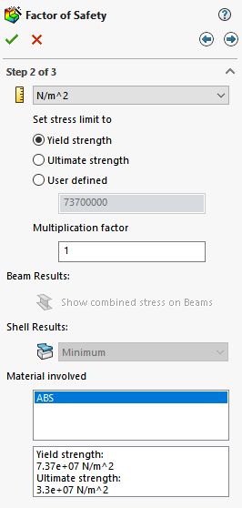

In this page, we can set our stress limit for the FoS plot. Since we are trying to observe the FoS plot to see how our 
bracket will fail and its behavior, the stress limit should be set to “Tensile Stress”, which for our ABS material is 
3.3 x 10^7 Pa (remember for the buckling analysis were using the flexural strength instead of the tensile strength). 

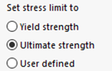
 
After selecting OK, the bracket should now contain the FoS distribution plot for the bracket along with the plot legend to 
dictate what colours correspond to their respective FoS values.

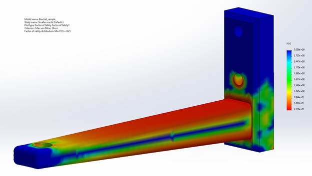
 
As seen in the image above, a large portion of our bracket is highlighted orange/red, which indicates that these areas have 
a FoS of less than 1. This indicates that the bracket will fail in these areas. Another important point in this plot is the 
plot information provided in the top left of the visual window. As well, the minimum FoS value can also be identified on 
both the plot legend and plot description, which in this case is 0.23. This value will be important to continually check and 
observe when changes and optimizations are made to the bracket (which will be described later in a bit more detail in the 
optimization section).

Making Changes to the Plot Legend
^^^^^^^^^^^^^^^^^^^^^^^^^^^^^^^^^
Note that for the FoS plot, the values in the plot legend have been switched from scientific notation to ust decimal numbers. 
This may be helpful when you;re trying to quickly interpret your results (when compared to scientific notation). Changes to 
the plot such as changing the plot legends values can be done by right-clicking the “Factor of Safety” option in the 
simulation property window.

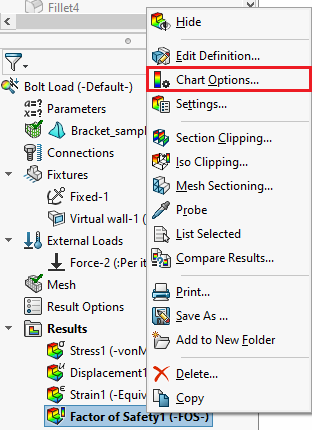
 
Once in the options manager, the chart values can be changed under the Position/Format section in “Number Format” by 
changing the format from “Scientific” to “Floating”.

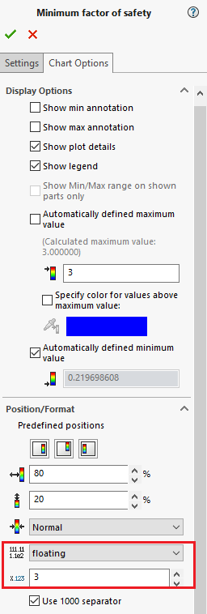
 
The Chart options also provide options to choose the maximum & minimum values of the plot legend, its size and if you wish 
to include it in your model window or not. 

Creating Binary FoS Plot 
^^^^^^^^^^^^^^^^^^^^^^^^

Using the additional steps in the FoS plot setup, the FoS bracket distribution plot can be further refined to better dictate 
in what areas the bracket will fail. The FoS setup menu can be reopened by right clicking the Factor of Safety result plot 
and selecting the “Edit Definition” option.

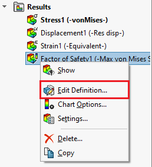
 
Next, select the right arrows as we did before to select ultimate strength previously and choose the “Areas below factor of 
safety” option.

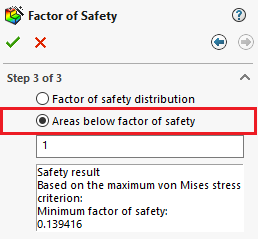
 
Make sure to re-select “Ultimate Strength” in step 2 like in the initial FoS plot, as the plot will default back to tensile 
strength whenever editing the FoS plot. Clicking OK, the new plot should appear as follows:

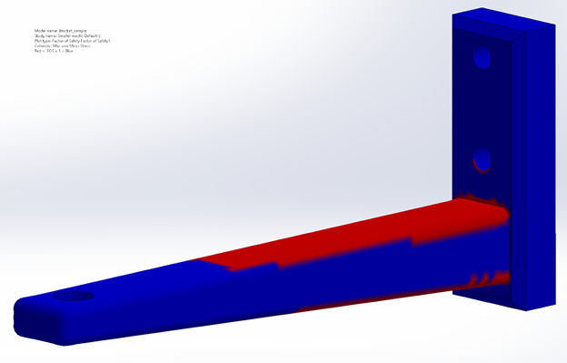
 
As seen in the plot description in the top left corner of the plot image, the blue areas on the bracket dictate areas that 
are above a FoS of 1, whereas the red areas show places where the bracket is below a FoS of 1, where the bracket is supposed 
to fail. 
