Arduino Coding
==============

The first thing you need to do before you start coding your Arduino is to download the Arduino Integrated Development Environment  (IDE). This can be downloaded directly from: https://www.arduino.cc/en/software

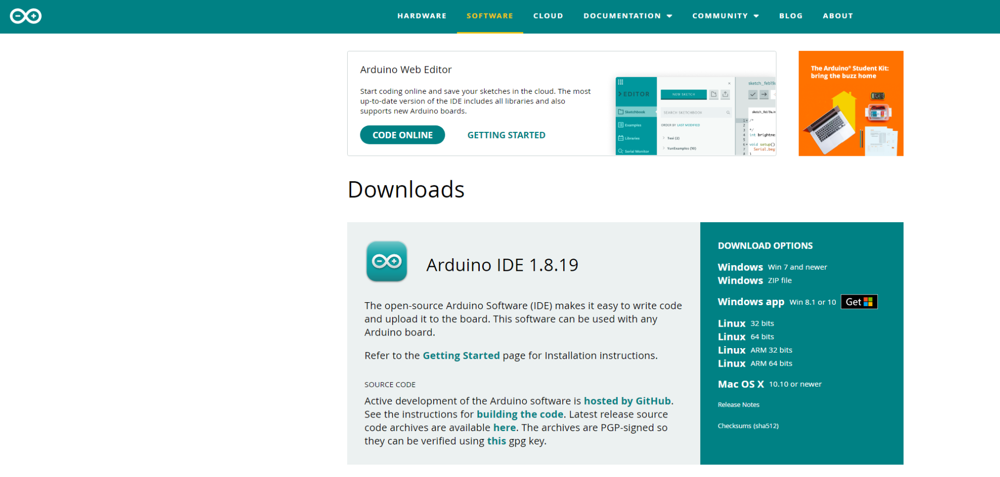

Next, you need to connect your Arduino to your computer. The output for the Arduino is a USB-B so a converter to USB-A or USB-C will be needed to plug into your windows or mac, respectively.

Now you can start coding. The coding language used in the Arduino IDE is C++ or C.

Declaring Variables
-------------------

The first thing we will do is define all our variables to correlate which pins on the Arduino are connected to which pins on the L298N motor driver.

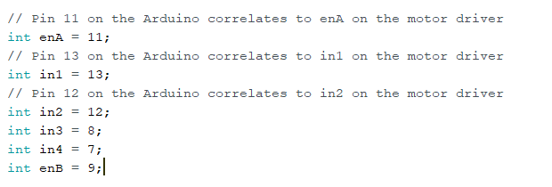

Next, we need to declare that these pins will be giving output commands from the Arduino to the motor driver which will in turn, power the wheels. Every pin being used on the Arduino has to be declared as either an output or input pin. Output pins send messages while input pins receive data from things like transmitters, buttons, or dials.

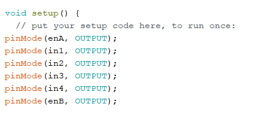

Circuit testing
---------------

Then, we can write our first test just to see if our motors can spin. In order to write a command to move the motor we need to address all 3 motor driver inputs as discussed previously:

*  The enabler pin, which will control the speed
*  The two input pins that will control the direction of spin

For example: 

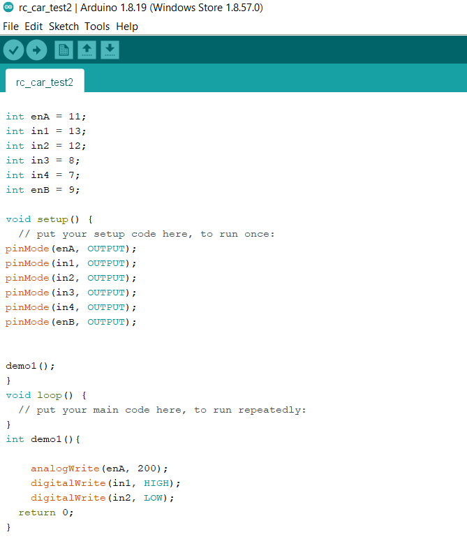

In this code we call the function “demo1” in the void setup. The function “demo1” addresses the enabler pin first and sets the speed to 200. It's important to note the maximum output value for any digitalWrite  arduino pin has a value of 255 and a minimum of 0. The max output value for an Arduino pin is 255 because the processor is an 8-bit processor. Using the binary numbering system, a 8-bit number can have a max value of 255. For more information on the binary numbering system watch the following Khan Academy video: https://www.khanacademy.org/computing/computers-and-internet/xcae6f4a7ff015e7d:digital-information/xcae6f4a7ff015e7d:binary-numbers/v/the-binary-number-system

In the figure above, enable pin A has been set to the output value of 200 which will cause the motor to spin close to maximum speed. We use analog write instead of digital write when talking about enabler pins because they output a specific oscillating (analog) value and not just an on or off (digital) value. The second and third lines in the function address the input pins. By setting IN1 to HIGH and IN2 to LOW the motor spins forward, if we were to switch which pins were HIGH and LOW, the motor would go in reverse.

Once you have your code ready make sure to verify and upload your code to the arduino by pressing the check in the top left corner of the IDE and then the arrow to its side to upload the code to the Arduino. Then, turn on your breadboard as a power supply and the motors should start spinning.

Error Analysis: If an error occurs the first place to check would be at the end of every line to ensure there is a semi colon(;)! C++ does not depend on spacing and indentation to distinguish each line of code but instead a semicolon marks the end of each line. 

If your motor can successfully work using this circuit congratulations! The main electrical work is done!

Next, we are going to focus on controlling the motors; not just turning them on. To achieve this we will add a for loop onto our existing function “demo1”. The function will turn the motor forward for 2 seconds and then turn the motor off for 2 seconds. This will continue for 4 cycles, then the motor will stop spinning permanently.

Turning the motor will be followed with a delay function (written in milliseconds) so that the motor will have enough time to stop its spin before starting back up again. 

The code looks as follows:

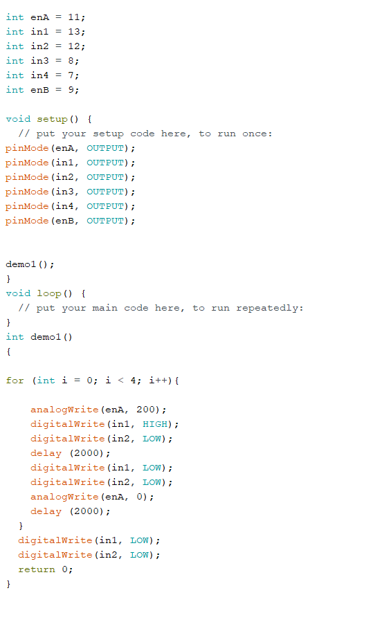

This code is important because it demonstrates that the DC motor is not just turning on when the power supply is turned on. By using this code we can be assured that the motor driver is taking commands from the IDE and using them to control the motor.

Note: Be sure to close your for loop with “}” at the end of the function. The “{“ and “}” symbols help organize multiple lines of code under one function or method. Whenever a for loop, if statement or function is called it is always followed up with “{“, and then all the contents of that function will be written, and it will be concluded with “}”

Remote Controller Setup 
-----------------------

Now it's time to set up your remote controller. 

Your remote controller should consist of a transmitter that has a minimum of two outputs, a throttle/speed control and steering wheel/direction control. This transmitter will connect to a receiver placed onto the car and will send signals to the receiver that can in turn be used as input data for the arduino.

The first thing you need to do to set up the remote controller is to ensure your transmitter has batteries and turns on. 

Next, you will want to connect your receiver to the Arduino Uno. We have to ensure the receiver is powered and is able to transmit information to the Arduino. For the purpose of the RC car being made in this video we will only need two inputs: the throttle and the steering wheel. 

The following diagram shows the basic layout of most of the main receivers on the market, so if your receiver isn’t like mine, the design should be similar.

.. figure:: ../_static/images/RCcar/image70.jpg
  :align: center

The wiring looks as follows:

.. figure:: ../_static/images/RCcar/xf.jpg
  :align: center

The transmitter is able to communicate with the receiver by sending signals using pulse-width modulation. This input information cant be converted into useful values automatically by the Arduino so we need to download a library of code that can decipher the information for us. A common library used across the platform is the ServoInput library by David Madison. It is possible to make a code that will convert the PWM signals into useful data but that is beyond the scope of this tutorial. To download this library in the IDE, go to: Tools> Manage Libraries> Search: “ServoInput”.

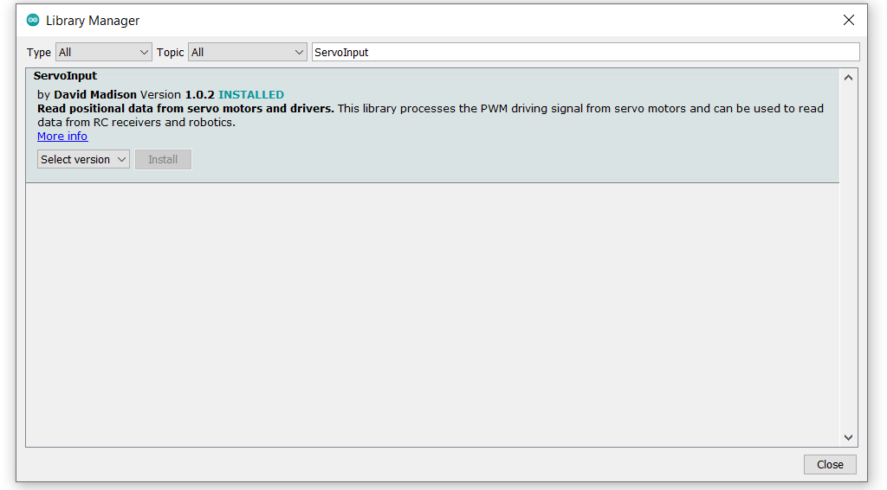

The first action to do with this library is to write a code that will print the values from the controller back onto the computer screen. We will also add a one second delay to avoid any computer crashes and for easier data analysis.

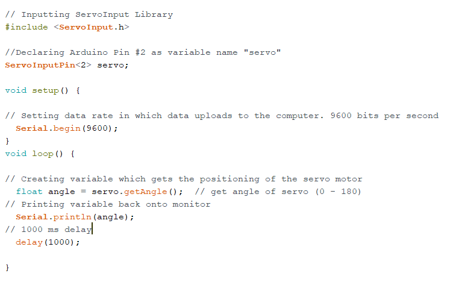

Before verifying and uploading this code it is a good idea to disconnect the power supply from the circuit. This is because we will leave the arduino plugged into the computer while running the code which will in turn act as the power supply. When you upload the code, you can see the data being returned to the monitor by going to the top of your screen and going: tools > serial monitor or ctrl + shift + M.

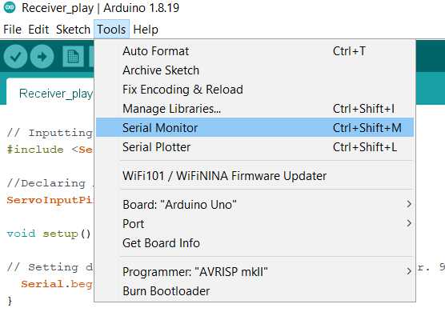

On your screen there should be numbers popping up at one second intervals that should change in relation to the position of the throttle. Recall that the Arduino outputs have a range of 0 - 255. Our end goal is to map the range of the throttle inputs onto a range from 0 to 255. To do this we will need to know three things.

*  The middle value
*  The furthest left value
*  The furthest right value

Keep in mind that you will need the range of the throttle and the steering wheel. To switch to steering wheel values simply adjust the line “ServoInputPin<2> servo;” to “ServoInputPin<3> servo;” and repeat the same data collection.

My data looked like this:

.. list-table:: Range Data
   :widths: 10 10 10 10
   :header-rows: 1

   * - 
     - Left Value
     - Middle Value
     - Right Value
   * - Trottle
     - 180.0 (full speed)
     - 89.28 (stopped)
     - 3.60 (full reverse)
   * - Steering Wheel
     - 184.58
     - 95.04
     - 5.50

If the data you collected looks differently than mine, do not worry the equations will be the same but, keep in mind your specific numbers when copying the code!

Once your data has been collected, it is time to start writing the main part of your code. The first step is to define all the variables that will be used including the ServoInput variables and declaring the pin modes.

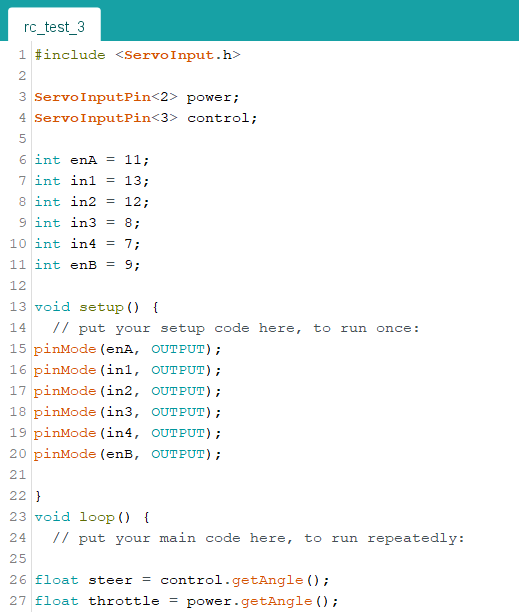

Note: It’s important to understand what this code means before moving on to the next steps. Unless seen otherwise, the remainder of the code shown in this tutorial will be written as part of the void loop() function.

Range Mapping
-------------

When our data is collected, you will need to perform some math to transform your range into a range of 0-255. This will in turn create a result where if you push the throttle; the value of the enabler pins will change in proportion with the throttle and therefore adjust your speed.

The math is as follows:

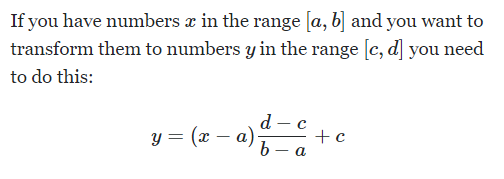

In this application you might think it will look like this: 

Throttle_output = (throttle - 3.6 ) ((255 - 0) / (180 - 3.6))

Where: 

*  3.6 is my throttle minimum and, 

*  180 is the maximum. 

**That is incorrect**. We want to have forward and reverse, so our slowest speed will be in the middle. Therefore **the  “a” value should be the middle value in the range.** By doing this all forward outputs will be positive and reverse outputs will be negative

The correct formula is as follows:

Throttle_output = (throttle - 86.4) ((255 - 0) / (180 - 86.4))

Which simplifies to:

Throttle_output = (throttle - 86.4) *  2.72

This exact same process is repeated for the steering aspect and the simplified formula should look like this:

Steer_ouput = (steer - 95.04) * ((255-0)/(184.58 - 95.04))

Steering Equations
------------------

The last piece to full DC motor control is to code the proper steering equations. Without a proper rack and pinion steering system, the easiest way to steer the remote controlled toy car is to slow either the left or right wheel to turn that respective way. For example: If the wheel is turned 10% to the left, the left motor will be reduced in speed by 10%. To achieve this, the range [0, 255] needs to be mapped on a range from [0, 1] (using the same math as done previously). 

Taking the new value, between 0 and 1, and multiplying it by the throttle output will give the value in which the output will need to be reduced by. 

Steer_Killing =((steer_output - 0) * (( 1 - 0 ) / (255 - 0 )) + 0) * throttle_output

Steer_Killing = (steer_output * 0.0039) * throttle_output

Once you have the steer_killing variable, it will either give a positive or negative value depending on if you turned to the left or right, respectively. Because of this there will need to be two separate equations so that the final output will always be a reduced value. There also needs to be thought put into when steering in reverse and how the negative throttle output value will influence your reducing equation. Below is a table that shows all four turning possibilities.

.. list-table:: Range Data
   :widths: 10 10 10
   :header-rows: 1

   * - Turning Scenario
     - Positive or Negative
     - Equation to reduce output
   * - Forwards and Left
     - Positive and a Positive
     - Throttle_output - Steer_killing
   * - Forwards and Right
     - Positive and a Negative
     - Throttle_output + Steer_killing
   * - Backwards and Left
     - Negative and a Positive
     - Trottle_output + Steer_killing
   * - Backwards and Right
     - Negative and a negative
     - Thorttle_output - Steer_killing

Test the math manually by picking a steering and throttle output value in the range of -255 to 255 and see if the final output makes sense.

All the math equations derived above should look like this in proper C++ coding:

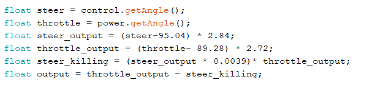

Structure and Conditions
------------------------

The last coding concept to understand is the use of “if” statements and embedded “if” statements. These conditional statements will provide structure to the code and organize all the created variables, so that the correct commands are done under the correct conditions. When doing this part of the code, reflection of what this prototype is trying to accomplish is essential. 

For a remote controlled toy car there needs to be: 

*  A deadzone

*  Forward and backward deciding if statements 

*  Steering left, right or straight if statements. 

When all conditions have been discussed it is recommended to start with the easiest condition and work up to the harder parts of the code. Be aware of which conditions will be embedded in others and what makes logical sense to the overall goal of the project.

The easiest code that we can make by utilizing this data is creating a deadzone for the throttle. A deadzone is a range of values, around the middle value, that will all equal zero. This serves to avoid sudden and small direction changes when your throttle is nudged just past rest. 

For my deadzone I felt a range of 5 over and 5 under my middle value was appropriate.

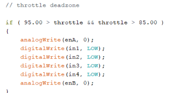

In this condition, the “&&” represents that both separate conditions must be true for the entire statement to be true. This is great when determining when one number must be greater than one number and lower then another. 

As said before, all forward outputs are positive and reverse outputs are negative. To indicate this; a simple if statement with the condition, if the output is above 0, will work!

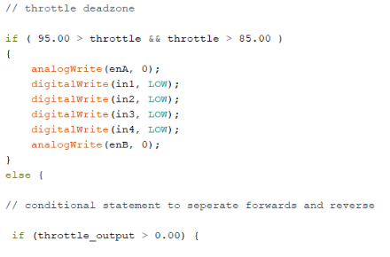

The same way we created a deadzone for the throttle, we will create a deadzone for steering. I used the same range as above 5 and below 5 and embedded this if statement inside the one used above.

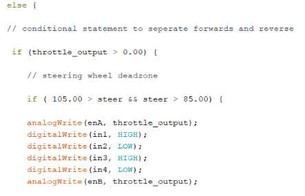

Now that throttle and direction dead zones are defined we can tackle the steering part of the code. As seen in the equations table, there will be two separate turning equations for four separate turning scenarios. These scenarios can be separated using if statements. We can use the middle column in the table to dictate our if statements as they represent the positive and negative values. Since we have already separated forwards and reverse, we will embed the turning conditions into the existing if statement. We know that when turning right the steer_killing variable will be negative, this will be our condition. We must apply output2 on the right motor to slow that wheel down. 

We also know that in order to turn right, our right wheel will need to slow down. When writing our analogWrite functions for turning right, enA should have the reduced speed, “output2” variable, while enB has the regular “throttle_ouput” variable. When wanting to turn left, vice versa.

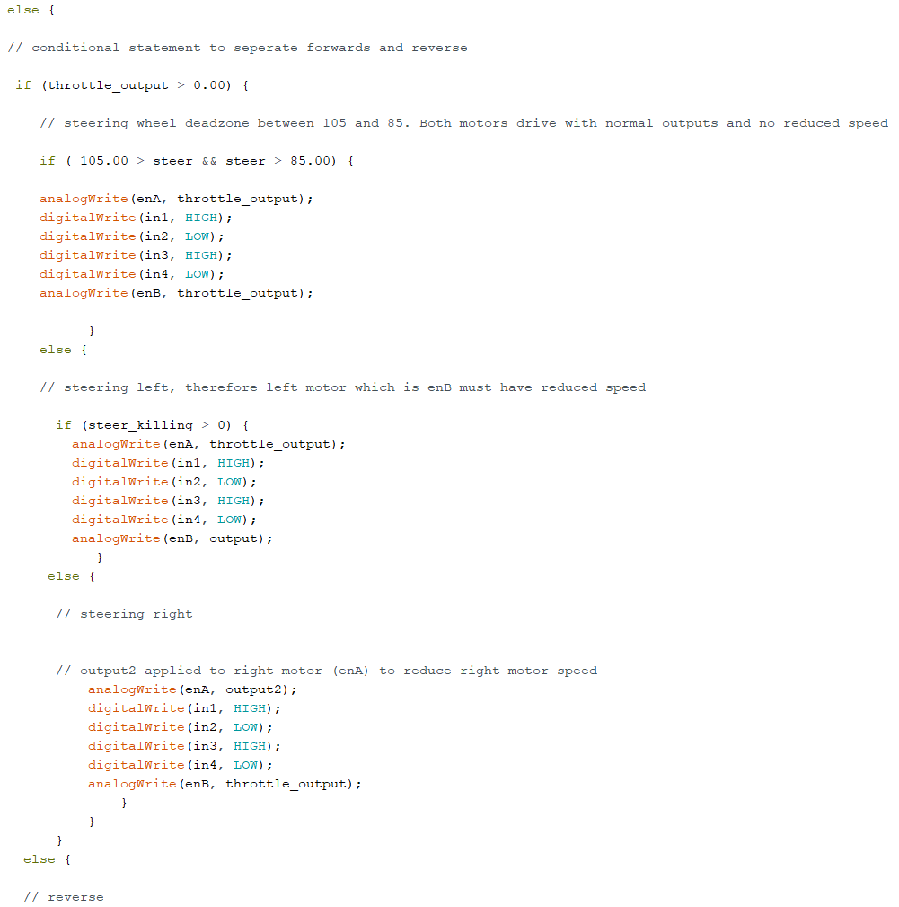

Full code
----------

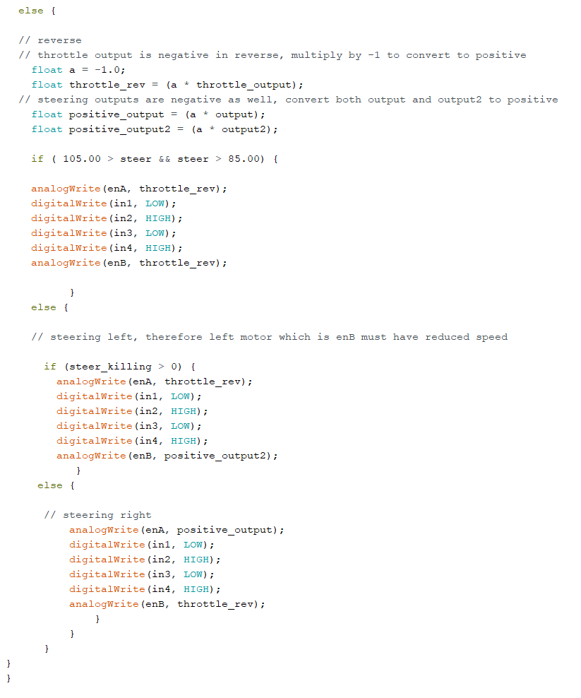

The last piece of code implemented was the reverse functions. Two things in this step that are important to note. All throttle and steering outputs will be negative, which was great for the structure of the code up to this point. Now all these outputs must be converted back to positive. Secondly, the HIGH and LOW digitalWrite lines must be switched so where in1 is HIGH in when accelerating forwards, it will be LOW in reverse.

This code can be tested by uploading it to the arduino while it is powered by the breadboard. Be sure to connect your second DC motor to outputs 3 and 4 on the L298N by this time.

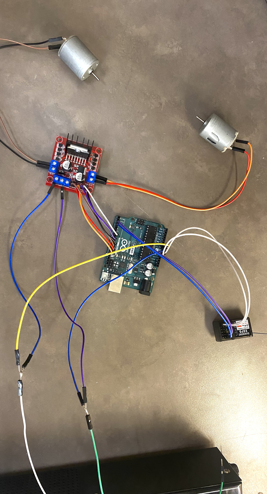

Use the remote controller to drive forwards and make sure the motors increase speed as more throttle is applied. Also ensure the left motor slows when the steering wheel is turned left and vice versa.

