2 - Assigning Footprints to Components
==================================
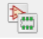
   
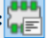
   
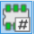
   
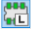
   
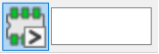
   
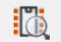

Understanding PCB Footprints
----------------------------
A footprint is the arrangement of soldering pads for a component. They define the location of how and where the component will be soldered to the board. A component can either be surface mount or through hole as discussed in :ref:`PCB Ccomponents`.

Through Hole Components (THT)
^^^^^^^^^^^^^^^^^^^^^^^^^^^^^
The yellow section in the figure below is known as the pads - it is the exposed region of metal and the most important part of the footprint. It is where the leads will be soldered to and how the component will be electrically connected. The regions highlighted green on the footprint are going to be printed on the silk screen i.e. they will be visible on the circuit board. The layers of a circuit board in KiCAD were explained in :ref:`PCB Layers`.

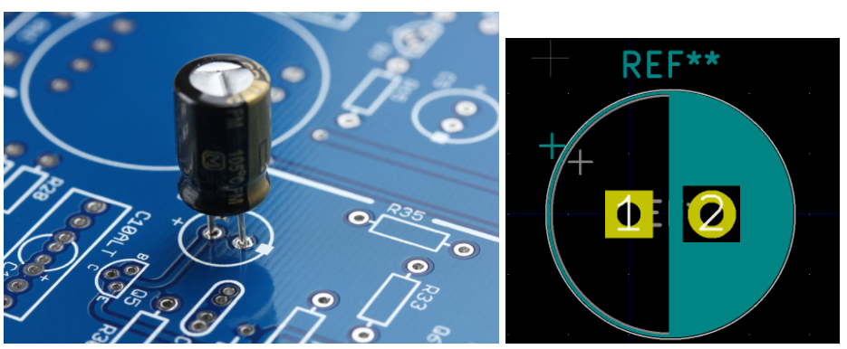

THT Capacitor being mounted on a board and the capacitor footprint on kiCad

Surface Mount Devices (SMD)
^^^^^^^^^^^^^^^^^^^^^^^^^^^
The pads are the red sections i.e. copper layer. It is clear that the pads are not holes like THT but are simply on the copper layer surface of the circuit board. The grey outline is the component outline on the F.Fab layer, which is useful for board manufacturing houses like `JLCPCB <https://jlcpcb.com/VGR?gclid=CjwKCAjwuvmHBhAxEiwAWAYj-ITIlLQRA1Wo_996nJWkou_tb6e5x8ydLtVoxVGrIuntaySqb4OLfxoC6dwQAvD_BwE>`_.

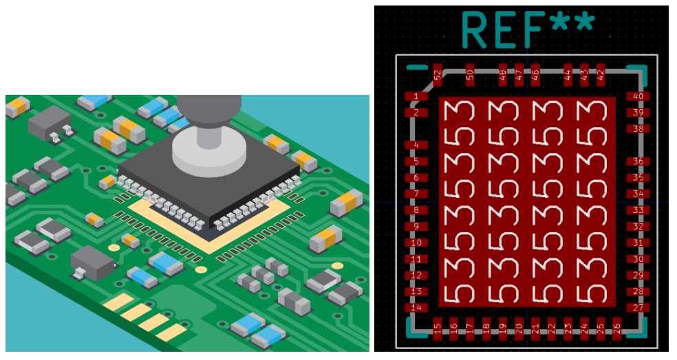
SMD integrated circuit being mounted on a board and the footprint on kiCAD

Understanding PCB pads
----------------------

Through Hole Components (THT)
^^^^^^^^^^^^^^^^^^^^^^^^^^^^^
For through hole pads, the radius of the external circle is the pad size and the radius of the internal circle is the drill size i.e. the size / width of the component lead. The drill size is specified on the data sheet and the pad size is usually estimated as (2*0.38mm + drill size + 0.25mm)

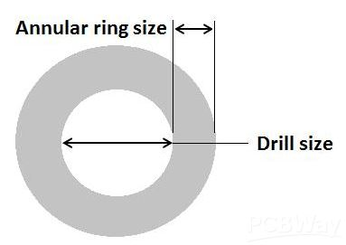
A THT PCB pad

Surface Mount Devices (SMD)
^^^^^^^^^^^^^^^^^^^^^^^^^^^
SMD components are simply placed on the pads, unlike THT components that are soldered through the pads. As a result, SMD pad dimensions are simpler and correspond with the component’s lead dimensions.

SMD integrated circuit being mounted on a board and its footprint on KiCAD

Selecting Footprints
--------------------

Through Hole Components (THT) and Surface Mount Devices (SMD)
^^^^^^^^^^^^^^^^^^^^^^^^^^^^^^^^^^^^^^^^^^^^^^^^^^^^^^^^^^^^^
1. **Pitch:** the distance between each pin of the component.

#. **Body size / shape:** components come in different sizes and shapes (from rectangles, squares, to octagons). There are standardized metric sizes for resistors, capacitors, and inductors but they do not always apply as some inductors are still produced in non-standardized sizes.

#. **Lead size:** the width of the component’s lead, will it fit in the hole?

#. **Component orientation:** Is it radial or axial, vertical or horizontal?

How to Filter Footprints
^^^^^^^^^^^^^^^^^^^^^^^^^^^
Select the assign PCB footprints to schematic symbols icon |assignPCB| on the top toolbar. An ‘assign footprint’ tab should open. There are four footprint filters; 

* |filterbys| - schematic symbol footprint filter to filter based on the component’s reference
* |filterbyf| - to filter footprint list by pin count
* |filterbyl| - to filter by library
* |filterbyn| - to filter by searching component name

To assign a footprint, double click on the footprint in the filtered footprint tab.

To view a footprint, select the footprint then click on the view footprint icon |vfootprint| on the top right corner of the assign footprints tab.

It is best practice to start by filtering only by schematic symbol footprint filter |filterbys| and then adjust as needed.

Examples: Footprint Selection
-----------------------------

Selecting a Footprint for a Connector
^^^^^^^^^^^^^^^^^^^^^^^^^^^^^^^^^^^^^
Take this `connector <https://www.digikey.ca/en/products/detail/jst-sales-america-inc/BM08B-SRSS-TBT-LF-SN/1640130?s=N4IgTCBcDaIEIFkAMAOOBaAygJU59AKnAQBQAyAYgJQmYByVIAugL5A>`_ as an example. The yellow box indicates it is surface mount and the green box indicates it is 8 position with 1 mm pitch. Pitch is the distance between pins and 8 position indicates it has 8 pins. 

Don’t panic if you do not know what properties to look out for when looking at components. Always remember that important information is placed in both **the description and detailed description sections.**

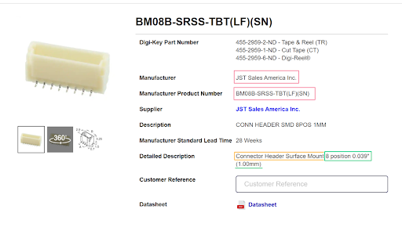
    
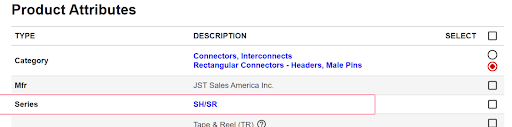
    
1. **Filter by component symbol** |filterbys|: There’s still quite a bit of a selection. It needs to be narrowed down.

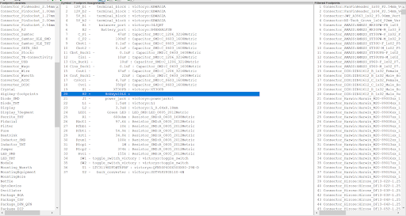

2. **Filter by symbol and pin count** |filterbys| |filterbyf| : It still needs to be narrowed down.

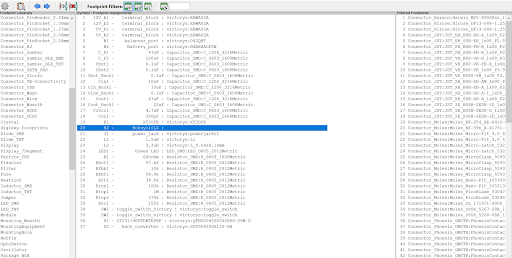

3. **Filter by symbol, pin, and library** |filterbys| |filterbyf| |filterbyl|: Since we are looking for a footprint for a connector, let's look at which of the multiple libraries for connectors to search in. Remember the **manufacturer of the connector is JST**. Footprint libraries are usually arranged by manufacturers since different manufacturers will produce different parts. Select the ‘connector_JST’ library. 

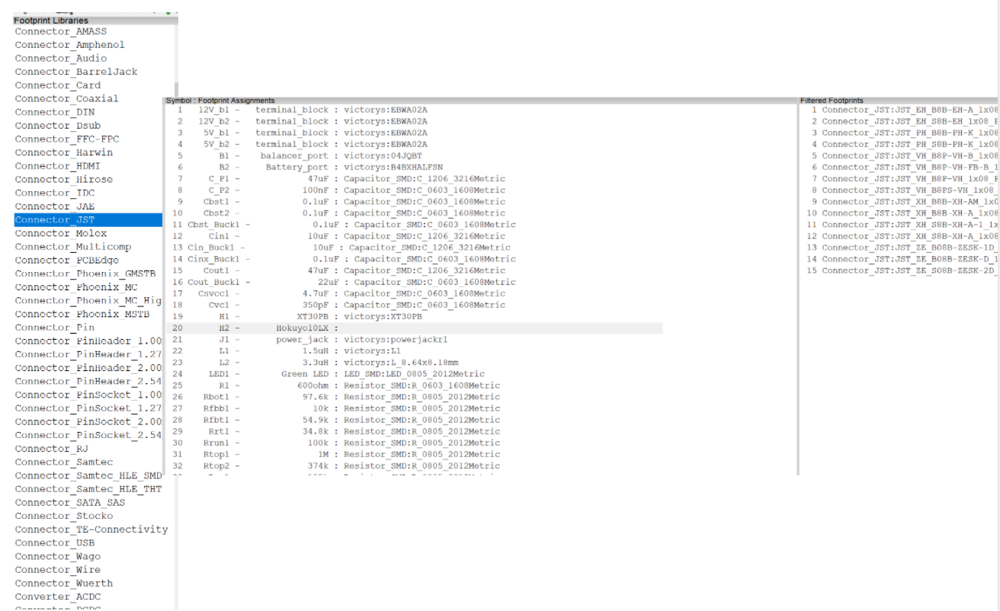
    
In the third tab, the filtered footprints, the connectors are organized by the manufacturer’s part numbers (MPM) which we determined from the digikey product page as **BMO8B-SRSS-TBT(LF)(SN)**. It is clear that the part number is not listed with any of the footprints in the filtered footprints tab.

This introduces that sometimes KiCAD glitches. To confirm if the footprint exists or not, filter by library only (connector_JST). Notice that there is a pattern in how the footprints are named.

.. figure:: ../_static/images/footprint16.png
    :figwidth: 700px
    :target: ../_static/images/footprint16.png

Library name: Manufacturer_*MPM*_row x positions_pitch_component orientation on board

The important part here is the MPM. As if the MPM is exactly as the one listed on our product page on digikey, the footprint should match. Search the footprints until you find one with the MPM, then double click on it to assign it to the connector. To view the footprint, select the footprint then click on the view footprint icon |vfootprint| on the top right corner.

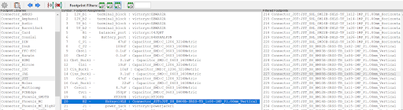

Standard Sized Footprints: Selecting a Footprint for a SMD Resistor
^^^^^^^^^^^^^^^^^^^^^^^^^^^^^^^^^^^^^^^^^^^^^^^^^^^^^^^^^^^^^^^^^^^
Take Resistor `Rtop2 <https://www.digikey.ca/en/products/detail/te-connectivity-passive-product/4-2176094-8/4034258?s=N4IgTCBcDaIIIEYEAYDsBOZBhAKgWgDkAREAXQF8g>`_ as an example. Chip resistor boxed in yellow indicates that the resistor is surface mount (SMD) and the text entailed in the green boxes indicate that it is a standard body size of 2012 metric or 0805 imperial.

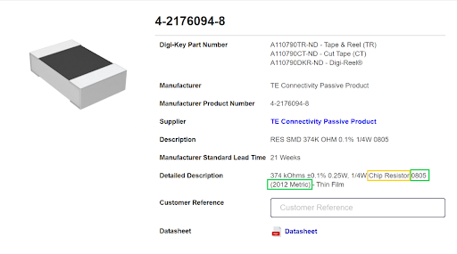
    
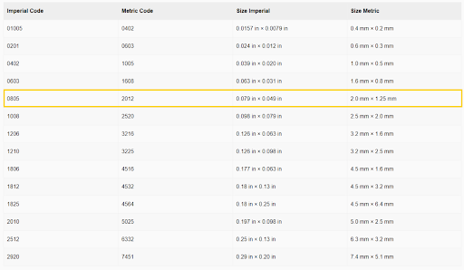

**Filter by symbol, pin, and library** |filterbys| |filterbyf| |filterbyl|: Following the filtering instructions used for the connector above, ends up with us using all 3 filters. 

* The library choices are either resistor_SMD or Resistor_THT. We figured this resistor was SMD so choose the SMD library.
* We previously noted that the body dimensions of the resistor were a standard 2012 metric. So select the filtered footprints that are 2012 metric; there are two options - the hand solder one and the regular one. The hand solder one has additional allowance for easier hand soldering. We select the regular one. View :ref:`Getting Started with PCB Assembly` for soldering tips. It is good to have a good overview of how the components will be soldered when choosing the footprints.

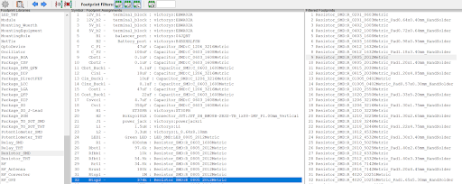

Searching by Manufacturer: Selecting a footprint for a SMD Inductor of Odd Shape
^^^^^^^^^^^^^^^^^^^^^^^^^^^^^^^^^^^^^^^^^^^^^^^^^^^^^^^^^^^^^^^^^^^^^^^^^^^^^^^^^

Take this `inductor <https://www.digikey.ca/en/products/detail/murata-electronics/1217AS-H-1R5N-P3/5271426?s=N4IgTCBcDaICwE4AMBaAjEg7ADgKzpQDkAREAXQF8g>`_ with an inductance of 1.5uH. The yellow box indicates it is surface mount (SMD) and the green box indicates it is non standard size meaning a custom footprint may need to be created.

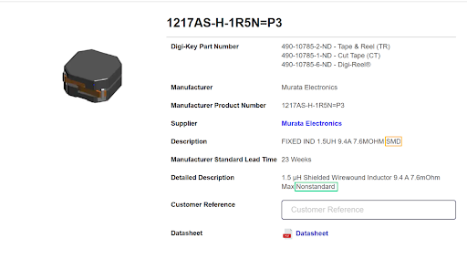

Footprints on Kicad are either saved as standard parts or under manufacturers, for non standard sizes. Since inductor L1 is non standard, the footprint might not be on Kicad or might be saved under a manufacturer but it is most definitely not saved under a standard size.

**Filter by symbol, pin, and library** |filterbys| |filterbyf| |filterbyl|: 

* Two library options; Inductor_SMD or THT. We previously identified the inductor as SMD. So select Inductor_SMD library.
* We previously identified that the manufacturer is Murata electronics. Search for footprints with Murata in the name. There are 3 options; 66,67,68. 
* We identified the MPM to be 1217AS … None of the options have that part number. As such the footprint does not exist in Kicad libraries. See :ref:`Custom Footprints in Footprint Editor` to learn how to create custom footprints or do a google search for the footprint and follow the guidelines in :ref:`Importing footprints into KiCAD`.

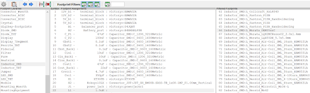
