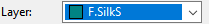
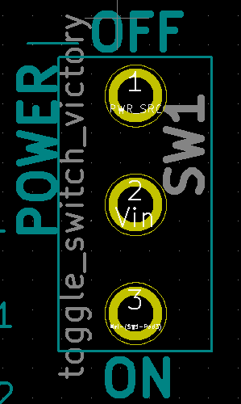
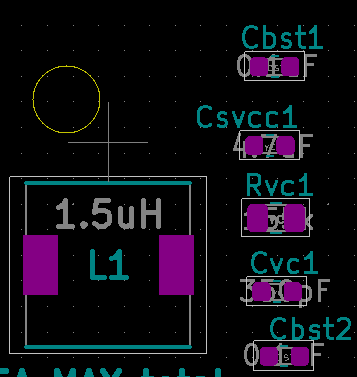
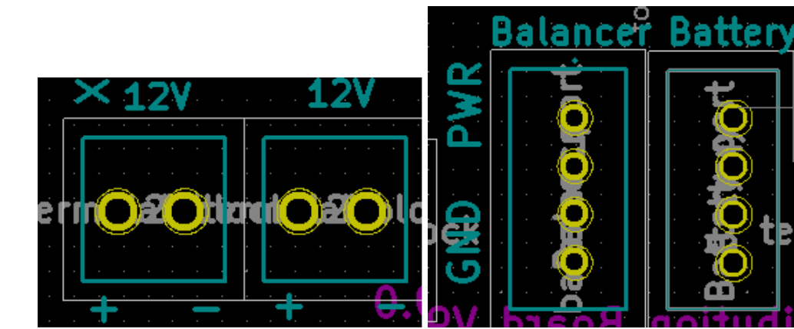
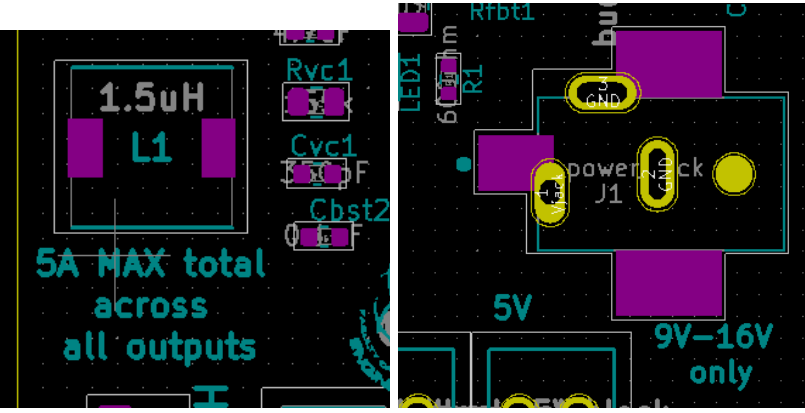
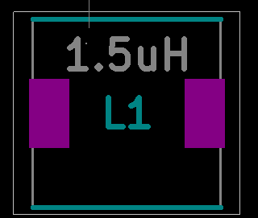

Best Board Design Practices
===========================

   

   
.. |fab| image:: ../_static/images/best8.png
   :width: 3%

Designing your circuit for easy assembly and intuitive functionality is very important. Take note of the following tips to do this:
Label the off/on positions for switches

1. Indicate the function/name of each component

2. Indicate the function/name of each component

3. Label the components if plugins are required i.e connectors to plug in a battery, balancer or a sensor name (Hokuyo 10LX).

.. figure:: ../_static/images/best3.PNG
    :figwidth: 700px
    :target: ../_static/images/best3.PNG
    
4. Indicate ground and power pins for components that can be easily misplugged. 

    
5. Indicate the max current and voltage of the circuit board as this will be important for testing

Editing Text / Annotations
--------------------------
**Use the following functions to edit annotations:**

* Use the text icon |text| on the bottom of the left toolbar to insert text. Ensure the text is on the silk layer |silk| as only the silk layer will be visible on the circuit board.

* Hide text that you don't want visible by moving them to a different layer. Select the text >> properties >> layer. Move to the fabrication layer |fab|. Text that is coloured grey will not be visible on the board, while those coloured blue will be visible.

