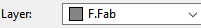
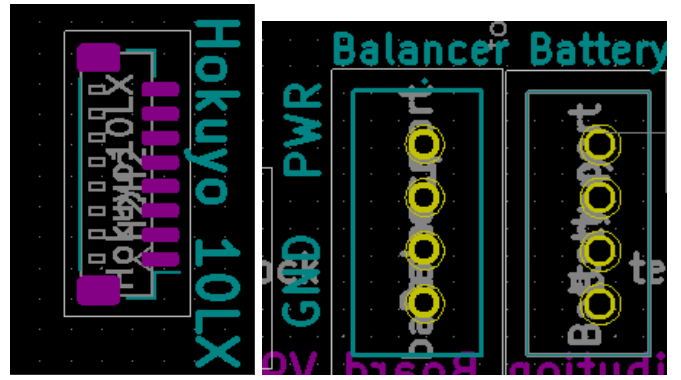

Best Board Design Practices
===========================

   

   

Designing your circuit for easy assembly and intuitive functionality is very important. Take note of the following tips to do this:

1. Label the off/on positions for switches

2. Indicate the function/name of each component

3. Label the components if plugins are required i.e label connectors to plug in a battery, a balancer or a sensor (like the Hokuyo 10LX).

    
4. Indicate ground and power pins for components that can easily be plugged in the reverse way. Plugging ground into a pin meant for power can permanently damage a component.

    
5. Indicate the max current and voltage restrictions of the circuit board as this will be important for testing. Indicating that the power jack only takes in 9V - 16V is a warning to prevent other people from permanently damaging the circuit board. The designer of the cirucit board will know the details about the board, but the people using it won't. Which is why it is important to indicate these details.

Editing Text / Annotations
--------------------------
**Use the following functions to edit annotations:**

* Use the text icon |text| on the bottom of the left toolbar to insert text. Ensure the text is on the silk layer |silk| as only the silk layer will be visible on the circuit board.

* Hide text that you don't want visible by moving them to a different layer. Select the text >> properties >> layer. Move to the fabrication layer |fab|. Text that is coloured grey will not be visible on the board, while those coloured blue will be visible on the circuit board.

