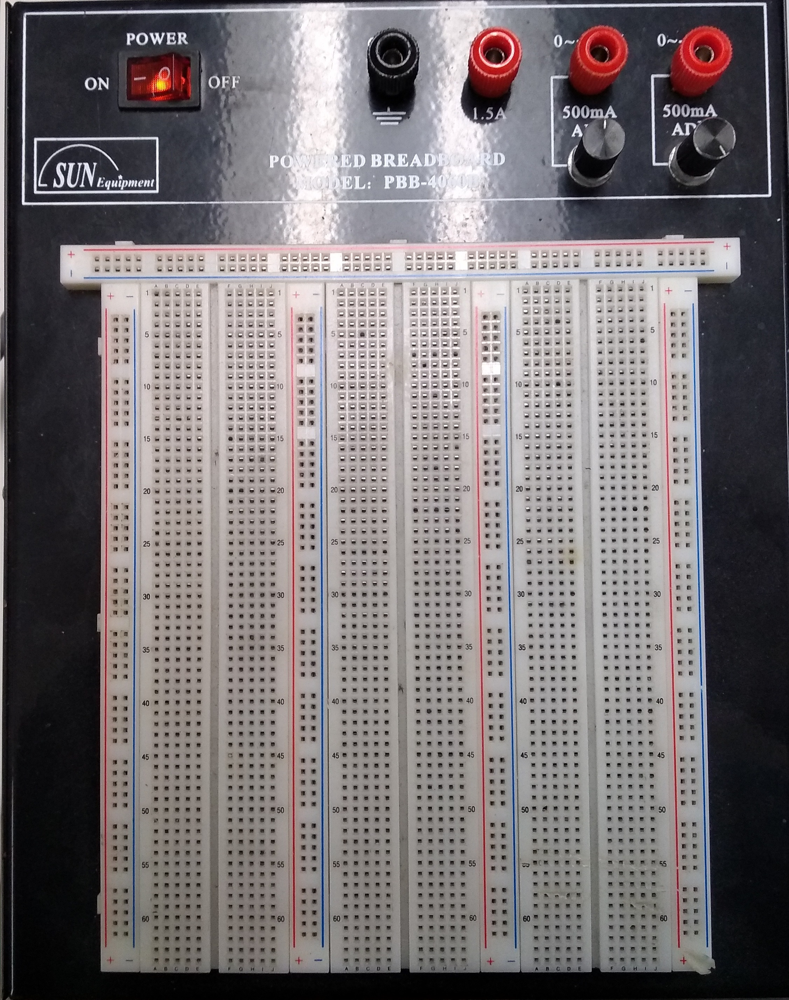
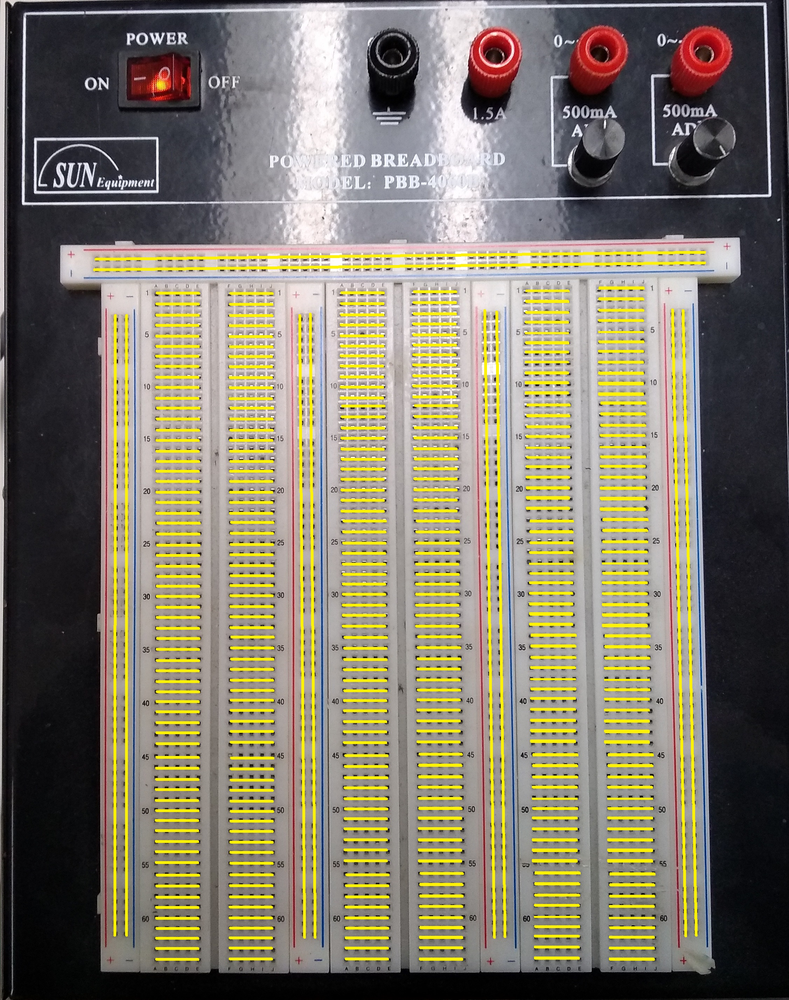
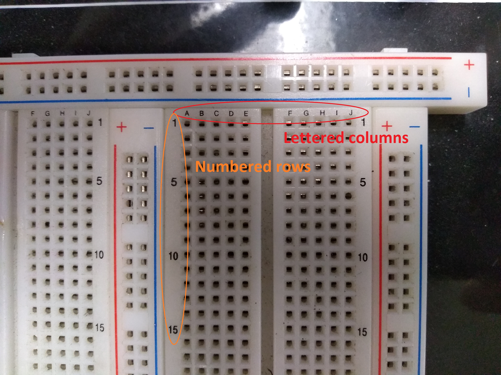
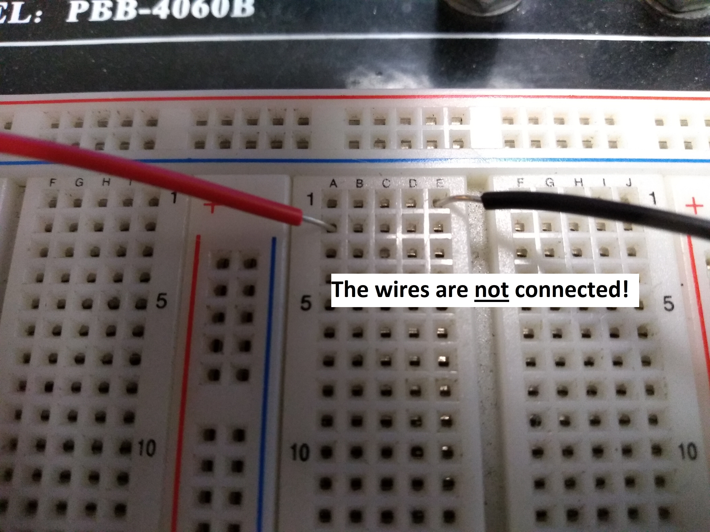
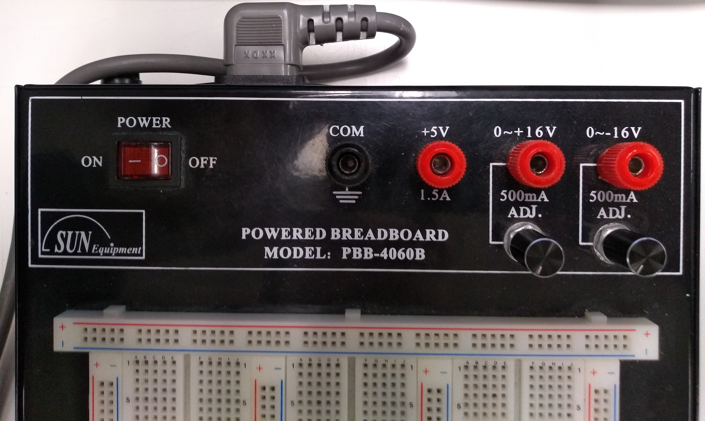
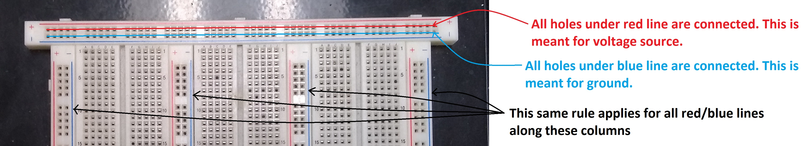
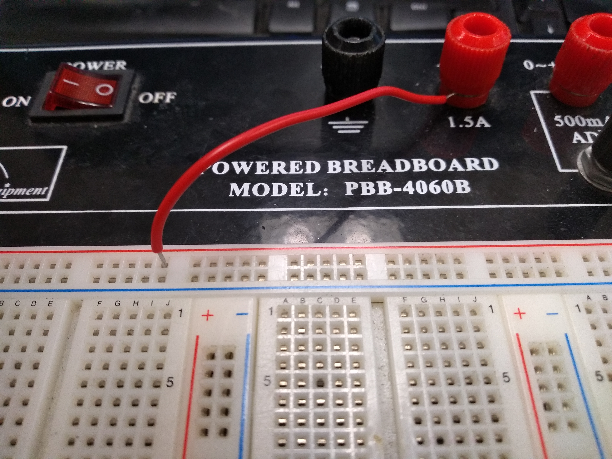

How to Use the Powered Breadboards in the Lab
=======================

Breadboards are used for testing out circuit designs without the need to solder the components together. This means that each component can be reused afterwards and does not need to be cut. The breadboards in the Student Design Hub come with a built-in power source, so powering the circuit with an external power source (such as batteries) is not always necessary. The powered breadboards do not need to be powered by their built-in power source in order to work.

How the Breadboards are Connected
---------------------------------
The following diagram shows how the breadboard is connected internally. Each yellow line can be thought of as a wire that connects to every hole it overlaps:

Each row on the breadboard is labelled numerically (1 to 64) and each column is labelled alphabetically (A to J). 

Putting two components in the same row (same number, different letters) connects them:

.. image:: BreadboardTutorial/WiresConnected.jpg
   :width: 600px

But putting them in the same column (different numbers, same letter) does not:

   
Powering the Breadboard
-----------------------
The breadboard can be powered using the power switch and knobs at the top of the device:

   
The red power switch on the left controls whether the knobs to the right receive any power.

The **black knob** labelled "COM" is the ground for the circuit.

The **leftmost red knob** labelled "+5V/1.5A" supplies 5V when the power switch is turned on.

The **middle/rightmost red knobs** labelled "+0~16V/500mA" supplies anywhere between 0V to 16V, which depends on the position of the black knobs below each of them. The output of the red knobs can be adjusted by simply turning these black knobs.

The sides of the breadboard have red and blue lines labelled "+" and "-". These lines show that all the holes along that line are connected together, and are meant to receive power from one of the red knobs (or the ground for the "-" end). These long connected lines are called **rails.**

   
Simply turning on the power switch of the breadboard does not supply power to the power rails. I wire must run from one of the red knobs to the power rail. The ground rail must also be connected to the ground (COM) knob. The method for connecting a wire to one of these knobs is shown here:

.. image:: BreadboardTutorial/KnobTutorial.jpg
   :width: 1000px

This wire must then be inserted into a hole belonging to one of the power rails of the breadboard:

**Note:** Connected power to one rail **does not** connect power to all of them. Similarly, connecting ground to one (ground) rail does not ground all of them.

Example Circuit
---------------
In this section, we will build a simple circuit involving a few wires, a 300 Ω resistor, a push button, and a Light-Emitting Diode (LED):

