Carbon Fiber Tools and Materials List
=====================================

Please ensure you abide by the :ref:`PPE and Safety` notes. 

While some of the common items found here can be found at your local hardware store, some products and materials need to be specially ordered. For purposes of this tutorial, all non-generic products can be found on https://www.easycomposites.co.uk/. 

* Sandpaper (1500 grit for shiny finish)

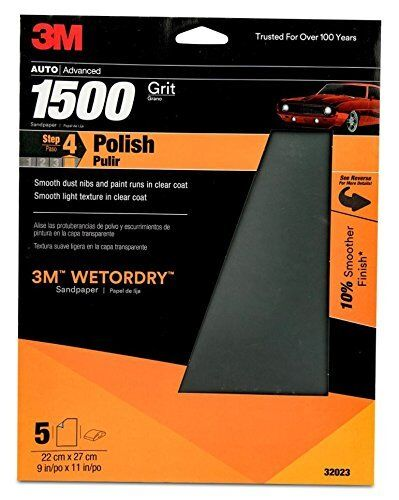

* Polishing compound (TOPFINISH 2 Natural Ultra Gloss Polishing Compound)

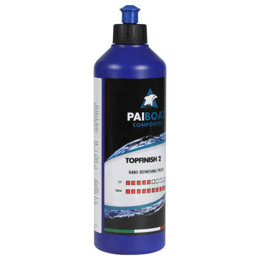

* Microfiber polishing cloth

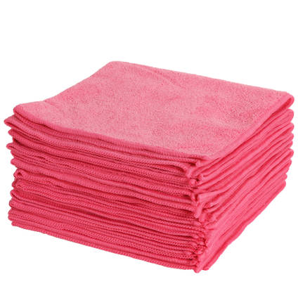

* MC1 Mould Cleaner

* Lint-free wipes

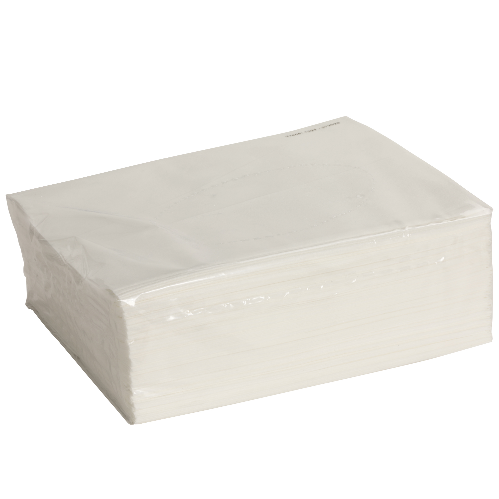

* CR1 Easy-Lease Chemical Release Agent

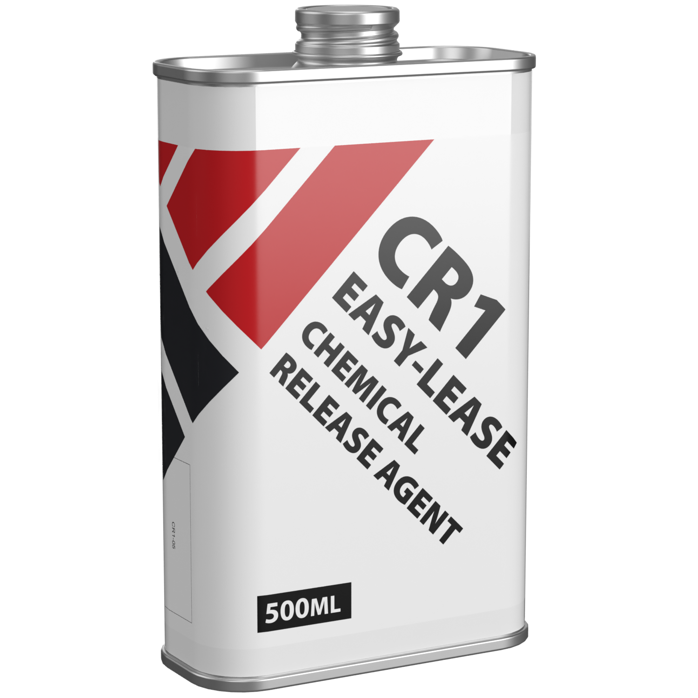

* Carbon fiber twill

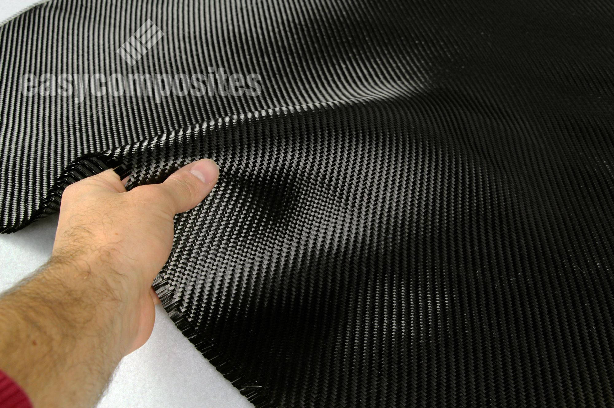

* Peel Ply

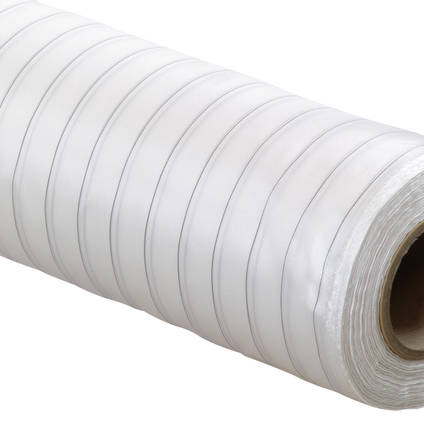

* Breather Cloth

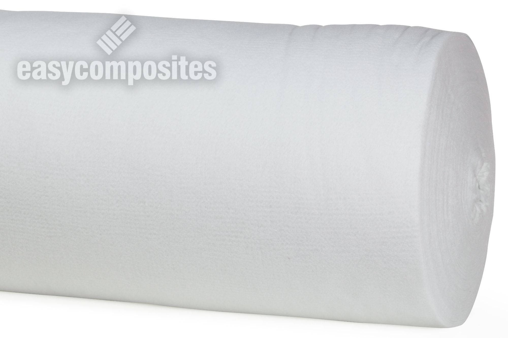

* Nomex Honeycomb (Aerospace)

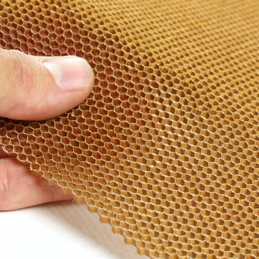

* EL2 Epoxy Laminating Resin and AT30 SLOW Epoxy Hardener

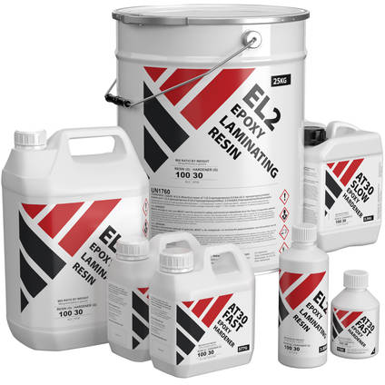

* 1”-2” Brushes

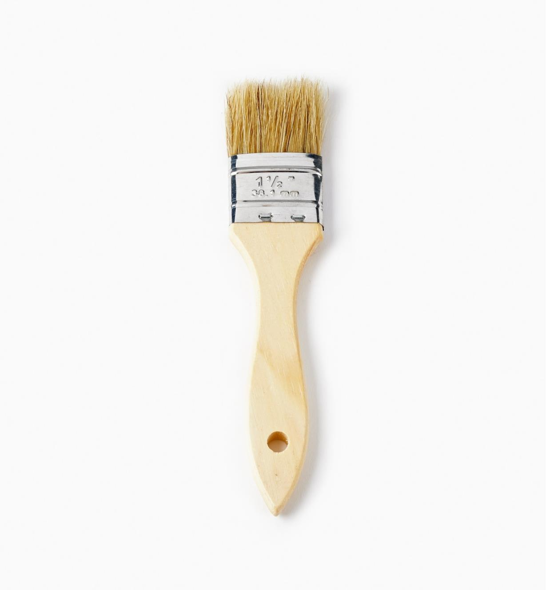

* Calibrated Mixing Cup (1000L or more)

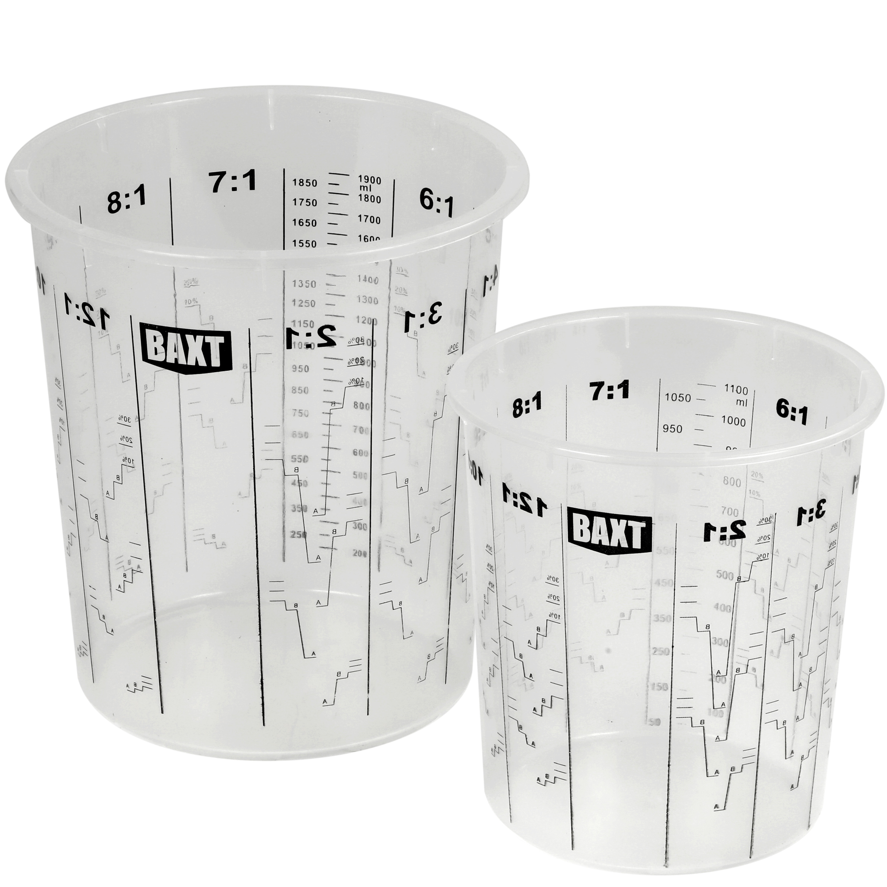

* Vacuum Bagging Gum Sealant Tape 

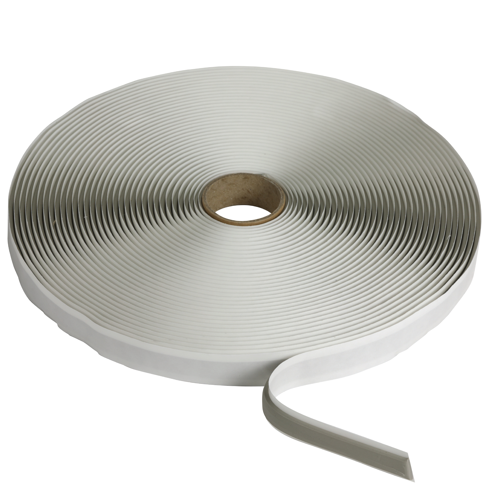

* Vacuum Bagging Film

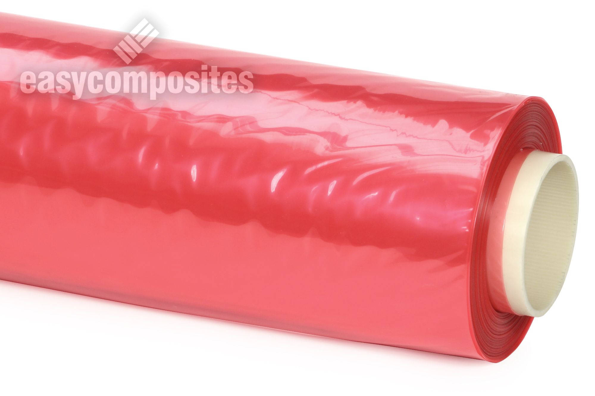

* PVC Vacuum Hose

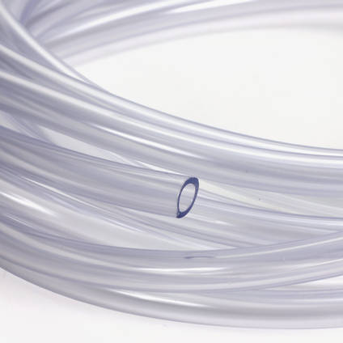

* Vacuum Pump

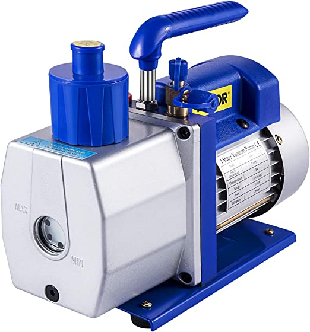

* Glycerine-Filled Vacuum Gauge

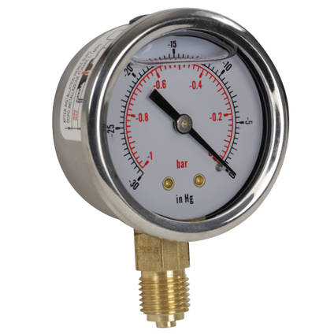

