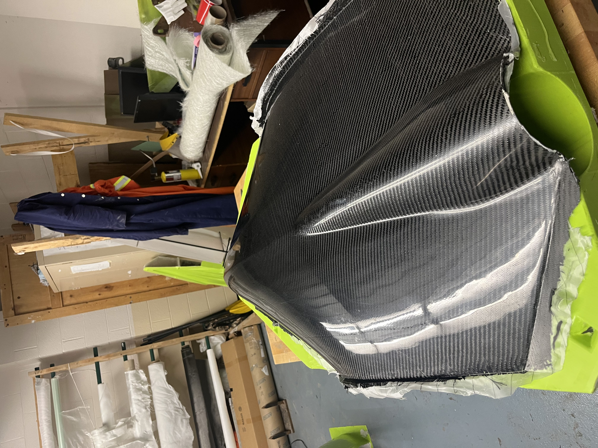

Carbon Fiber Vacuum Bagging Process
===================================

When you finish the Fiberglass mold, you can begin working on the Carbon Fiber process. Luckily, this process is NOT time sensitive and can be done in one go, however will take an hour or two to complete.

This is how your mold should look when you begin: 

Preparing the Mold

To begin, you need to prepare the mold:
1. Begin wet sanding the inside of the mold. The finish you want will determine what grit you use. For a shiny finish (which is what we are doing), use 1500 grit sandpaper. This sanding process can be time consuming. Make sure to get all areas. 
2. Wipe off any excess water and sanding residue with a paper towel.
3. Using a polishing compound (we used TOPFINISH 2 Natural Ultra Gloss Polishing Compound) and a microfibre polishing cloth (or an electric polisher if available), begin polishing the surface until you can see a reflection (as seen below). 

4. Wipe off any excess polish with a clean microfiber cloth.I
5. Using MC1 Mould Cleaner and a lint free wipe, clean the mold (flanges included) thoroughly. 
    * Ensure to clean the mold every time you use it 
6. Using Lint-free wipes, apply CR1 Easy-Lease Chemical Release Agent over the ENTIRE surface (plug and flanges), 5 times. 

Carbon Fiber Sheet Preparation
==============================

Before beginning the resin process, it is best to cut out and prepare everything you need. For our process we used 2 sheets of carbon fiber, 1 sheet of peel ply, 1 sheet of breather cloth, and Nomex Honeycomb (for reinforcement in certain places). However, your case may vary depending on the use case. 

* 2 Carbon Fiber Layers: These sheets should be slightly larger than the body of the project - it should go about 1cm onto the flanges. You can trim after you lay if needed.
    * Try not to stretch the sheets as the first sheet you lay will be the visible layer. 
    * Cut as many sheets as layers you plan on doing. We are doing 2 layers of carbon fiber, therefore need 2 sheets. 

* 1 Peel Ply Layer: This sheet should be roughly the same size as the carbon fiber but can be slightly larger. 

* 1 Breather Cloth Layer: This piece can be smaller than the peel ply.
* Nomex Honeycomb: This is for reinforcement purposes. There are other materials that can be substituted here. Only cut as big as the area you’d like to reinforce. 

Layup Process
=============

After you have prepared and cut your sheets of carbon fiber, peel ply, breather cloth, and nomex honeycomb, you may begin the layup process:
1. Start by preparing a mixture of Epoxy Laminating Resin and Epoxy Hardener into a mixing cup. Make sure to follow the 100g epoxy to 30g hardener ratio provided on the label when measuring. 
2. Mix well. Ensure to scrape the sides and bottom. 
3. Apply some of the epoxy mixture with a 1”-2” brush to the mold itself (to make sure the first layer will be fully impregnated). 
4. Lay the first layer of Carbon Fiber. Try not to stretch this sheet too much.
5. Apply the epoxy mixture with a brush to the top of the first layer, making sure that all areas of this layer are covered.

6. Next, apply the Nomex Honeycomb layer (in between this layer and the next).
7. Lay the second carbon fiber layer on top of the first layer and nomex honeycomb.

8. Apply more of the epoxy mixture with a brush. Ensure this layer is saturated in the mixture.
9. After this is done, lay the peel ply layer. 

**NOTE:** This layer is a barrier. Anything placed below the peel ply layer will be cured into a composite part. Anything placed above the peel ply layer will not stick. 

10. Lay the breather cloth layer on top of the peel ply. This cloth absorbs any extra/excess resin. 

Next, we will begin the vacuum bagging process.

Vacuum Bagging
==============

When you have finished your layup, the next step is to vacuum bag the part. 

1. Using the MC1 Mould Cleaner and Lint-free wipes, clean any resin or carbon fiber strands from the flanges of the mold. 
* It is important to do this because the gum tape will not stick if there is any resin and will not seal if there is the smallest strand of carbon fiber interfering with the tape. 
2. Taking a roll of gum tape, apply it to the entire perimeter of the mold. Leave the top white paper on it for now.

3. Cut a piece of vacuum bagging film significantly larger than the mold. 
4. Pick a place to begin applying the film to the tape.
5. Attach the edges of the film to the tape, anywhere where the film sheet has to be turned, create a ridge.
6. Poke a small hole in the middle of the bag. 
7. Insert the PVC Vacuum Hose and apply gum tape around it to seal it. 
8. Attach this hose to the Vacuum Pump and turn on the pump. 
9. Allow the pump to suck any air out of the bag. Turn off pump when done.

When the vacuum is sucessful, it should look like this:

If the bag does not become vacuum tight, there must be a leak. 

When checking for leaks, you may be able to hear the leak if it is large. If small, the best way to tell if there is a leak is to use a vacuum gauge. When you turn off the vacuum, if it is not sealed, this gauge will show a decrease the pressure. 
Ways to check fix and fix leaks:
* Make sure there are no creases
* Make sure there are no tiny pinholes in the bag
* Make sure there are no strands of carbon fiber going through the gum tape
* Make sure any holes, grooves, or pockets in the mold have been filled with gum tape

Removing the Vacuum Bag/Finishing Steps
=======================================

After 24 hours, you may remove the vacuum bag.

1. Begin by taking the pvc tube out of the bag.
2. Remove the vacuum bag and gum tape. You should now be able to access the breather cloth/peel ply. 
3. Remove the composite from your mold.

4. Flip the completed part over to its inner side. Remove the breather cloth and peel ply. This step may take some effort. We found the easiest way to do this is by cutting the peel ply and removing it in strips. 
5. Remove any access on the edges by sanding them off. Make sure to use a dust mask or respirator for this step!
6. Compete your other pieces (if needed) and assemble by your process of choice.

You have now completed your carbon fiber part. 