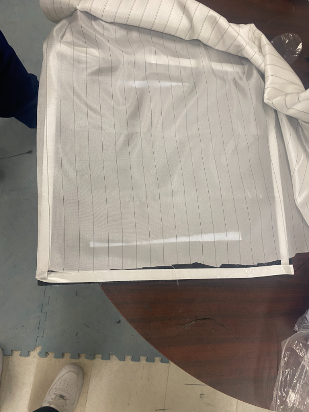
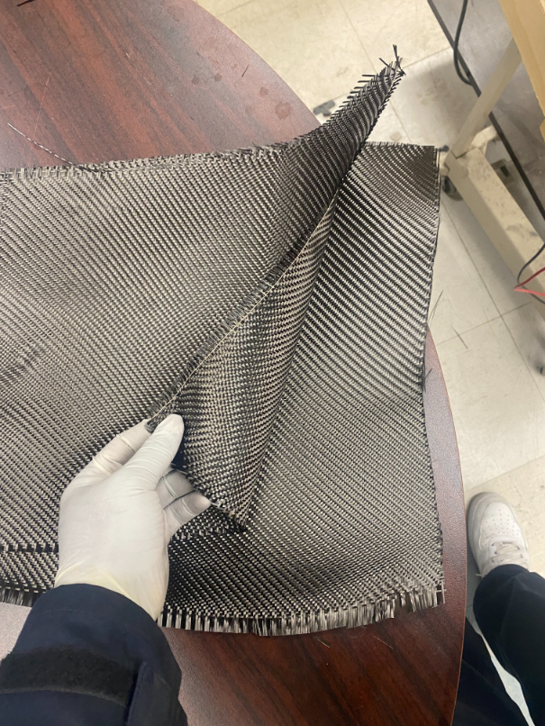

Carbon Fibre Plate Manufacturing
================================
This tutorial describes the process of making a solid carbon fibre plate. The process involves 
fitting carbon fibre pieces to a core material and using resin/hardender to make the fibre rigid.
This same process can applied to other shapes as well.

Tools
-----
While preparing the plate it is best to wear gloves to prevent any resin or adhesive from touching your skin. 
Losing resin/adhesive at certain steps can mean that piece of the material will not cure. 

Easy Release Chemicals Agent (Volatile)
^^^^^^^^^^^^^^^^^^^^^^^^^^^^^^^^^^^^^^^
The easy release agent is used to prevent the material from sticking to the bed. Without this,
the material can be easily damaged when removed.

Core Material
^^^^^^^^^^^^^
Material that lays between the carbon fibre plates. 

Gum tape
^^^^^^^^
Used in the vacuum bagging process to seal the vacuum bag.

Peel Ply
^^^^^^^^

Meant to be peel away after vacuum bagging. Doesn't not stick to the material, just creates a layer.

Breather Cloth
^^^^^^^^^^^^^^
Soaks up excess resin coming from the permeable peel ply. This can be peeled off as it goes on the peel ply.

Epoxy
^^^^^
Epoxy resins are the most common type of resin used with carbon fibre. Epoxy resins adhere well to carbon fibre.
There is a resin side and a hardener. The resin is laid first and the hardener then cures the resin, stiffening it.

Hardener
^^^^^^^^
There are various hardeners that have different cure times. Some hardeners can take 24 hours or more while others
can cure in about 2 hours. The 24 hours takes much more time but the work is not as rushed as it would with a 
2 hour hardener.

Plate Making Preperation
------------------------
To begin the process the top and bottom layer must be cut out of the carbon fibre material. Cut whatever size that 
is needed for the core material.

.. figure:: ../_static/images/Carbon1.jpg
    :figwidth: 900px
    :target: ../_static/images/Carbon1.jpg

Cut out a shape the same size as the one made from carbon fibre. The thickness of this material will be the 
thickness of the plate. 

Place the core material in between the carbon fibre cuts. 

Clean and prepare the bed using a rag or a line free paper towel

Apply the easy release on the bed using a lint free wipe. Apply about 5-7 coats.

Tape the surrounding if the material on the bed using gum tape. Air bubbles will be left under the tape
use a rubbing up and down motion to remove them.

Next apply peel ply on the material.

Apply breather cloth to the assembly. This step does not need to be precise! 

Make sure peel ply covers the entire carbon fibre or the breather cloth will stick to the carbon fibre.
The breather cloth should also be smaller than the peel ply or conversely smaller than the carbon fibre. 

Mixing and Applying the Epoxy
-----------------------------
Measure and mix the resin/hardner using a 100:30 ratio of resin to hardener. For 100g of resin,
30g of hardner should be used.

Use the stir stick to slowly stir the resin and hardener. Stirring fast will introduce air bubbles to the mixture.
Make sure to let the mixture sit to dissipate air bubbles. Mix 100% of the resin and hardener together, if there is
any unmixed resin it will not cure without the hardener. 

Once again, leave the mixture to sit for a moment to let all the air bubbles escape. 

Now apply the mixture to the bed using a squeegee or brush to spread it. Mix more epoxy if needed.

Once the epoxy is applied, place the carbon fibre cut on the resin covered surface. Then with a dabbing motion using
a brush or squeegee squeese the resin from underneath the carbon fibre. A dabbing motion is important to keep the 
strands of carbon fibre in place. 

***************EMBED VIDEO**********************

Vacuum sealing
--------------

Now place the core material on the resin soaked carbon fibre layer. Use the same dabbing motion to get rid of excess
resin.

Give the assembly a quick shake before applying the last carbon fibre layer to remove any excess material. Then place
the second and final layer using the method described above.

The side of the plate that is facing the bed will be smooth, but the side with the peel ply will be a little more rough.

Place the peel ply on top of one side. This does not have to be precise as the vacuum sealing will pull the ply in tight.

Now apply the breather cloth on top of the peel ply.

Next, release the casing to reveal the gum tape. 

Leave a space to put the vacuum pump casing when placing the vacuum bag on top.

Take the vacuum bag and lay it on top. Leave a bit of room and press firmly on the gun tap and make sure there are no
creases in the vacuum bag. This can let air in, so avoid them. Use small cleats if air must enter the vacuum. 

Make a small hole in between the vacuum bag and the casing to connect the vacuum hose but add some gum tape to 
make sure there is no air leak in between the two.

Connect the vacuum and turn it on to drain all the air. Check for any leaks and seal them in necessary. 

********************************VIDEO***********************************************

Finishing
---------
The process should be left to cure overnight. Once it is cured it should look like the image below.

Now remove the vacuum bag and the gum tape.

Afterwards take off the breather cloth by using the peel ply underneath it. Cut strips off the peel ply
if it does not come off easily.

The carbon fiber part should then come off easily because we added the easy release agent at the 
beginning of the process

You can finally trim the edge and cut into your desired shape.

