Case Studies
============

Building the Supermarine Spitfire Mk IX Plane
^^^^^^^^^^^^^^^^^^^^^^^^^^^^^^^^^^^^^^^^^^^^^

Introduction
------------

There are endless possibilities in the things you can create with additive manufacturing. Anything designed in a CAD software or 
scanned into a computer can be brought to life with the use of a 3D printer. From mechanical components to fun displays and 
even a functioning flying plane. To showcase this power we built a functioning Supermarine Spitfire model plane.

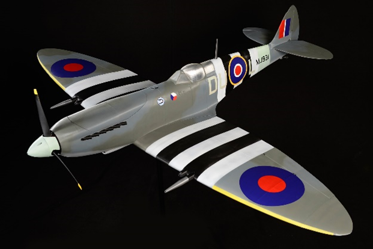

History
-------

The Supermarine Spitfires are a historic line of planes with over 22 000 being crafted over 24 versions. In 1941 the Royal Air 
Force (RAF) first debuted the Spitfire Mk V the same day as the Luftwaffe debuted their plane, the Fw 190. It was clear the 
Mk V was inferior and the RAF was in trouble. They immediately needed new planes and so Supermarine and Rolls Royce got together 
and created the Mk IX just a few months later. After being dominated by the Fw 190 for months, the MK IX was a blessing and had 
finally given the Allies a shot at aerial combat against the Luftwaffe. The Supermarine Spitfire Mk IX became an iconic plane 
in history, war, and in the model plane world.

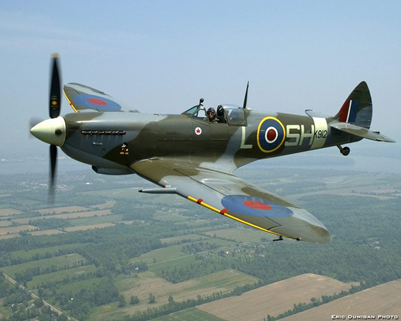

Research
--------

3D LabPrint is a Czech Republic company that has several model plane and vehicle designs that can be printed, including the 
Supermarine Spitfire Mk IX. 3D LabPrint offers STL models of planes that can be printed out and assembled into real 
flying planes. The plane is broken down into many parts that are printed separately and then are glued together and painted. With 
the addition of some electronics like motors, servos, and ESC’s, once properly put together, the plane will be able to fly. Even 
though it is a model the Spitfire Mk IX is still quite large with a wingspan of 1.7 m and a length of 1.5 m.

After selecting which plane to print, the first step was to do research on the plane. Research was needed to find out what 
printer(s), Slicer, Filament, etc. were needed. 3D LabPrint offers a detailed user guide that provides all of the information 
needed. The planes are able to be printed with open-source printers like the Eryone ER-20 in the Student Design Hub, in fact, an 
Eryone ER-20 was used to print most of the parts made in the Supermarine Spitfire Mk IX on display. Any slicer would typically do, but 
3D LabPrint recommended Simplify3D, so that was the slicer used to print this plane. Filament brand did not matter as long as it was 
a quality filament that would be able to print well. Overture PLA was used for most of the plane and a little bit of Prusa 
Original PLA was used. For bed adhesion, 3D LabPrint recommended using hairspray. Hairspray was mostly used however some glue 
sticks were used as well.

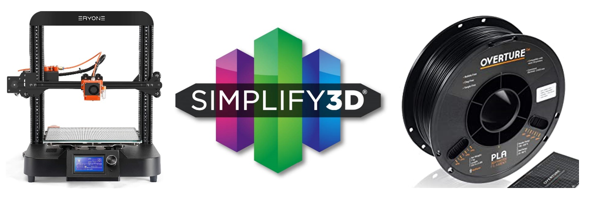

Thin Wall Printing
------------------

For summarized quick settings, visit :ref:`Thin Wall Printer Settings`

When the package is bought from 3D LabPrint, there are a few things included. 3D LabPrint offers already prepared G-codes or base 
STL’s that can be sliced with most programs. The prepared G-codes are made for the Prusa I3 or other compatible printers. STL’s with 
prepared settings come for Simplify3D, Cura, and MatterControl Slicers. However, as the user guide says these are just base settings 
and will need to be edited as needed.
 
Before purchasing the entire package of the plane, 3D LabPrint allows the download of one part of the plane (typically the largest) 
to see how the printer will handle thin walls as well as the size of the part. In the Spitfire’s case, the free part was the front 
of the fuselage. This first part was downloaded with the prepared G-code. Even though the Eryone ER-20 is not compatible with 
the Prusa I3, the G-code was used to see how the printer would handle it. This did not go well, there was lots of stringing and 
holes in the print. The print was stopped well before it was finished because of how bad it was printing.

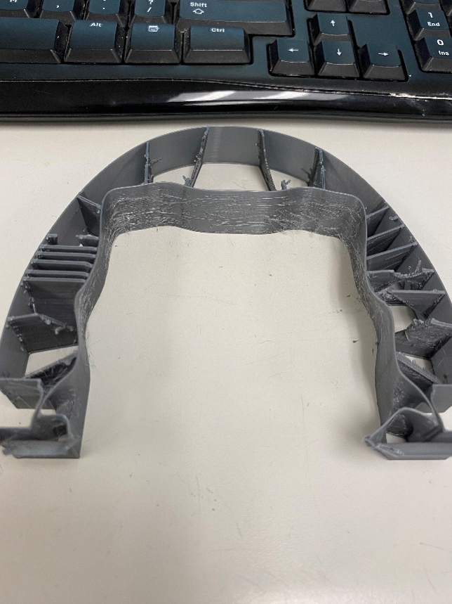

As you can see from the picture, thin wall printing can cause a lot of issues, especially when the G-code isn’t tailored to get 
the best result possible from the printer and the filament. The main issues were the amount of stringing, over extrusion, too high 
of a temperature, and the z-seam.

One of these initial problems that occurred when 3D printing this plane was the amount of stringing. Stringing is small lines of 
filament trace over gaps in the part. See picture

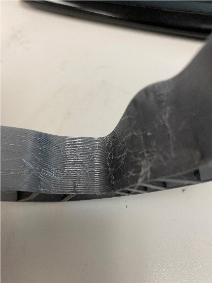

There are many settings that can help with stringing, but testing them is the only way to ensure the print can get the best result 
possible. After many tests of the settings in Simplify3D like Retraction Distance, Coasting Distance, and printing speed 
it was found that the best numbers for these settings to avoid as much stringing as possible was 5 mm, 0.2 mm, and 3400 mm/min 
respectively. Some stringing still occurred with different parts being printed, but it was never enough to cause any issues.

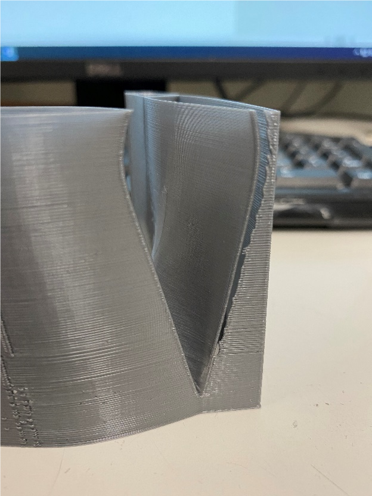

Another major issue with printing this plane was the z-seam. Fused Filament Fabrication (FFF) or Fused Deposition 
Modeling (FDM) 3D printing is done by layering melted thermoplastic to build up a structure. The filament for each layer has to 
start somewhere and end somewhere. This is known as the z-seam, when the start/end of each layer is set at a specific point, there 
will be a seam going up the part. It is very hard to merge two pieces of plastic without causing any visible effects but with the 
correct settings in a slicer then the effect can be minimized. 

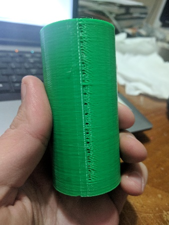

The initial problem with the plane part’s z-seam was that it was very noticeable and too big. There were several spots going up 
the test parts that had big blobs where way too much filament was coming out of the extruder. Some research and testing had to be 
done to find out the best settings to fix this.
 
A powerful setting in Simplify3D is called Extra Restart Distance. This setting will add or subtract the amount of filament being 
pushed out of the nozzle after a retraction and/or the start of each layer. If the retraction distance is set to 2 mm and 
Extra Restart Distance is set to -0.4mm then the extruder will push the filament back down 1.6mm and begin to print. This 
can be helpful when there is too much filament coming out after every retraction. Oppositely, Extra Restart Distance can be 
set to +0.4mm, and 2.4 mm will be pushed out of the extruder after each retraction. This can be helpful when there is not enough 
filament coming out at the end of each retraction and is leaving holes in the prints.
 
In the Spitfire planes case, the problem was too much filament. As mentioned above Extra Restart Distance is a powerful setting 
and slight changes can make a big difference in prints. As pictured below, if there is not enough filament coming down after each 
retraction there can be many holes in your print.

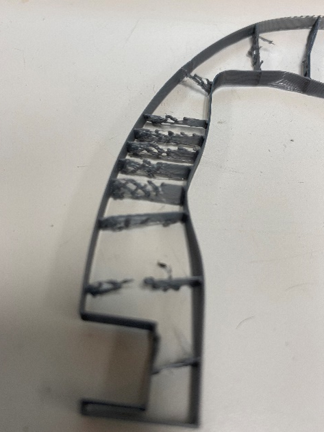

3D LabPrint’s base setting was to have Extra Restart Distance at 0.04 mm. Even this very small number cause issues. After some 
failed prints, trying negative and positive values for this setting, it was found that a value of 0 was best to be used. 
However, that was not the only setting that needed to be changed.
 
Simplify3D has settings that can also affect the placement of the z-seam. The start of each layer can be spread out around the 
part so that there is not one consistent seam going up the part, however, a drawback with this setting is then there are blobs and 
zits all over the part and sometimes in certain places where a part might need to be smooth.
  
That is exactly what happened when testing out the placement of the z-seam. There were blobs and zits all over the part and in 
some places were so bad would have had an effect on the part. In testing, it was found that there seemed to be more blobs and 
zits on curved walls of the print over flat walls. It was decided to test out placing to z-seam on a flat part and changing the 
extra restart distance setting to see how that would fair. There were some holes but since it was on the bottom of that part and 
was not a significant amount, the part was deemed usable. Using 0 restart distance and placing the z-seam on a flat surface of 
whatever 3D LabPrint had recommended was the best way to print the parts for the fuselage.

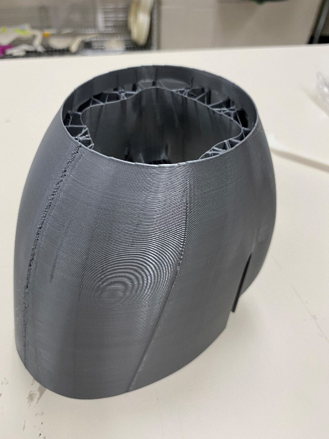

On the left side of the picture the z-seam is visible, as mentioned above there are some small holes going up the side. This part 
was not meant to be waterproof and since the holes are so small they will not cause any issues for the plane. As well in 
the assembly of the plane, a type of fill such as wood fill, Bondo, or epoxy can be used to fill in any holes or imperfections.

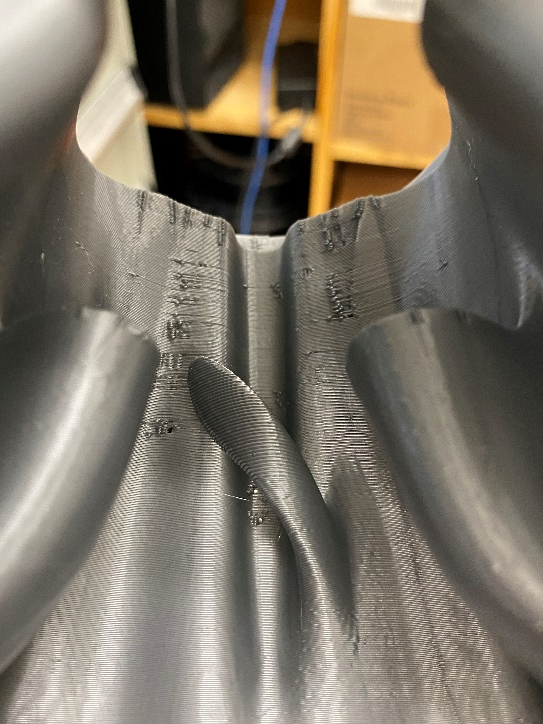

From the inside, there are also some blobs and zits that have formed towards the top from the extruder. These imperfections are 
on the inside of the plane and hence have no effect on anything.

Bed Adhesion For Thin Wall Printing
-----------------------------------

Bed adhesion was a problem at the start of printing the plane. 3D LabPrint suggested the use of hairspray and so that is what was 
used. However early troubles with bed adhesion were due to the lack of hairspray being used.
 
Glue sticks are very strong and are great for holding down parts. However, sometimes it can be too strong and result in it 
being very difficult to remove from the bed. With pieces of a plane being printed, they need to be perfectly flat on the bottom, and 
removing apart from a bed with glue sometimes hurts the bottom of a print.
 
That is why hairspray was used. However, hairspray is not as strong as glue so when hairspray is being applied it needs to 
be coated a couple of times. As well as give it time to dry before placing it on the bed. Most important; **Remove Bed from the 
Printer When Applying Hairspray**. If the bed is not removed it could cause serious damage to the printer and its electronics.  

Gluing Together Plane
---------------------

The plane was glued together with medium viscosity Cyanoacrylate (CA) glue and an accelerator. When working with CA glue you must 
be very careful as it is incredibly strong. **Wearing gloves is advised**.
 
When gluing the parts together you should be very careful they are lined up correctly because once the glue hardens even a 
little, it is not going to come off. Having to reprint parts will not be uncommon. The Ailerons for the Spitfire had to be 
reprinted because they were glued together poorly. As shown in the picture below, they should be flat. The fumes can also be 
bad, so make sure you are in a **room with good ventilation**.

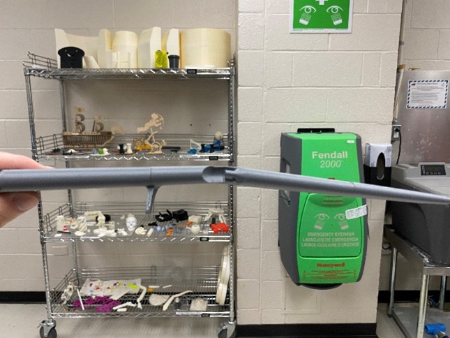

The plane had to be assembled into separate pieces to start. The fuselage, wings, and tail had to be glued independently and 
then glued together at the end. When working with an assembly, all your parts might not fit the same as they did in 
SOLIDWORKS. Having to file down a part or reprint a smaller version is not uncommon. The flaps and some parts of the wings had to be 
filed down so they could fit in their proper space for the Spitfire.

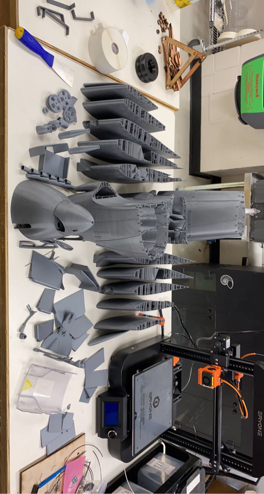

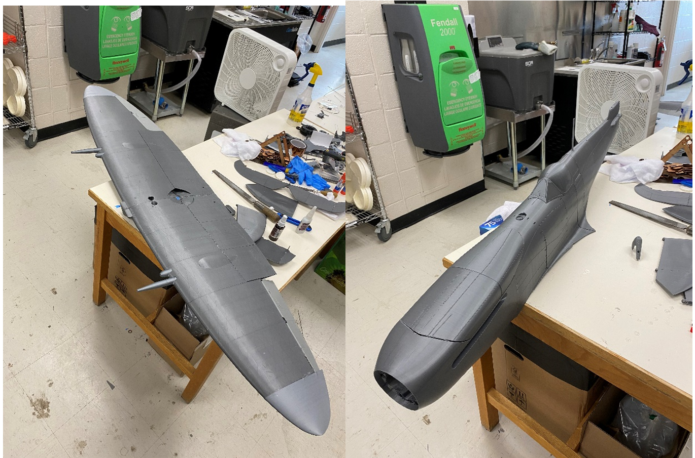

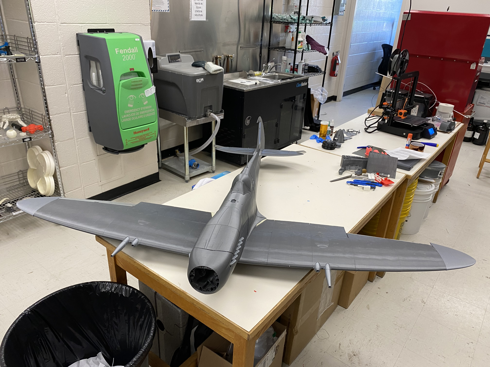

*Case Study of the Spitfire was cut short but the Construction of Spitfire was later completed*

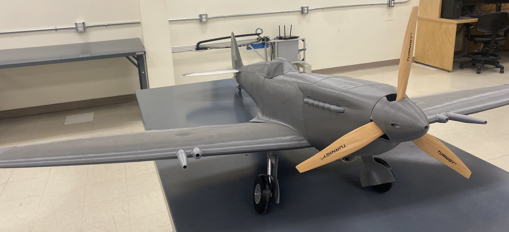

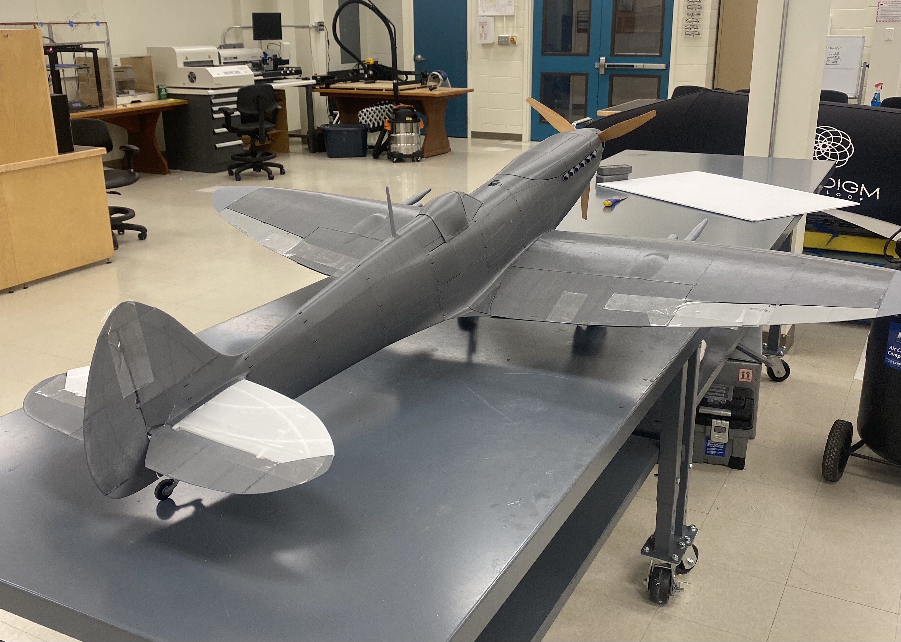

