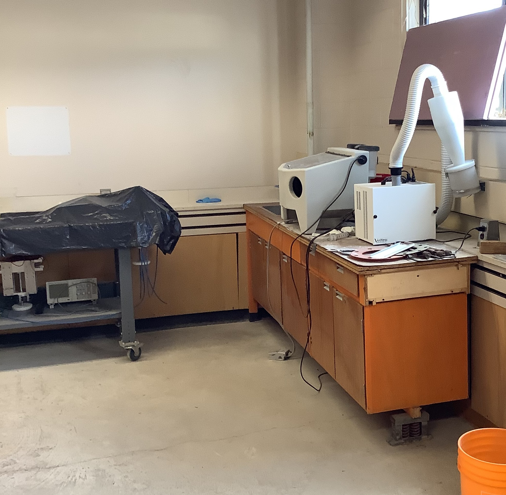
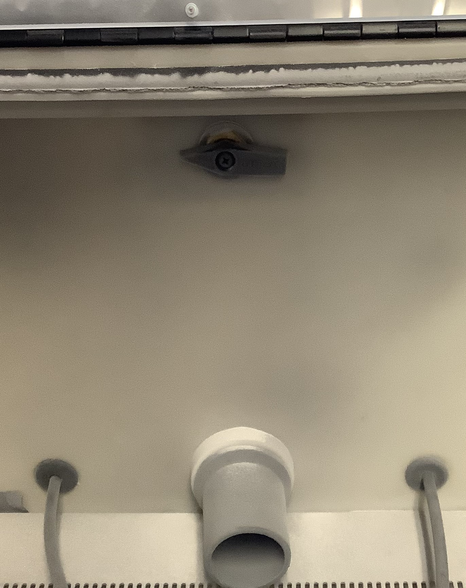
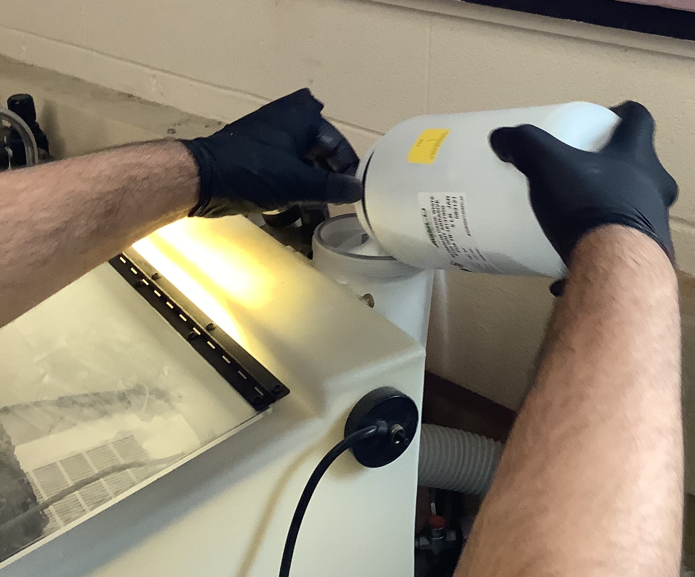
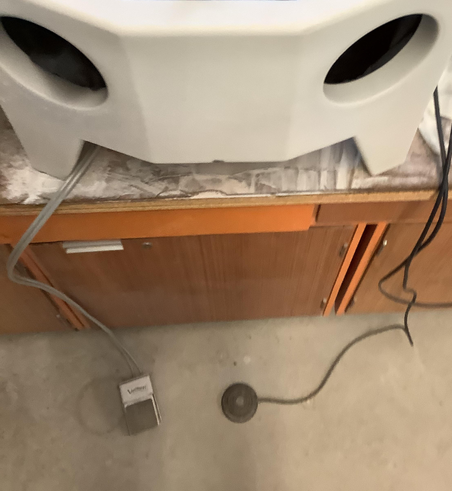
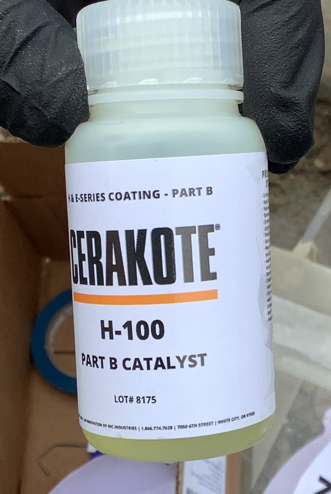
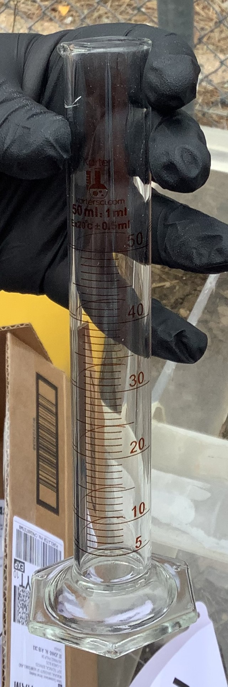

Cerakote Ceramic Coating
========================

Introduction
------------

Ceramic coating is the process of applying a surface finish to a  part will result in the part having
improved surface protection while also providing a refined look. Finishing the materials used during 
production can have many benefits including:

*Better Aesthetic
*Heat Protection
*Improved Durability
*Smoother Surfaces

Mostly all consumer materials today undergo some version of finishing. Some examples of this would be the
matte look of a car’s exterior or the smooth top on a desk. The finishing method explained in this
tutorial is ceramic coating using Ceracoat brand products available through the Student Design Hub. 

By the end of this tutorial you should be able to post process a part and apply a protective coating.

Before:

After:

.. figure:: ../_static/images/ceramic31.png
    :figwidth: 500px

Preparation
-----------

Before starting this tutorial, the following will be needed:

*Long extension cord
*Air compressor
*Spray gun nozzle
*Plumbers Tape
*Lint-free wipes
*Nitrile Gloves or medical gloves
*Acetone
*Sand-blaster
*Sand-blasting grain
*Oven able to heat to 300 degrees fahrenheit and fit your part
*Cerakote coating mix
*Cerakote catalyst
*Graduated cylinder or method or volume measuring device
*Masks

The first step to ceramic coating a part, is to clean the part of all dirt and grime using a lint-free wipe.
Next, soak the part in acetone for 30 min. Be sure to wear nitrile gloves when dealing with this chemical. By 
soaking the part in acetone, the chemical is evaporating any oils that are absorbed by the material and enables 
the ceramic coating to stick to the surface evenly when applied. Each chemical has an associated Material Safety 
Data Sheet. Never handle any chemicals without first reviewing the MSDS. Before proceeding with this tutorial please 
confirm that your WHMIS certification is up to date.  

Sandblasting
------------

After soaking the part in acetone for 30 minutes, the next step is to cover any areas of the part where you do not
want the coating to be applied with some sort of mask. This is often done with tape. The next step in this process 
is to sand the surface of the area where you’d like to apply the coating. This can be done using the sand blaster 
located in the upstairs portion of EN 1035 - Fluids and Hydraulics Room above the large wave generator. 

Sand-blasting is the action of shooting a grain textured material at high speeds to further smoothen a surface. Using a
system powered by compressed air, millions of pebbles shoot out of a hand-held nozzle in an enclosed chamber.

It's important to remember that choosing what product will shoot millions of pebbles. This is  because the decision will 
have a direct impact on the smoothness of the finish. Aluminum Oxide and sand are most common choices, but be aware of the 
grit rating because ratings that are too coarse will create a non-uniform finish. If needed, click the following link to purchase 
this material:https://www.agsco.com/minerals-and-abrasives/

Also, be cautious of the warnings on the bottles as they may require specific PPE, oftentimes, nitrile gloves are required.The 
MSDS for this Blasting material can be found here: https://www.agsco.com/assets/pdfs/Alumina-AOW-SDS.pdf?r=false

When first using the sandblaster it is important to avoid cross-contamination with the different grains that may have been used 
in the machine previously. It is good practice to check the bucket, and  the base of the enclosure for products that may be 
different than that being used. If this is the case, dry brush and clean as much of this away as possible to minimize mixing. 
The grains in the base of the enclosure can be accessed using a Phillips screwdriver, that is normally located in the area, to 
unscrew the grates. Then a plug underneath the machine can be pulled and the substance can be drained into a container.

The next step is to pour the product into one of the back two cylinders attached to the sandblaster, again, checking to 
ensure cross-contamination is minimal. For this example, the right-hand nozzle was to be used, so only the right cylinder was 
filled.  In order to ensure the air pressure flows to the correct nozzle, turn the switch found in the back of the enclosure to 
point towards what cylinder is being used. 

Once the grain is in the desired cylinder, turn on the machine, and turn the green lever found in the left corner of the room so 
that the lever is parallel with the pipe to which it is attached.

 Place the part being finished in the enclosure and seal the lid. Then, use the two arm holes to access the enclosure. Using the 
two pedals on the floor it is easy to control the power. The black pedal is a button that turns on and off the filtration system 
while the silver foot pedal switches the air pressure to the nozzle on and off.

It is recommended to use a PSI of 80-100 for metals and a PSI of 30-40 for non-metals like plastics and carbon fiber. This can be 
done by adjusting the knob by the green lever pulled earlier. First, pull up on the knob and then twist it clockwise or counter-clockwise 
to increase or decrease the PSI. Then, snap the knob back down into the original position. 

Continue to sand-blast the material until satisfied or, the sand in the back cylinder runs out. In this case simply re-empty the sand in the 
base of the enclosure or in the bucket found at the bottom of the cone filter and pour the substance back into the back cylinders. When 
finished with the sandblaster turn off the filtering machine and the green lever to stop the air flow. Finally, step on the silver pedal and 
drain all pressure out of the system.

After sandblasting the product, head to EN 1020 - Mechanical Room and with the help of Steve Steele, set up the oven for 300 degrees fahrenheit. 
Steve Steele can be reached quickly by checking his office in EN 1020 or he can be contacted by either email or phone, ssteele@mun.ca and 
709-864-7283. While waiting for the oven to preheat, rub the part down with acetone once more with lint free gloves and hang it up. Once the 
oven is preheated, bake the part for 60 minutes. This process evaporates any solvents and trapped contaminants left behind from sand-blasting 
or the acetone soak.

Mixing
------

While awaiting the 60 minutes for the part to bake, gather the following:

*Air compressor: found in the bottom right corner of the Student Design Hub (EN 1040)

.. figure:: ../_static/images/ceramic18.jpg
    :figwidth: 500px

*Long Extension Cord
*Plumbers Tape
*Masks

*The preferred ceramic coating mix. In this tutorial H-146 Graphite Black by CeraKote was used. To buy this product or other Cerakote products: 
https://www.cerakote.com/shop/cerakote-coating/H-146/graphite-black

*A Catalyst to add to the coating mix. This tutorial used Cerakote H-100 Part B Catalyst. Click this link to purchase the same:
https://www.cerakote.com/shop/cerakote-equipment/H-100/part-b-catalyst

*Graduated Cylinder or an alternative to measure volume. Note: Do not mix catalyst and Cerakote coatings in any plastics besides: polypropylene 
(PP), high-density polyethylene(HDPE), or low-density polyethylene (LDPE).

*Cerakote spray nozzle. Inquire to Engineer In Residence for its location. Oftentimes will be around or attached to the air compressor.

Once these pieces have been gathered, the spraying process can begin. Start by finding a safe place to spray the ceramic coating. If outside 
is a feasible option, it’s often the safest. During this tutorial, spraying was done behind the Engineering Building near the large garage 
door to the fluids lab. Run an extension cord to the designated spray area. Plug in the air compressor and connect the spray nozzle to the air 
compressor with plumbers tape. Plumber tape is applied by wrapping the material tightly clockwise around the threads of the nozzle. Plumbers 
tape serves to seal any gaps in the threaded connection and prevents air leakage. Use a wrench to tighten.

Next, shake the coating mix aggressively and let it sit for 5-10 minutes. Take the graduated cylinder and begin mixing the desired amount of 
cerakote ceramic coating with the catalyst. The ratio of this mixture is as follows:

Standard Mix: 1 part catalyst for every 18 parts of coating mix
Low Gloss Mix: 1 part catalyst for every 24 parts of coating mix
High Gloss Mix: 1 part catalyst for every 12 parts of coating mix

Note: Be sure to create enough mixture the first time, because making two separate batches may cause different dilutions and will therefore 
result in two slightly different finishes.

In order to mix the products stretch a nitrile glove tightly over the top of the graduated cylinder and shake for 30-60 seconds.

.. figure:: ../_static/images/ceramic25.jpg
    :figwidth: 500px 

The last step before spraying, is to strain the mixture. This is done by resting the provided paper filter on top of the spray gun canister and pouring in the mixture so that it seeps through the filter and into the canister.

The strain mesh required will be specified on the bottle. For Cerakote products, the normal mesh ratings are 100, 150, or 325 in-cup strainers. 

Spraying
--------

Begin spraying by putting on a respirator mask and nitrile gloves and becoming familiar with the nozzle. Refer to the image below related to 
the effect of each knob or go to the beginner guide video found in the “Tips” section below. Set the pressure to 20-25 PSI and practice on a 
piece of scrap until the correct spray pattern is about 2-3 inches thick when spraying 3-5 inches away from the part. Finally hang the part 
that is being finished in a clear and easily accessible place and start spraying. Perform two or three wet coats of ceramic for best results.

Spraying Tips:

*Spray gun setup and technique: https://www.youtube.com/watch?v=vOmB0yzJ0m8
*Avoid dry spraying: A sandpaper like appearance. Caused by either: spraying too far away, having too much air pressure, or not enough coating 
in the chamber. Ensure to spray between 3-5 inches, and that the correct air pressure is set. 
*Apply very thin layers
*Do not spray mechanical parts: Doing so can create functionality issues and the layer of Cerakote can violate tolerancing
*Shake the canister above the spray gun frequently to avoid clumping and settling
*Should appear wet but not runny
*Do not touch or wipe wet spray

TO SEE A FULL VIDEO GUIDE BY CERAKOTE CLICK THE FOLLOWING LINK!

https://www.youtube.com/watch?v=cuqo8f_7foU

Curing
------

After being satisfied with the spray, carefully transfer the part back to the oven used previously in EN 1020 to bake again. If using the 
H-series cerakote as used in this tutorial, the curing process calls for a temperature of 250 degrees fahrenheit for 2 hours. See the photo 
below for what to expect as a final product. 

Clean-Up
--------

While waiting for the final product to cure, remember to clean all components used in the mixing and spraying process. This can be done using 
lint-free wipes and acetone. To do this effectively disassemble all parts used to spray the ceramic coating this may include but is not limited: 
the spray gun itself, the air compressor, extension cord, and the graduated cylinder. Bring these parts to a clean area, like a workbench, and 
clear a place to let the components dry before wiping them. Next, while wearing nitrile gloves, remove all ceramic coating on these pieces by 
dabbing a small amount of acetone on the wipes and scrubbing the places that have coating until there is none left to be seen. Hang or position
the parts, the wipes and the gloves out to dry so that the flammable acetone has time to evaporate before going to storage or the garbage. 
Lastly, return everything used to its correct location in better condition than when it was taken!

