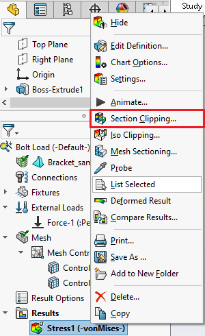
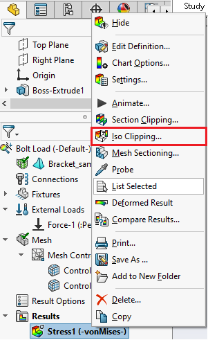
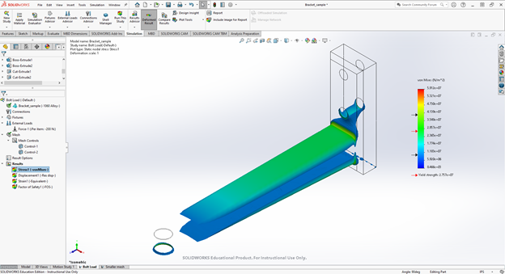
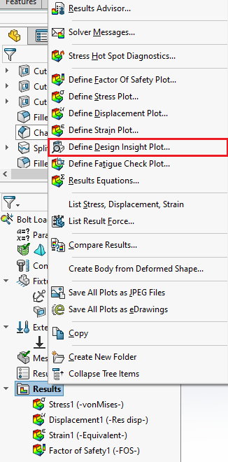
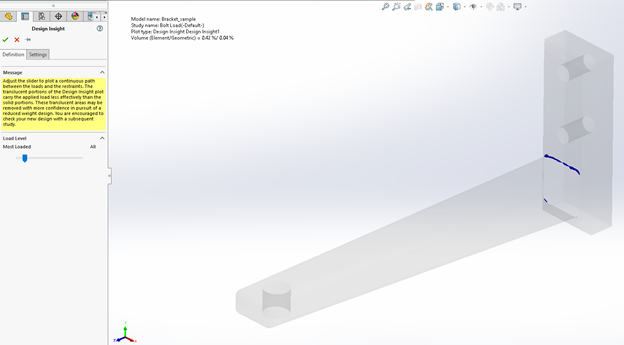
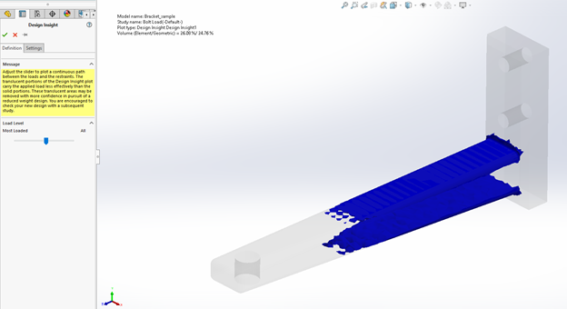

Clipping Views & View Plots 
===========================

Section Clipping
^^^^^^^^^^^^^^^^

Having now re-run the study with the newly refined mesh we can further look at these areas using the available clipping 
features available in the results feature in the design tree. For example with the tool “Section Clipping” you can create up
to 3 sections along the model planes to isolate the model and can choose the angle and/or distance the section will clip at 
with reference to the model planes. Section clipping can be accessed by right-clicking on the desired plot and selecting 
the option.
 

 
In the images below, I’ve used a section clip along the front plane and another along the top plane to isolate the sharp 
edge where the stress is greatest, giving the bracket view as seen below. Section clipping is a much more important tool for 
models with more complex geometry to isolate sections of your part that you may wish to view. 

.. figure:: ../_static/images/ClippingViews&ViewPlots2.png
    :figwidth: 600px
    :target: ../_static/images/ClippingViews&ViewPlots2.png  
 
Iso Clipping
^^^^^^^^^^^^

A second useful clipping tool to use when analyzing your results is the “Iso Clipping” tool, which lets you isolate your 
parts based on your plot values instead of your part position. With the Iso Clip tool, we can select a value that we don't 
want to see values above or below for. Similar to the Section Clipping tool, the Iso Clip tool can be accessed by 
right-clicking the appropriate plot and selecting it in the menu.

 
We can also create a second iso point in order to establish a range of values that we wish to suppress in between or outside 
of. Shown below is an example of a stress iso clipping where only values between 10 and 40 MPa are being shown on the 
bracket. The Iso tool is useful similar to the section clipping tool in that it can help to isolate and work with 
problematic areas in your build, which can be much more helpful the more complex your model geometry gets.

 
Design Insight Plot
^^^^^^^^^^^^^^^^^^^

A 3rd useful plot to monitor is the design insight plot, which allows you to monitor which areas of the model experience the 
greatest von Mises stress values. The design insight plot can be accessed by right clicking the results tab and selecting 
“Define Design Insight Plot”.

 
The plot contains a slider that allows you to choose the load level which dictates the maximum load percentage that the plot 
will show on the bracket. For example, the image below shows the bracket with the slider almost only showing the “Most 
Loaded” portions of the plot, which is at the bracket arm/face corner as predicted with the previous plots.  

 
The slider can then be moved to the right to see the areas on the bracket that experience less load than all preceding load 
values, which proves useful to see how the load gets distributed along the bracket.

 

