4 - Copper Routing
==================
**At the end of this section, view :ref:`Common Routing Mistakes` for improve your routing skills.**

   
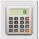
   
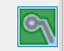
   
Copper routing is the process of placing copper traces to electrically connect all the components. 

You must have noticed a white spider web between the components after loading the netlist on PCBnew. This white spider web is called a ratsnest. A ratsnet is essentially a visualization of all the electrical connections in the circuit. It shows what every component is connected to and its importance is emphasized during the routing process. 

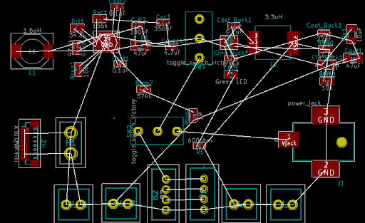
    
Routing Checklist
-----------------

1. **Organizing the ratsnest:** Before routing, the ratsnest must be organized inorder to maximize the space and possible paths for the copper traces. Organizing it means minimising the amount of traces that are crossing over each other. This can be achieved through rotating the components and changing their positions. See the before and after pictures of organizing the ratsnest.

Before organizing ratsnest

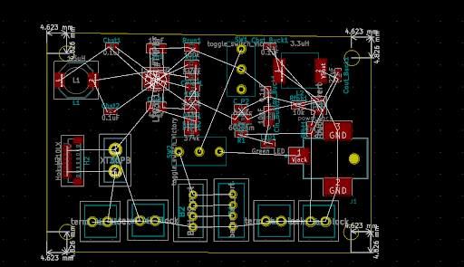
After organizing ratsnest

2. **Confirm the component orientations and footprints:** The routing process is not exactly an iterative one. To avoid complications, ensure that the correct footprints are assigned to the components before you begin routing. Also ensure that you like the orientation of your components - this really only has an effect when dealing with components that require a plug in, like a barrel jack. Once a component has been routed, changing the footprint or orientation will affect the routing. The routing will not change with a change in either the footprint or orientation - the copper traces are attached to nodes on the board not the pins of the component.

Rotating footprints by 180 degrees is the most common rookie mistake. Take the barrel jack below.

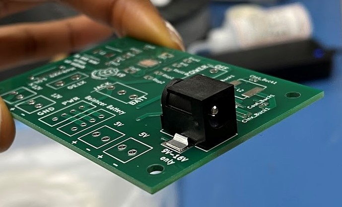
Correct orientation - plug in facing edge of the board

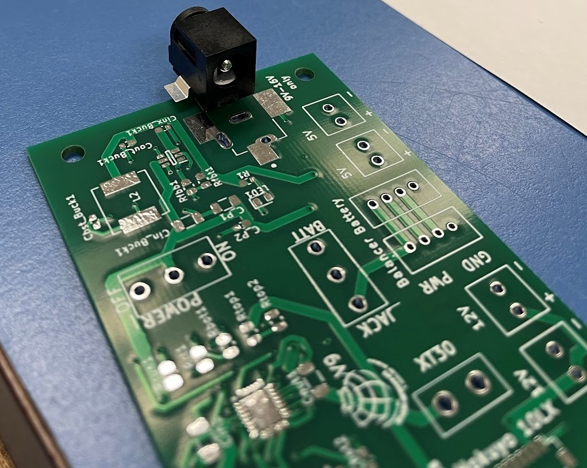
Incorrect orientation - plug in facing towards the board making it impossible to plug in a component

This mistake can be avoided by visualizing the board before production using the KiCAD 3D viewer. Access the 3D viewer in PCBnew by navigating to the top left and selecting view >> 3d viewer. Some components might not have a 3D model and will require you to download one off the internet and import it into KiCAD. View :ref:`Importing 3D Models` for how to do this.

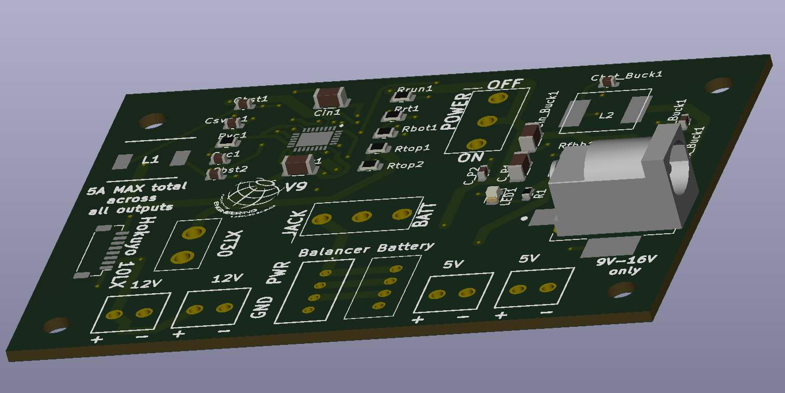

3. **Understand manufacturing specifications:** Every PCB manufacturer has both maximum and minimum specifications for the boards they can produce. For JLCPCB specifications, see `here <https://jlcpcb.com/capabilities/Capabilities>`_. There are different specifications for 1 oz copper thickness and 2 oz copper thickness. JLCPCB’s specifications are:

* Minimum trace widths: 2oz - 8mil (0.2mm), 1oz with 1 or board 2 layers - 5mil (0.127mm), 1oz with 4 or 6 layers - 3.5mil (0.09mm)
* Trace spacing 8mil (0.2mm), and
* The number of layers they can handle on a board: 1 to 6 layer boards
* Trace to Outline >0.2mm
* Drill Hole Size 0.20mm - 6.30mm
* Minimum annular ring 1oz - 0.13mm, 2oz - 0.2mm

4. **Determine the appropriate trace width:** The copper traces need to have a width. The width of the traces are dependent on the current going through them. If the trace is too narrow, it will overheat and burn - then your circuit is ruined. To get the appropriate width, use a `trace width calculator <https://www.4pcb.com/trace-width-calculator.html>`_.

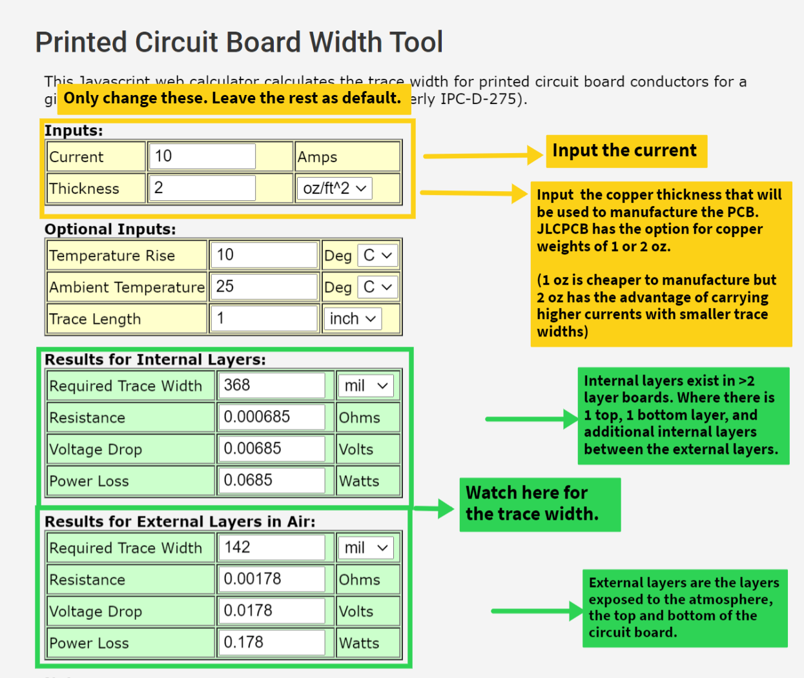

or the built-in trace width calculator |calculator| on KiCAD. The icon can be accessed from PCBnew by opening the project page and scrolling to the top toolbar.

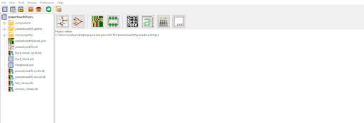

Routing
-------
A key tip for routing is **traces go across components but traces do not cross other traces** i.e. traces can't go over each other. As such, copper traces can appear on both the bottom and top copper layers of the board. Copper traces can also appear on internal layers for 3+ layer boards. Some tips are:

* SMD components must be routed on the same consistent layer for all pins while THT components can have one pin routed on the back and the other pin routed on the front of the board. The leads of THT components go through a hole, so the leads can connect the component to the other side of the board. Since SMD components are placed on the surface of the board, they cannot be connected to the other side of the board unless throgh vias.
* Use vias. A via is a hole that connects two electrical connections on different layers. To prevent traces from crossing each other, a via can be used to create the trace on another layer. Press the ‘V’ key to place a via.

Select the route tracks icon |route| on the right toolbar (Or press 'X'), then trace the ratsnest to route a component. 

Routing Order
-------------
Using the `trace width calculator <https://www.4pcb.com/trace-width-calculator.html>`_ seen in :ref:`Routing Checklist` above at **2 oz copper** for the respective currents, the trace width can be determined as seen in the table below. An important thing to note is in a circuit, different currents go through different sections. For example, the current at the power input will be higher than the current after passing through power dissipating components like resistors. Higher currents will have wider traces.

======================    ==================   ===========
Trace                      Trace Width (mm)     Current (A)
======================    ==================   ===========
Power traces               1.38 (54.33 mils)     5A
IC traces                  0.263 mm             1.15A
Easy to connect Traces     0.532 (20.9 mils)     2.5A
======================    ==================   ===========

1. **Start with the power traces:** The power traces carry the most current with the thickest copper traces on the circuit board. The connections of the power outputs like terminal blocks, XT3O connector and the components directly connected to the power inputs are the power lines.

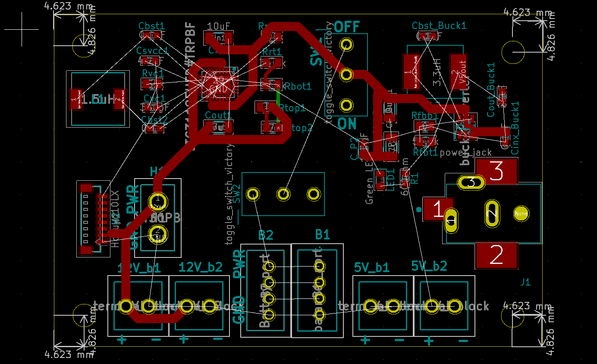
    
2. **Then the easy to connect traces:** These are traces that are simply straight lines, like between the balancer port, battery port, and the terminal blocks.

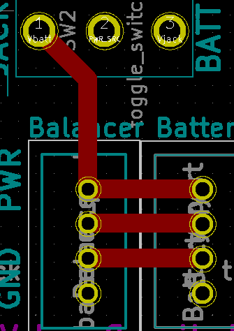
    
3. **Integrated circuits (IC) traces:** ICs like the buck converter and the buck-boost converter have a lot of pins which make them a tad bit complex to route. Routing these components requires visualization to ensure all pins can be routed. A helpful tip is make sure to not wrap the traces around the IC. Use mostly 90 degree traces to route this component.

.. figure:: ../_static/images/route14.PNG
    :figwidth: 700px
    :target: ../_static/images/route14.PNG
    
4. **Finally the ground pins (ground plane):** With the multitude of ground pins in circuits, it is easier to have a ground plane than to connect all the ground pins to each other. Having a ground plane means the ground pin can just be connected to a ground plane that will pccupy a specific area of the board.

**To create a ground plane:**

A. Select the add filled zone icon |zone| on the left toolbar.
B. Outline the board with an additional 1 grid as the zone then left click to close the outline. The zone must be closed at the point where the zone was started to ensure the outline is complete.
C. Select what layer you want the ground plane to be on. Ideally select only the bottom layer to prevent the concept called ground loop. Read more about a ground loop in :ref:`Common Routing Mistakes`

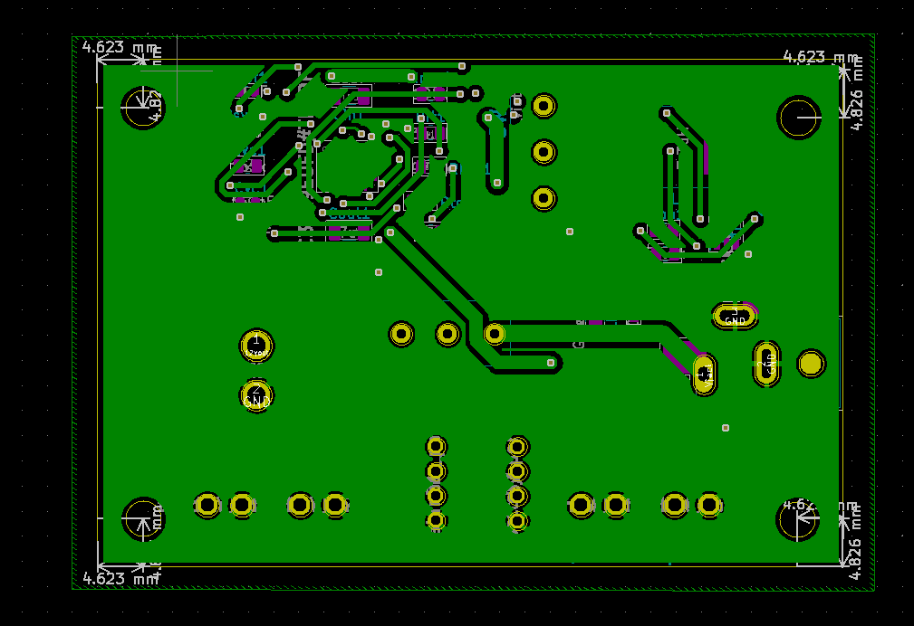

