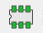
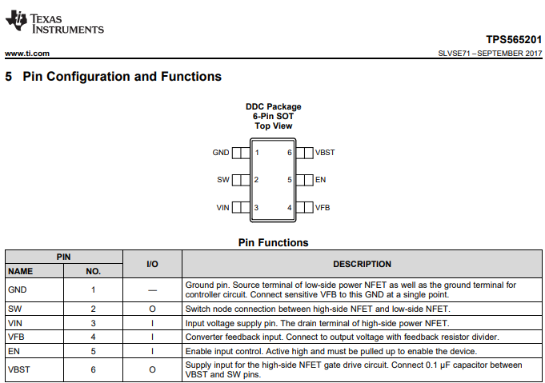
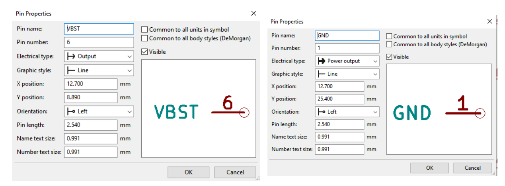

Creating and Importing Custon Symbols
==========

   
.. |bitmap| image:: ../_static/images/beyond27.png
   :width: 5%
   
.. |glines| image:: ../_static/images/Board9.PNG
   :width: 5%
   
.. |pin| image:: ../_static/images/beyond6.png
   :width: 3%
   
.. |nsymbol| image:: ../_static/images/beyond2.png
   :width: 5%
   

   
.. |gpolygon| image:: ../_static/images/board12.PNG
   :width: 5%
   
.. |apad| image:: ../_static/images/beyond19.png
   :width: 5%
   
.. |adlibrary| image:: ../_static/images/beyond24.png
   :width: 5%

Custom Symbols in Symbol Editor
-------------------------------
Creating custom symbols is necessary when the symbols needed cannot be found in the kiCAD library. To do this, a datasheet for the component is needed. For this tutorial, let's use this `buck converter <https://www.digikey.ca/en/products/detail/texas-instruments/TPS565201DDCR/7732455?s=N4IgTCBcDa4JwDYC0AWOAGdyCMSByAIiALoC%2BQA>`_ as an example.

Component Datasheet
    
1. **Create a new library to store the new symbol:** Click the symbol library editor icon |nsymbol| on the top toolbar of eeschema or the project page then select file >> new library. Save the library in your desired location then either select to save it on kiCAD as a global or a project specific symbol. Global symbols can be accessed from any KiCAD project, while project specific symbols can only be accessed from that particular project.

2. **Create new symbol:** Click the new symbol icon |nsymbol| on the top left corner. Select the library created in the previous step and then edit the symbol properties - the default reference designator and the symbol name are the settings that should be changed, leave the rest as default. The designator and the name both appear with the symbol.

.. figure:: ../_static/images/beyond3.PNG
    :figwidth: 700px
    :target: ../_static/images/beyond3.PNG
    
The default reference designator is used to identify the component in the schematic. KiCAD uses the reference designators to keep track of common components in your schematic, derailing from the standard reference designators can break your project. Do not guess the designator, use the reference designators standard IEEE 200-1975/ANSI Y32.16-1975 as seen below or by visiting `here <https://en.wikipedia.org/wiki/Reference_designator>`_:

.. figure:: ../_static/images/beyond4.png
    :figwidth: 700px
    :target: ../_static/images/beyond4.png

3. **Draw symbol outline:** Use the graphic polygon |gpolygon|  or lines |glines| tool to draw the outline of the symbol. Left click on the symbol outline to edit the properties. Select the fill background option to shade the outline of the symbol yellow.

.. figure:: ../_static/images/beyond5.PNG
    :figwidth: 700px
    :target: ../_static/images/beyond5.PNG

4. **Modify pins:** Add pins to the symbol using the pin tool icon |pin| on the right toolbar, based on the pin configuration from the datasheet. The thing to remember here is that the convention is to group similar pins together and place the two power pins to the top left and bottom right of the rectangle. 

First of all, I/O means input/output. Based on the pin configuration on the datasheet, pin 1 is named the ground. Ground is a power output even though it is not noted as output ‘O’ in the datasheet. Pin 6 is named VBST and is an output. Power pins are usually put under the electrical type power input/output, while regular pins are either input/output in the pin properties.

.. figure:: ../_static/images/beyond7.png
    :figwidth: 700px
    :target: ../_static/images/beyond7.png

.. figure:: ../_static/images/beyond9.png
    :figwidth: 700px
    :target: ../_static/images/beyond9.png

The positions of the pins do not matter and can be different from what is specified on the datasheet. The most important aspect of the symbol is the pin numbers and names. Do not mix up the names i.e. pin 1 must always be ground. Pin 2 cannot be ground, it must be SW.

Importing Symbols into KiCAD
----------------------------
Most component symbols can easily be found online from sites like `mouser <https://www.mouser.ca/>`_, `component search engine <https://componentsearchengine.com/>`_, or `snapeda <https://www.snapeda.com/>`_. After downloading it off the site, import it into Kicad by opening the symbol editor >> file >> import symbol. If you did not initially create a library, one is needed to store the symbol. Follow step 1 of :ref:`Custom Symbols in Symbol Editor` to do this.