Creating Schematics in Eeschema
================================

   
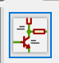

.. |slibraries| image:: ../_static/images/slibraries.png
   :width: 5%

.. |powerport| image:: ../_static/images/powerport.png
   :width: 5%
   

.. |nconnection| image:: ../_static/images/no-connect.png
   :width: 5%
   
.. |ERC| image:: ../_static/images/ERC.png
   :width: 5%
   
.. |hsheet| image:: ../_static/images/hsheet.png
   :width: 5%
   
.. |global| image:: ../_static/images/global.png
   :width: 5%
   
.. |adfootprint| image:: ../_static/images/beyond11.png
   :width: 5%
   
.. |bitmap| image:: ../_static/images/beyond27.png
   :width: 5%
   
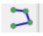
   
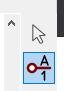
   
.. |nsymbol| image:: ../_static/images/beyond2.png
   :width: 5%
   
.. |footprint| image:: ../_static/images/beyond11.png
   :width: 5%
   

   
.. |apad| image:: ../_static/images/beyond19.png
   :width: 5%
   
.. |adlibrary| image:: ../_static/images/beyond24.png
   :width: 5%
    
Schematic Design
----------------
A schematic is simply the symbolic representation of a circuit as seen in the figure below. Schematics are designed on a schematic drawing sheet (whose size can be adjusted). 

.. figure:: ../_static/images/schematic1.png
    :figwidth: 700px
    :target: ../_static/images/schematic1.png
A simple schematic

For more complex schematics, the whole circuit may not fit onto the standard schematic sheet. As such, multiple schematics on different sheets are needed - which implies that the components cannot be visually connected together as they are not on the same sheet. As such, using a global label will connect the components on different sheets together - this set of multiple sheets connected together is called **hierarchical sheets**.

The V5out global label connects all points connected to it, to each other. The set of hierarchical sheets opens more sheets with more schematics and global labels. Click :ref:`Hierarchical sheets` to find out how to do this **AFTER** going through the :ref:`Schematic Creation Process` below.

.. figure:: ../_static/images/schematic2.png
    :figwidth: 800px
    :target: ../_static/images/schematic2.png
Hierarchical sheets with global labels connecting the schematics

Schematic Creation Process
--------------------------
At the end of this section, you should be able to recreate the schematic below. The buck converter schematic is not present on KiCAD so reference the Going Beyond setion to learn how to use the symbol editor.

.. figure:: ../_static/images/schematic3.png
    :figwidth: 800px
    :target: ../_static/images/schematic3.png

Follow these steps to create a simple schematic:

1. **Create a new project:** On the top right corner select file >> new >> project. The top toolbar should now be seen.

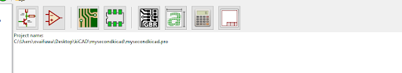
      
2. **Toolbars:** Select the schematic layout editor icon (also known as eeschema) |eeschema|. A page with a schematic drawing sheet and three toolbars (top, left, and right) should pop up. The left toolbar can be used to change your units and some other more advanced settings. We will be focusing on the right toolbar.

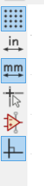
Left toolbar
    
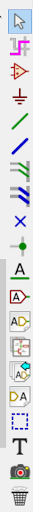
Right toolbar
    
3. **Place a symbol:** Place symbols using the symbol libraries icon |slibraries| on the right toolbar (Or press 'A'). Select the icon then click on the sheet, the symbol library should pop up. Type in the search bar the name of the component you are looking for, select it, click ok, then place it on the sheet. Common components like resistors and capacitors can easily be found by searching only the first letter of the component. Some components are referenced by other letters not found in the component name i.e. Inductors are referenced by ‘L’. Rotate components by selecting it and holding down the ‘R’ key.

Less common symbols like the buck converter are not part of the KiCAD symbol library. As such, the symbols have to be made by you or found on the internet. View :ref:`Custom Symbols in Symbol Editor` to learn more about this.

4. **Electrical connections:** Electrically connect the components using the wire icon |wire|  on the right toolbar (Or press 'W'). Use the power port icon |powerport| to place global labels like grounds, potentials, and other power labels. Grounds, power, and potentials are referred to as global labels because they are always the same no matter where they are placed or connected to - they do not ever change, unlike resistors that the values can be adjusted.

5. **Edit symbol properties:** Access the properties by left clicking on the symbol then selecting properties. This becomes handy when you need to edit the value of a component or the name (also known as reference). Take the Cin_buck1 capacitor as an example.

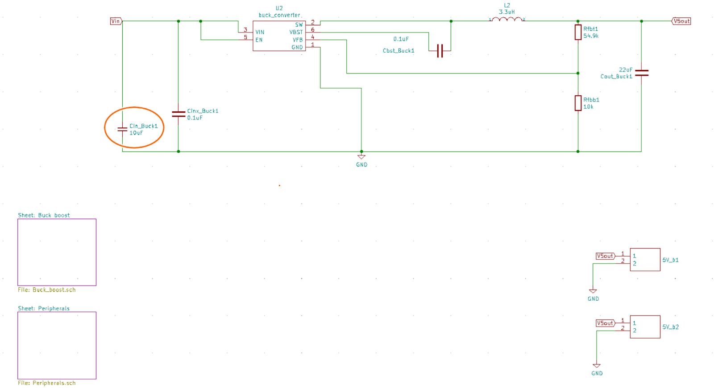

    
.. figure:: ../_static/images/schematic8.PNG
    :figwidth: 700px
    :target: ../_static/images/schematic8.PNG

6. **Annotate schematic symbols:** When symbols are placed on KiCAD, no names are attached. For example capacitors are shown as ‘C?’ and resistors as ‘R?’. So they need to be named and numbered i.e. R1,R2 … using the annotations icon |annotations| on the top toolbar. If you want custom names like the ones i.e. Cinx_buck1, you will need to manually edit all the names/references from the symbol properties.

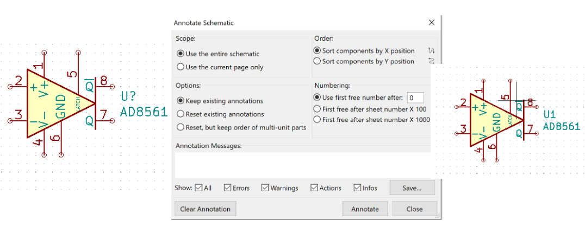
    
7. **Connection flags:** There are two major connection flags; the no-connect flag |nconnection| and the power flag |powerport|. The purpose of these flags are to suppress errors / problems about pins from the electrical rules checker and to also provide clarification to your schematic. The electrical rules checker verifies your schematic connections.

* The no-connect flag is placed at unconnected pins. You can place the no-connect flag by clicking on the icon |nconnection| on the right toolbar.

* The power flag is placed at pins that are driven by an external power source. You can place the power flag by selecting the power port icon |powerport| (Or pressing 'P') and searching for it.

.. figure:: ../_static/images/schematic10.PNG
    :figwidth: 800px
    :target: ../_static/images/schematic10.PNG

8. **Run electrical rules checker (ERC):** select the ERC icon |ERC| on the top toolbar, leave all settings as default, then click ok. If there are any problems with the schematic, it should  show in the box. 

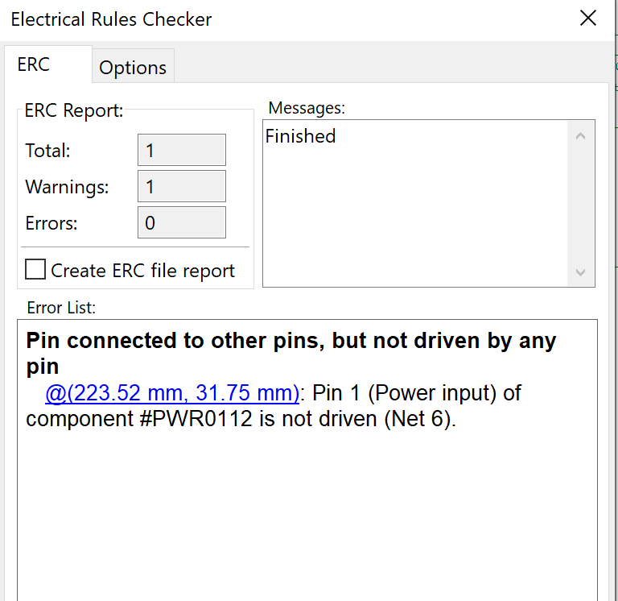
The error shown in the box can be removed by placing a power flag at that pin.

Hierarchical sheets
-------------------

.. figure:: ../_static/images/schematic2.png
    :figwidth: 900px
    :target: ../_static/images/schematic2.png
Hierarchical sheets with global labels connecting the schematics
    
1. **Creating a sheet:** select the hierarchical sheet icon |hsheet| on the right toolbar and place the outline on the sheet. Fill in the sheet properties like the sheet, file name, and leave the rest as default.

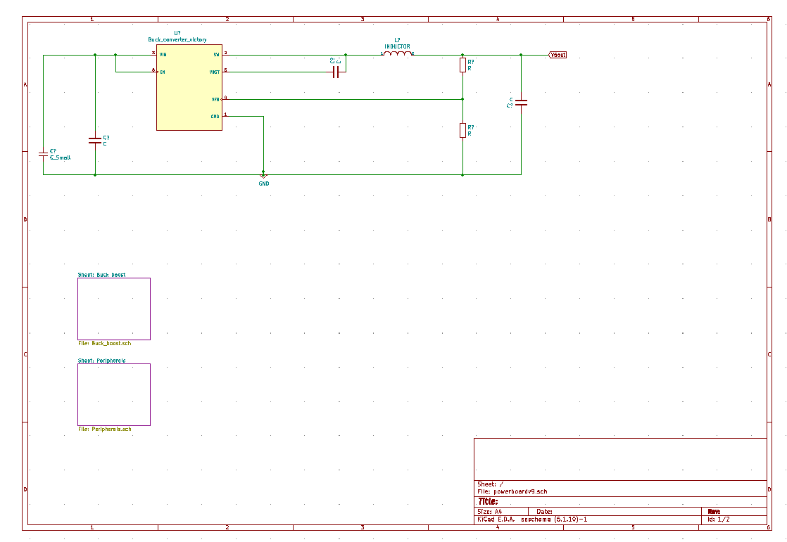

2. **Global labels:** Since the schematics are on different sheets, they need to be connected to other components using global labels. Examples of global labels are power labels. They can be placed using the power port icon |powerport| while custom global labels can be created by selecting the place global label icon |global| on the right toolbar.

Creating and Importing Custom Symbols
------------------------------------

Custom Symbols in Symbol Editor
^^^^^^^^^^^^^^^^^^^^^^^^^^^^^^^
Creating custom symbols is necessary when the symbols needed cannot be found in the kiCAD library. To do this, a datasheet for the component is needed. For this tutorial, let's use this `buck converter <https://www.digikey.ca/en/products/detail/texas-instruments/TPS565201DDCR/7732455?s=N4IgTCBcDa4JwDYC0AWOAGdyCMSByAIiALoC%2BQA>`_ as an example.

.. figure:: ../_static/images/beyond1.png
    :figwidth: 700px
    :target: ../_static/images/beyond1.png
Component Datasheet
    
1. **Create a new library to store the new symbol:** Click the symbol library editor icon |nsymbol| on the top toolbar of eeschema or the project page then select file >> new library. Save the library in your desired location then either select to save it on kiCAD as a global or a project specific symbol. Global symbols can be accessed from any KiCAD project, while project specific symbols can only be accessed from that particular project.

2. **Create new symbol:** Click the new symbol icon |nsymbol| on the top left corner. Select the library created in the previous step and then edit the symbol properties - the default reference designator and the symbol name are the settings that should be changed, leave the rest as default. The designator and the name both appear with the symbol.

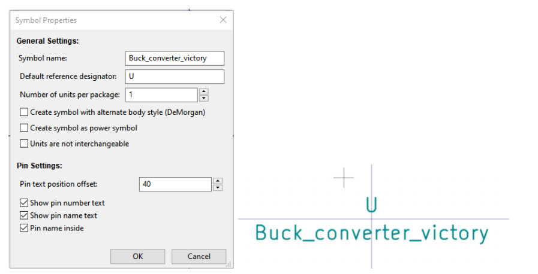
    
The default reference designator is used to identify the component in the schematic. KiCAD uses the reference designators to keep track of common components in your schematic, derailing from the standard reference designators can break your project. Do not guess the designator, use the reference designators standard IEEE 200-1975/ANSI Y32.16-1975 as seen below or by visiting `here <https://en.wikipedia.org/wiki/Reference_designator>`_:

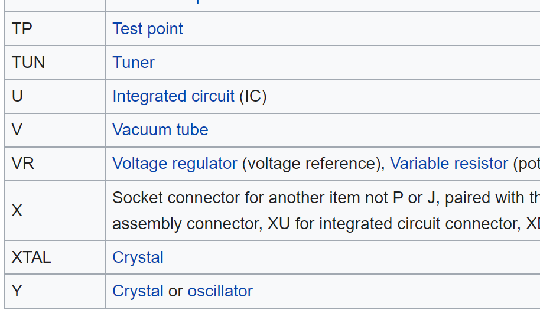

3. **Draw symbol outline:** Use the graphic polygon |gpolygon|  or lines |glines| tool to draw the outline of the symbol. Left click on the symbol outline to edit the properties. Select the fill background option to shade the outline of the symbol yellow.

.. figure:: ../_static/images/beyond5.PNG
    :figwidth: 700px
    :target: ../_static/images/beyond5.PNG

4. **Modify pins:** Add pins to the symbol using the pin tool icon |pin| on the right toolbar, based on the pin configuration from the datasheet. The thing to remember here is that the convention is to group similar pins together and place the two power pins to the top left and bottom right of the rectangle. 

First of all, I/O means input/output. Based on the pin configuration on the datasheet, pin 1 is named the ground. Ground is a power output even though it is not noted as output ‘O’ in the datasheet. Pin 6 is named VBST and is an output. Power pins are usually put under the electrical type power input/output, while regular pins are either input/output in the pin properties.

.. figure:: ../_static/images/beyond7.png
    :figwidth: 700px
    :target: ../_static/images/beyond7.png

.. figure:: ../_static/images/beyond8.PNG
    :figwidth: 700px
    :target: ../_static/images/beyond8.PNG

.. figure:: ../_static/images/beyond9.png
    :figwidth: 700px
    :target: ../_static/images/beyond9.png

The positions of the pins do not matter and can be different from what is specified on the datasheet. The most important aspect of the symbol is the pin numbers and names. Do not mix up the names i.e. pin 1 must always be ground. Pin 2 cannot be ground, it must be SW.

Importing Symbols into KiCAD
----------------------------
Most component symbols can easily be found online from sites like `mouser <https://www.mouser.ca/>`_, `component search engine <https://componentsearchengine.com/>`_, or `snapeda <https://www.snapeda.com/>`_. After downloading it off the site, import it into Kicad by opening the symbol editor >> file >> import symbol. If you did not initially create a library, one is needed to store the symbol. Follow step 1 of :ref:`Custom Symbols in Symbol Editor` to do this.

Importing digikey libraries into KiCAD
--------------------------------------
Sometimes component symbols and footprints can be found in digikey libraries. To import the library into kiCAD; the digikey library must be downloaded onto your computer then imported into KiCAD. 

1. **Get the digikey library from the github repository:** An easy google search for Digikey KiCAD library will yield the github repository. Download the zip file. It is important to note that the digikey Kicad library gets updated i.e. the library in 2019, may not be the same library in 2020.

.. figure:: ../_static/images/beyond23.png
    :figwidth: 700px
    :target: ../_static/images/beyond23.png
Github repository

2. **Update both the symbol and footprint libraries:** Go to preferences at the top of the project page. Select manage symbol libraries / manage footprint libraries. Click the add existing library to table icon |adlibrary|  and open the downloaded digikey library >> digikey - symbols, then hold the ctrl and ‘a’ key to select all the files in it. Finish the process by clicking ok. The digikey library should now be added to your Kicad. Repeat the same process for adding the digikey footprint library.

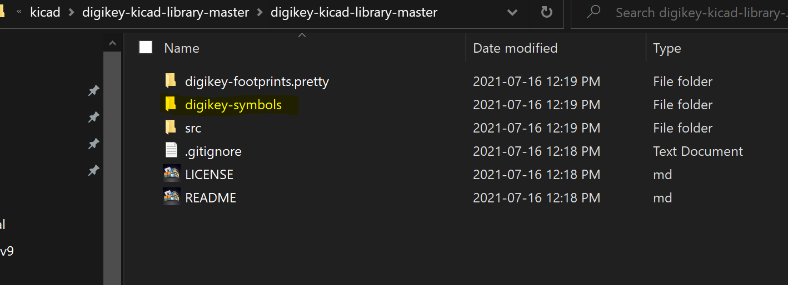
    
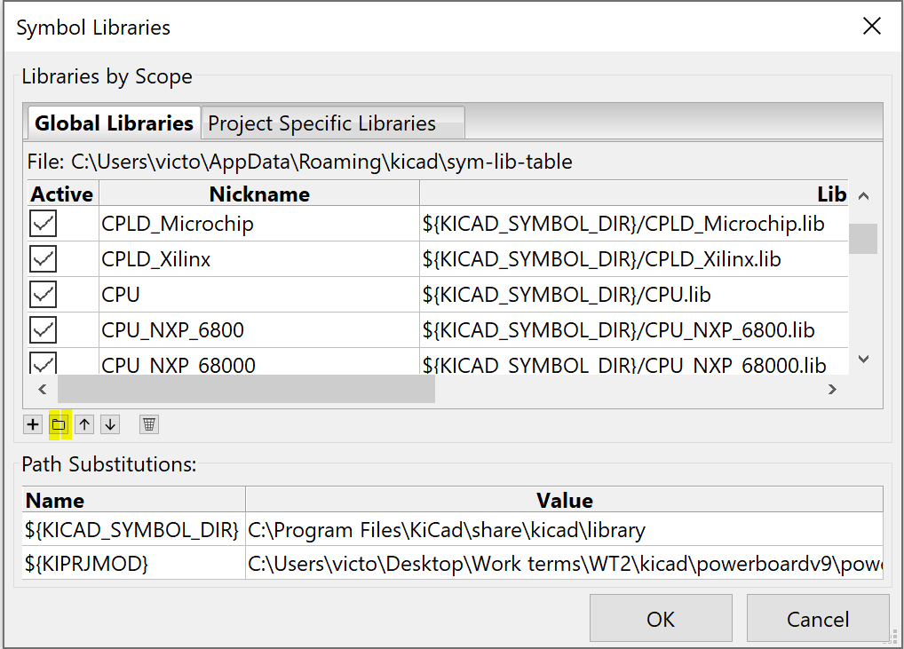

Assigning Footprints to Components
----------------------------------
.. |assignPCB| image:: ../_static/images/footprint4.png
   :width: 5%
   
.. |filterbys| image:: ../_static/images/footprint6.PNG
   :width: 5%
   
.. |filterbyf| image:: ../_static/images/footprint7.PNG
   :width: 5%
   
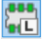
   
.. |filterbyn| image:: ../_static/images/footprint9.PNG
   :width: 5%
   
.. |vfootprint| image:: ../_static/images/footprint10.png
   :width: 5%

Understanding PCB Footprints
^^^^^^^^^^^^^^^^^^^^^^^^^^^^
A footprint is the arrangement of soldering pads for a component. They define the location of how and where the component will be soldered to the board. A component can either be surface mount or through hole as discussed in :ref:`PCB Ccomponents`.

Through Hole Components (THT)
^^^^^^^^^^^^^^^^^^^^^^^^^^^^^
The yellow section in the figure below is known as the pads - it is the exposed region of metal and the most important part of the footprint. It is where the leads will be soldered to and how the component will be electrically connected. The regions highlighted green on the footprint are going to be printed on the silk screen i.e. they will be visible on the circuit board. The layers of a circuit board in KiCAD were explained in :ref:`PCB Layers`.

.. figure:: ../_static/images/footprint1.png
    :figwidth: 700px
    :target: ../_static/images/footprint1.png

THT Capacitor being mounted on a board and the capacitor footprint on kiCad

Surface Mount Devices (SMD)
^^^^^^^^^^^^^^^^^^^^^^^^^^^
The pads are the red sections i.e. copper layer. It is clear that the pads are not holes like THT but are simply on the copper layer surface of the circuit board. The grey outline is the component outline on the F.Fab layer, which is useful for board manufacturing houses like `JLCPCB <https://jlcpcb.com/VGR?gclid=CjwKCAjwuvmHBhAxEiwAWAYj-ITIlLQRA1Wo_996nJWkou_tb6e5x8ydLtVoxVGrIuntaySqb4OLfxoC6dwQAvD_BwE>`_.

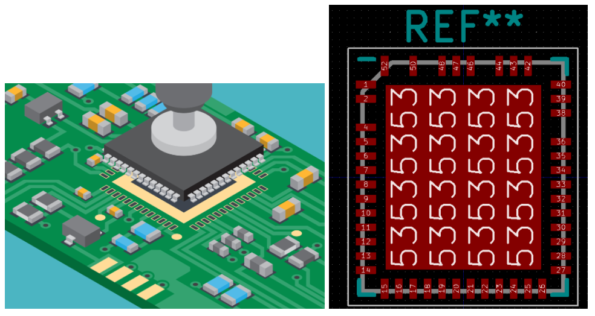
SMD integrated circuit being mounted on a board and the footprint on kiCAD

Understanding PCB pads
----------------------

Through Hole Components (THT)
^^^^^^^^^^^^^^^^^^^^^^^^^^^^^
For through hole pads, the radius of the external circle is the pad size and the radius of the internal circle is the drill size i.e. the size / width of the component lead. The drill size is specified on the data sheet and the pad size is usually estimated as (2*0.38mm + drill size + 0.25mm)

.. figure:: ../_static/images/footprint3.png
    :figwidth: 700px
    :target: ../_static/images/footprint3.png
A THT PCB pad

Surface Mount Devices (SMD)
^^^^^^^^^^^^^^^^^^^^^^^^^^^
SMD components are simply placed on the pads, unlike THT components that are soldered through the pads. As a result, SMD pad dimensions are simpler and correspond with the component’s lead dimensions.

SMD integrated circuit being mounted on a board and its footprint on KiCAD

Selecting Footprints
--------------------

Through Hole Components (THT) and Surface Mount Devices (SMD)
^^^^^^^^^^^^^^^^^^^^^^^^^^^^^^^^^^^^^^^^^^^^^^^^^^^^^^^^^^^^^
1. **Pitch:** the distance between each pin of the component.

#. **Body size / shape:** components come in different sizes and shapes (from rectangles, squares, to octagons). There are standardized metric sizes for resistors, capacitors, and inductors but they do not always apply as some inductors are still produced in non-standardized sizes.

#. **Lead size:** the width of the component’s lead, will it fit in the hole?

#. **Component orientation:** Is it radial or axial, vertical or horizontal?

How to Filter Footprints
^^^^^^^^^^^^^^^^^^^^^^^^^^^
Select the assign PCB footprints to schematic symbols icon |assignPCB| on the top toolbar. An ‘assign footprint’ tab should open. There are four footprint filters; 

* |filterbys| - schematic symbol footprint filter to filter based on the component’s reference
* |filterbyf| - to filter footprint list by pin count
* |filterbyl| - to filter by library
* |filterbyn| - to filter by searching component name

To assign a footprint, double click on the footprint in the filtered footprint tab.

To view a footprint, select the footprint then click on the view footprint icon |vfootprint| on the top right corner of the assign footprints tab.

It is best practice to start by filtering only by schematic symbol footprint filter |filterbys| and then adjust as needed.

Examples: Footprint Selection
-----------------------------

Selecting a Footprint for a Connector
^^^^^^^^^^^^^^^^^^^^^^^^^^^^^^^^^^^^^
Take this `connector <https://www.digikey.ca/en/products/detail/jst-sales-america-inc/BM08B-SRSS-TBT-LF-SN/1640130?s=N4IgTCBcDaIEIFkAMAOOBaAygJU59AKnAQBQAyAYgJQmYByVIAugL5A>`_ as an example. The yellow box indicates it is surface mount and the green box indicates it is 8 position with 1 mm pitch. Pitch is the distance between pins and 8 position indicates it has 8 pins. 

Don’t panic if you do not know what properties to look out for when looking at components. Always remember that important information is placed in both **the description and detailed description sections.**

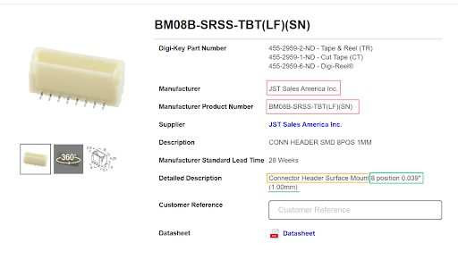
    
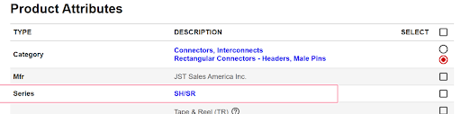
    
1. **Filter by component symbol** |filterbys|: There’s still quite a bit of a selection. It needs to be narrowed down.

.. figure:: ../_static/images/footprint13.png
    :figwidth: 700px
    :target: ../_static/images/footprint13.png

2. **Filter by symbol and pin count** |filterbys| |filterbyf| : It still needs to be narrowed down.

.. figure:: ../_static/images/footprint14.png
    :figwidth: 700px
    :target: ../_static/images/footprint14.png

3. **Filter by symbol, pin, and library** |filterbys| |filterbyf| |filterbyl|: Since we are looking for a footprint for a connector, let's look at which of the multiple libraries for connectors to search in. Remember the **manufacturer of the connector is JST**. Footprint libraries are usually arranged by manufacturers since different manufacturers will produce different parts. Select the ‘connector_JST’ library. 

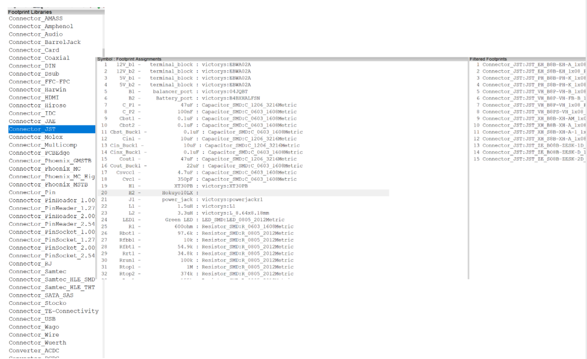
    
In the third tab, the filtered footprints, the connectors are organized by the manufacturer’s part numbers (MPM) which we determined from the digikey product page as **BMO8B-SRSS-TBT(LF)(SN)**. It is clear that the part number is not listed with any of the footprints in the filtered footprints tab.

To confirm if the footprint exists or not, filter by library only (connector_JST). Notice that there is a pattern in how the footprints are named.

.. figure:: ../_static/images/footprint16.png
    :figwidth: 700px
    :target: ../_static/images/footprint16.png

Library name: Manufacturer_*MPM*_row x positions_pitch_component orientation on board

The important part here is the MPM. As if the MPM is exactly as the one listed on our product page on digikey, the footprint should match. Search the footprints until you find one with the MPM, then double click on it to assign it to the connector. To view the footprint, select the footprint then click on the view footprint icon |vfootprint| on the top right corner.

.. figure:: ../_static/images/footprint17.png
    :figwidth: 700px
    :target: ../_static/images/footprint17.png

Standard Sized Footprints: Selecting a Footprint for a SMD Resistor
^^^^^^^^^^^^^^^^^^^^^^^^^^^^^^^^^^^^^^^^^^^^^^^^^^^^^^^^^^^^^^^^^^^
Take Resistor `Rtop2 <https://www.digikey.ca/en/products/detail/te-connectivity-passive-product/4-2176094-8/4034258?s=N4IgTCBcDaIIIEYEAYDsBOZBhAKgWgDkAREAXQF8g>`_ as an example. Chip resistor boxed in yellow indicates that the resistor is surface mount (SMD) and the text entailed in the green boxes indicate that it is a standard body size of 2012 metric or 0805 imperial.

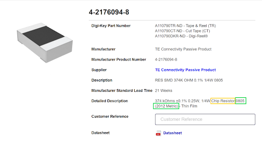
    
.. figure:: ../_static/images/footprint19.png
    :figwidth: 700px
    :target: ../_static/images/footprint19.png

**Filter by symbol, pin, and library** |filterbys| |filterbyf| |filterbyl|: Following the filtering instructions used for the connector above, ends up with us using all 3 filters. 

* The library choices are either resistor_SMD or Resistor_THT. We figured this resistor was SMD so choose the SMD library.
* We previously noted that the body dimensions of the resistor were a standard 2012 metric. So select the filtered footprints that are 2012 metric; there are two options - the hand solder one and the regular one. The hand solder one has additional allowance for easier hand soldering. We select the regular one. View :ref:`Getting Started with PCB Assembly` for soldering tips. It is good to have a good overview of how the components will be soldered when choosing the footprints.

.. figure:: ../_static/images/footprint20.png
    :figwidth: 700px
    :target: ../_static/images/footprint20.png

Searching by Manufacturer: Selecting a footprint for a SMD Inductor of Odd Shape
^^^^^^^^^^^^^^^^^^^^^^^^^^^^^^^^^^^^^^^^^^^^^^^^^^^^^^^^^^^^^^^^^^^^^^^^^^^^^^^^^

Take this `inductor <https://www.digikey.ca/en/products/detail/murata-electronics/1217AS-H-1R5N-P3/5271426?s=N4IgTCBcDaICwE4AMBaAjEg7ADgKzpQDkAREAXQF8g>`_ with an inductance of 1.5uH. The yellow box indicates it is surface mount (SMD) and the green box indicates it is non standard size meaning a custom footprint may need to be created.

.. figure:: ../_static/images/footprint21.png
    :figwidth: 700px
    :target: ../_static/images/footprint21.png

Footprints on Kicad are either saved as standard parts or under manufacturers, for non standard sizes. Since inductor L1 is non standard, the footprint might not be on Kicad or might be saved under a manufacturer but it is most definitely not saved under a standard size.

**Filter by symbol, pin, and library** |filterbys| |filterbyf| |filterbyl|: 

* Two library options; Inductor_SMD or THT. We previously identified the inductor as SMD. So select Inductor_SMD library.
* We previously identified that the manufacturer is Murata electronics. Search for footprints with Murata in the name. There are 3 options; 66,67,68. 
* We identified the MPM to be 1217AS … None of the options have that part number. As such the footprint does not exist in Kicad libraries. See :ref:`Custom Footprints in Footprint Editor` to learn how to create custom footprints or do a google search for the footprint and follow the guidelines in :ref:`Importing footprints into KiCAD`.

.. figure:: ../_static/images/footprint22.png
    :figwidth: 700px
    :target: ../_static/images/footprint22.png