Introduction
============
Bubble.io is a code-free online web tool that is used to make many kinds of web applications. It is very versatile and can be used for anything ranging from social media sites, online marketplaces, landing pages, etc. This tutorial will explain the basics of using the interface and also show how to make a few simple web apps.

The Basics
==========
The following subsections will describe how to get started with Bubble and some of its most basic features that you will inevitably use while making your apps.

Creating a New App
---------------
To start making apps with Bubble, you must first create an account. After that is done, navigating to the home screen will show a label that says "My apps" along with a blue button which says "New app":

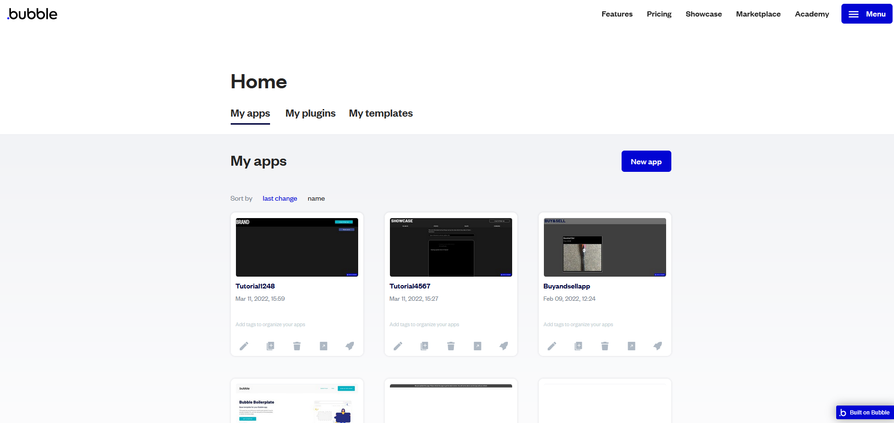

After clicking the blue button, a popup will appear that will allow you to give your app a name, specify the type of app you want to build, etc. Please note that your app's name must be unique from all other app names create on Bubble (not just your own apps):

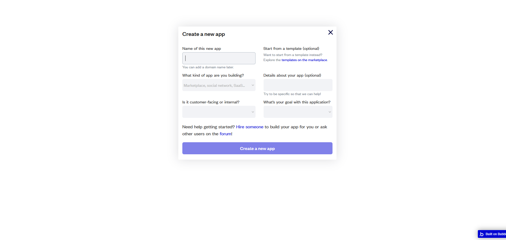

Press the blue button to be taken to the Bubble editor. You will see a popup on the left side of the screen called "New application assistant." By clicking "Let's get started," you will be able to change the icon and title that displays in your app's tab when it is running, along with a few other features that will be discussed later on.

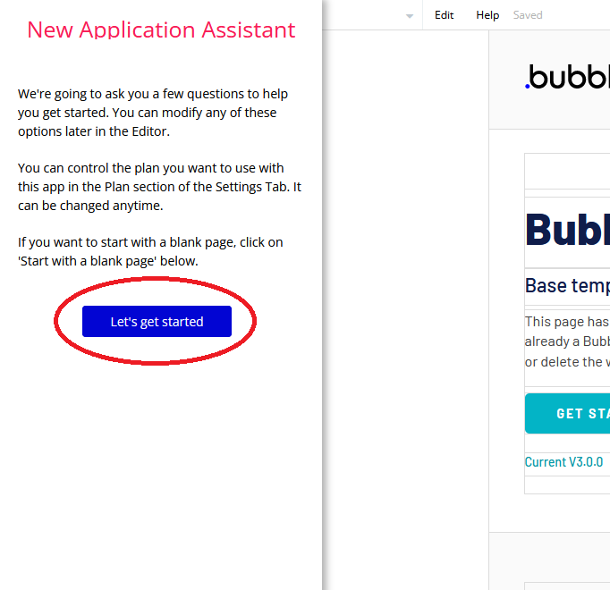

It is useful to keep in mind that you can always hover your cursor over anything in Bubble to get access to its reference page, where you can learn all about what it does.

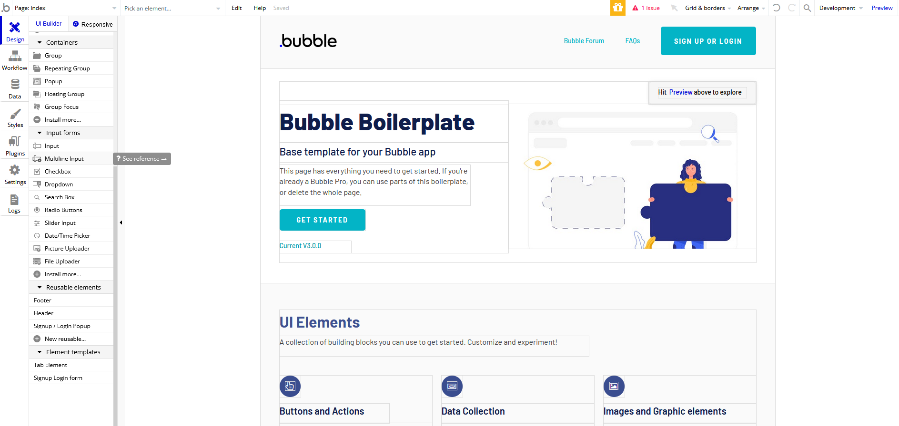

The Design Tab
--------------

You should now see the Bubble editor's Design tab. This is where you will decide how your app will look to its users. You will be able to drag and drop elements into the white area on the right side of the screen. You will also be able to resize, rotate and reposition those elements to your liking. Right now there is probably a default webpage showing where this white space would normally be, but that can easily be cleared by drag-selecting everything and pressing the "delete" button on your keyboard.

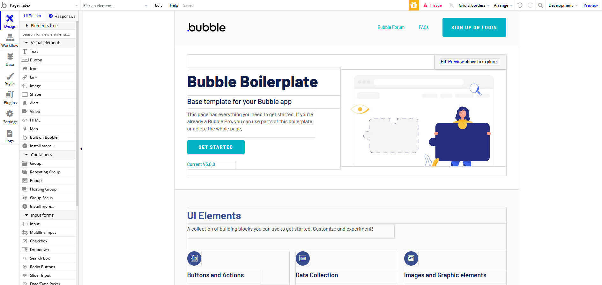

The UI builder on the left allows you to add new elements to the page by dragging and dropping (or clicking and then dragging on the white space).You may notice several useful features under the "visual elements" dropdown:

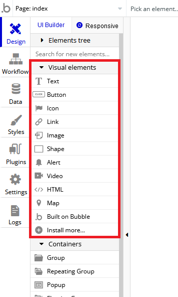

Here is a brief explanation of each:

| **Text** - Allows you to add text to the screen. Its font type and size can be changed.
| **Button** - Allows you to add a button to the screen. Making the button do something requires starting a *workflow*, which will be discussed later.
| **Icon** - Adds a common icon of your choosing to the screen (a "like" button, for example).
| **Link** - Adds hyperlinked text to the screen.
| **Image** - Adds an image to the screen.
| **Shape** - Adds a rectangle to the screen.
| **Alert** - Shows a temporary message when an event occurs. Triggered using a workflow.
| **Video** - Adds a playable video to the screen. Video must be accessed through Youtube or Vimeo.
| **HTML** - Allows you to embed HTML code into your web app.
| **Map** - Allows you to add a map that can be navigated and referenced by other elements in your app.
| **Built on Bubble** - Adds an optional Bubble watermark to your app.
| 
| Within the UI builder there is also a dropdown called "Containers." It contains several features that are necessary for almost every kind of web app:

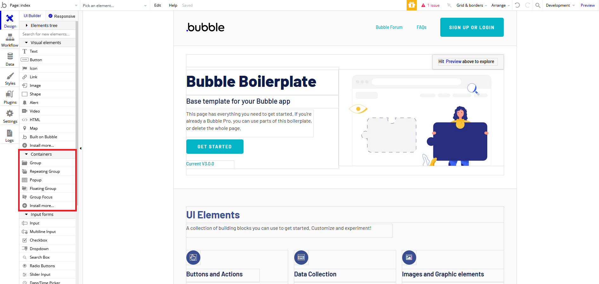

Here is what each container does:

| **Group** - Groups multiple elements together.
| **Repeating Group** - Repeats groups of elements vertically/horizontally on the page. Useful for displaying lists of data (comments on a post, for example).
| **Popup** - Shows a small "page" (really just a group) overlapping the original page when an event triggers it (a login popup, for example).
| **Floating Group** - A group of elements that stays in the same position on the screen as the user scrolls through the site.
| **Group Focus** - A group of elements that shows only when an event triggers it, and disappears once the user clicks outside of it.
| 
| The UI builder also has a dropdown titled "Input forms." These elements allow the user to enter information into the web app:

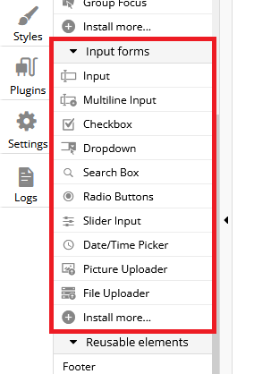

Here is what each input element does:

| **Input** - Allows the user to enter a single-line input.
| **Multiline Input** - Allows the user to enter a multiline input.
| **Checkbox** - Adds a checkbox to the interface.
| **Dropdown** - Allows the user to choose an input from multiple options (an example would be sorting posts in order of most popular, most recent, or least recent).
| **Search Box** - Searches a database for the user's input and provides search suggestions.
| **Radio Buttons** - Allows the user to choice from a list of choices, but only one option is allowed at a time.
| **Slider Input** - Lets the user choose a value from a range of values (or specify a range within these values).
| **Date/Time Picker** - Lets the user input a date (and time, if needed).
| **Picture Uploader** - Lets the user upload an image to the app.
| **File Uploader** - Lets the user upload a file (of any type) to the app.
| 
| In each element dropdown, you may notice that there is an option to "Install more..." at the bottom. Clicking this option opens the plugins page, which will be discussed later. These are all the basic UI elements that you will need to build your apps.

The Workflow Tab
----------------

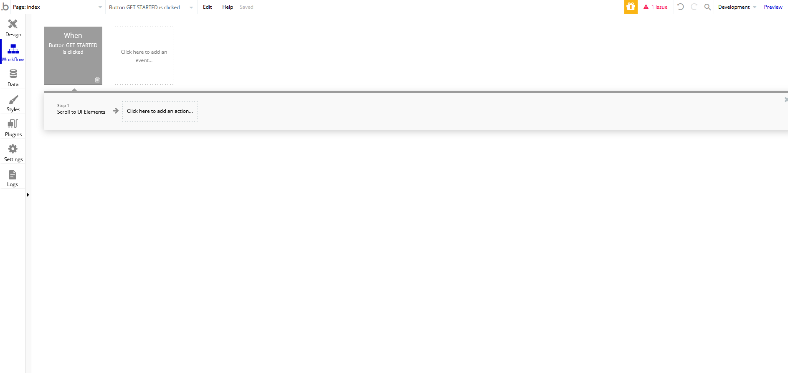

The purpose of this tab is to add functionality to the elements you created in the design tab. For example, the event that occurs as a result of pressing a button would be specified here. The triggers/actions that can occur in a given workflow are too numerous to list in this tutorial, so it is best just to learn them as you need them. We will briefly talk about the basic interface.

Clicking on the event block lets you specify which event will trigger the action. It could be a page loading, a button being clicked, a popup opening, etc. Once an event is picked, a action section will appear, allowing you to choose what happens when this event occurs.

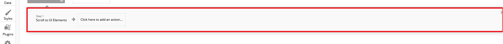

Actually using the options presented in the actions tab is mostly self-explanatory, but can quickly become complicated in the later stages of building your app. The best way to get comfortable using it is through examples, which are available in the later sections of this tutorial.

The Data Tab
-------------
As you use Bubble, you will start to see references to database terminology:

| **Types** - Data templates that have several fields. For example, "user" is one of the preloaded data types in Bubble. Its fields include the user's email, the date their account was created (Created Date), the date the user's account was modified (Modified Date), and the user's account's slug. The "User" type defines what data is associated with a user's account.
| **Things** - Instances of a type. To use the "User" example again, this would refer to a specific user's account. When you create a new thing, you must specify what this thing's type is. If it is of type "User", then you are creating a new user account.
| **Fields** - Attributes of a type. A thing of type "User" has an associated Email, Creation Date, Modified Date, and Slug. More fields can be added to a type as desired, but default fields cannot be deleted.
| 
There are several tabs within the data tab, each dedicated to dealing with different parts of your app's data. Each will be described below.

| **The "Data types" Tab** - This tab deals with creating, viewing, editing, and deleting data types. It also lets you add/delete fields of each type (except for the default fields).

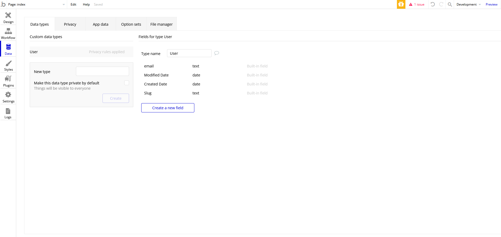
   
| **The "Privacy" Tab** - This tab Lets you set privacy rules for each data type, such as what can be shared or searched by other users.

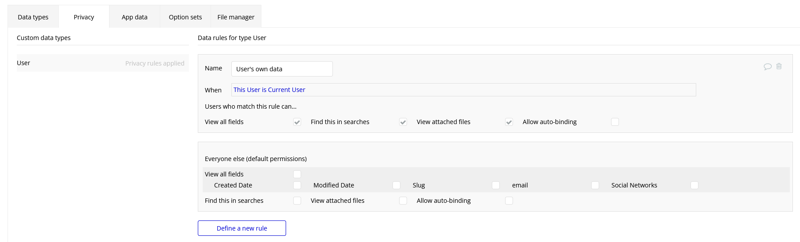

| **The "App data" Tab** - This is where you can view, create, edit, or delete instances of different types (things). For instance, the information of someone who created an account with your app would be accessible in this tab.

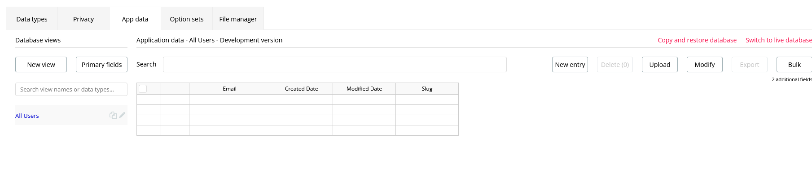

| **The "Option sets" Tab** - Allows you to create, view, edit, and delete dynamic sets.

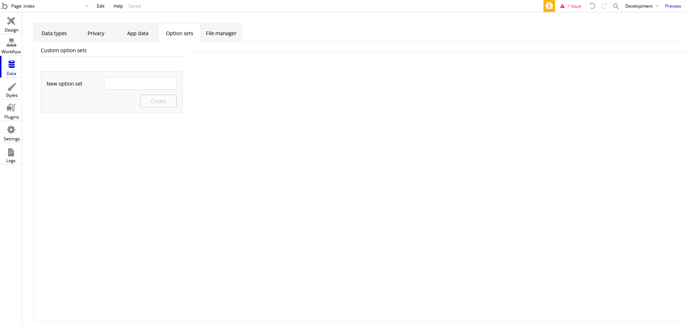

| **The "File manager" Tab** - Allows you to upload, view, and delete files that users have uploaded to your app (can be of any file type).

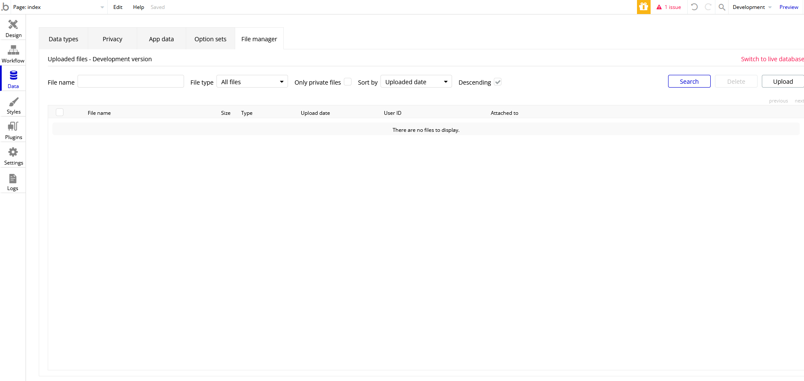

The Styles Tab
--------------

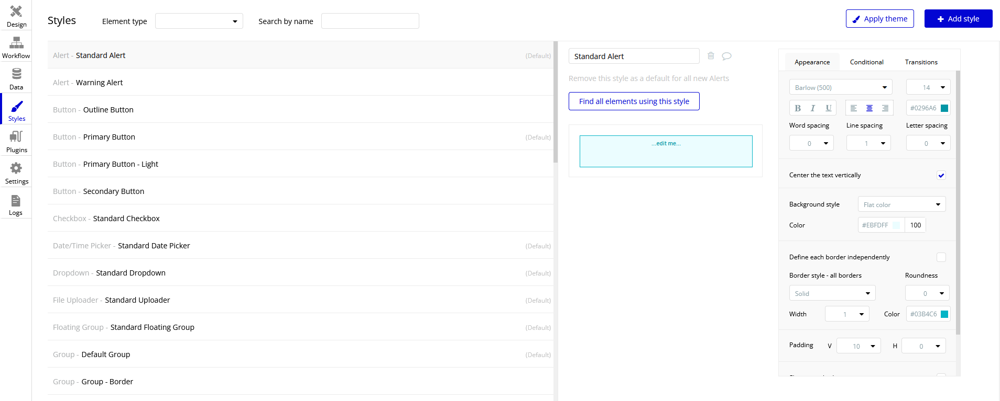

This tab opens automatically whenever you try to edit the style of one of the elements in the design tab. It allows you to change the appearance of the element by altering fonts, colors, shapes, etc.

The Plugins Tab
---------------

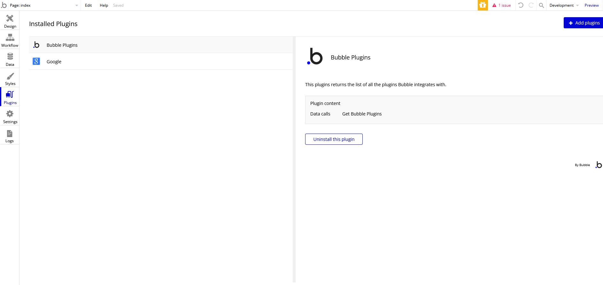

Bubble has a vast library of plugins for integrating third-party services into your app. Some of the most popular plugins allow you to integrate Facebook, Google, Amazon, PayPal, etc. directly into your app. Pretty much any app that you could ever want to make will require a plugin.

First Example: Social Media App
===============================

In this section, we will create an app that can do the same basic functions as most social media apps. The user will be able to create posts (with pictures, if they want), like other people's posts, comment on those posts, and see those posts on a map.

Creating the Header as a Reusable Element
-----------------------------------------
If you look at a web app today, most (if not all) of them use a header. A header is simply a bar at the top of the screen showing the site's logo, the sign in/sign up button (or the user's username and profile photo if they are signed in), and tabs for navigating the site.

We will start by clicking the dropdown menu in the top-left corner of the screen to see all the pages that current exist in our web app. The reusable elements are also listed here. 

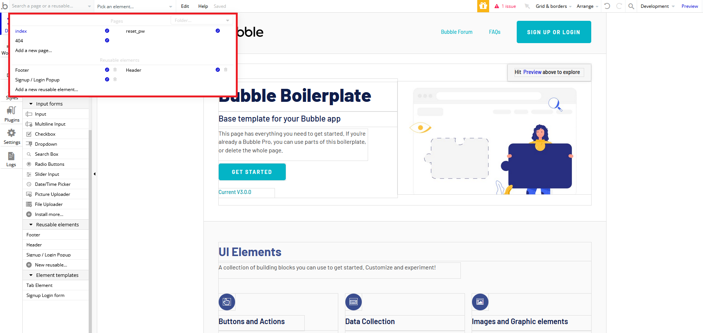

From here, we will click "Add a new reusable element" to create our header. Give the header element a unique name and click CREATE.

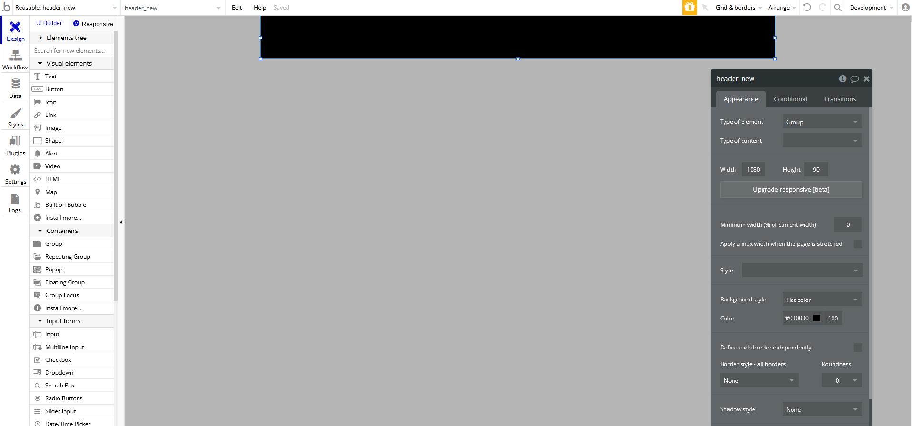

You will now be taken to a new page. The white block that you see in the center of the screen will become our reusable element. You can edit the properties of any element in Bubble by double-clicking on it. Double-click on the white box to change its width to be the same as the width of your index page (usually 1080px). Also adjust the height and color to your liking.

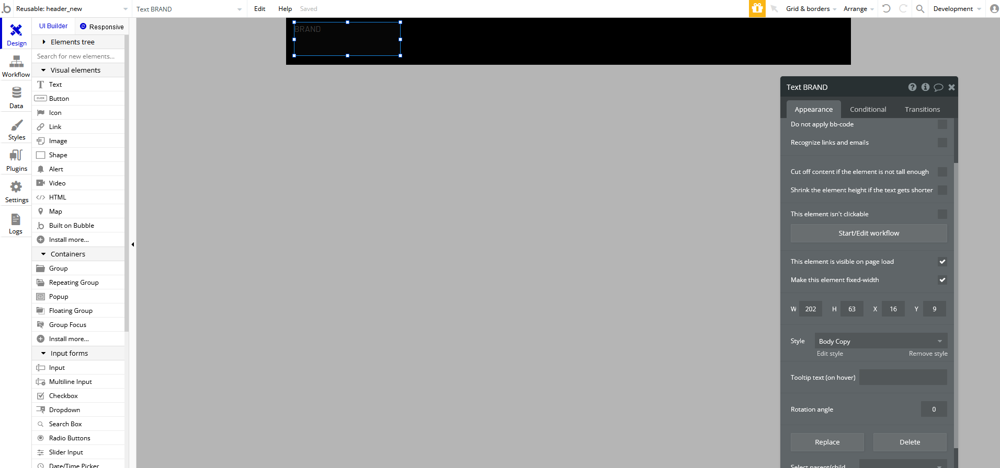

Now we will add a logo to out header. Select the "Text" element from the visual elements dropdown on the left, then click and drag over the rectangle we just edited. This clicking and dragging is how all elements are added to your app. Double-click the textbox to change the font size, type, and color of the logo to be on-brand with your website. You may notice that the text does not show up in the editor, despite the text being visible when the app is running or when you use the element in another page. This is likely just a bug, and should not affect your app.

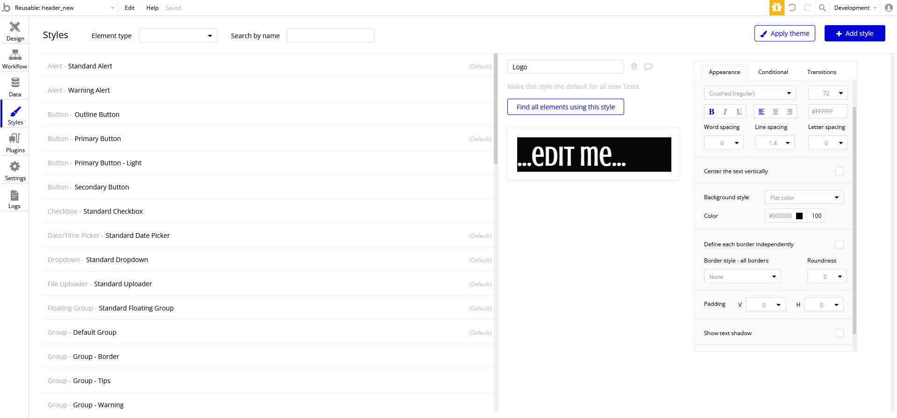

Let's add a Login/Sign up button to the header. We want the button to open a new page where the user can login or sign up. Create a new page using the dropdown in the top-left corner and name it "sign in page" or something similar. Click the "Button" element and place it somewhere on the header. Now let's open the button's properties window and click the "Start/Edit workflow" option.

Bubble will assume that the event that triggers the action is when the button is clicked. Click on the box below it to add an action and go to *Navigation > Go to page...* to make the button move the user to another page. A window will pop up requiring a "destination". Input the page you created for signing the user in.

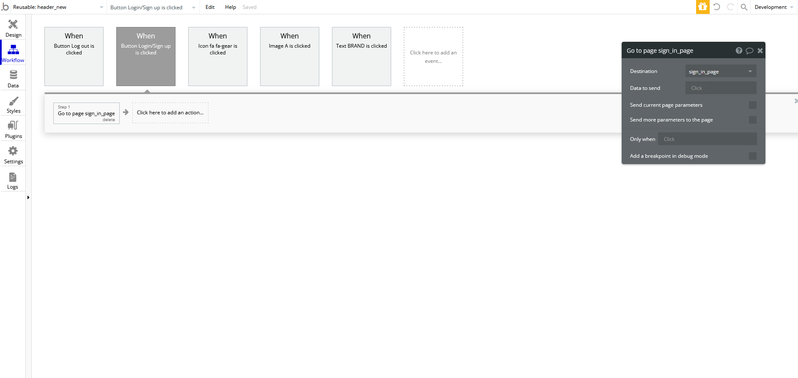

You can now test your button. Navigate to the "index" page and add the header to the top of the screen (find the "Reusable elements" dropdown on the left). Click "Preview" in the top right corner and you should be taken to a new tab where you can test your app. When you click a button, you should be taken to a blank page.

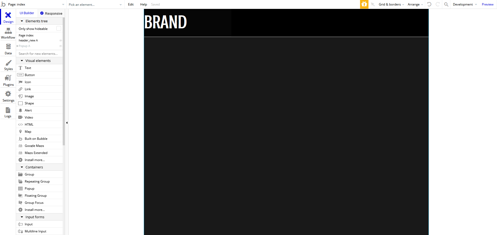

As an exercise, you can also make your logo act as a button that takes you back to the "index" page. The process for doing this is almost identical to the process for the button. (hint: you can only edit elements within a reusable element by going back to that element's page using the page dropdown.)

Account Functionality
---------------------
It is very simple to create a login/sign up system in Bubble. Navigate to your sign in page and Add input lines for the user's email, password, and password again (retyped for confirmation). For the email line, type "Enter an email" as a placeholder and select Email from the dropdown menu for "Content format". For the passwords, type "Type a password" and "Retype password" respectively for the placeholders of each, and set their content formats to "Password".

Now add a button below these input lines that says "Sign up". You can also add some text above the input lines that says "Sign Up". Your page should now look something like this:

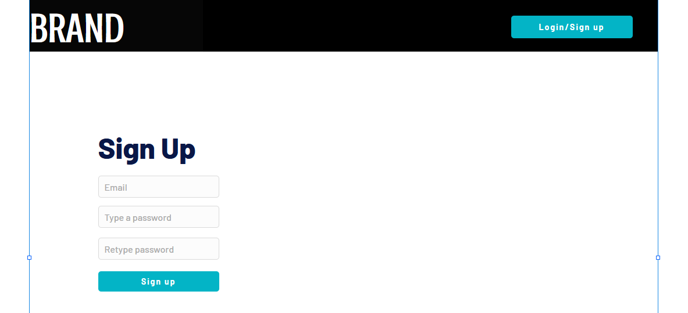

Now open up the properties for the sign up button and start a workflow. Add an action by navigating to *Account > Sign the user up*. A window will pop up with multiple options. 

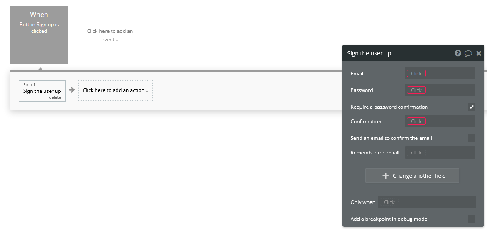

First, check the "Require a password confirmation" checkbox. This will mean the user must type the password in the second password input as well as the first to create an account. Now click the red box next to "Email" and click the options so that it says **Input Enter an email's value**. Next, click the red box next to "Password" and click the options to say **Input Type a password's value**. Lastly, put **Input Retype password's value** next to "Confirmation". The window should now look like this:

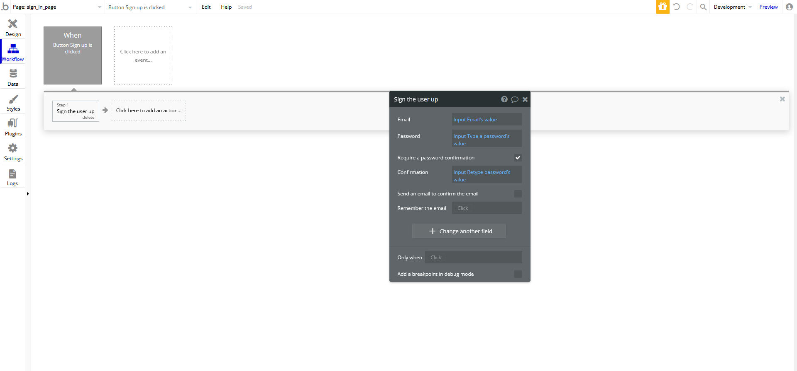

You can now test the sign up functionality using the "Preview" button. Nothing will actually change in the test app yet, but you can go to the "App data" section of the Data tab to see if a new entry has been created under "All Users":

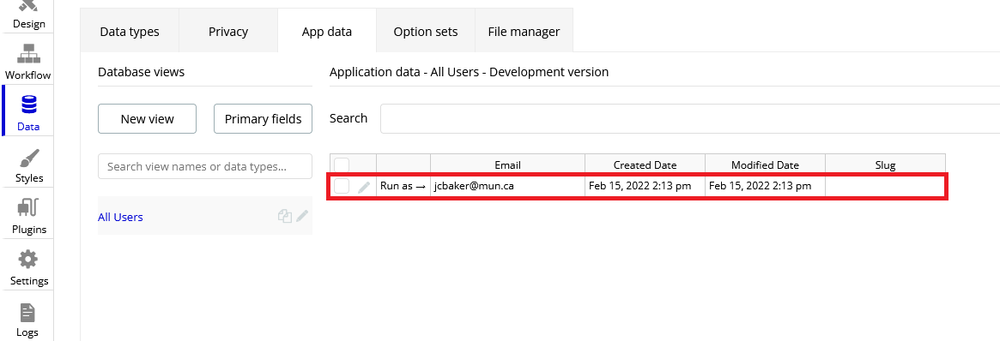

You may notice that the input fields do not become empty when you click the "Sign up" button. This does not affect the functioning of the app, but it does look messy. To fix this, we can add an extra step to the end of the "Sign up" button's workflow to clear all inputs. Open the button's properties window and click the button to edit its workflow. Add another action to happen after signing the user up under *Element Actions > Reset inputs*. This will reset all the inputs on the page to be their default value (which we have kept empty).

Now let's add the inputs for logging in. The workflow for this is very similar to signing the user up, except the password is only needed once. Let's add another email and password input along with a "Login" button and a title. The result should look like this:

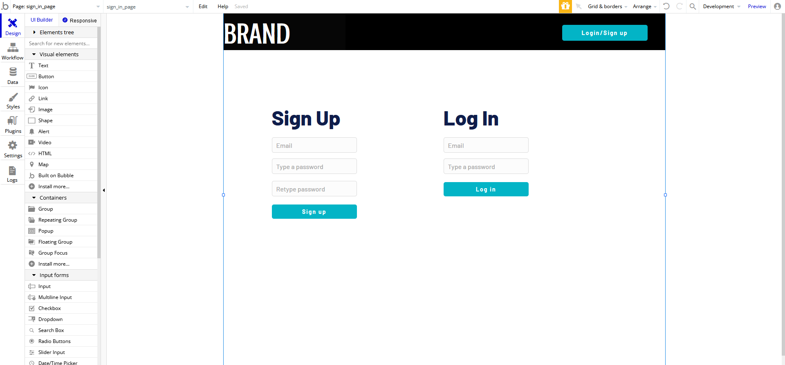

Enter the login button's workflow and select *Account > Log the user in*. Enter **Input Email's value** next to Email and **Enter Password's value** next to password. Once again, start another action to reset the inputs.

.. image:: ../_static/images/Bubble_90.png
   :width: 1000px

Signing in with Google
----------------------
We would like to give users the option to sign in with their Google account as well. To do this, we must first download the Google plugin. Navigate to the Plugins tab and click the blue "Add plugins" button in the top right corner. Search "google" in the searchbar and click "Install" on the plugin highlighted below:

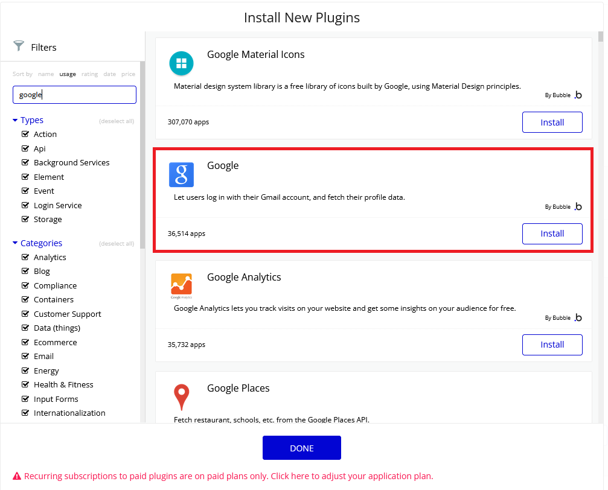

Once installed, click "Done". In order to actually use this plugin, we must acquire an App Secret and API Key from Google. Go to the `Google Cloud Platform <https://www.google.com/url?sa=t&rct=j&q=&esrc=s&source=web&cd=&cad=rja&uact=8&ved=2ahUKEwjM36Le5oT2AhUAlIkEHS59AkMQFnoECAgQAQ&url=https%3A%2F%2Fconsole.developers.google.com%2F&usg=AOvVaw39ieEDI7pzBj4NtuzqS57M>`_. This is where you register your app so that Google knows to trust it when it asks for a user's Gmail account information.

Here are the steps to create an API key for your app:
| - Click on CREATE PROJECT.
| - Give your project a name and set the location, if applicable.

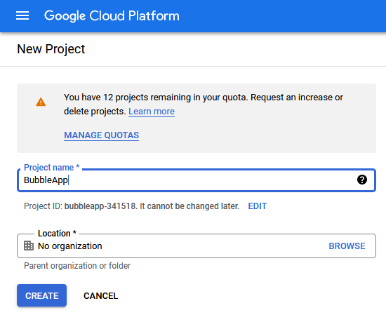

| - Click CREATE.
| - Click "APIs & Services" and then "OAuth consent screen".

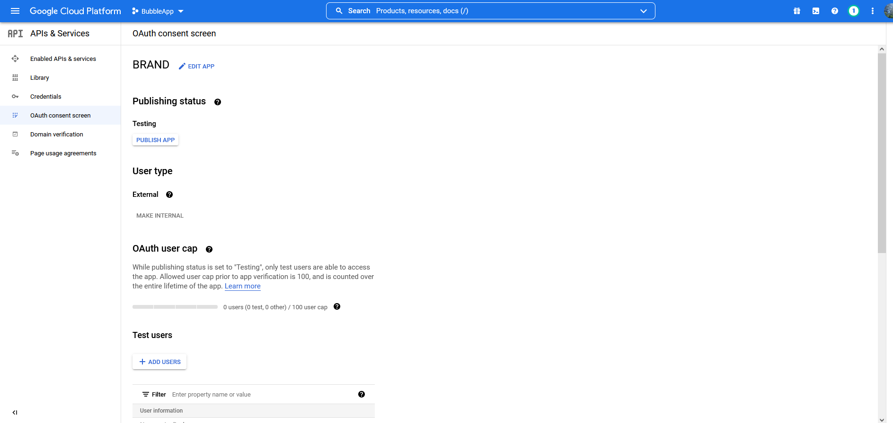

| - Click CREATE CREDENTIALS > OAuth client ID.
| - Select "External" and then CREATE.

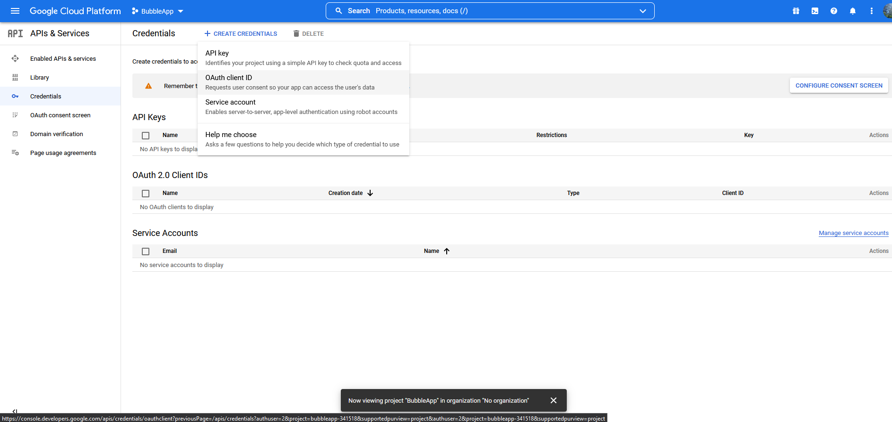

| - Fill out the app registration questions as completely as possible.
| - Once all questions have been completed, go to "Credentials" on the left and click CREATE CREDENTIALS > OAuth client ID.
| - Select "Web application" under "Application type".
| - Give your app client a name.
| - To finish filling out the OAuth client ID window, we must get the generic redirect URL from our Bubble app and copy it over. It can be found in the plugins tab under the Google plugin:

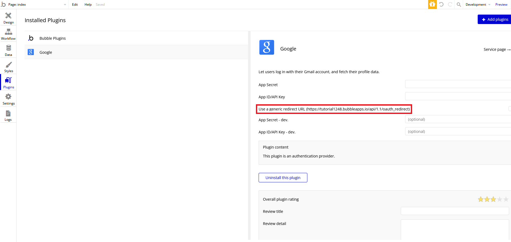

| - Click "ADD URI" and add the generic redirect URL to it. 
| - CLick "ADD URI" again and add your web app's URL to it while in preview mode.
| - Click CREATE.
| - You should now see a window providing the Client ID and the Client Secret. Copy them over to the plugin page in Bubble where it says "App Secret" and "App ID/API Key":

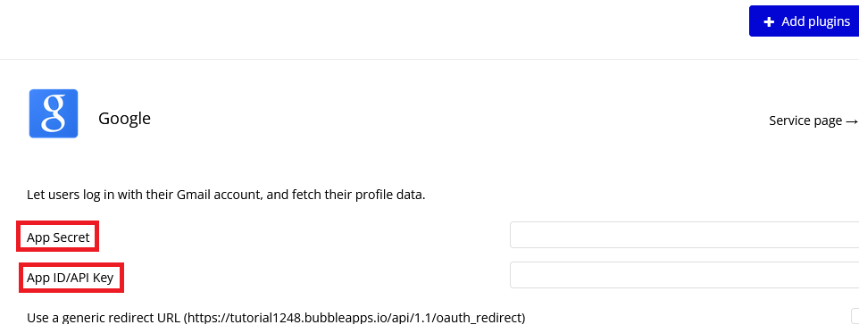

Your app should now be all set up to allow users to sign in with their Google account. Now let us add a button to the sign in page for this purpose. Navigate to the sign in page in the design tab and add a button that says something like "Sign in with Google". It is usually a good idea to make this button a different color from the other buttons, so scroll down to the "Style" dropdown and click "Remove style". Now Bubble allows us to change the style of the button directly from the properties tab, and without changing the style of the other buttons. Change the background color to whatever you want.

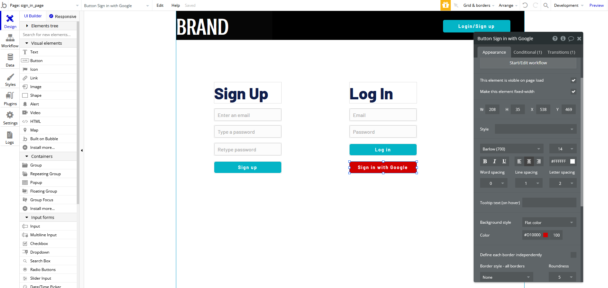

Now we need to configure the button's workflow to sign the user in using a Google account. In the button's workflow tab, add *Account > Signup/login with a social network* as an action. Under "OAuth provider", select Google. Now add another action to redirect the user back to the index page.

The user should now be able to sign in to your app using Google. A similar process can be completed for any other apps as well, provided a plugin for it is available. Run the app and see if pressing the "Sign in with Google" button allows you to sign in with your Google account.

Displaying User Data
--------------------
Let us now display a user's profile picture and username in the top right corner of the screen when the user is logged in. This also means that we only want the "Login/Sign up" button to display when the user is **not** logged in. To do this, open up the header page and click on the "login/Sign up" button to open its properties. Go into the "Conditional" tab and click "Define another condition". In the box that appears, make it say "When Current User is logged out" and select "This element is visible" in the dropdown below. Make sure the checkbox is checked. 

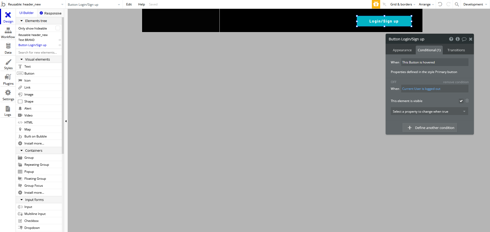

Go back to the appearance tab and uncheck "This element is visible on page load". This will ensure that the element's visibility is only dependent on what we configured in the conditional tab.

The Login button will now disappear once the user is logged into an account. Now we want to add the user's profile picture and username to display in place of the login button. To start, hide the login button by opening the elements tree dropdown on the left and clicking the eye to the right of the button. (Note: this only hides the button in the editor. It does not affect the button's visibility when the app is running.)

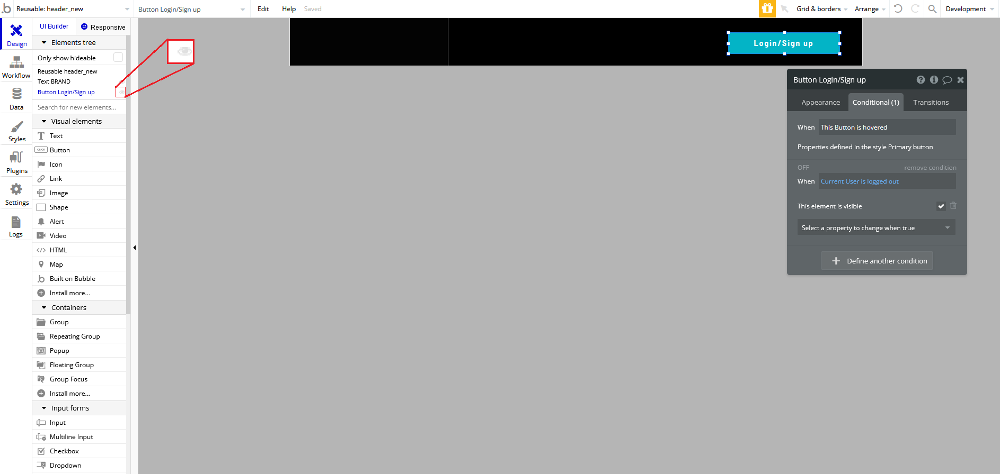

Now add an image to the right side of the header. Make sure the image is square, not rectangular. This will be a **Dynamic image**, meaning it will change depending on what user is signed in and what image they use as their profile picture. Before we do this, we must add a "photo" field to the "User" type in our database. Go to the **Data** tab and select "Create a new field" under "User". Type "photo" under "Field name" and select "image" as the field type. The "User" type should now look like this:

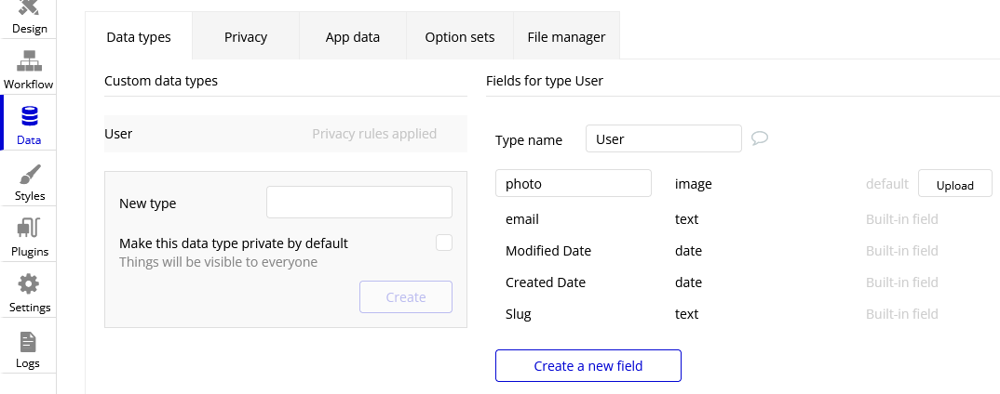

Back in the design tab, click on the image you added click on the input box next to "Dynamic image". Click on the blue bar that pops up labelled "Insert dynamic data" and put in "Current user's photo". For aesthetic purposes, let's also set Run-mode rendering to "Zoom". Now go to the conditional tab and do the same thing we did for the button, except set the condition to "When Current User is logged in" instead of "logged out". Make sure to disable "This element is visible on page load" here as well. "Most social media sites use circular frames for profile photos. We can do the same here by creating a new style called "circularframe" or something similar. Edit this style to have a roundness of 9999 (or some other really large number). The profile photo should now be circular. 

If you run the app now and sign in, you would probably notice the login button disappear, but no profile photo appears in its place. This is because we did not set the User's "photo" field to be the user's profile picture when their account was created with Google. Also, a user who creates their account without Google has no way to set their profile picture, so it is just empty.

Let's fix this issue by setting a default "anonymous" photo for users when they first create an account. Go to the **Data** tab and click on the "Upload" button next to the "photo" field we set up for the "User" type earlier. Choose a photo to display when a user has not yet set their own profile photo.

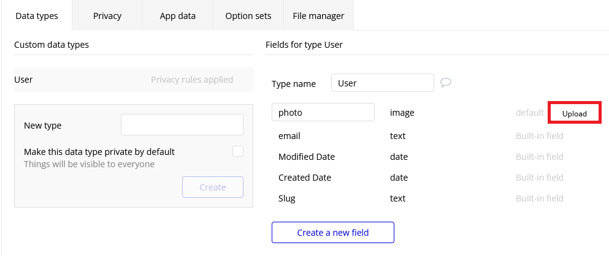

**Important Note:** Accounts created before updating the field properties in the database will have to be manually deleted and recreated to see changes. This is because the account's data was set **before** the default settings were set.

For users who sign in with their Google account, we must edit the workflow for when the user clicks the Google sign in button. After the action that signs the user in using a social network, add *Data(Things) > Make changes to thing* as an action. Put "Current User" as the thing to change, and click the "Change another field" button. Select "photo" and make it say "photo = This User's Google's Profile picture". The workflow should now look like this:

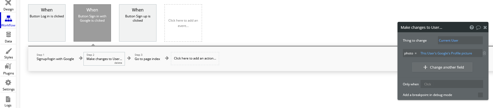

You should now see a profile photo when you run the app. Let's add a button for logging out that is only visible when the user is logged in. Go back to the header and add a button next to where the profile photo would beand type "Log out" for its label. Start a workflow for it and click *Account > Log the user out*. Go back to the design tab and set the button to only be visible when the user is logged in, and set "This element is visible on page load" to be unchecked. You should now be able to log the user in and out using the buttons that appear in the header.

Creating Posts for Other Users
------------------------------
We are now going to turn our index page into a place where we can search and view posts from other users. To start off, we have to create a new type in the database called "post" and give it the following fields:

| - "location" (Field type: geographic address)
| - "message" (Field type: text)
| - "picture" (Field type: image)
| 
Now we must create a reusable element that will act as a template for our post. Open the page dropdown and create a new reusable element, calling it "post". We want our post to show the creator's profile picture, their user name, the creation date, where the user was when they created it, their message, and the photo (if they included one). Since this reusable element is going to dynamically display information from a specific thing, we need to click on the white rectangle and select "post" under "Type of content". Add all the elements to include this information so that it looks like this:

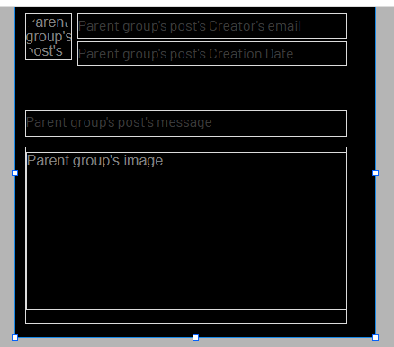

Now we are going to make sure the image element only extends the post's window if the user actually included a photo. Add a "Group" Container over the image. Make sure the image is nested inside it by dragging it in the group until the group's borders turn red. Click on the image and type in "Parent Group's image" under the "Dynamic image" input. Select the group again and set "Type of content" to image. Also set the "Data source" input to "Parent group's post's picture". Now set the following settings as shown here:

| - This element is visible on page load -> Unchecked
| - Make this element fixed-width -> Checked
| - Collapse this element's height when hidden -> Checked
| 
Now go into the Conditional tab and define a new condition. In the input labelled "When", insert "Parent group's post's picture is not empty". Select "This element is visible", making sure that it is checked.

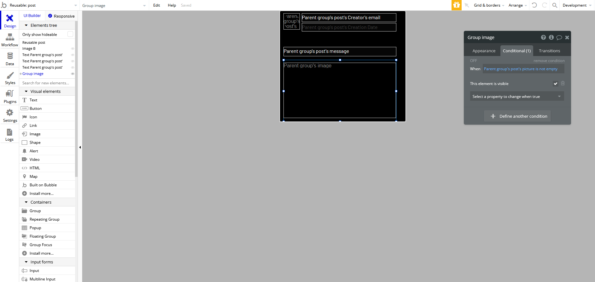

When the posts functionality is complete, they will now collapse the photo section when a photo is not provided by the user.

Notice that each element is set to say "Parent group's post's email/Creation Date/message/image/etc." In this case, the "Parent group" is the reusable element. Setting each visual element dynamically like this is important because each post's email/Creation Date/message/image is going to be different, and we want the post's content to change accordingly.

Navigate back to the index page and place a "Repeating Group" container into the page. We want each cell in this group to contain a post, so make sure each cell is tall enough to fit it. You may have to extend the page itself to achieve this. In the repeating group's "Type of content" prompt, put "post". This repeating group also requires a data source, as it needs to know which posts to display and in what order. This means we want the repeating group to search our database for posts and organize them on the page according to a sorting rule that we will apply in a moment. Click on the input next to "Data source" and select "Do a search for". Select "post" in the "Type" dropdown and select Sort by>Created Date. This will make posts that were made most recently appear at the top. Lastly, select Descending>"yes". Your page should now look like this:

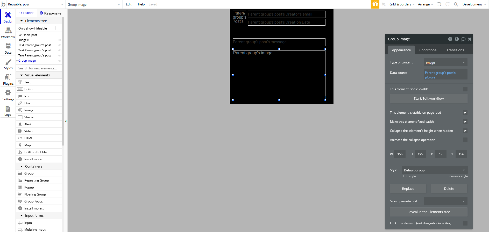

To put the page into endless scrolling mode (rather than having a scrollbar), select Layout style>Ext. vertical scrolling.

Now drag and drop the reusable element called "post" that we made earlier into the first cell of the repeating group. Notice that the element gets repeated in each cell of the repeating group. This gives you a preview of how the page will look when it is displaying several posts at once. Center the element in the page by selecting Arrange>Center horizontally in the top right corner of the screen. Inside the post element's Appearance tab, select Data source>Current cell's post. This tells the post element to display whatever data the repeating group found when it searched the database for posts.

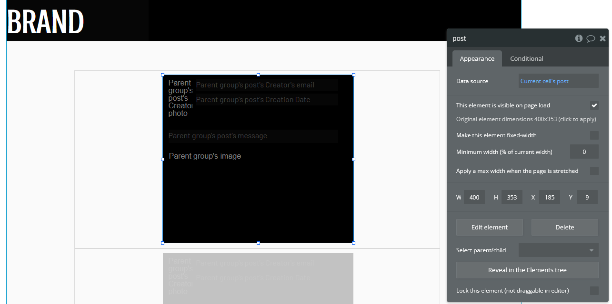

If you preview the app now, all you will see is an empty page. This is because we have not posted anything yet. To fix this, let's start by adding a button that will allow the user to create a new post. Place a button somewhere on the web page and label it "New post".

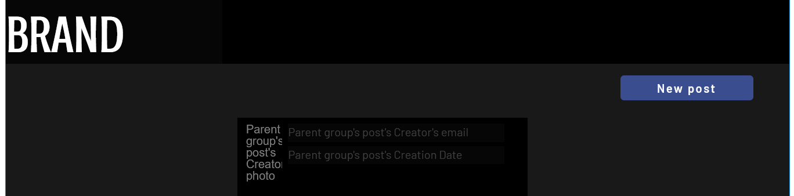

Now add a popup container to the page. Overlay a title that says "New Post", along with a Multiline Input, a Picture Uploader and a button that says "Submit". Change the style of each of these elements to match the theme of your website. The popup should now look something like this:

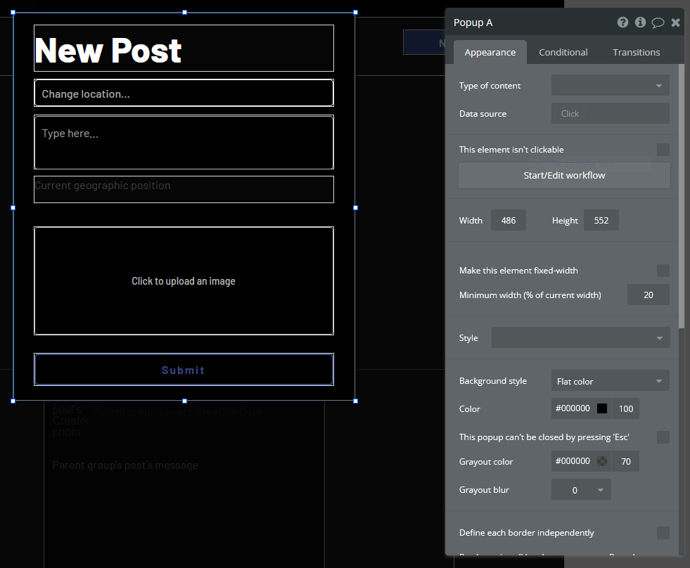

Start a workflow for the "Submit" button. Select Data(Things)>Create a new thing. Under "Type", select "post". We are goingto set this post's fields as shown here:

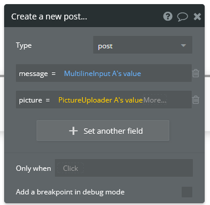

Create another action for resetting the inputs in the popup. When you open the action selection menu, you might see this action under a heading that says "Recommended next action". If that is the case, click that. If that does not appear for you, navigate to Element Actions>Reset inputs.

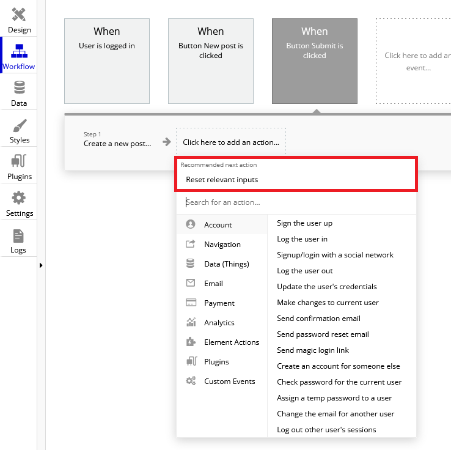

The last action we want is to hide the popup. Add a new action and navigate to Element Actions>Hide. When the action's window pops up, select the popup name in the "Element" dropdown.

We now need to configure the "New post" button on our index page to show the popup when we click it. Select the button and start a workflow. Navigate to Element actions>Show and select the correct popup under "Element".

You should now be able to create posts in your app. Try creating a new post with a photo and see how it looks. You may find it looks stretched and has poor formatting like this:

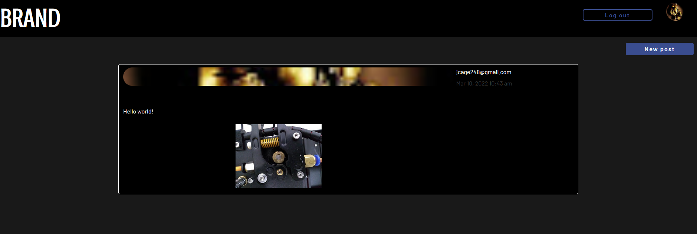

If that is the case, go back into the editor and select the post element in the index page. Make sure "Make this element fixed width" is checked. Now go into the repeating group and make sure "This repeating group has a fixed width" as well. This will keep the post in the center of the page. When you run your app again, the formatting should be fixed.

Try creating several accounts and posting several posts with those accounts. Also try Posting without being signed in. This will give you a better preview of what your app will look like when multiple users have started using it.

Adding Upvote/Like Functionality
--------------------------------

We are now going to give users the option to like each other's posts. To do this, we need to make it so that each user can only give each post a single upvote. We will also allow users to take back the upvote by clicking the Like button a second time. Our database will have to keep track of every user that has liked each post. However, we cannot use the user's username, email password, etc. because those things can all be changed by the user. Fortunately, every "thing" that is created in Bubble has a field called a **unique_id** that cannot be changed by the user. It is what will allow us to determine whether a user has already upvoted a post.

The first thing we need to do is add an "upvote" field to the "Post" type in the database. Go to the "Data" tab  and create a new field under "Post". Name it "upvotes" or something similar and set its field type to "number". Set the default to 0.

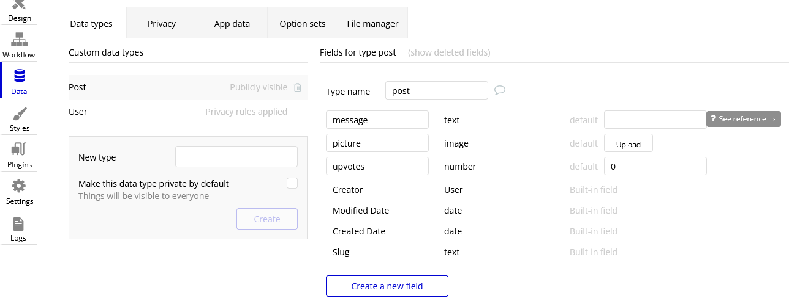

Since we made changes to the "Post" type's fields after posts have already been added to the database, you will have to delete all the sample posts you added and recreate them to see the latest changes. You could also leave the old posts and just create new ones, but that might become confusing.

Now we are going to edit the reusable "post" element to include a like button. Go to its editor page and extend the window so it can fit a small icon and some text. Drag and drop an icon into the bottom corner of the window. Resize it until it fits and select an unfilled heart icon in the appearance tab. Uncheck "This element is visible on page load".

Drag and drop a text element next to the heart icon. This will display the number of upvotes the post got. In the text editor input, insert "Parent group's post's upvotes" as dynamic data.

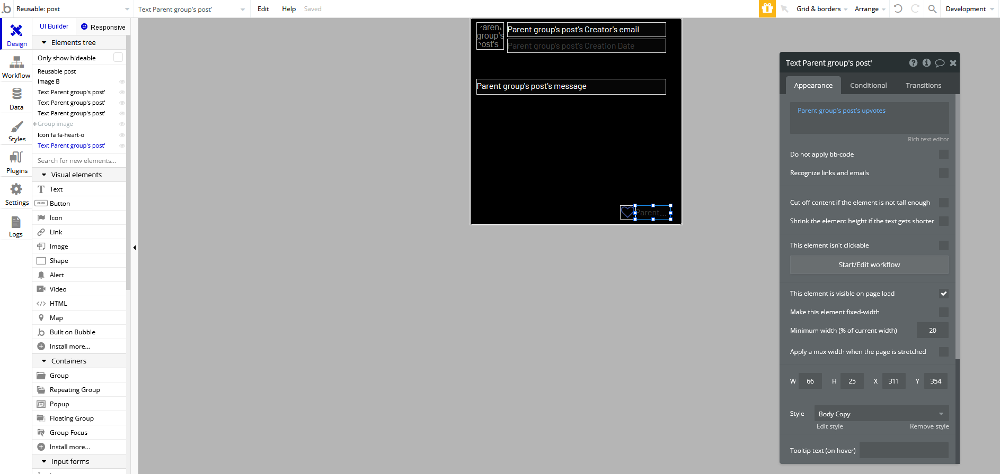

You may need to update the size of the repeating group and reusable post element on the index page. Do this by clicking "Original element dimensions 000x000 (click to apply)" in the Appearance tab of the reusable element.

Now we need to configure this icon to only add an upvote to the post when the current user is not already among a list of users who have liked. Here is how this will work: we will create a new data type called "UsersWhoLikedPost" or something similar. We will add two fields to it: ParentPost and users. Every time a user likes a post, a new thing of type "UsersWhoLikedPost" will be created. The ParentPost field of this object will tell us which post this like belongs to, and the "users" field will tell us the unique_id of the user who liked it. We can then search through the entries of the type "UsersWhoLikedPost" to determine whether the user has already liked the post or not. We can also delete these entries when a user unlikes a post.

Let's start by creating the new data type. Go to the data tab and create the fields as shown here.

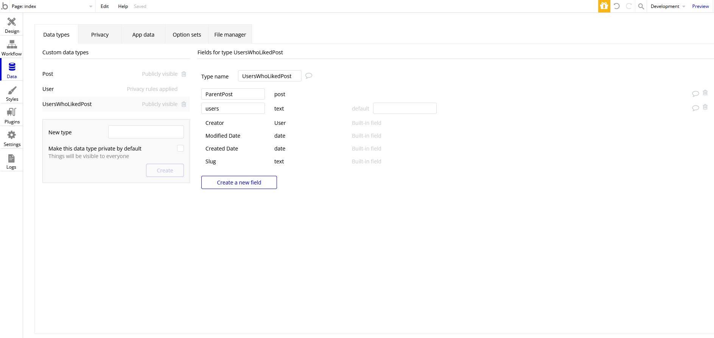

Now go back to the reusable post element editor and start a workflow for the heart icon. Select Data (Things)>Create a new thing... and fill out the window as shown below.

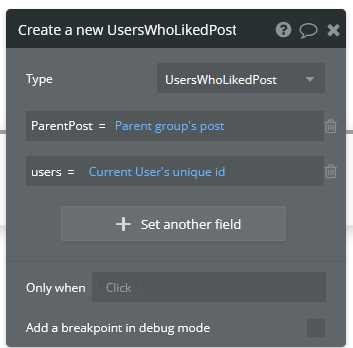

Add another action by navigating to Data (Things)>Make changes to thing... and fill out the window as shown here. You will have to type "1" manually and press Enter at the end.

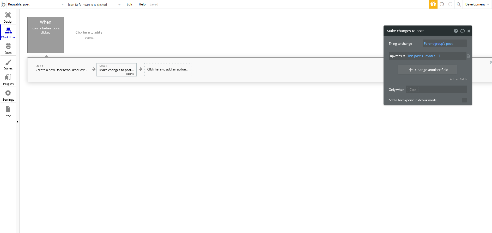

Go back to the design tab. With the heart icon still selected, go to the Conditional tab. Define a new condition starting with "Do a search for..." and fill out the input so that it looks the same as shown below. Select "This element is visible" as a property to change and make sure it is checked.

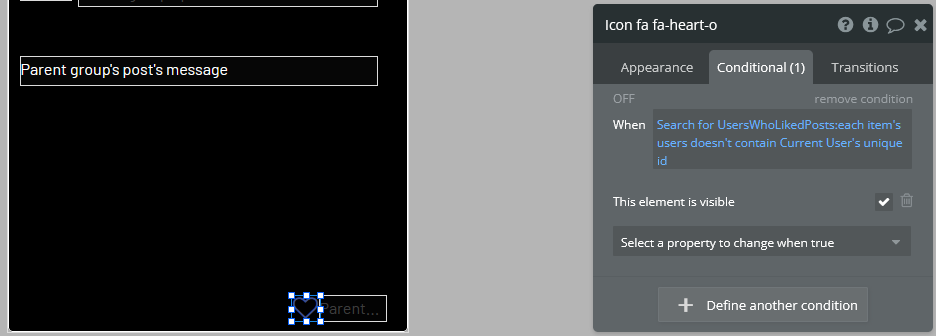

The heart icon will now disappear when it is clicked by the user. Now we need to configure another icon to appear in its place. This icon will do the opposite of the first one when it is clicked. It will remove the current user's unique_id from the database and decrease the post's upvote count by 1. To start, drag and drop another icon to the post in the reusable post element editor. Make sure is in the exact same position and the same size as the first icon. Choose a filled heart this time, to represent the Like button already being clicked. Make sure "This element is visible on page load" is unchecked. 

Start a workflow. The first action will be under Data (Things)>Delete a list of things... fill out the windows as shown below. Start the "List to delete" input with "Do a search for...". This will delete the user's unique_id from the list, allowing them to like the post again if they wish.

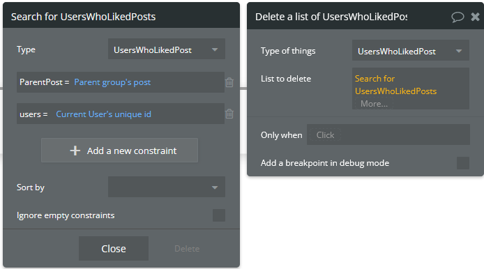

Add another action under Data (Things)>Make changes to a thing... and configure the inputs in the window as shown below.

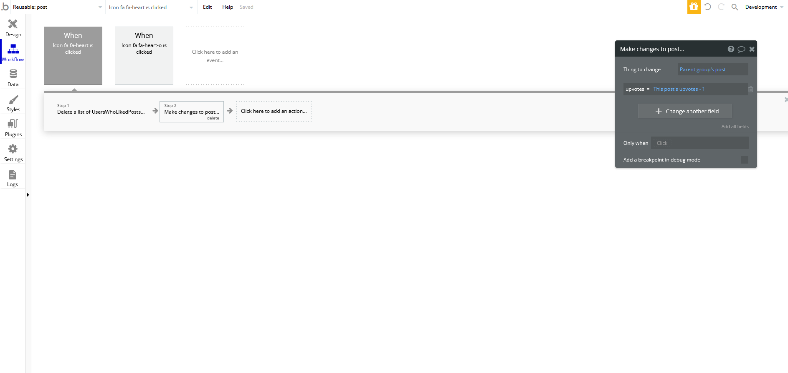

Now we need to make the filled heart icon only be visible when the user has already upvoted the post. Go back to the design tab, select the filled heart icon, and go into the Conditional tab. Fill out a new condition as shown below. The property to change is "This element is visible", which must be checked.

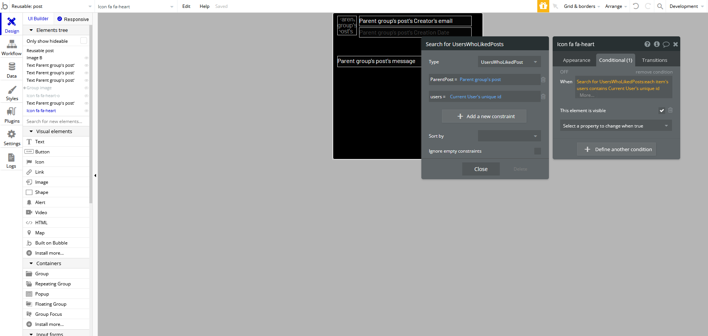

In the Appearance tab, make sure "This element is visible on page load" is unchecked. If you run the app now, you should find that you are able to like and unlike posts that you have created.

Configuring a Profile Settings Page
-----------------------------------

Let's create a page for the user to change their username, password, email, etc. Create a new page using the dropdown menu in the top left corner. Name it "profilesettings" or something similar. Before we actually design the page, we must go to the data tab and add the "Username" field to the User data type. It is of type "text". You can also set the default username to "Anonymous" so that even users who are not signed in will have a username.

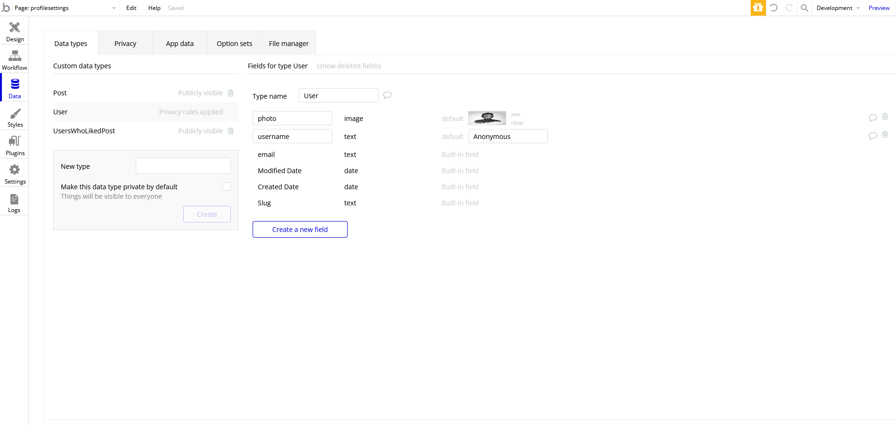

In the profile settings page, we will need a photo uploader for changing their profile photo, an input that takes in a username and a section for changing their password. This section should take an email input, an input for their old password, an input for their new password, and another input for their new password (ask them to retype it). Lastly, a "Save all changes" button that will change the user's info to the new values in the inputs. Do not forget to include text headers.

The input for the passwords and email should be "Password" and "Email" respectively under the "Content format" field in the Appearance tab. This will hide the characters for the password inputs, and the email inputs will expect an @ symbol to be entered. Also make sure that the "Prevent 'Enter' key from submitting" option is checked in each input.

For the profile picture, it might look best to show the current profile photo and put the image upload button beneath it. Putting all this together, your profile settings page should look something like this:

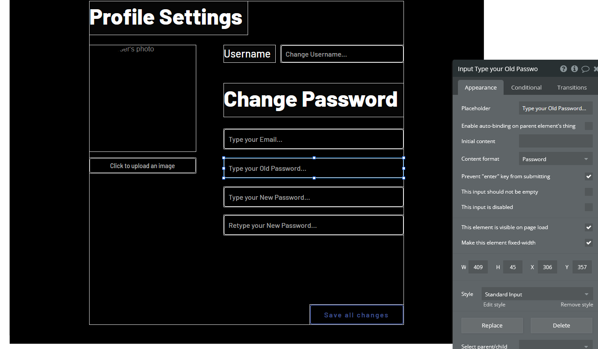

The user is going to need a way of getting to this page. Open your reusable header element and add an icon underneath the user's profile photo. Change the icon to a gear (representing settings) and uncheck "This element is visible on page load". Go to the conditional tab and add the condition "When Current user is logged in", which turns on the icon's visibility. Use the image below for reference if anything is unclear.

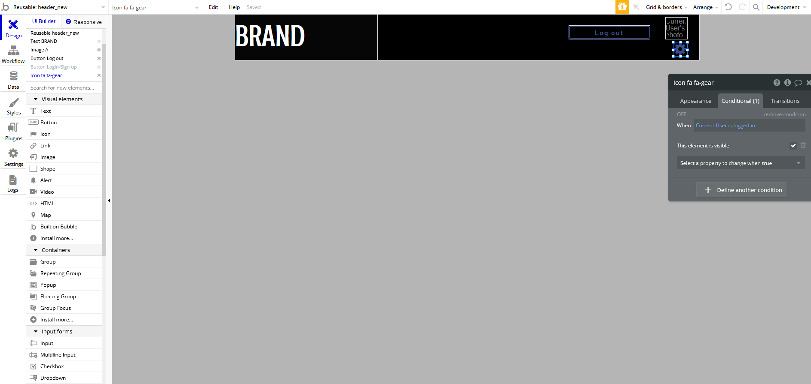

Now start a workflow for the icon. Add Navigation>Go to page... as an action for when the gear is clicked. Set the destination to the profile settings page.

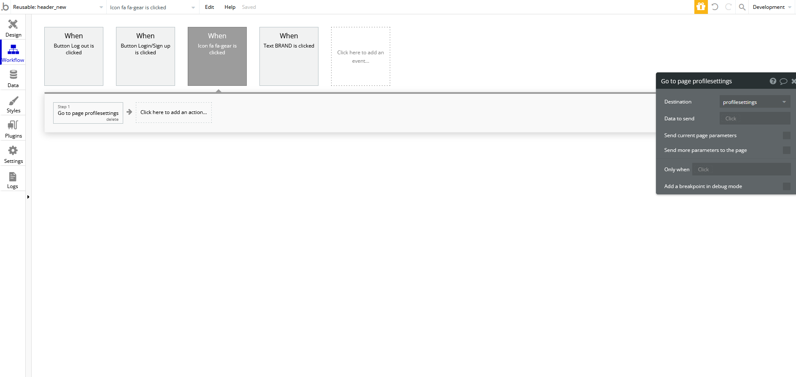

You should now be able to access the profile settings page by clicking the gear icon in the header. Now we have to configure the "Save all changes" button in the profile settings page to actually change the user's information when it is clicked. Start a workflow for this button and select Account>Make changes to current user. Add the fields as shown below. Make sure that these two fields have placeholder values (found in the Appearance tab of the inputs) so that the user does not have to insert their info into every field if they only want to change one thing.

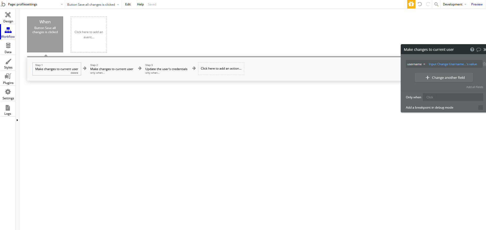

Add another action of the same kind for changing the photo. We are doing this separately because we only want this action to occur when the picture uploader has actually had a new photo uploaded to it. Here is what that looks like:

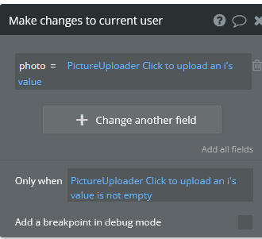

Next add another action under Account>Update the user's credentials. Fill out the inputs as shown here. Note the extra long input at the bottom, which says that the app will not try to update the user's credentials if all the inputs for changing their password are empty.

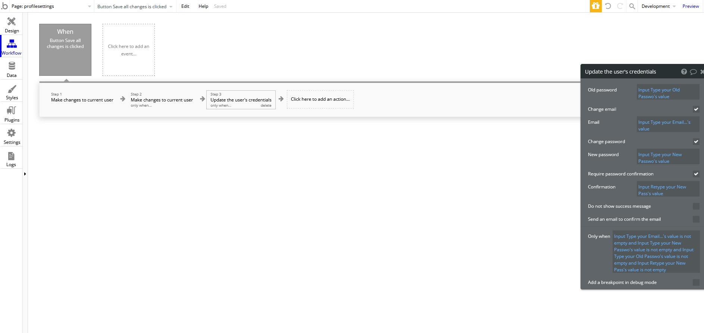

The profile page is complete. You should now be able to change the username, password, photo, and email associated with an account on your app through this page. It may be hard to tell that any changes have been made to your account, so you can also add a popup that says something like "Changes were successful" or something like that if you wish.

Viewing Other Users' Profile Pages
----------------------------------
Almost every social media site allows users to view each other's profiles. These pages show the user's photo, username, their posts, and posts they have liked.

We can start by create a new page called "profilepage". Since this page must display a specific user's information, we have to click on the whitespace and select "User" next to "Type of content". You can also change the page title if you wish. Make sure the page width matches the width of all the other pages.

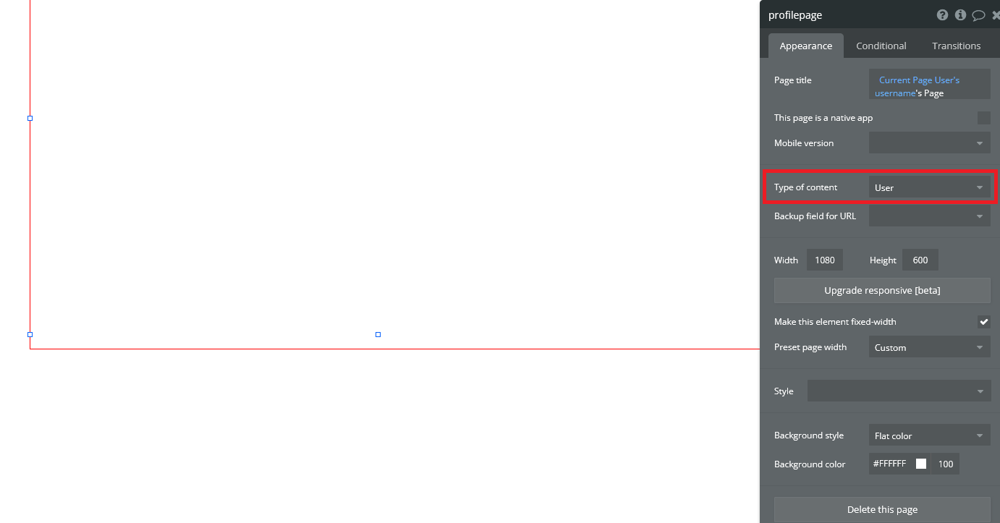

Include your header and change the style of the page to match the rest of your app. Add an image and text element for the user's username and profile photo. Since we want to display the name and photo of the user whose page we are viewing (rather than the info of the user who is viewing it), we will select "Current Page User" rather than "Current User".

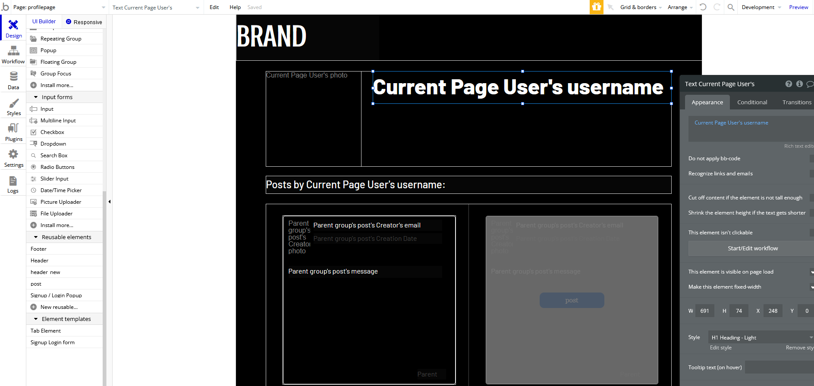

Now we will create a section of the page for posts created by the user. Create a text header using the dynamic data/text combination shown here:

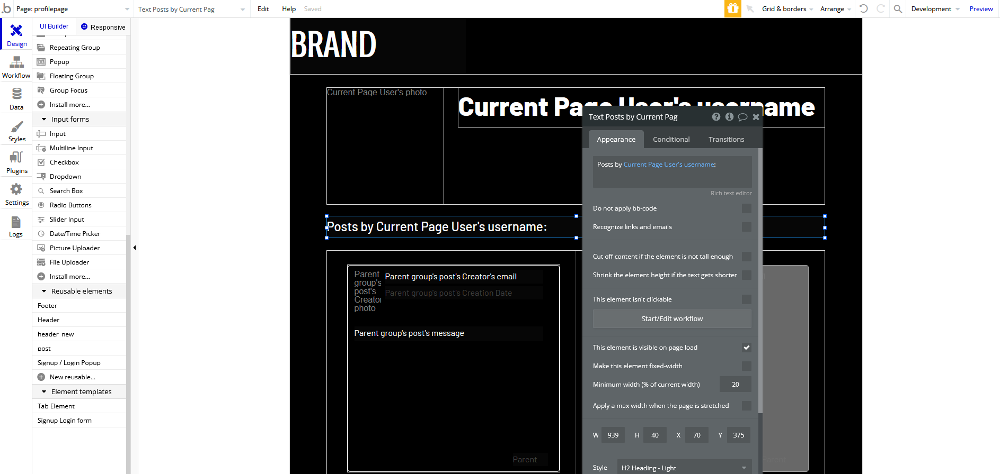

Now add a repeating group with the settings shown below. We are sorting this by Created Date, with Descending set to "Yes". This means that the newest posts will show first. We will also set the Layout style to Horizontal scrolling instead of vertical so the page is more compact. Also remember to add a reusable post element to the inside of the first column of the repeating group. Set the reusable post element's Data source to "Current cell's post".

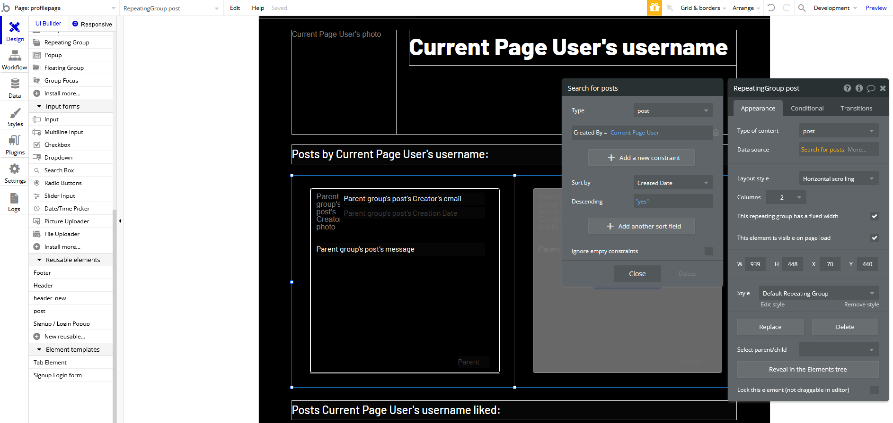

Now we are going to do a similar thing for the user's list of liked posts. Create another text header with the dynamic data shown here:

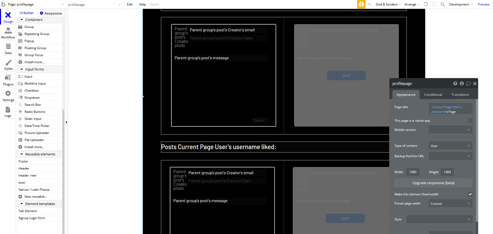

Add the repeating group with the reusable post element as we just did, except the data source should look like this:

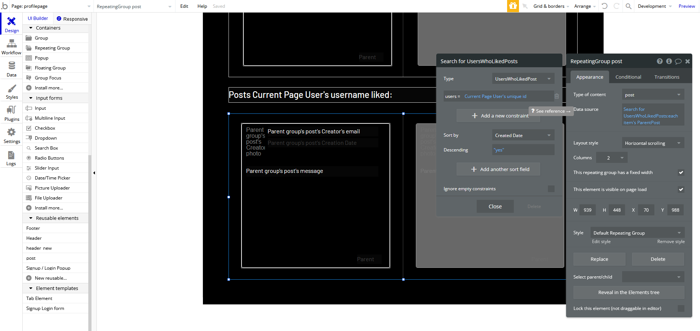

The profile page should now be ready to use. However, trying to Preview the app from this page would look strange since it does not know which user information to display. Before we can see if our settings worked, we have to make a way to get to a user's page through the app. Let's do this by making the user's username clickable through the reusable post element. Move to this element's editor page and select the text that displays the user's email. While we are here, let's change this text to display the user's username instead. You can do this by simply changing the dynamic data to say "Parent group's post's Creator's username". Now start a workflow.

Add Navigation>Go to page... and select profilepage. Since the content on this page is dependent on which user we have clicked on, we have to set the Data to send to "Parent group's post's Creator". The window should look as shown:

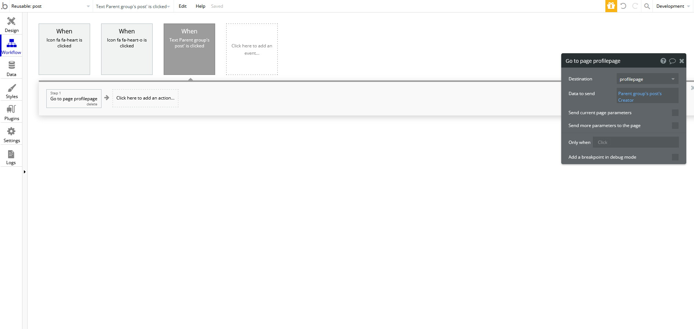

Let's also view our own profile by clicking the profile photo in the header. Go to the reusable header element editor page and select the profile photo. Start a workflow.

We are going to use the same action as before, except this time the Data to send will just be "Current User".

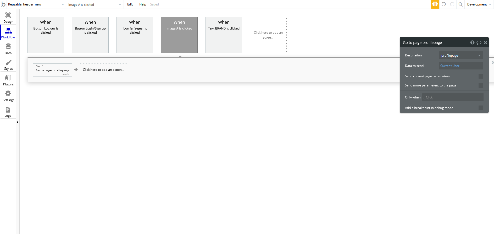

The profile page setup is now complete. you should be able to click your own profile photo in the header to see your profile page, or click another user's username to see their page.

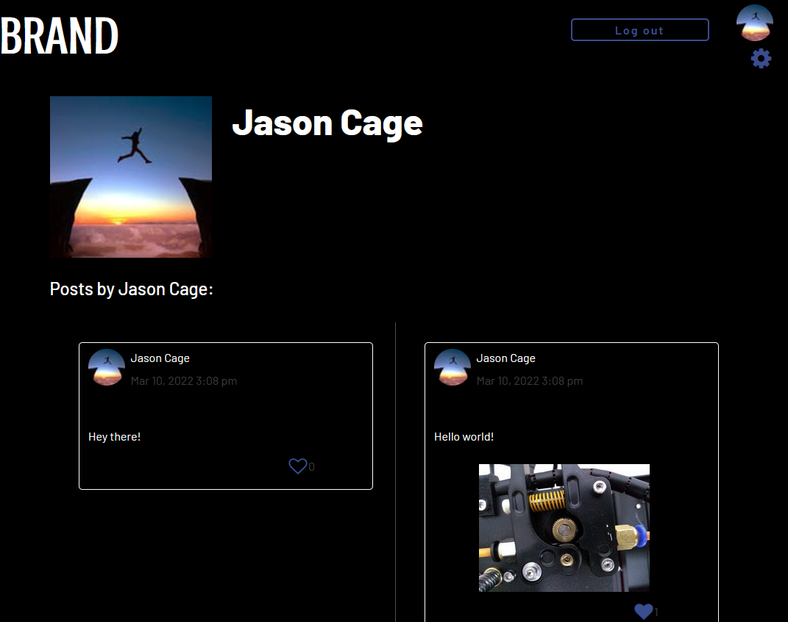

Adding Comments to Posts
------------------------
We will now add commenting functionality to the posts. To start, we are going to go to the Data tab and create a new data type called "comments". Its fields will be called "message" (type: text) and "ParentPost" (type: post).

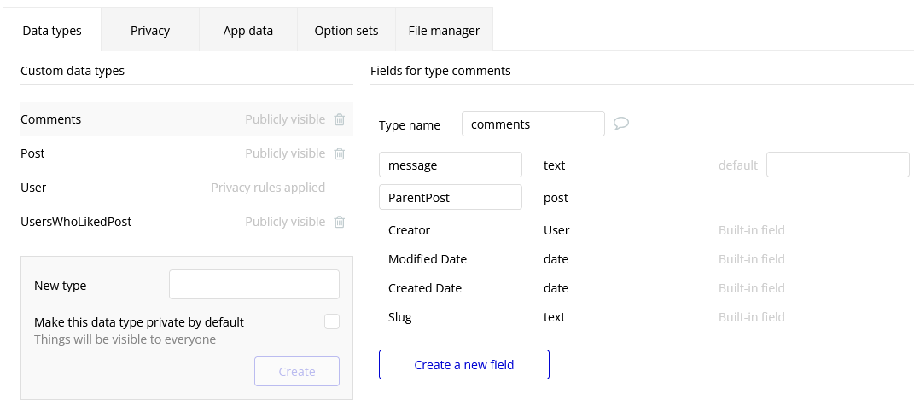
   
Next we have to go to the reusable post element's editor page and add a text element to access the comments. Drag and drop a text element to the bottom left corner of the post element labelled "Comments". Next we will add a popup element which will show us the comments posted by other users and allow us to add a comment ourselves. Inside this popup we will add a title ("Comments" would be fine), a repeating group for the comments, a multiline input for typing our own comment, and a "send" icon for creating a new comment. The popup should look something like this:

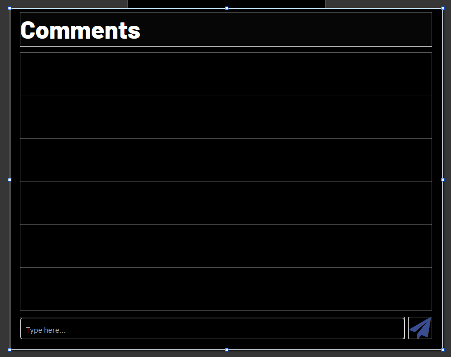

The popup itself should have "post" under "Type of content" and "Parent group's post" as its Data source:

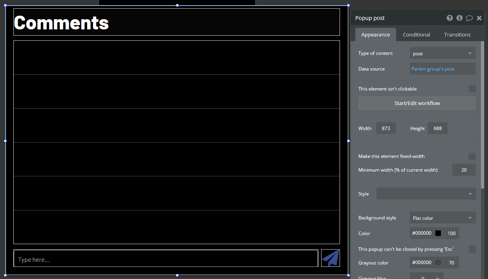

The repeating group should have the settings shown here:

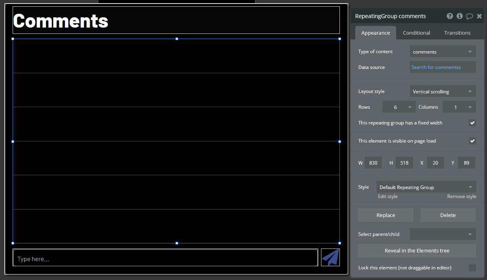

Instead of creating a new reusable element on a separate page and adding it to the comments popup, let's create the reusable element directly from this page. Drag and drop the necessary elements into the first cell of the repeating group so that it looks the way you want the comments to look. Each comment should show the user's username, the message, the user's profile photo and the date that the comment was created.

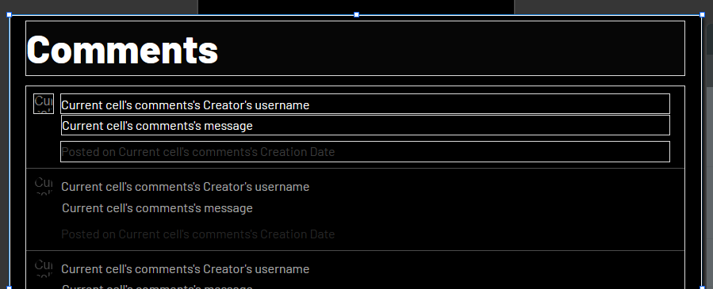
   
Now select all the elements inside the cell (but **not** the repeating group itself) and right click > Convert into a reusable element. Give the reusable element a name. You will then be taken to a new page where the elements you selected will be overlapping whitespace. Select the whitespace and set the Type of content to "comments". Adjust the sizing to your liking.

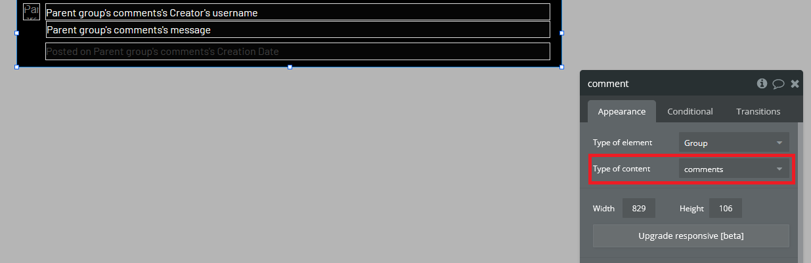

Go back to the post element and reopen the popup (select it from the elements tree on the left). Remove all the elements you just placed in the cell and replace it with the reusable element you just created. Set the element's data source to "Current cell's comments".

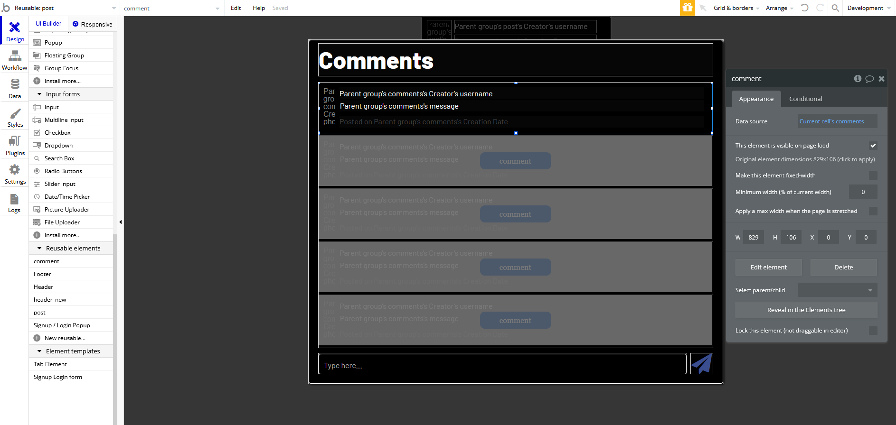

Now let's configure the "send" icon to create a new comment when clicked. Select the icon and start a workflow. Select Data (Things)>Create a new thing... and configure the properties as shown below.

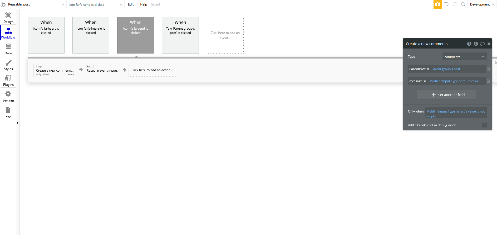

Add another action to reset the inputs when done. Now let's make it possible for the user to open the comments section. Go back to the reusable post element's editor and select the "Comments" text element that we created earlier. Start a workflow. Select Element Actions>Show and set it to show the comments section. Add another action from Element Actions called "Display data". Set the fields as shown below.

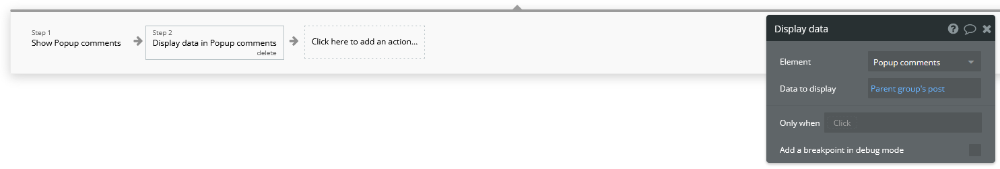

The comment functionality should now be complete. If you find that the usernames and profile photos are not showing on the posts when you view them from a different account, you may have to fix the privacy settings for your app. Go to the data tab and click "Privacy" at the top. Select "User" on the left and make sure that "View all fields" is checked.

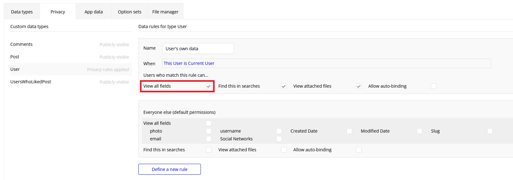

Seeing Posts on a Map
---------------------
Now we are going to add a feature that allows us to see where a post was made on a map. Unfortunately, since we are only now going to add a field to record the location that a post is created, the sample posts that you created before this point will not be viewable on a map. To start, open the data tab and add a field called "location" with type "geographic address".

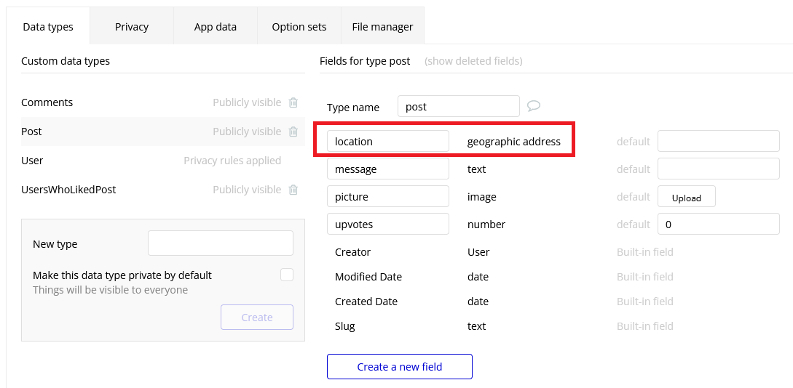

You may get an error saying you need to obtain a Google Geocode API Key to process addresses. Watch the video tutorial on `this webpage <https://manual.bubble.io/help-guides/working-with-data/working-with-location-data>`_ to learn how to do this.

Go to the "New Post" popup in the index page and add a new input line for location. We want the default location to be the user's current location, so set the Initial content to "Current geographic position's formatted address" and the Content format to "Address", as shown below.

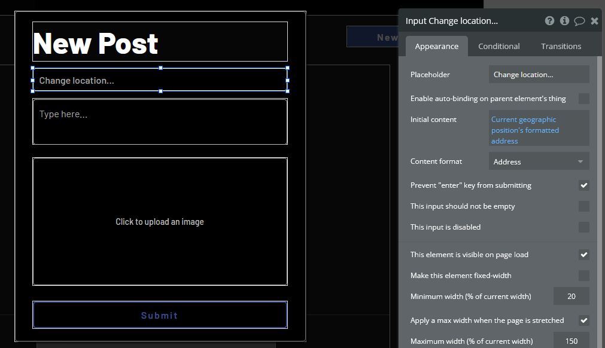

Edit the workflow for the "Submit" button so that the first action (Create a new post) sets the "location" field to the input we just created.

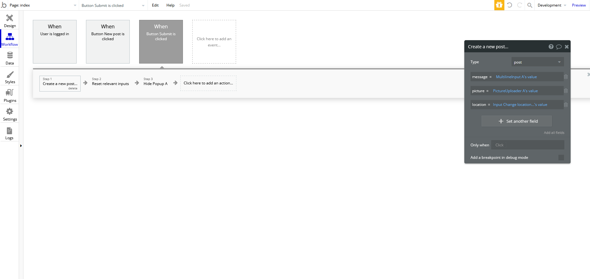

Now go back to the reusable post element's editor and add a new text element below the post's creation date. this element will display the post's location. Add an icon element next to this element and change its appearance to "globe".

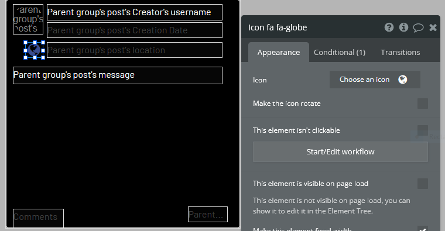

Let's configure this globe to only be visible when the post has a location associated with it. Select the globe icon and uncheck "This element is visible on page load". Now go into the Conditional tab and set a new condition to "When Parent group's post's location is not empty". Set the property to change to "This element is visible" and make sure it is checked.

Now create a new popup, and make it big. Add a text element for the title and a "Map" element. Set the popup's Type of content to "post" and the Data source to "Parent group's post". Now select the map and set its marker address to "Parent group's post's location". Feel free to change the style of the map to whatever you wish.

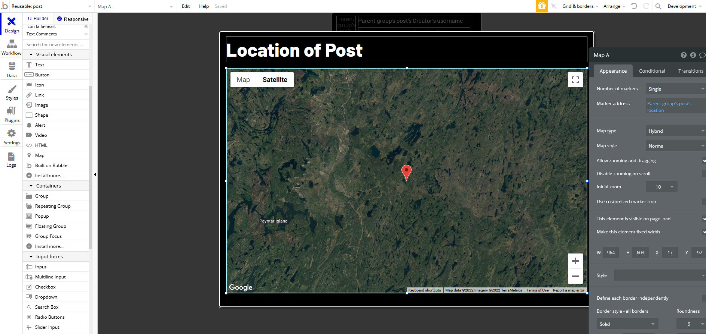

Close the popup and select the globe icon again. Start a workflow. Go to Element Actions>Show and select the map popup. Create another action in Element Actions>Display data.

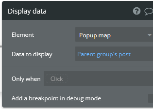

The app is now complete. You should be able to create posts, view other users' profiles, edit your profile settings, like other posts, make comments, and view where those posts were created on a map.

Second Example: Buy & Sell App
==============================

