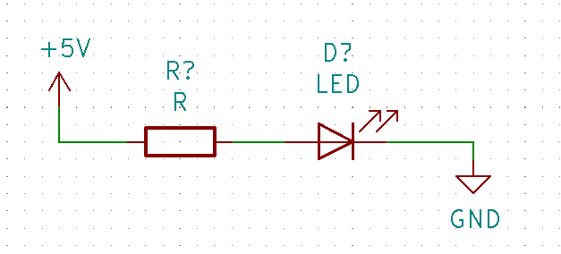
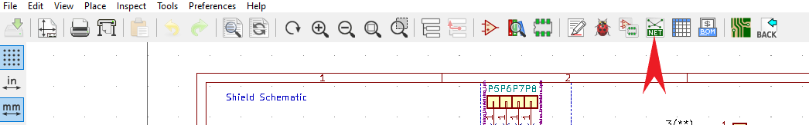

Creating a schematic
====================

To begin, open KiCAD and navigate to File > New Project > New Project. From there, make a new folder, name it whatever you want, and this is where 
all your files will be stored that are created for this project. Two files will be created, a **.sch** and a **.pcb file**, we will start with the 
**.sch** file.

From here, you will see the blank schematic page and to the right of the screen is the toolbar. To start placing symbols, click the "place symbol tool" 
and then click anywhere on the schematic page to open the symbol library. Or press 'A' anywhere on the schematic for the symbols library. You can then 
search and select for whatever component you are looking for and place it in the schematic.

To place power and ground symbols, use the following tool and click anywhere on the schematic. Or press 'P' anywhere on the schematic:

Once you have all your components placed and positioned on the page, you can connect them using the wire tool:

To edit the properties of a component, however over it and press "e" or just right click and navigate to Properties > edit properties. From here you can 
add values or any other information such as datasheets, part numbers, etc.

Once you finish placing your components you need to name them. You'll see right now that there are question marks at the end of each name, to fix this click "Annotate 
Schematic Symbols" then "Annotate" and there will be names assigned to each component.

Before annotating:

	
Creating Custom Symbols and Symbol Libraries
--------------------------------------------
KiCAD will not have every symbol you will need. You will either need to create your own symbol or download it. 
Good resources to find custom symbols are `SnapEDA <https://www.snapeda.com/>`_ or `UltraLibrarian <https://www.snapeda.com/>`_. 

To learn how to make your own symbol and symbol libraries follow this video:  

.. raw:: html

   <iframe width="560" height="315" src="https://www.youtube.com/embed/LhFWFO8H0jQ" title="YouTube video player" frameborder="0" allow="accelerometer; autoplay; clipboard-write; encrypted-media; gyroscope; picture-in-picture" allowfullscreen></iframe>
   
To learn how to import symbol libraries watch follow this video:

.. raw:: html

   <iframe width="560" height="315" src="https://www.youtube.com/embed/V8tcgFb2NUQ" title="YouTube video player" frameborder="0" allow="accelerometer; autoplay; clipboard-write; encrypted-media; gyroscope; picture-in-picture" allowfullscreen></iframe>
   
Creating and Assigning Footprints
---------------------------------

Now it is time to assign footprints to all the components. KiCAD has a large library of footprints already available that you can search for in the footprint editor and if it is not 
already available you can usually find them already made online. Simply search for the component on `Digikey <https://www.digikey.ca>`_ and there is usally an option to download the CAD models and footprints. 
The footprint file will download as a **.pretty** folder. From here, open the footprint editor from the project window and navigate to **File > Add Library** and select the **.pretty** 
folder you just downloaded. The footprint will now be available to assign.

If you cannot find the footprint online or you'd simply like to make one yourself, please refer to the following video:

.. raw:: html

   <iframe width="560" height="315" src="https://www.youtube.com/embed/UBIhCX_ET4M" title="YouTube video player" frameborder="0" allow="accelerometer; autoplay; clipboard-write; encrypted-media; gyroscope; picture-in-picture" allowfullscreen></iframe>

After you have all your footprints ready, you can begin assigning them to your components. Click on "Assign PCB footprints to schematic symbols".

Now you will see the following window open with three coloumns:

The left column is the footprint libraries, the middle column is the symbols in your schematic, and the right is the contents of the selected footprint library. To assign a footprint, simply select the symbol 
in the middle column, then the library where the footprint is located, and finally the footprint on right that matches what you are looking for. You will also seen an example of this in the above video.

Finally to prepare for the routing, click on "Generate netlist" and then "Generate netlist" on the following window again.

	