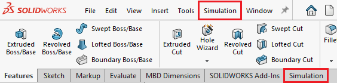
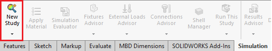
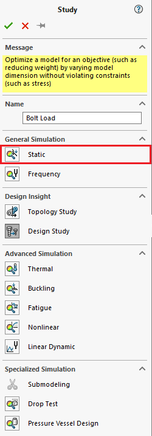
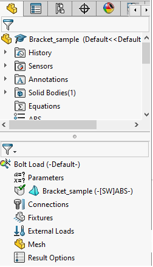

Creating the Simulation
=======================

Creating a New Study
^^^^^^^^^^^^^^^^^^^^

To start the simulation, we will access Simulation by clicking on the “Simulation” tab in the command manager toolbar or by 
clicking the “Simulation’ drop down menu in the interface. 

	
To start, we’ll begin by selecting the “New Study” icon in the Simulation toolbar. 

Once clicked on, the study property manager window should appear. From here, the desired simulation type can be selected and 
can also be given a name. For tutorial purposes, we’ll just be going for a static simulation and naming it “Bolt Load”.

	
Clicking the check mark in the top left corner will then open up the simulation manager tab below your model tab. 

