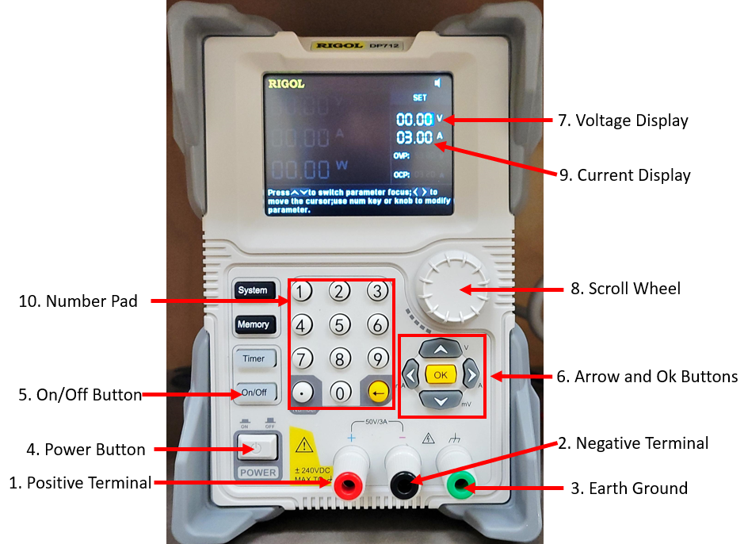
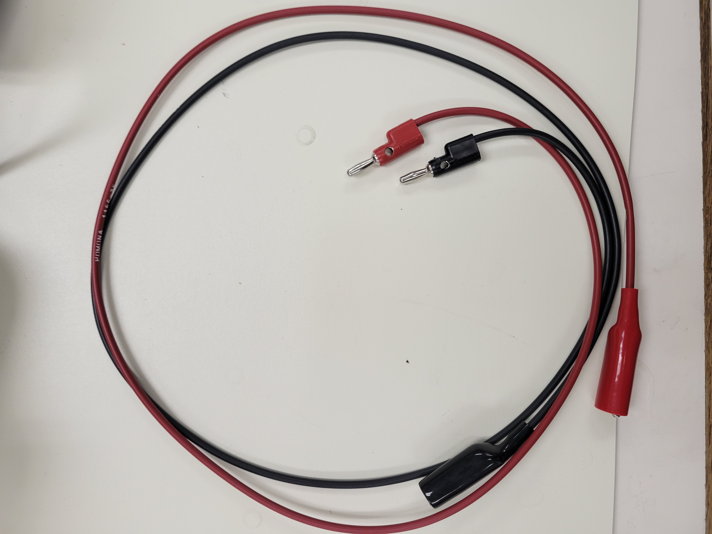

DP712 Power Supply
==================

The DP712 power supply can output up to 50V/3A for a total power of 150W.

On the front of the power supply, you will see three output terminals. The red terminal (1) is the is the positive terminal and the black terminal (2) is the negative terminal. 
There is a third green terminal, that is earth ground (3). You mostly like will not use this port unless you need to ground a chassis or create a common node in your circuit with earth ground. 
These terminals take standard 4mm banana plugs. 

	
The power button (4) turns the power supply on and off. Keep in mind that when the power supply is turned on it will not output anything, you need to press the On/Off button (5). When the On/Off button is pressed it will light up green, meaning the power supply is supplying power to your circuit.
6
Before you are ready to press the On/Off button, you need to first set the output voltage and the max current output. To set the output voltage and current, first use the arrow buttons (6) to move to the set voltage display (7). 
You can use the left and right arrows buttons to move digits and use the wheel (8) to get to the voltage you want.

To set the current use the arrow buttons to move back to the current display (9), and set your max current the same way you did with the voltage. If you want a faster way to set the values you can use the number pad (10). 
Pressing a number will show a green box, type the voltage or current you are want to set then press the yellow OK button (6) in the middle of the arrow buttons. Once you have set the desired voltage and maximum current levels you can press the On/Off button to start the output.

The output voltage and current will be shown on the left side of the display. Remember that the current you set will not be the current that is output immediately, but it is the maximum current that the power supply will output. 
Do not set the max current to be greater than the maximum current your components can withstand. It is good practice to always check the output with a multimeter before connecting the power supply to the circuit. 
