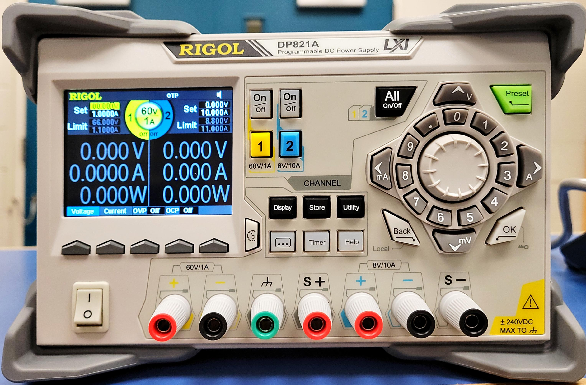

DP821 Power Supply
==================

	
The DP821 power supply is very similar to the DP712 power supply. There are a few differences, there are two sets of power terminals. One has a maximum output of 60V and 1A (1) and the other has a maximum output of 8V and 10A (2). 
There is also the S+ and S- terminals (3), these are the sense terminals they can be connected across a load to detect the voltage drop across the load.

The power supply will then alter the output to ensure the connect voltage drop across the load. Most likely you will not need to use this feature, 
but if you have a circuit that needs a very precise voltage you can use this function. How to use this function will be explained later.

	
To set the voltage and current output first pick the channel you want to use. The yellow “1” button (4) controls channel 1 the 60V/1A channel and the blue “2” button (5) controls channel 2 the 8V/10A channel. 
Once you have picked the channel you want to use, you can press the grey buttons (6) to pick voltage, current, OVP (over voltage protection) and, OCP (over current protection) you would like to set.

	
To set the values you can use the number buttons (7), the scroll (8) or the arrow keys (9) to set the desired levels. To turn on the output of the 60V/1A channel, press the On/Off button above the yellow “1” button. To turn on the 8V/10A channel press the On/Off button above the blue “2” button. 
When the channel is turn on, the On/Off button will light up green. If you do not want to use the OVP or OCP you can press the grey button below these settings until it reads off. 

Most application you will use the power supply for you will not need to worry about the OVP and OCP. If you are connecting your power supply to a circuit that you think could draw more current or voltage than is safe, you should use the over voltage and/or over current protection. 
You can set the OVP and OCP to between 110% to 140% of the supplied voltage or current. Or you can set them to be lower than the absolute maximum that your components can handle.

The Sense Working Mode only works when using the 8V/10A channel (channel 2). Once you select the 8V/10A channel you will see above the right most grey button (6) there will be a sense option. you can press this button to turn the sense function on or off. 
To connect the leads of the sense function, connect the S+ terminal to the positive end of the load and the S- to the negative end of the load. This will detect the voltage drop across the load and correct the input voltage to obtain the correct voltage drop. 
