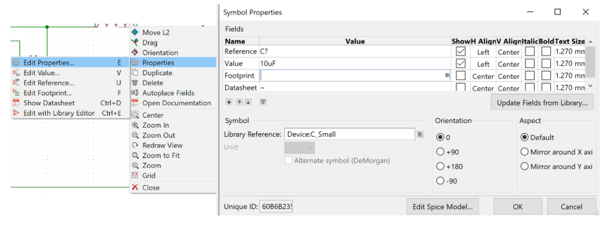

1 - Designing Schematics in Eeschema
================================

.. |eeschema| image:: ../_static/images/eeschema.png
   :width: 2%

   
.. |annotations| image:: ../_static/images/annotations.png
   :width: 2%

   

   

   

    
Schematic Design
----------------
A schematic is simply the symbolic representation of the circuit as seen in the figure below. The schematics are designed on a schematic drawing sheet (whose size can be adjusted). 

.. figure:: ../_static/images/schematic1.png
    :figwidth: 700px
    :target: ../_static/images/schematic1.png
A simple schematic

For more complex schematics, all the components cannot fit onto the standard schematic sheet. Multiple schematics on different sheets are needed - which implies that the components cannot be visually connected together as they are not on the same sheet. As such, using a global label will connect the components on different sheets together - this set of multiple sheets connected together is called **hierarchical sheets**.

The V5out global label connects all points connected to it, to each other. The set of hierarchical sheets opens more sheets with more schematics and global labels. Click :ref:`Hierarchical sheets` to find out how to do this **AFTER** going through :ref:`Schematic Creation Process` below.

Hierarchical sheets with global labels connecting the schematics

Schematic Creation Process
--------------------------
At the end of section 1, you should be able to recreate the schematic below. The buck converter schematic is not present on KiCAD so substitute that component with whatever you feel appropriate.

Follow these steps to create a simple schematic:
1. **Create a new project:** On the top right corner select file >> new >> project. The top toolbar should now be seen.

.. figure:: ../_static/images/schematic4.png
    :figwidth: 800px
    :target: ../_static/images/schematic4.png
      
2. **Toolbars:** Select the schematic layout editor icon (also known as eeschema) |eeschema|. A page with a schematic drawing sheet and three toolbars (top,left, and right) should pop up. The left toolbar can be used to change your units and some other more advanced settings. We will be focusing on the right toolbar.

.. figure:: ../_static/images/schematic5.png
    :figwidth: 800px
    :target: ../_static/images/schematic5.png
Left toolbar
    
.. figure:: ../_static/images/schematic6.png
    :figwidth: 800px
    :target: ../_static/images/schematic6.png
Right toolbar
    
3. **Place a symbol:** Place symbols using the symbol libraries icon |slibraries| on the right toolbar. Select the icon then click on the sheet, the symbol library should pop up. Type in the search bar the name of the component you are looking for, select it, click ok, then place it on the sheet. Common components like resistors and capacitors can easily be found by searching only the first letter of the component. Some components are referenced by other letters not found in the word i.e. Inductors are referenced by ‘L’. Rotate components by selecting on it then holding down the ‘R’ key.

Less common symbols like the buck converter are not part of the KiCAD symbol library. As such, the symbols have to be made by you or found on the internet. View :ref:`Custom symbols in library editor` to learn more about this.

4. **Electrical connections:** Electrically connect the components using the wire icon |wire|  on the right toolbar. Use the power port icon |powerport| to place global labels like grounds, potentials and other power labels. Grounds, power, and potentials are referred to as global labels because they are always the same no matter where they are placed or connected to - they do not ever change, unlike resistors that the values can be adjusted.

5. **Edit symbol properties:** Access the properties by left clicking on the symbol then selecting properties. This becomes handy when you need to edit the value of a component or the name (also known as reference). Take the Cin_buck1 capacitor as an example.

.. figure:: ../_static/images/schematic7.png
    :figwidth: 800px
    :target: ../_static/images/schematic7.png

    

6. **Annotate schematic symbols:** When symbols are placed on KiCAD, no names are attached. For example capacitors are shown as ‘C?’ and resistors as ‘R?’. So they need to be named and numbered i.e. R1,R2 … using the annotations icon |annotations| on the top toolbar. If you want custom names like the ones in figure XX, you will need to manually edit all the names/references in the symbol properties.

.. figure:: ../_static/images/schematic9.PNG
    :figwidth: 800px
    :target: ../_static/images/schematic9.PNG
    
7. **Connection flags:** There are two major connection flags; the no-connect flag |nconnection| and the power flag |powerport|. The purpose of these flags are to suppress errors / problems about pins from the electrical rules checker and to also provide clarification to your schematic.

* The no-connect flag is placed at unconnected pins. You can place the no-connect flag by clicking on the icon on the right toolbar.

* The power flag is placed at pins that are driven by an external power source. You can place the power flag by selecting the power port  icon and searching for it.

8. **Run electrical rules checker (ERC):** select the ERC icon |ERC| on the top toolbar, leave all settings as default, then click ok. If there are any problems with the schematic, it should  show in the box. 

.. figure:: ../_static/images/schematic11.png
    :figwidth: 800px
    :target: ../_static/images/schematic11.png
The error shown in the box can be removed by placing a power flag at that pin.

Hierarchical sheets
-------------------

Hierarchical sheets with global labels connecting the schematics
    
1. **Creating a sheet:** select the hierarchical sheet icon |hsheet| on the right toolbar and place the outline on the sheet. Fill in the sheet properties like the sheet, file name and leave the rest as default.

.. figure:: ../_static/images/schematic12.png
    :figwidth: 800px
    :target: ../_static/images/schematic12.png

2. **Global labels:** Since the schematics are on different sheets, they need to be connected to other components using global labels. Examples of global labels are power labels. They can be placed using the power port icon |powerport| while custom global labels can be created by selecting the place global label icon |global| on the right toolbar.

