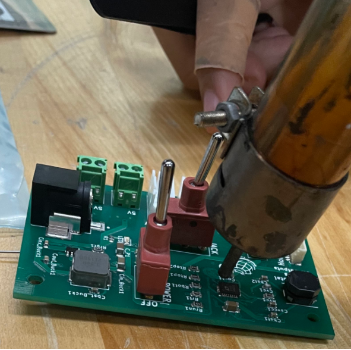

Desoldering SMD Components
==========================

Soldering SMD components, even with a reflow oven, can always be reversed. However, it is more tedious to desolder SMD components than THT components. See below for how to desolder SMD components:

1. Use a heat gun to heat up the solder, then remove the component with a tweezer.

2. Clean the pad with copper wick using a soldering iron. Place the copper wick on the pad, then place the soldering iron on the wick. The copper wick should absorb the remaining flux.

    
3. If needing to resolder the SMD component onto the same board, a stencil can no longer be used. As it won't fit flush with the board anymore because of the other components already placed on it. Manually place the solder paste on the pins, use a heat gun to heat the paste until it reaches a shiny silver finish, then clean the extra flux on the pads to ensure there are no short circuits. Place the component on the pad and heat with the heat gun.

