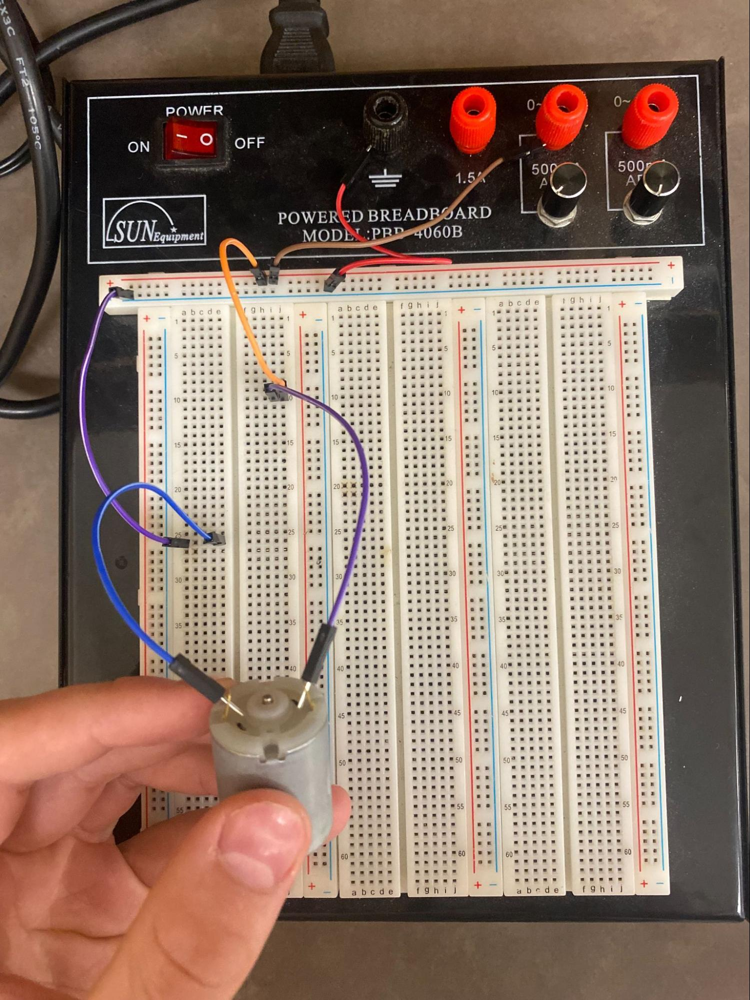
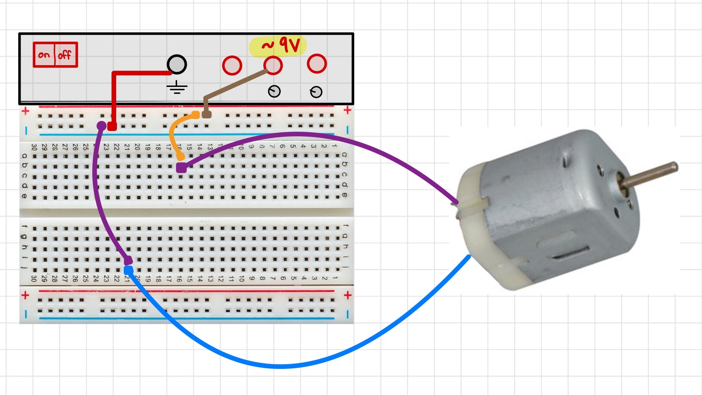
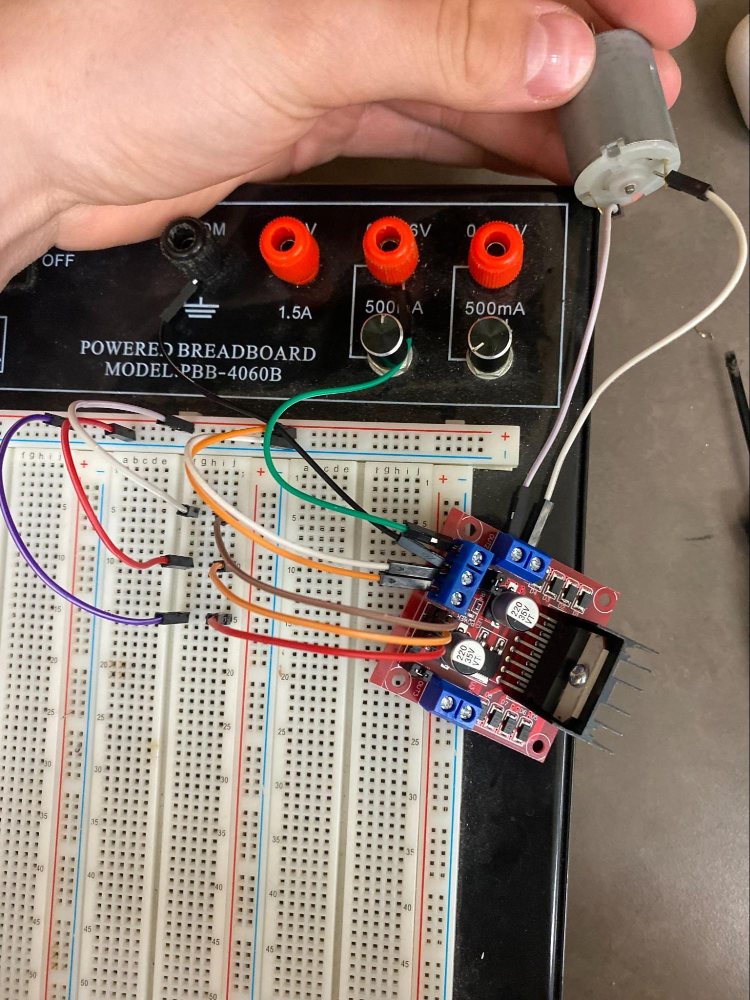
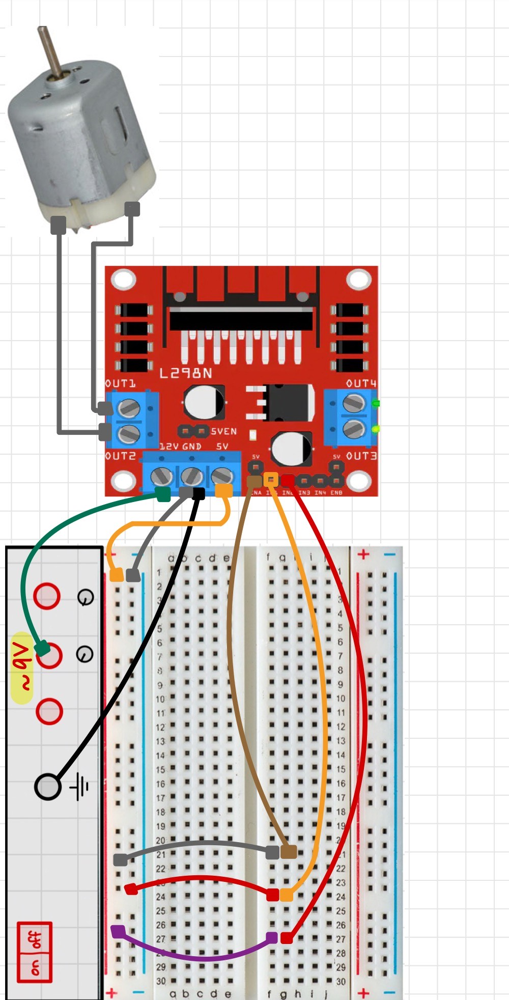
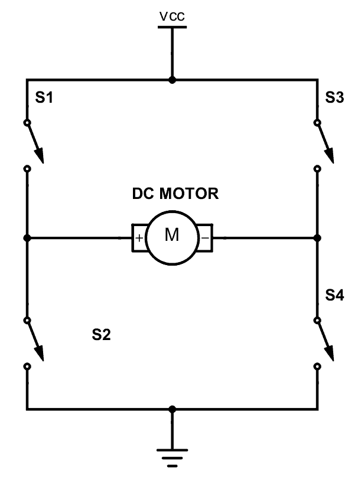
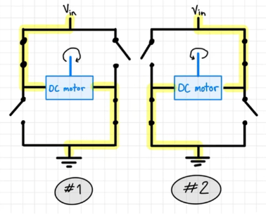
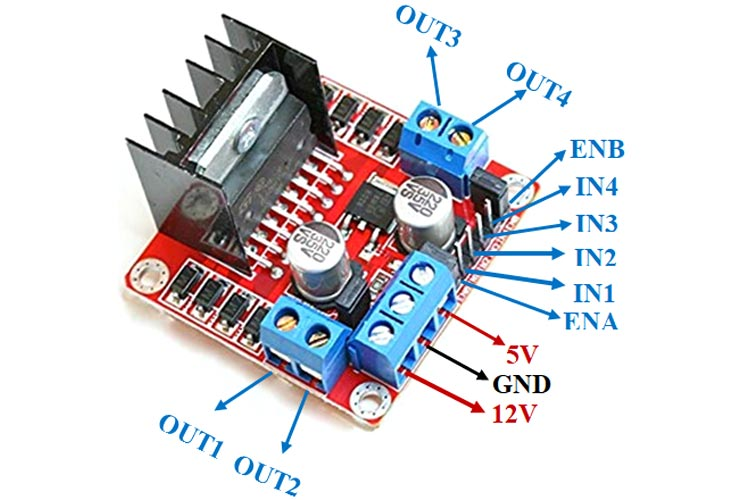
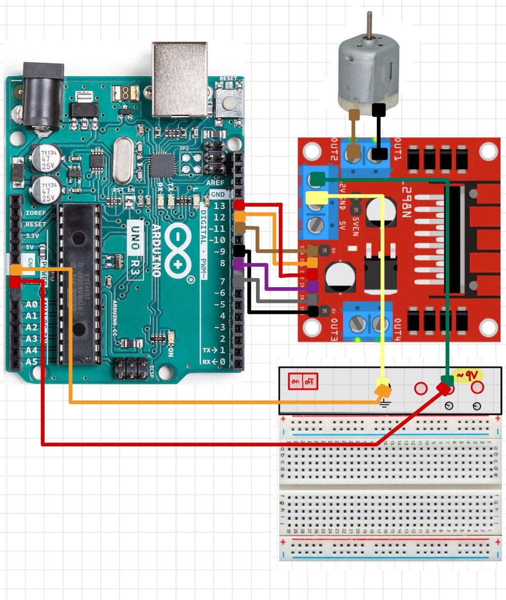
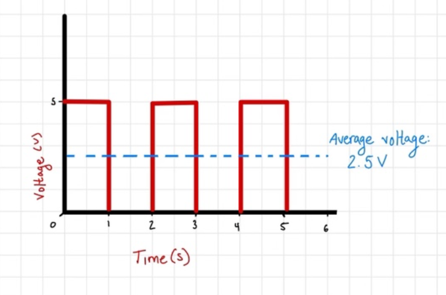

Electrical Setup
================

The first step to configuring the electrical components of a RC car is to understand how to use a breadboard. If you are unfamiliar with how to use a breadboard see :ref:`How to Use a Breadboard`

To gain the best understanding of this section of the report, the circuit starts as simple as possible. Once the circuit works as intended, another component is added and explained until the circuit is complete.

The first circuit is as follows:

This circuit is essentially just supplying power directly to the DC motor with the amount of voltage specified on the powered breadboard. This setup is almost identical to the example “LED circuit” in the :ref:`How to Use a Breadboard` tutorial. This motor will eventually be connected to the wheels and will drive our car around.

Test this circuit by turning on the breadboard and seeing if the motor turns.

Next, the L298N motor driver is added.

A motor driver is impactful to a RC car as it allows us to control the direction and speed of the motors without having to sacrifice power. The L298N has the ability to switch the direction of current flow using a H-bridge circuit. The switch in current flow reverses the polarity of the motor and therefore causes it to spin in the opposite direction. This makes the motors be able to go forwards and reverse. For an in-depth explanation of a H-bridge circuit follow this link: https://components101.com/articles/what-is-motor-driver-h-bridge-topology-and-direction-control

A H-bridge circuit is demonstrated in the diagrams below.

The motor driver also acts as a high voltage distributor. Ideally, we want to supply as much voltage as possible to our DC motors to maximize power, whilst still having control of the car. But because the microcontroller we are using, the Arduino Uno, is only capable of supplying a voltage of 5V through the outputs,we would need to find a solution to not sacrifice power. By using the L298N as a medium between the Arduino Uno and the 2 DC motors we can get the best of both worlds. The motor driver can directly supply a voltage of up to 12V to a maximum of 2 motors (this is called the drive voltage) while simultaneously taking data commands from the Arduino Uno, or in this circuit, voltage commands from the breadboard. These commands come through L298N connections ENA, IN1, IN2, IN3, IN4, and ENB as seen below:

* Outputs 1 and 2 connect to motor 1 and take information from ENA, IN1, and IN2. 
* Outputs 3 and 4 connect the second motor and take information from ENB, IN 3, and IN 4. 

The IN (Input) ports and EN (Enabler) ports are currently connected to the breadboard but will eventually connect to the Arduino Uno. The input connections can be either positive or negative/high or low and correlates to the H-bridge circuit which determines the direction the motor spins. The enabler connections are able to use Pulse-Width Modulation (PWM) to control the speed of each motor, which will be discussed more later.

**In order to access the enabler ports you must carefully remove the capping over them** 

**Note** : The L298N has the ability to regulate its supply voltage down to an output voltage of 5V (known as the logical voltage). This feature is used to power the breadboard in this circuit so that a separate power source is not required. 

Test this circuit by turning on the breadboard to see if the motor turns. Then, switch the polarity of IN1 and IN2 and see if the motor spins the opposite way. Polarity can be switched by changing the purple wire to negative and red wire to positive. That is, current flows from the negative terminal (purple) to the positive terminal (red). 

Now that we’ve validated that the motor driver is working as intended, we can connect the Arduino Uno microcontroller.

An Arduino UNO is a microcontroller; which is essentially a small computer able to perform specific tasks. With 14 input/output pins we are able to program the Arduino to do computations and give specific outputs. 

The Arduino requires a minimum of 6V to operate,  we cannot power the board using the regulated 5V from the L298N. Instead, we need to create a parallel circuit with the battery used to power the motors. Connect the pins to match the diagram above. It's important to note that the enabler pins on the L298N must be connected to the pins with the “~” symbol on the Arduino. The “~” symbol means that the pin is capable of performing PWM. 

**Pulse Width Modulation** is the simplest way to control the speed of DC motors. The more voltage supplied to a motor, the faster the motor will go; as long as the supplied voltage is within the range the motor is intended for. Oftentimes when the Arduino interacts with buttons or LED lights, the Arduino output pins either supply their maximum output voltage, or no voltage at all, turning on and off their subject. If this same concept is applied to DC motor control, the motors will either be at full speed or no speed. But, with pulse-width modulation, supplied voltage is sent at specific and controlled pulses so that the average voltage can output the desired speed. 

For example, if the desired speed required 2.5 V of power and the circuit was only capable of supplying 5 V, a 2 seconds interval could have a 5V pulse for one second and a 0 V pulse for another second, therefore, averaging 2.5 V. A visual representation of a voltmeter reading PWM pin might look something like this.

In real life application these intervals would change at much faster speeds but luckily PWM pins have built in timers so that they can automatically determine the correct intervals, and output the correct speed. The width of these voltage pulses used in PWM is called the Duty Cycle and is directly proportional to the average voltage and overall speed. The longer the Duty Cycle, the faster the motor will run. For further understanding of pulse-width modulation visit: https://howtomechatronics.com/tutorials/arduino/arduino-dc-motor-control-tutorial-l298n-pwm-h-bridge/ 

Once your circuit is the same as the diagram above we will move into developing a series of codes that start simple in order to test our circuitry but then continuously get added features until we have full control of the DC motors using this circuit!

