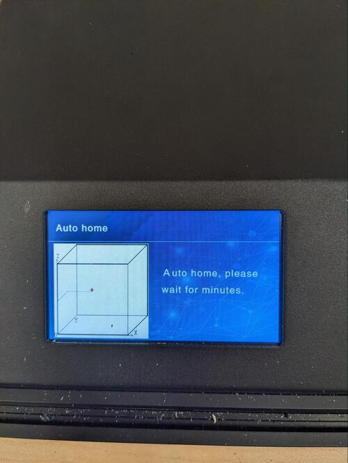

Ender 5 Leveling Guide 

To begin leveling the Ender 5 Plus, navigate to the leveling menu using the touch screen on the bottom of the printer. Let the printer auto home once the leveling button is clicked; this will only take a minute or so. 

The initial Z-offset must first be determined. This can be done by using a piece of paper or any similar thin sheet.

Place the paper beneath the nozzle and use the Z+ and Z- buttons to align the nozzle slightly above the bed. There should be a small amount of resistance when moving the paper below the nozzle.

If the paper cannot move at all, the bed must be lowered. If the paper can move freely, the bed must be lifted up. 

Once the nozzle is aligned, hit the Z-Home button to set the distance between the bed and the nozzle. This can be done multiple times.

Once the Z-offset is set. You can begin auxiliary leveling by hitting the AUX Leveling button.

Using the same paper method above, select a corner and use the tuning knobs below the bed to align the nozzle above the bed.

This AUX Leveling process may need to be completed multiple times. Once this is completed try using the paper method once more in the center of the bed to ensure it is level.

