Foam Wire Cutter CNC
====================

Introduction
------------
CNC machining (or computer numerical control machining has many applications within the field of engineering . A CNC machine typically follows instructions called g-code or m-code. These instructions are created by CAD (computer aided design) or CAM (computer aided manufacturing) software.

.. figure:: ../_static/images/fcnc/FC1.jpg
    :figwidth: 600px
    :target: ../_static/images/fcnc/FC1.jpg

The machine that will be discussed in this tutorial is a four-axis hot wire foam cutter CNC that is located in EN 1020 on the first floor of the engineering building. This system consists of two horizontal rail systems housing two motors each. One is responsible for the horizontal motion while the other is responsible for the vertical motion. A DC power supply is connected using alligator clips to the wire. The wire is then heated by the electricity and can glide through foam effortlessly.

The machine has a control software powered by an arduino mega. devFoam Pro2. devFoam uses a built-in drawing tool or can create cuts based on image files in a DXF format.

A foam CNC be used to create airfoils for airplanes, hulls for boats, plugs for molds or anything that requires smooth cleanly cut curvature. This tutorial will cover how to create a small boat hull from transverse uniform cross sections. This is a fairly universal approach and can be scaled or modified to manufacturing needs. 

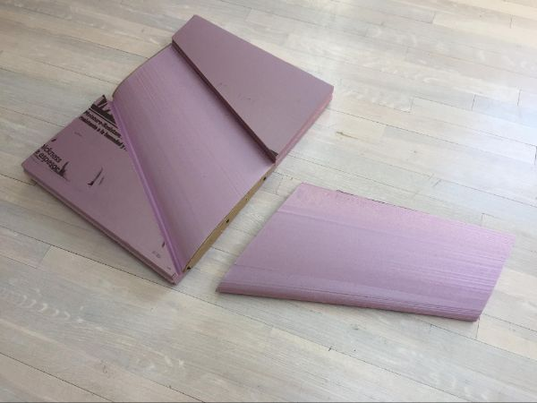

Safety
------
The hot wire foam CNC uses an extremely hot wire to cut foam. For this reason you must be  cautious while the power supply is on. 

It is always best to perform a dry run (run the machine with the power supply OFF) before engaging the power supply. This will make sure the cut will work before the wire is hot and any foam is cut.

Do not wear loose jewelry, loose clothing and keep long hair tied up when using the machine. 

When PLACING or MOVING foam near the cutter ensure that the power supply is OFF. 

Sometimes a cut must be made within the foam block. The wire must be hot before entering the foam. To ensure your cut starts correctly, orient the foam against the wire before heating the system. 

The wire must sit in the foam with no resistance, like below. If you feel a slight tug on the foam, let the wire move to its original position.
The wire only takes a maximum of 30 seconds to heat up. The wire will be hot enough when you start to see smoke rise from it. If it is taking longer than 30 seconds, reset the power supply. 

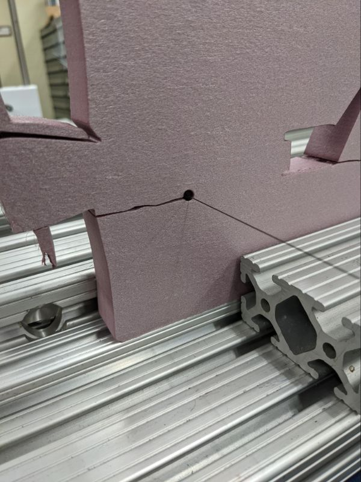

DXF File Creation
-----------------
To use the foam cutter, there needs to be something to cut! Devfoam will read DXF files; A DXF is a drawing interchange format and a type of vector file. The foam cutter needs a 2D image to cut into the foam. The third dimension is the thickness of the foam being cut. 

In order to create a DXF file you will need CAD software. For this tutorial, Rhino3D was used due to its availability on the MUN computers. Other alternatives included on the MUN network include Solidworks, AutoCAD, Inventor and Fusion360. These programs can be used in EN 3000, the computer lab on the 3rd floor of the engineering building.

Rhino
-----
Start by launching Rhino.  If the file is an STL or .3dm it can be dragged and dropped into Rhino. If the file is a step file or configured for another CAD program use the import function in the top left.

When starting Rhino you will be prompted for your units. Choose Small objects millimeters as a small object is supposedly for an object the size of a truck or smaller!

 .. figure:: ../_static/images/fcnc/FC6.jpg
    :figwidth: 600px
    :target: ../_static/images/fcnc/FC6.jpg

Rhino’s features can be selected through various menus and tabs. The command line can be utilized by typing the name of the command in the command line and hitting enter.. Of course the name of the command must be known first. 

For the purposes of this tutorial the following commands are used and explained in the following table.

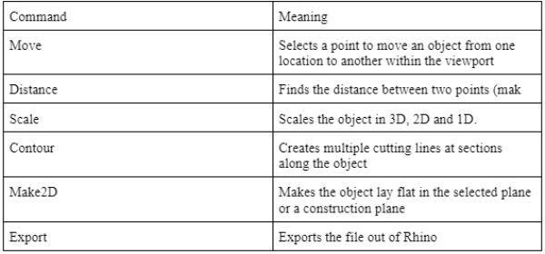

To import a file, drag and drop it into the Rhino viewport. You can also use the import function in the file tab. 

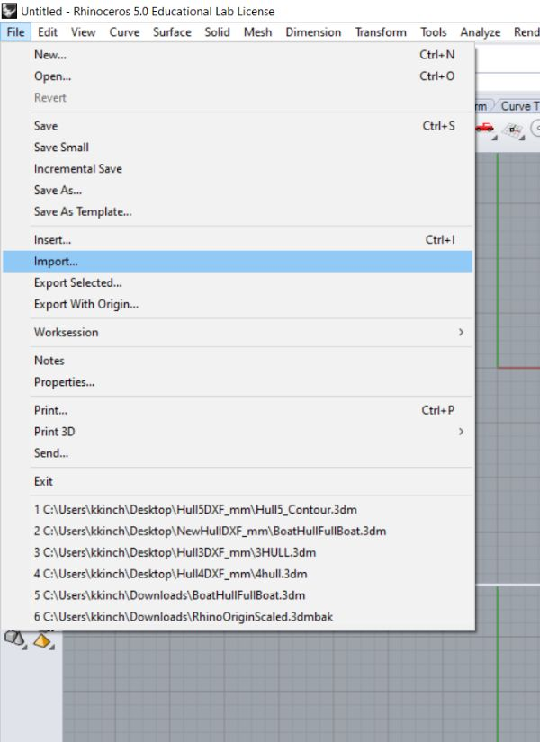

devFoam requires the units to be in millimeters, you can select this from the properties at the top of the window if millimeters were not selected when launching Rhino. 

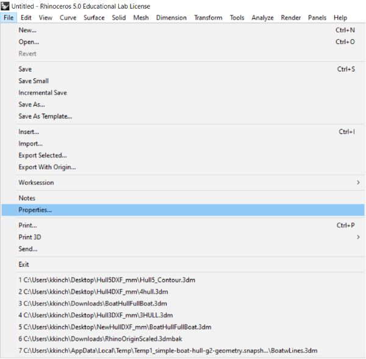

Once properties are selected navigate to the unit tab and change the units to millimeters. 

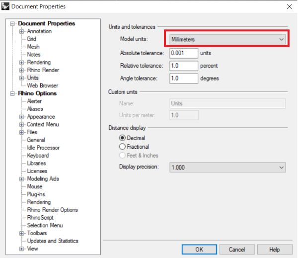

Before attempting the cross sections it is best to enable some settings to make Rhino easier to use. At the bottom of the window there are options for snapping to certain points. Checkmark the settings that are enabled below as well as the “Grid snap” and “Osnap” options. 

Osnap or object snap will allow the cursor to snap to various points on an object. Like the end of a line, the middle of a circle, etc…

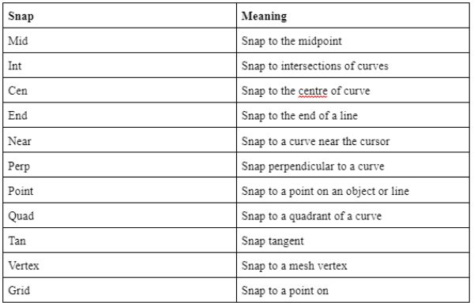

Now using the type the move command into the command line and select the entire object and align it to an axis. Holding shift while an object is selected will snap that object to the nearest snap setting. Bring the object near an axis and hold shift. This should align the object. 

The move command will prompt you to select one point on the object to move from and the object will drag with your cursor until you place the object. It is also best practice to move one end point of the model to the origin but this is not 100% necessary. 

The grayed out boat is the original position while the yellow is the new position. The black line is the distance the selected point moved.

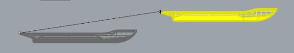

It is important to have an idea of how large the actual part will be. For example, each section for the hull in this tutorial will be one inch because the thickness of the foam being cut is one inch. 

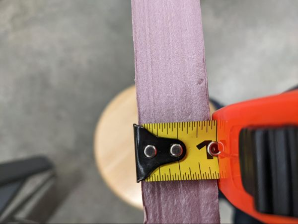

The hull will end up being 14 inches or 355.6 mm so there will be about 13 section lines. 

The part should be as close to 1:1 scaling as possible. Meaning that the dimensions in Rhino should line up with the dimensions in real life. If this is not possible, make the dimensions as accurate as you can and make note of them. There is a scale factor in the devFoam CNC software that can be used to adjust the part to the right size. Simply divide the measured Rhino dimensions by the desired dimensions and your scale factor will be solved for!

The part can be measured in rhino by using the distance command and selecting the endpoints of the part. It can be scaled in one, two or three directions. Scaling in three directions scales the entire object while scaling in one and two directions can be good to make slight adjustments to a dimension. 

.. figure:: ../_static/images/fcnc/FC16.jpg
    :figwidth: 600px
    :target: ../_static/images/fcnc/FC16.jpg

The hull was originally dimensioned in inches. This is no issue as the conversion is simple. 15.33 inches is approximately 389.5 mm. Now that the object has been aligned and scaled the cross section profiles can be obtained. This will be done with the contour command. First select a starting point, which will be the start point/endpoint on the model. 

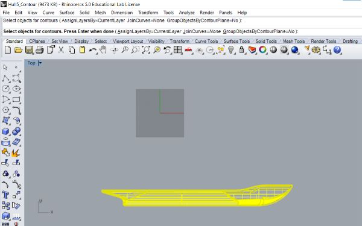

Then select a perpendicular direction, this will usually be along the axis of the object.

A distance between each section must be selected.  Knowing the overall length of the model will help make the section distancing a matter of simple math. 389.5 mm/15 = 25.966 mm. So the distance between each section will be roughly an inch. It’s generally advised to have at least 13-16 section lines in order to capture the curvature of the object. More section lines will mean more detail but more cutting and construction. 

After contouring, left click and drag the profile that was just created away from the model. This should look like the profile of the object that was just contoured. Each one of these section lines must be converted into a DXF.

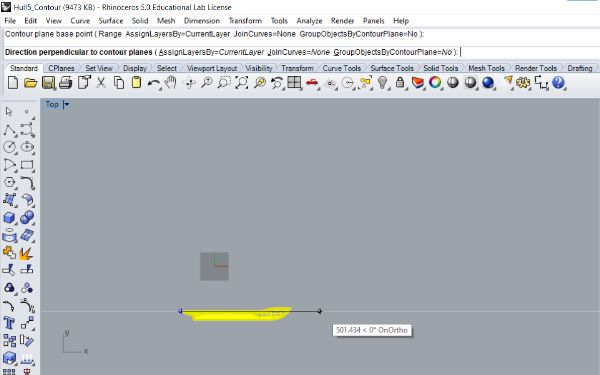

The Make2D function is very useful here. Select the first section profile and use the command Make2D and hit enter. A small menu should appear. Select the current view and hit OK. Then delete the highlighted line that was just created. This setting will ensure that the desired profile can be obtained.

Type Make2D in the command line but do not hit enter. Now right click the view port that has a front facing view of the ship’s profile, it should look like a jumble of U’s or V’s. The front facing view for this hull happens to be the right view due to the hull’s rotation. 

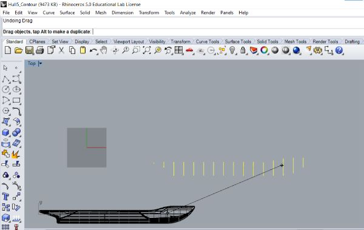

This will lay the section line flat in the view in which the profile actually lies, in this example it is the top plane. 

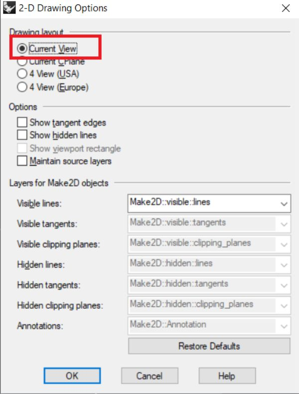

Then use the Make2D function again and right click on the viewport that has a view of the profiles from a front perspective, usually this will be the front viewport. After right clicking the profile of that section will appear. 

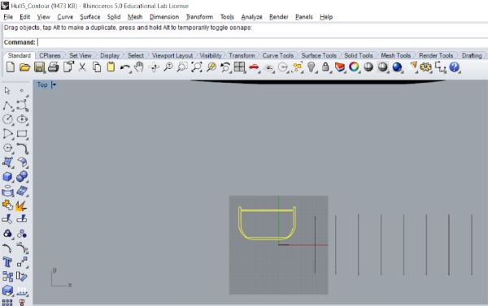

It is already selected, so use the “export” command to export the selected profile. Select where the file will be saved and make sure to save it as a DXF.

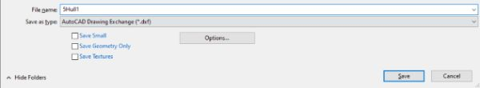

The DXF file for one section has been created! Now the process must be repeated for each section. Highlight each section, make it 2D with the Make2D command and export. Make sure to check within Rhino or another CAD that each profile worked. 

Setting up the Foam Cutter CNC
------------------------------
The foam cutter can be found in EN-1020 on the first floor of the engineering building. It is on a system of steel rails near the door closest to the end of the hallway. 

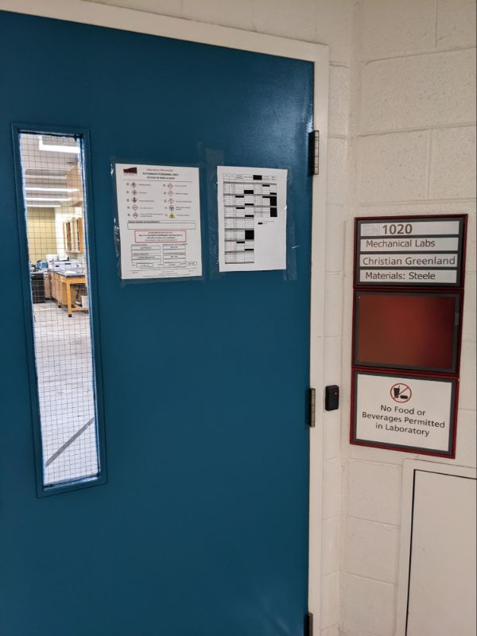
    
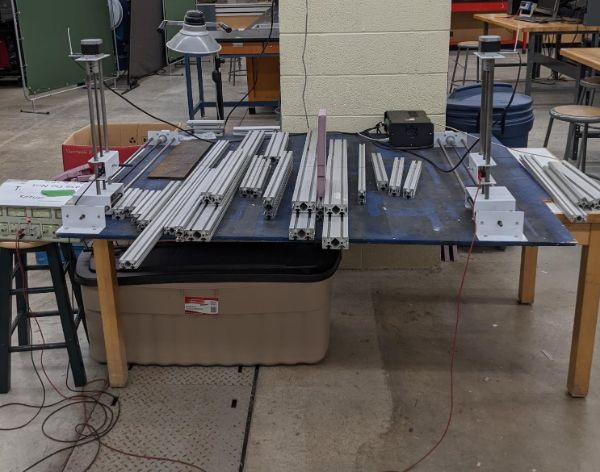

There is a PC on the table next to it with “Foam Cutter PC” written on top. This has the Devfoam Pro 2 software needed to run the machine. Make sure to download the DXF files needed on this PC. 

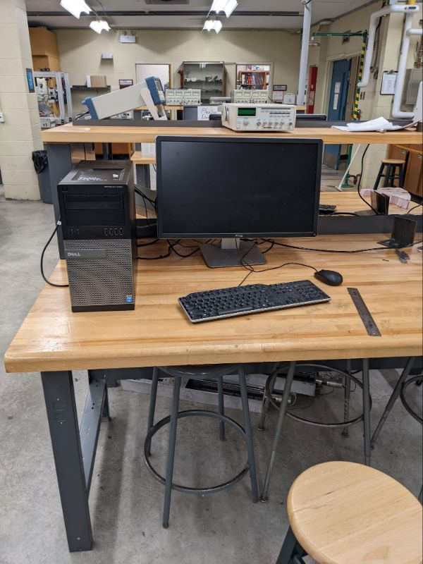

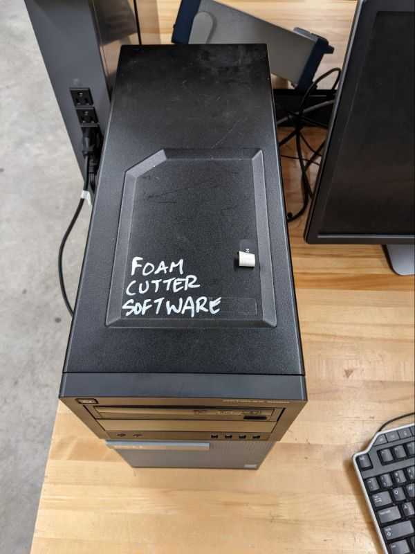

The small black box on the table has the control board for the machine. This will need to be powered on and the gray USB must be connected from the box to the PC. The power cord is located on the back of the box. 

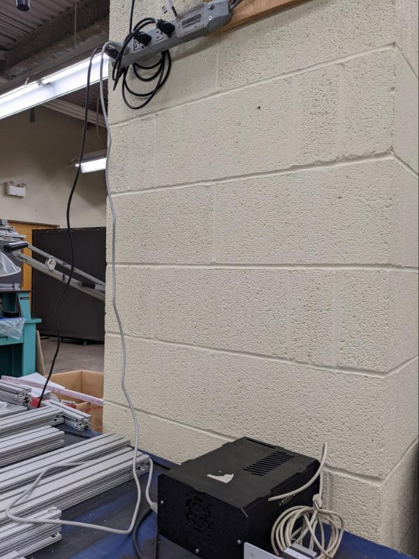

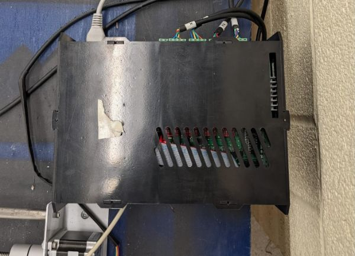

There is a large amount of rails on the table, these will be used to support the foam in the cutting position. Some rails are thinner than others and can be placed below or next to the foam to prevent it from moving during the cut. Always make sure to check how stable the foam is before cutting. Just push gently on the foam near the supports and the top of the block to see if there is any movement. If not, the foam is supported. 

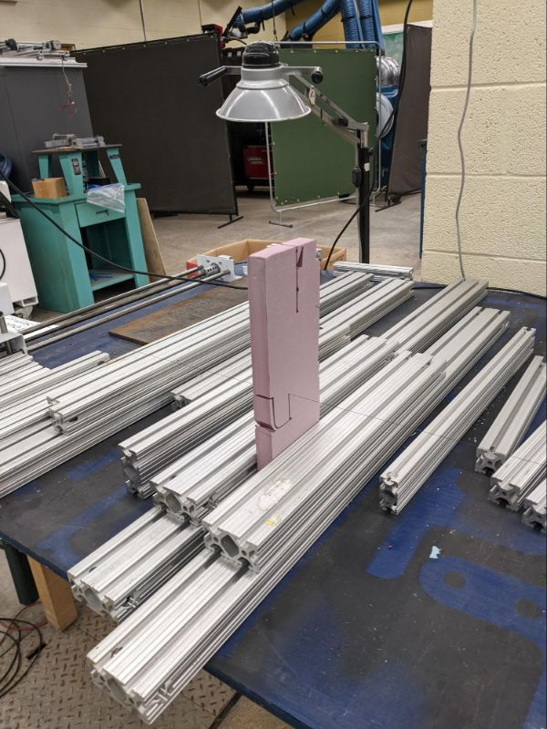

Always ensure the wire has enough clearance as to not make contact with steel rails. This could damage the machine and ruin the cut. Generally an inch of clearance will suffice. 

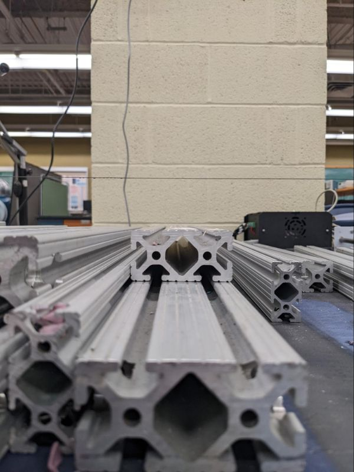

Finally, the power supply must be plugged in and the small gator clips must be connected to the nuts attached to the wire. Connect them like they are connected in the images below. The black is on the left and the red on the right. 

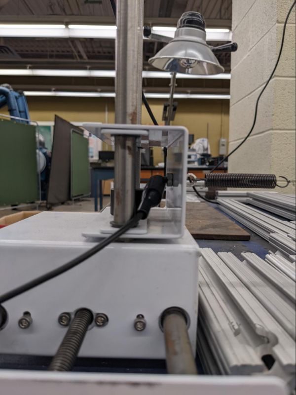

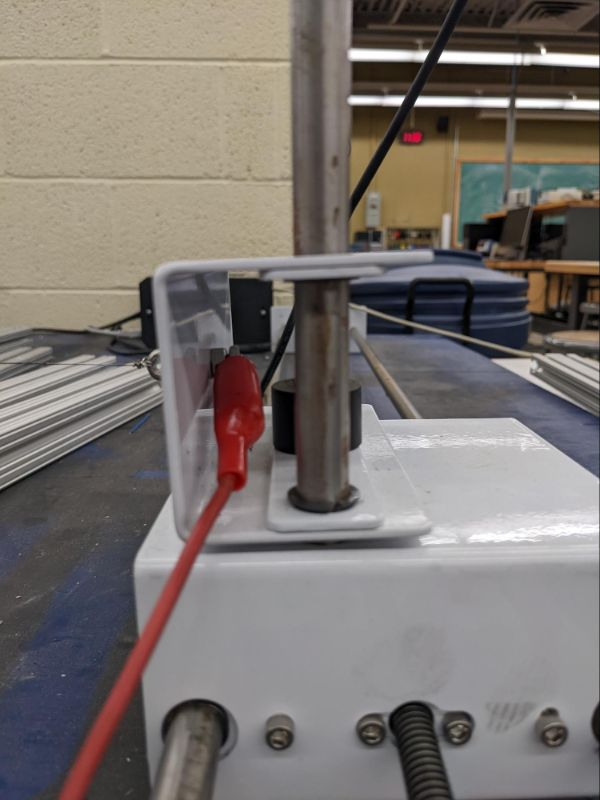

.. figure:: ../_static/images/fcnc/FC35.jpg
    :figwidth: 600px
    :target: ../_static/images/fcnc/FC35.jpg

Lastly, there is a DC power supply on a small stool next to the foam CNC. Ensure the power supply is off by checking for the led lights; if no lights are on then the POWER SUPPLY is OFF.  After connecting the alligator clips and plugging them into the DC power supply it is time to prepare the DXF files for cutting. 

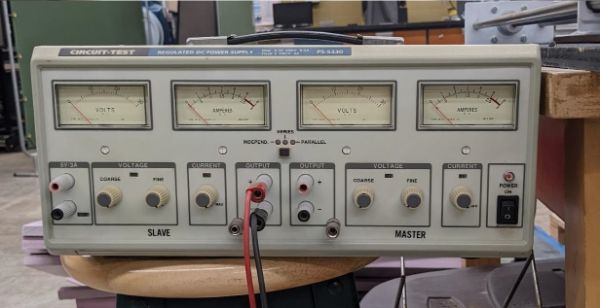

The power supply should already be set up and ready for use. The settings should be unchanged. If not, the current and voltage should be set to max. 

Devfoam
-------
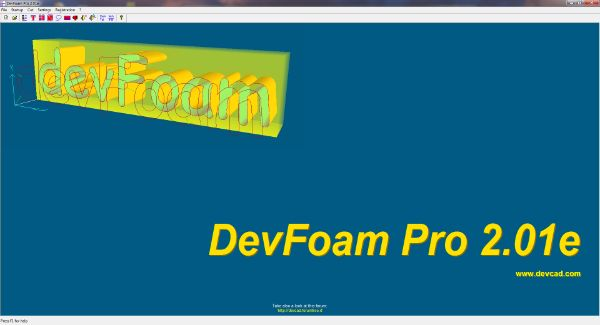

devFoam Pro 2 will be used to convert the 2D DXF files into g.code for the CNC machine. The shortcut will be located on the desktop of the foam cutter PC.

Start by opening the devFoam Pro 2 software on the PC next to the foam cutter. There are several other devFoam versions but Pro 2 will be used as it is the latest. The startup prompt will appear in the window. Select the “cut parts” option and find the first file.

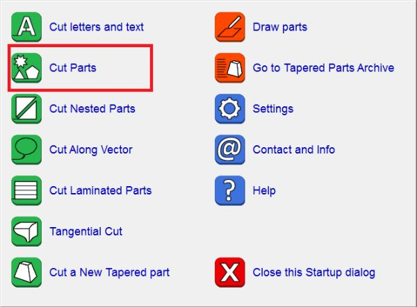

After selecting the first file the entire sketch should be selected in red.. Click the “Create cut”  button, this should create a cut like the one below. 

.. figure:: ../_static/images/fcnc/FC39.jpg
    :figwidth: 600px
    :target: ../_static/images/fcnc/FC39.jpg

Once the cut menu has been opened some settings must be checked to ensure the machine runs properly. It’s important to check that the motors are set to the proper directions. This can be done by selecting the “customize 4-axis g-code” button.

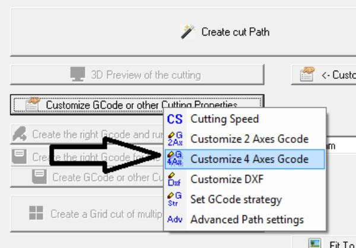

The motor on the horizontal-right and vertical-right axes should be A and Z respectively. The left will use X and Y. 

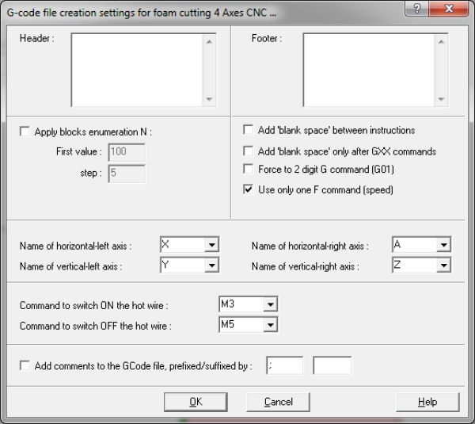

In the “create cut” menu there will be a scaling factor option. The default is 1.00 but can be changed if the part needs to be scaled up or down. 

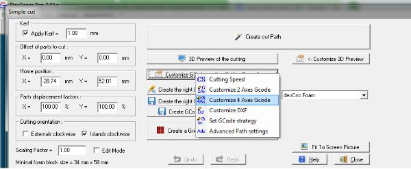

The cut can also be edited by ticking the “Edit Mode” box near the scaling factor at the bottom of the options. Edit mode enables the position the wire enters and exits the foam to be modified. The blue boxes indicate entry and exit paths while the small green arrows display the direction of the cut. 

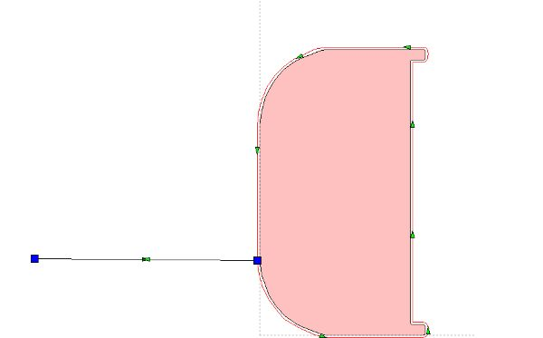

It is best to have the cut enter and exit the same position to minimize the amount of foam cut. The enter/exit path should be near the top of the cut so the newly cut foam does not fall into the wire due to gravity, reducing the precision of the cut. 

The cutting speed can also be changed by selecting the “Customize G-code or other Cutting Properties” button. The default is 200.00 mm/s. It is generally not advised to go slower than this as the foam could melt rather than cut. This speed can be increased; check the texture of the foam after cutting. If the foam has variations or waves in it then the speed is too high. 

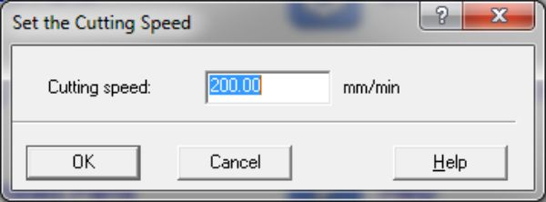

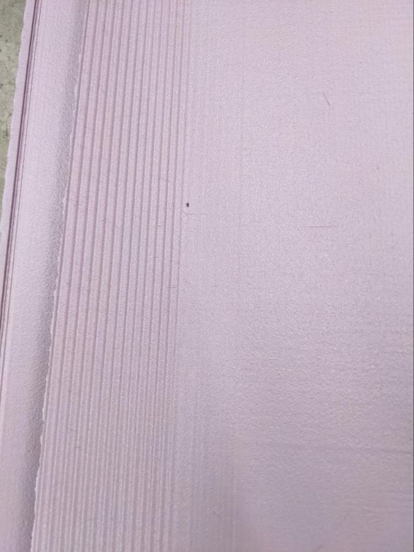

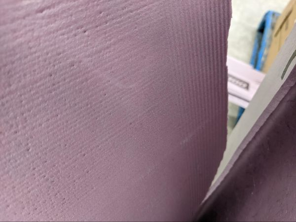

Cut Preview
-----------
Once the cut path has been created select “the “create the right g.code sel. Application” and select “devCnc Foam” this will open up the control and preview window. 

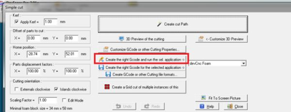

It is essential to select the “go to origin” option before starting a cut. This will home the machine at the origin. Then align the foam from the origin. 

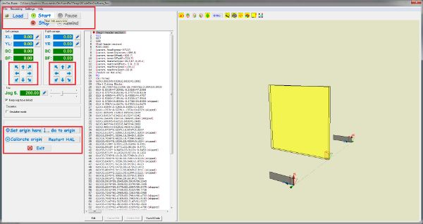

BEFORE STARTING ANY CUT. Perform a dry run before making any cut to ensure the cut will be performed successfully. Review the safety section once again before cutting.

This window can control the motion of the machine. The left and right set of arrows will move their respective motors in that direction. Allowing the motion of the machine to be tested and the wire to be aligned as per the requirement of the cut. 

It is best to begin a cut from the origin as the wire can be reset to the origin quickly with the “Go to Origin” button. From the origin the wire can be moved to another location to start a cut if desired. The wire can be moved using the sets of arrows.

The g-code window describes the instructions given to run the machine.

The start, pause and stop buttons are all self explanatory. The cut must be STOPPED in order to EXIT this window. 

The foam block size can also be changed to represent the piece of foam being cut, leading to a more accurate representation of the cut. This can be done in the settings tab of the cut preview menu.

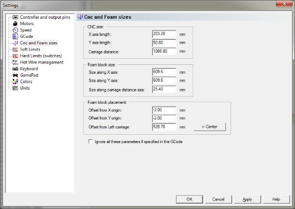

The foam block size was changed to two feet by two feet (609.6 mm is 24 inches) and the size along the carriage was set to one inch to accurately represent the foam block. The wire only takes a maximum of 30 seconds to heat up. The wire will be hot enough when you start to see smoke rise from it. If it is taking longer than 30 seconds, reset the power supply. 

The wire only takes a maximum of 30 seconds to heat up. The wire will be hot enough when you start to see smoke rise from it. If it is taking longer than 30 seconds, reset the power supply. 

Once ready to begin your cut, hit the start button and watch the CNC do its thing. 

After a section has been cut, remove the wire from the foam, turn off the power supply and slide the section out. Labeling each piece is a good idea to keep organized but with a relatively small hull it should be okay to just align them.

Rinse and repeat for each section of the model! Once complete the pieces should start to take shape. Now alignment and post processing can begin to prepare the part for the mold making/ composite process.

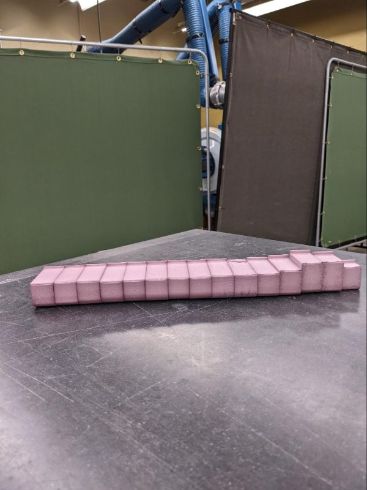

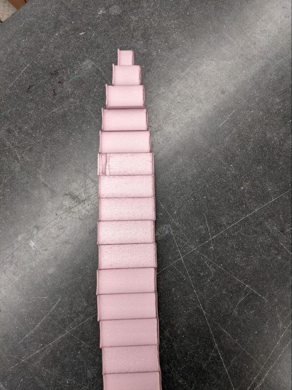

The model will generally be the shape of the vessel but will require some or lots of sanding, depending on the complexity of the shape. 

Cutting Best Practices
----------------------
It is best to have the cut enter and exit the same position to minimize the amount of foam cut. The enter/exit path should be near the top of the cut so the newly cut foam does not fall into the wire due to gravity, reducing the precision of the cut. 

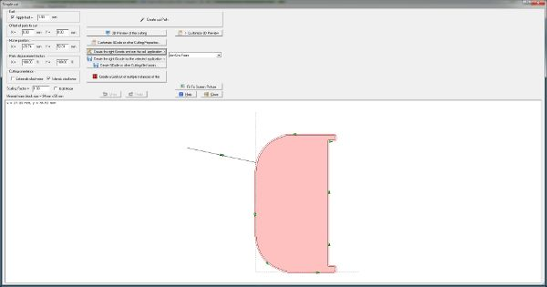

 This is an example of a good cut. The entry and exit are in the same places, near the top of the cut.

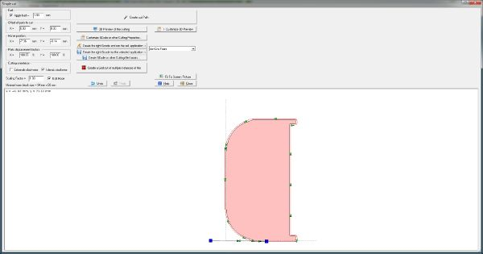

This is an example of a bad cut. The entry and exit are in the same place but they are at the bottom of the cut, meaning the cutout foam will just fall into the wire.

Multiple cuts will need to be made, so it is important to make an efficient use of space. Try to make cuts as close to one another as possible to minimize wastage. 

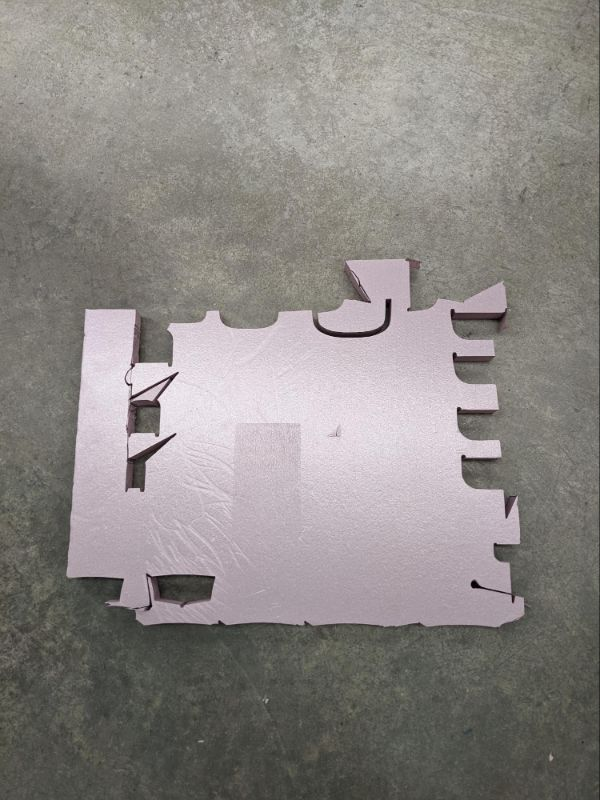

Some trial and error must be done establishing a good place to place the wire and start a cut. Try changing the direction of the entry and exit path as well as the position of the foam at the origin. Generally it is best to start in one corner and make cuts with a small space between them along one side of the foam.

Be careful when cutting into a board with multiple cuts, it is possible to cut the support to the upper part of the foam board and have a large chunk of foam fall into the wire. 

Make sure the foam board is tightly supported by the metal rails. Create a slot for the board to lay in. If not the board can lean to one side or another, leading to sloped cuts. 

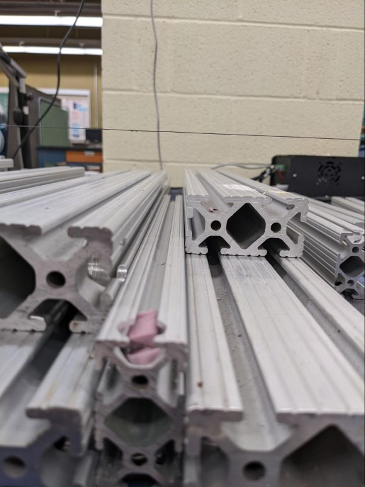

