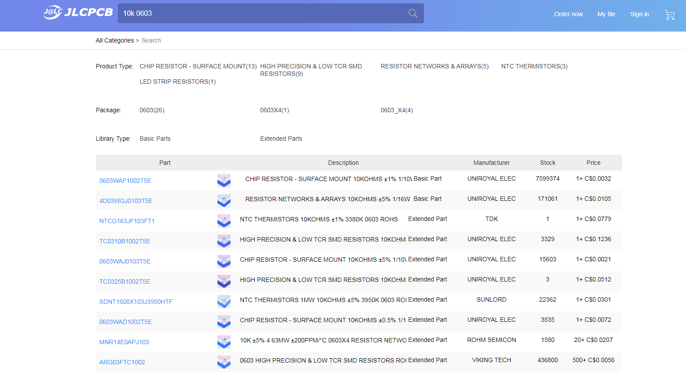
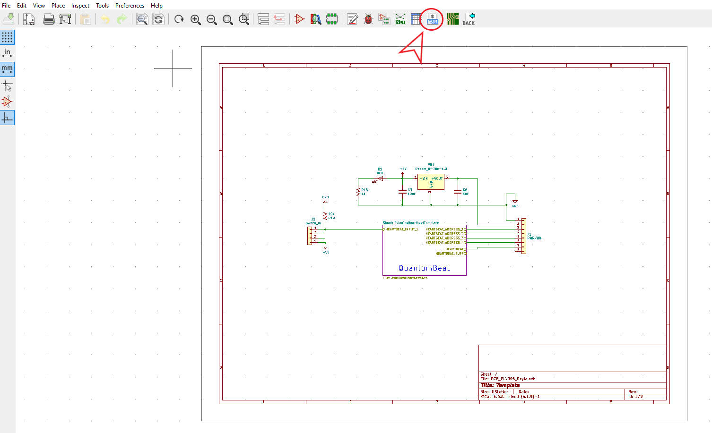
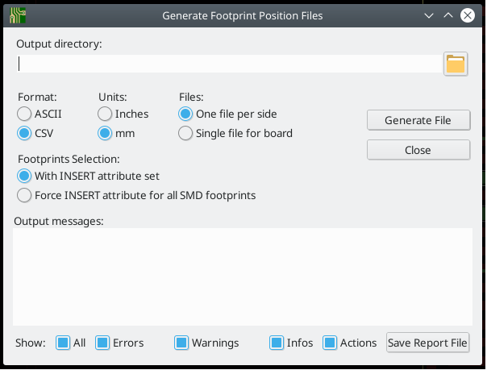

Generating BOM and CPL for JLCPCB SMT assembly in KiCAD
=======================================================

Here is a detailed video of how to place an order for SMT assembly with KiCAD.

.. raw:: html

   <iframe width="560" height="315" src="https://www.youtube.com/embed/VejO8rDdhzo" frameborder="0" allow="accelerometer; autoplay; clipboard-write; encrypted-media; gyroscope; picture-in-picture" allowfullscreen></iframe>

Below you will find a summary of this video:

Adding LCSC to Symbol Properties
^^^^^^^^^^^^^^^^^^^^^^^^^^^^^^^^

First start by opening your KiCAD project to the schematic viewer. Click on a component that you would like to include
in your BOM and you will see the follow:

Next, we need to add the **LCSC** number to the symbol properties. To find this, go to `JLCPCB parts library <https://jlcpcb.com/parts>`_ 
and search for your component. Here we are looking for a 10k resistor with the footprint propertie 0603:

Ensure that the component is in stock and select the one that fits what you are looking for. When you click on the component, you will
see some information regarding the component. You will need the **LCSC Part #**.

Now add a row titled "LCSC" and add the part #.

Repeat these steps for all the parts that you would like to have assembled.

Exporting Bill of Materials in JLCPCB Format
^^^^^^^^^^^^^^^^^^^^^^^^^^^^^^^^^^^^^^^^^^^^

Once you have the LCSC # added to every component go to this `this link <https://gist.github.com/arturo182/a8c4a4b96907cfccf616a1edb59d0389>`_ to
download it and then unpack it.

Next click on "Generate bill of materials" and add the BOM script to KiCAD. Click on "Add Plugin" and select the folder from the zip file that you just unpacked.
Then, in the command line change the "%O" to **"%O.csv"** and click generate. This will generate the BOM in the correct format for JLCPCB.

Generating CPL file
^^^^^^^^^^^^^^^^^^^

In the PCB editor, click on file -> Fabrication output -> Footprint position (.pos).

Export the file with the following settings.

Now, you must make the following changes to the file to be compliant with JLCPCB.

You must change the following cells:

* Ref to Designator
* PosX to Mid X
* PosY to Mid Y
* Rot to Rotation
* Side to Layer

This is what the file will look like when exported from KiCAD:

After modifying the cells:

