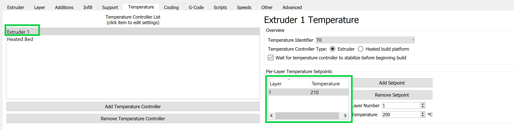

Generating the G-Code
=====================

Eryone ER-20
------------

.. figure:: ../_static/images/Eryone1.PNG
    :figwidth: 350px
    :target: ../_static/images/Eryone1.PNG

How to Use the Eryone ER-20 Printer
^^^^^^^^^^^^^^^^^^^^^^^^^^^^^^^^^^^

There are a few steps involved before printing with the Eryone ER-20 printer. The first is to
make sure your 3D model has been saved in STL format. Please review :ref:`STL Format` to learn how.

The next step is selecting a material to use in this print. The Eryone ER-20 supports 3 different materials:

* **Poly Latic Acid (PLA):** PLA filament is a biodegradable material that is easy to print due to its low heating requirements,
  however it does not possess a very high resilience to UV rays, its more suitable for parts used indoors and at around
  room temperature.

* **Polyethylene Terephthalate Glycol (PETG):** PETG is a more durable filament then PLA. It has good chemical resistance,
  flexibility, and impact resistance. As well as being good for clear prints, however this also means “post processing” such
  as sanding or removing supports can be much more difficult.

* **Thermoplastic Polyurethane (TPU):** TPU is a rubber like filament offering it flexibility and versatility, however it
  can be more of a challenge to print.

More information on each filament can be found `here <https://3dinsider.com/pros-and-cons-3d-printing-filaments/>`_

Once you have chosen a material, the next step is to upload your STL to a Slicer. In this case we will be using Simplify3D.

There are two guides to using Simplify3D: A quick guide for very easy and simple parts such as a chess piece and a detailed
guide for more complex parts and different materials.

Open up Simplify3D by double clicking the icon.

You should be brought to this page.

.. figure:: ../_static/images/Eryone3.PNG
    :figwidth: 700px
    :target: ../_static/images/Eryone3.PNG

If there is already an item(s) on the screen, please select the “Remove” button. Then click “Import”, this should bring you
to file explorer where you will open up your STL.

.. figure:: ../_static/images/Eryone4.GIF
    :figwidth: 700px
    :target: ../_static/images/Eryone4.GIF

Here is where you can view your model from different angles. By left clicking and dragging you can rotate around the model, by
right clicking and dragging you can change the point of rotation. The command bar on the right side of your screen is
also available for quick changes to different viewing planes, similar to *SOLIDWORKS*.

.. figure:: ../_static/images/Eryone5.PNG
    :figwidth: 500px
    :target: ../_static/images/Eryone5.PNG

This command bar also lets the user position, scale or rotate their model. You can also double click your model for
precise numerical changes and the ability to reset any changes.

.. figure:: ../_static/images/Eryone6.GIF
    :figwidth: 700px
    :target: ../_static/images/Eryone6.GIF

The center and arrange button will automatically fix the orientation of your part(s) and make them fit on the bed.

When arranging your part on the bed there is a few things to take into consideration. FDM printing is done by
layering melted thermoplastic on top of itself, building from the ground up. You can not print something in thin
air, there needs to be something to support it. Take a look at this bracket:

The first arrangement does not work because it requires plastic to be laid down in thin air. The second arrangement will
print however, you should also look at the largest **FLAT** surface of your model and print from there. This will
assure good bed adhesion and a better chance at a successful print. The third option with a large **FLAT** surface to
print from and no overhang is the best option for this model.

Once your part(s) are arranged on the bed, click “Edit Process Settings”. This window should appear:

.. figure:: ../_static/images/Eryone8.PNG
    :figwidth: 700px
    :target: ../_static/images/Eryone8.PNG

This is the command center of Simplify3D, everything happens in here. In this quick guide we will not be going through all
the settings but instead checking a few things to make sure everything is right before you print. If your model consists of
any of the following features, then you may want to consider the :ref:`Advanced Workflow`.

* Large Overhang (Support structures needed)
* Thin Walls
* Fine Details
* No Large Flat Surface to Start Print From
* Needs to be Especially Dense or Strong
* Multiple Colours or Materials
* Electronic Enclosure (Threaded Holes)
* Troubleshooting

See here an example sheet.
:download:`pdf <Advanced Guide pdf.pdf>`

Simple Parts Workflow
^^^^^^^^^^^^^^^^^^^^^

If your part is simple and does not fall under any of the above categories, then please follow the instructions below.

Once you select edit process settings this page should appear. Make sure everything in the green boxes match your
screen. “Coast at End” and “Wipe Nozzle” should not be checked.

.. figure:: ../_static/images/Eryone9.PNG
    :figwidth: 700px
    :target: ../_static/images/Eryone9.PNG

Now click the layer tab and check these settings:

Next the Additions Tab, only skirt/brim should be checked. Uncheck any other boxes if they are on.

Next is the infill tab. The offset boxes should rarely be touched but if it is not the same, use the add and remove angle
buttons to navigate the boxes.

.. figure:: ../_static/images/Eryone12.PNG
    :figwidth: 700px
    :target: ../_static/images/Eryone12.PNG

Nothing should be selected in the support tab.

For the Temperatures tab, each filament has it's own preferred settings. You will have to change the temperature of the extruder
and bed based on what brand of material you are using. these temperature settings are often found printed directly on the filament spool or can be searched up on google,
You can change the temperature by double clicking the number or by using the add and
remove button.

For list of common PLA temperatures please view sheet :download:`pdf <PLA Temp.pdf>`

Nothing should ever be touched in the G-Code tab, but just to be sure, check these settings:

.. figure:: ../_static/images/Eryone13.PNG
    :figwidth: 700px
    :target: ../_static/images/Eryone13.PNG

In the Scripts tab there are a few different windows. Layer Change, Retraction and Tool Change Scripts should all
be blank. The Starting and Ending Scripts should look like this.

.. figure:: ../_static/images/Eryone14.PNG
    :figwidth: 700px
    :target: ../_static/images/Eryone14.PNG

.. figure:: ../_static/images/Eryone15.PNG
    :figwidth: 700px
    :target: ../_static/images/Eryone15.PNG

Next is the Speeds tab.

.. figure:: ../_static/images/Eryone16.PNG
    :figwidth: 700px
    :target: ../_static/images/Eryone16.PNG

The Other tab. Filament Properties and Tool Change Retraction does not affect the print.

.. figure:: ../_static/images/Eryone17.PNG
    :figwidth: 700px
    :target: ../_static/images/Eryone17.PNG

*Bridging is subject to change*

And finally, the Advanced tab.

.. figure:: ../_static/images/Eryone18.PNG
    :figwidth: 700px
    :target: ../_static/images/Eryone18.PNG

These should all be the default settings under the “Eryone ER-20” profile however it is always good practice to check and make sure.

.. figure:: ../_static/images/Eryone19.PNG
    :figwidth: 600px
    :target: ../_static/images/Eryone19.PNG

Select the “OK” button, the window should close. Now click “Prepare to Print!”. You should be brought to this screen where
you can see how the model will be printed layer by layer.

.. figure:: ../_static/images/Eryone20.GIF
    :figwidth: 700px
    :target: ../_static/images/Eryone20.GIF

You can also view the different features that the print has.

For a simple print there is nothing needed to do here. In the top left corner Simplify3D estimates the build time
however, it is rarely accurate. A good practice is to add about 20% more time, but it may be more or less.

You now want to acquire the Micro SD card and plug it into the computer using the USB A adapter. Now click “Save
Toolpaths to Disk” and transfer the SD card to the printer (Via Left side hole).

To prepare your printer and begin printing click :ref:`Preparing Printer`

Eryone Quick Start Material Settings
^^^^^^^^^^^^^^^^^^^^^^^^^^^^^^^^^^^^
.. list-table:: 3D Printing Quick Start Settings
   :widths: 10 10 10 10 10 10 10 10 
   :header-rows: 1

   * - Material
     - Infill (%)
     - Layer Height (mm)
     - First Layer Speed (mm/s)
     - Speed (mm/s)
     - Retraction (mm)
     - Nozzle Temp. (F)
     - Bed Temp. (F)
   * - PLA
     - 20
     - 0.2
     - 30
     - 60
     - 5
     - 215
     - 55
   * - PETG
     - 20
     - 0.2
     - 20
     - 45
     - 5
     - 255
     - 85
   * - TPU
     - 20
     - 0.2
     - 15
     - 20
     - 6
     - 220
     - 60

Prusa i3 MK3S+
^^^^^^^^^^^^^^

There are a few steps involved before printing with the Eryone ER-20 printer. The first is to
make sure your 3D model has been saved in STL format. Please review :ref:`STL Format` to learn how.

Once you have your .STL format you will need to select the filament you will be using. Luckily, the Prusa printer supports 
almost all FDM based filaments with a standard 1.75 mm diameter.

In order to generate the G-code for this printer you need to run the Prusa specific slicer called PrusaSlicer and follow the instructions mentioned.
If you already have the PrusaSlicer installed, you can skip this step, just ensure the slicer does not need any updates. I fyou need to download the slicer, it can be
done directly off the official Prusa website. When installing be sure to select that you are downloading the slicer only for you to avoid administrator restrictions.

After finishing the installation process, PrusaSlicer needs to be configured to use the Prusa i3 MK3S with the MMU2S unit:

- From the side menu, click the settings button next to “Printer” drop-down menu.

  .. figure:: ../_static/images/prusa_settings_button.png
    :align: center

- Click “Add/Remove presets.” This will open a new window where all the Prusa 3D printer models are listed.

- Scroll to the “MK3 Family” section.

- Look for the “Original Prusa i3 MK3S & MK3S+ MMU2S” entry, and check the “0.4 mm nozzle” box under it.

  .. figure:: ../_static/images/prusa_select_mmu.png
    :align: center

- Click “Finish.”

Next, you want to bring your .STL file into the Pruse Slicer by going file>import and selecting the .STL file

Once your design is in the system the first thing you want to select is the filament you are using.

Do this by hitting the "Filament" box on the right hand side of the screen. Here you will see the presets of common filaments. If the filament you wish to use is not listed,
you can simply hit the "Filament settings" tab in the top left corner and maually set the nozzle and bed temperature as listed on your filament spool.

Navigate back to the Plater. If your design has any overhanging parts you will need the slicer to automatically generate supports for you. This is because melted plastic cannot float in thin air. Refer to the ref:`Modelling` section if you are unsure if supports are needed.
To enable automatically generated supports, select the "Supports" drop down box and hit "Everywhere".

Then, select the next box on the plater named "Infill". An objects infill is the density of the part. Regular 3D prints have 15% of their inner shaped filled with filament. Making 85% hollow. But, if you desire a more sturdy and strong print, increase the infill. For more information on infill see section: ref:`Infill Percentage`

The rest of the settings in Prusa Slicer are advanced settings that rarely need to be adjusted. But, if following this guide leaves you with unsatisfactory results refer to the ref:`Advanced Workflow` section or ask a DDPL employee in EN 1017.

Now you are ready to slice the .STL file. To do this press the slice now buttom in the bottom right corner. 

The Prusa Slicer will give you a cost and used filament estimate of your print and show how long each section of the print will take.

To finish up he slicer workflow hit export G-code and save it to a SD-card.

