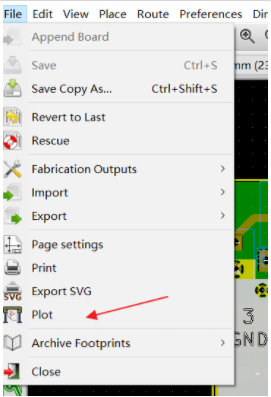
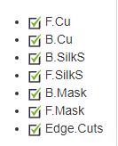

How To Generate gerber Files in KiCAD
=====================================

In the PCB view, select **File** then **Plot** from the menu to open the gerber generation tool.

In general, there are 8 layers that are required to have a PCB fabricated:

* Top Copper (F.Cu) + Soldermask (F.Mask) + Silkscreen (F.SilkS)
* Bottom Copper (B.Cu) + Soldermask (B.Mask) + Silkscreen (B.SilkS)
* Board Outline (Edge.Cuts)
* Drill File

In the plot window with the plot format set to Gerber, make sure these layers are selected:

If you are unsure which layers to select for your specific project and you plan on ordering from JLCPCB, then you can select all layers 
and JLCPCB will use the correct layers.

Now, click **Plot** to generate the gerber files for the layers and also click **Generate Drill File**.

.. figure:: ../_static/images/GERBER3.PNG
    :figwidth: 540px
    :target: ../_static/images/GERBER3.PNG

When in the Drill Files Generation window, check **Merge PTH and NPTH holes into one file**. Then click **Drill File** to generate the drill file.
Ensure the gerber files and the drill file are saved in the same location.

.. figure:: ../_static/images/GERBER4.PNG
    :figwidth: 540px
    :target: ../_static/images/GERBER4.PNG

If you would like to check the gerber files, you can use KiCAD's gerber viewer called "GerbView". You can open GerbView and see what your board looks like
before sending it to the manufacturer.

.. figure:: ../_static/images/GERBER5.PNG
    :figwidth: 500px
    :target: ../_static/images/GERBER5.PNG

For a more detailed tutoral, please see `this video <https://www.youtube.com/watch?v=4PnY2IUQ2Tg>`_.