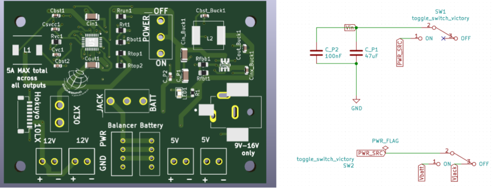
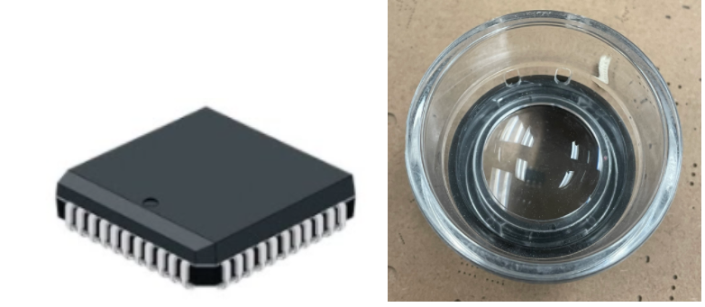
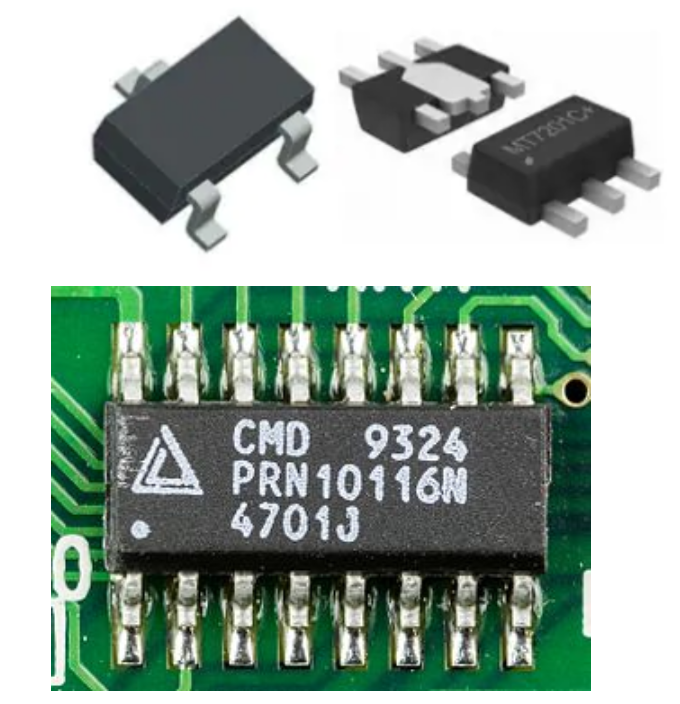

Getting Started with PCB Assembly
=================================

Assembling PCBs might be daunting at first but always remember that the assembly is reversible, soldering is not permanent. Here are a few tips to help you!

**What orientation should I place components in?**
^^^^^^^^^^^^^^^^^^^^^^^^^^^^^^^^^^^^^^^^^^^^^^^^^^

**Take note of components with polarities.** Resistors, ceramic capacitors (electrolytic capacitors do have a polarity) , and inductors do not have polarities, while LEDs and ICs have polarities i.e. ensure that the positive pin of the LED is connected to the positive pin on the board and vice versa for the negative pin. Read more `here <https://learn.sparkfun.com/tutorials/polarity/diode-and-led-polarity>`_

* For ICs, there are usually indentations on the component, like a notch or arrow that indicate pin 1. Ensure the notch is aligned with the annotation on the component’s outline on the board. Resistors can usually be soldered on any side but the side of the component’s body with text should not be soldered onto the board.

* For components like switches whose ON/OFF orientations are already indicated on the board, soldering should be in the correct orientations in line with the board’s annotations. You have to check that when you flip the switch’s actuator to the right, that it is switched off (think about your schematic and what pins need to be connected for the switch to be in the off position). For this particular board, pins 2 and 3 need to be connected to be switched off. The white line next to the OFF text indicates that pin 1 needs to be connected to that pin.

**What makes soldering easier?**
^^^^^^^^^^^^^^^^^^^^^^^^^^^^^^^^
*If you are new to soldering and are trying to select components, choose the bigger component that has pins. They are easier to solder by hand.

* When planning to solder SMD IC components by hand, select components that can be seen without a microscope and their pins are extended from the component body. Instead of components that have their pins as pads under the component body.This can be determined by looking up the component’s package. See :ref:`Digikey` where a component's package was discussed.

    
Do not use components like these when you have the intention of hand soldering them
    

    
Use components like these when hand soldering. For components like this you might need a microscope to solder them, the packages can be very small.
