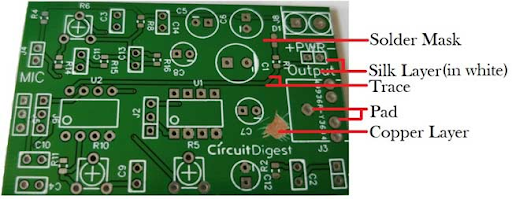
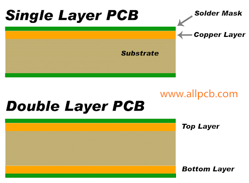
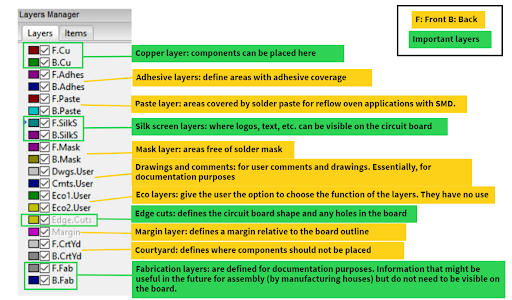

Getting Started with PCB Design
===============================

What is a PCB?
--------------
A printed circuit board (PCB) is a board with different materials stacked together.
The pads on the board, as seen below, are connected to the components and copper traces, which carry current around the board. 

Depending on the complexity of the circuit, the amount of materials stacked together on the PCB can be increased. On single layer PCBs, there are electrical connections on only one side of the board, double layer PCBs have electrical connections on both top and bottom, and more than 2 layer PCBs have electrical connections on top, bottom, and internal layers within the board of the PCB.

    A Simple PCB

The **substrate** is the solid core of the board, then other layers like the copper, soldermask, and silkscreen are glued to this substrate. 

    Single layer vs double layer PCB
    
The **copper layer/traces** electrically connect the components;
The **solder mask** gives the PCB the green coating that is seen and insulates the copper coating; 
The **silk layer** is where annotations go on i.e. letters and words. 

From the Single layer vs double layer PCB figure, the copper layer appears on both the top and bottom sides of the substrate for the double layer PCB and only on the top for the single layer PCB. This introduces how PCBs can be manufactured with multiple copper layers (from 1, 2, 4 … all the way to 16 copper layers for more complicated applications). 

PCB Layers
----------

In KiCAD, there are multiple layers for the PCB board.The most important layers are the **copper, silk screen, edge cuts, and fabrication layers**. For some layers, there exist a front and a back i.e. the front and back copper layers. These simply mean the corresponding layer can appear on both the top and bottom of the board, just like the copper layer in the Single layer vs double layer PCB figure.

     PCB Layers
 
PCB Design in KiCAD
-------------------
Designing a PCB in Kicad involves transferring your abstract idea of a circuit into a schematic to define the connectivity of the circuit board layout. The board layout then defines the dimensions of the board and how the components will be mounted onto the board using footprints. The process is summarized as:
 
 .. figure:: ../_static/images/pcb4.png
    :figwidth: 700px
    :target: ../_static/images/pcb4.png
    KiCAD Design Workflow
