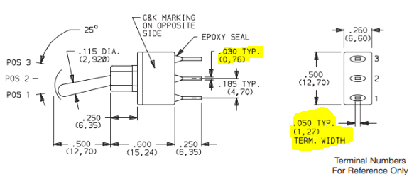

Going Beyond
============
.. |adfootprint| image:: ../_static/images/beyond11.png
   :width: 5%
   

   
.. |glines| image:: ../_static/images/Board9.PNG
   :width: 5%
   
.. |pin| image:: ../_static/images/beyond6.png
   :width: 3%
   

   
.. |footprint| image:: ../_static/images/beyond11.png
   :width: 5%
   
.. |gpolygon| image:: ../_static/images/board12.PNG
   :width: 5%
   

   

   
Custom Symbols in Symbol Editor
-------------------------------
Creating custom symbols is necessary when the symbols needed cannot be found in the kiCAD library. To do this, a datasheet for the component is needed. For this tutorial, let's use this `buck converter <https://www.digikey.ca/en/products/detail/texas-instruments/TPS565201DDCR/7732455?s=N4IgTCBcDa4JwDYC0AWOAGdyCMSByAIiALoC%2BQA>`_ as an example.

.. figure:: ../_static/images/beyond1.png
    :figwidth: 700px
    :target: ../_static/images/beyond1.png
Component Datasheet
    
1. **Create a new library to store the new symbol:** Click the symbol library editor icon |nsymbol| on the top toolbar of eeschema or the project page then select file >> new library. Save the library in your desired location then either select to save it on kiCAD as a global or a project specific symbol. Global symbols can be accessed from any KiCAD project, while project specific symbols can only be accessed from that particular project.

2. **Create new symbol:** Click the new symbol icon |nsymbol| on the top left corner. Select the library created in the previous step and then edit the symbol properties - the default reference designator and the symbol name are the settings that should be changed, leave the rest as default. The designator and the name both appear with the symbol.

.. figure:: ../_static/images/beyond3.PNG
    :figwidth: 700px
    :target: ../_static/images/beyond3.PNG
    
The default reference designator is used to identify the component in the schematic. KiCAD uses the reference designators to keep track of common components in your schematic, derailing from the standard reference designators can break your project. Do not guess the designator, use the reference designators standard IEEE 200-1975/ANSI Y32.16-1975 as seen below or by visiting `here <https://en.wikipedia.org/wiki/Reference_designator>`_:

.. figure:: ../_static/images/beyond4.png
    :figwidth: 700px
    :target: ../_static/images/beyond4.png

3. **Draw symbol outline:** Use the graphic polygon |gpolygon|  or lines |glines| tool to draw the outline of the symbol. Left click on the symbol outline to edit the properties. Select the fill background option to shade the outline of the symbol yellow.

4. **Modify pins:** Add pins to the symbol using the pin tool icon |pin| on the right toolbar, based on the pin configuration from the datasheet. The thing to remember here is that the convention is to group similar pins together and place the two power pins to the top left and bottom right of the rectangle. 

First of all, I/O means input/output. Based on the pin configuration on the datasheet, pin 1 is named the ground. Ground is a power output even though it is not noted as output ‘O’ in the datasheet. Pin 6 is named VBST and is an output. Power pins are usually put under the electrical type power input/output, while regular pins are either input/output in the pin properties.

.. figure:: ../_static/images/beyond8.PNG
    :figwidth: 700px
    :target: ../_static/images/beyond8.PNG

The positions of the pins do not matter and can be different from what is specified on the datasheet. The most important aspect of the symbol is the pin numbers and names. Do not mix up the names i.e. pin 1 must always be ground. Pin 2 cannot be ground, it must be SW.

Importing Symbols into KiCAD
----------------------------
Most component symbols can easily be found online from sites like `mouser <https://www.mouser.ca/>`_, `component search engine <https://componentsearchengine.com/>`_, or `snapeda <https://www.snapeda.com/>`_. After downloading it off the site, import it into Kicad by opening the symbol editor >> file >> import symbol. If you did not initially create a library, one is needed to store the symbol. Follow step 1 of :ref:`Custom Symbols in Symbol Editor` to do this.

Custom Footprints in Footprint Editor
-------------------------------------
Custom footprints are important if you can't find the specific component footprint online. It is also important to know how to create your own footprints as sometimes, footprints found online can be incorrect. Incorrect footprints ruin circuit boards by making the components impossible to mount and also impossible to function.

If your component is not one of the following standard body sizes or is not listed under a manufacturer on KiCAD, a custom footprint is needed.

KiCAD Standard Body Sizes

To do this, a datasheet for the component is needed. For this tutorial, let's use this `toggle switch <https://www.digikey.ca/en/products/detail/c-k/E101SYZQE/484035?s=N4IgTCBcDaKHAEBRAjABiQZQJoC0CKC4QBdAXyA>`_ as an example. 

1. **Create a new library to store the new symbol:** Click the footprint library editor icon |footprint|  on the top toolbar of the project page then select file >> new library. Save the library in your desired location then either select  to save it on kiCAD as a global or a project specific symbol. Global footprints can be accessed from any KiCAD project, while project specific footprints can only be accessed from that particular project.

2. **Create new footprint:** Click the new footprint icon |footprint| on the top left corner. 

3. **Get component datasheet:** This is an excerpt from the part’s datasheet. We will be working in millimeters (mm). As indicated in the datasheet, the dimensions in mm are in brackets and the ones outside the bracket are inches.

4. **Understand KiCAD coordinates:** KiCAD works in coordinates that are oriented as downwards being positive y and to the right being positive x. Creating an outline for the footprint requires that all dimensions from the datasheet be changed into coordinates. 

5. **Sketch footprint using body coordinates:** Always take the origin to be the middle of the body. Write down the body dimensions to determine the coordinates of the points where the body intersects.

6. **Improve the sketch with drill size, pad size, and hole coordinates:** The drill size is the where the component lead will be going through. Determine the drill size by adding an extra 0.25mm to the drill size indicated on the datasheet. The pad size is (2 x 0.38 mm) + drill size. Then determine all other coordinates.

The drill size for non-circular leads is essentially the longest dimension of the lead. The choice is between either 0.76 mm or 1.27 mm, of which 1.27 mm is the correct drill size. With the additional 0.25 mm, the drill size becomes 1.52 mm. 

The pad size is (2 x 0.38 mm) + 1.52 = 2.28 mm

    
Constrain the holes by adding the pitch of 4.7 mm to determine the hole coordinates. The pitch is the distance between two pins/drill holes.

7. **Input sketch into KiCAD:** Transfer the sketch to Kicad by inputting the coordinates. If the coordinates are correct, this step should be swift and easy. Draw the outline using the graphic lines tool |glines| and place the pads using the add pad tool |apad|  on the right toolbar. You can select the line or pad to edit the properties as shown below. Selecting the layer as the silk layer ensures that the outline will be shown on the circuit board.

    

8. **Indicate location of pin 1:** A line as shown below is usually placed at pin 1 to indicate the orientation of the part for easy assembly. This line can easily be placed using the graphic lines tool |glines| .
 

Importing Footprints into KiCAD
-------------------------------
Most footprints for components can easily be found online from sites like `mouser <https://www.mouser.ca/>`_, `component search engine <https://componentsearchengine.com/>`_, or `snapeda <https://www.snapeda.com/>`_. After downloading it off the site, import it into Kicad by opening the footprint editor >> file >> import footprint from KiCAD file. If you did not initially create a library, one is needed to store the footprint. Follow step 1 of :ref:`Custom Footprints in Footprint Editor` to do this.

Importing digikey libraries into KiCAD
--------------------------------------
Sometimes component symbols and footprints can be found in digikey libraries. To import the library into kiCAD; the digikey library must be downloaded onto your computer then imported into KiCAD. 

1. **Get the digikey library from the github repository:** An easy google search for Digikey KiCAD library will yield the github repository. Download the zip file. It is important to note that the digikey Kicad library gets updated i.e. the library in 2019, may not be the same library in 2020.

Github repository

2. **Update both the symbol and footprint libraries:** Go to preferences at the top of the project page. Select manage symbol libraries / manage footprint libraries. Click the add existing library to table icon |adlibrary|  and open the downloaded digikey library >> digikey - symbols, then hold the ctrl and ‘a’ key to select all the files in it. Finish the process by clicking ok. The digikey library should now be added to your Kicad. Repeat the same process for adding the digikey footprint library.

.. figure:: ../_static/images/beyond25.png
    :figwidth: 700px
    :target: ../_static/images/beyond25.png
    
.. figure:: ../_static/images/beyond26.png
    :figwidth: 700px
    :target: ../_static/images/beyond26.png

Adding a Logo onto the PCB
--------------------------
Logos can be added to KiCAD by transforming a .png image into a footprint, then adding it to the silk layer of the PCB.

1. **Close KiCAD**
2. **Open the project file**

.. figure:: ../_static/images/Board5.png
    :figwidth: 700px
    :target: ../_static/images/Board5.png

.. figure:: ../_static/images/Board4.png
    :figwidth: 700px
    :target: ../_static/images/Board4.png

3. **Image must be in .png format**

4. **Convert graphic to footprint:** Select the Bitmap to component converter icon |bitmap| on the top toolbar of the project page. The resolution determines the size of the graphic when it is converted to a footprint. So adjust as needed.

.. figure:: ../_static/images/beyond28.png
    :figwidth: 700px
    :target: ../_static/images/beyond28.png
    
5. **Store graphic:** save graphic in your preferred location.

6. **Import as footprint into KiCAD:** see :ref:`Importing Footprints into KiCAD`.
Place on board: open PCBnew. See 4 - Board layout in PCBNEW for how to open PCBnew. Select the add footprint icon  on the left toolbar of PCBnew and place it on board. The footprint library should open where you can then select the graphic that will be stored in your chosen library.

7. **Place on board: open PCBnew:** See 4 - Board layout in PCBNEW for how to open PCBnew. Select the add footprint icon |adfootprint| on the left toolbar of PCBnew and place it on board. The footprint library should open where you can then select the graphic that will be stored in your chosen library.

Common Routing mistakes
----------------------
PCB design beginners usually make the following mistakes. Try to avoid them:

1. **Traces that are too close to through-hole components.**  The circled route is too close to a through-hole component. The DRC will not flag this, but since we solder the through-hole stuff by hand, we need to have ample room for our soldering mistakes not to short circuit the vias. 

    
2. **Minimize ground loop effects.** Ground loop basically means that there are two or more different paths that the same signal can travel from point A to point B. Ground loops can be a cause of noise in the circuit. So wherever possible we should remove that. They are usually caused by having ground planes on both the top and bottom of the board. The effects can be minimized by using a single bottom ground plane and connecting components to ground mostly through vias to minimize the copper traces that are going to ground. Learn more `here <https://resources.pcb.cadence.com/blog/2019-what-is-a-ground-loop-and-how-to-minimize-its-harmful-consequences>`_.

3. **Copper traces that are too close to the board edge.** Increasing the size of the board so there's more margin with the top edge will resolve this.

.. figure:: ../_static/images/beyond31.png
    :figwidth: 700px
    :target: ../_static/images/beyond31.png

4. **Align resistors that are in a column for better aesthetics.**

    
5. **Add silk screen with logos and version number as finishing touches.** This was covered in :ref:`Adding a Logo onto the PCB`. Adding a version number helps to keep track of multiple design versions i.e. Power Distribution Board V9

