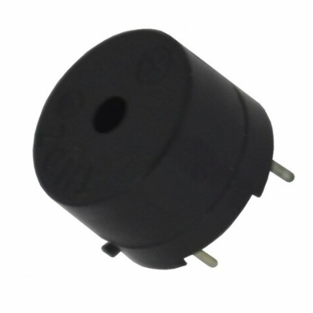
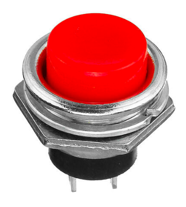

Hardware
========

The Raspberry Pi controls and utilizes a combination of input and output devices to meet the requirements of the project. We will discuss the purpose of each component and how it works. You can find a list of the hardware used, quantities, and links to purchase them :download:`here <../_static/sleep_tracker_components_list.xlsx>`.

Display
-------

The device uses a Quad Alphanumeric Display to show the time. This module consists of four 14-segment display digits. A segment display is a type of display that uses light-emitting diodes (LEDs) arranged in a rectangle to display numbers and letters.

Each LED has a dedicated pin to turn it on or off, where a combination of illuminated LEDs forms a digit. For example, turning the LEDs B and C below shows the digit “1”.

For easier control of the LEDs, the segment display comes with an LED backpack, which is a board with an HT16K33 chip to control the segment digits. The board uses an I2C interface, a master-slave communication protocol between a controller and a chip. You can read more about I2C `here <https://www.circuitbasics.com/basics-of-the-i2c-communication-protocol>`_.

Through I2C, the Raspberry Pi can control the display with only two pins:

- **Serial Data pin (SDA):** used to send and receive data between the two devices.

- **Serial Clock pin (SCL):** carries the clock signals to synchronize data transmission between the master and the slave so that information is decoded properly.

The adafruit-circuitpython-ht16k33 Python library offers simple commands that facilitate setting up the I2C interface and displaying numbers and text on the segment display pack.

In addition to the two I2C pins, the display controller also uses two Vcc pins and a Gnd pin as the positive and negative 3.3-volt power terminals, respectively.

Ultrasonic Sensor
-----------------

Ultrasonic sensors measure how far an object is using ultrasonic waves. The sensor consists of a transmitter (Trig pin) which generates sound waves, and a receiver (Echo pin) to detect incoming waves. It works by recording the time taken by emitted waves to be reflected after they hit a body, and the multiplying it by sound speed to get the distance to that body.

The ultrasonic sensor is used in this project to detect whether or not a person is resting on the bed. The sensor is placed above the bed at a certain distance. This distance gets shorter if a person lies on the bed. When Raspberry Pi detects a change in distance, it sends a signal to the Anvil server to update the sleeping state.

Buttons and Buzzer
------------------

A buzzer is a device that generates clicks or beep sounds when a voltage is applied across its two terminals. When an alarm is fired, the Raspberry Pi sends multiple consecutive high signals to the buzzer, creating the popular alarm sound effect.

Two buttons, a snooze button and a dismiss button, are used to control the alarm. The buttons are simple push-buttons with two pins, one of which connects to the 3.3 voltage line and the other to a GPIO pin. Pushing the button closes the circuit and causes a 3.3v signal to reach the GPIO input pin, which triggers an interrupt in the code. The Raspberry Pi then decides the function to run depending on the button pressed.

Schematic
---------

The table below summarizes the pin connections for each component. Components generally come labeled to help identify inputs/outputs. Use jumper wires to connect pins together.

.. _Pin Connections:

.. list-table::
  :align: center
  :header-rows: 1

  * - Display
    - Raspberry Pi
  * - Vi2c (+)
    - 3.3v
  * - VCC (+)
    - 3.3v
  * - GND (–)
    - GND
  * - SDA (D)
    - GPIO2
  * - SCL (C)
    - GPIO3
  * - **Ultrasonic sensor**
    - **Raspberry Pi**
  * - VCC
    - 3.3v
  * - Trig
    - GPIO4
  * - Echo
    - GPIO15
  * - GND
    - GND
  * - **Snooze button**
    - **Raspberry Pi**
  * - Pin 1
    - GPIO10
  * - Pin 2
    - 3.3v (through 220Ω resistor)
  * - **Dismiss button**
    - **Raspberry Pi**
  * - Pin 1
    - GPIO5
  * - Pin 2
    - 3.3v (through 220Ω resistor)
  * - **Buzzer**
    - **Raspberry Pi**
  * - Red wire
    - GPIO16
  * - Black wire
    - GND

The 3.3v (orange wire) and Gnd (black wire) pins on the Raspberry Pi are connected to the horizontal power rails of the breadboard (see schematic below), respectively, to establish power lines. All components can then connect to those lines and share the Raspberry Pi’s 3.3v and Gnd pins.

Note that a resistor is added between the buttons’ 3.3v line to act as a load that dissipates energy when the circuit is closed.

The schematic is built using Fritzing software and shows the final circuit connections. We color-coded the wires to facilitate identifying and tracing connections.

