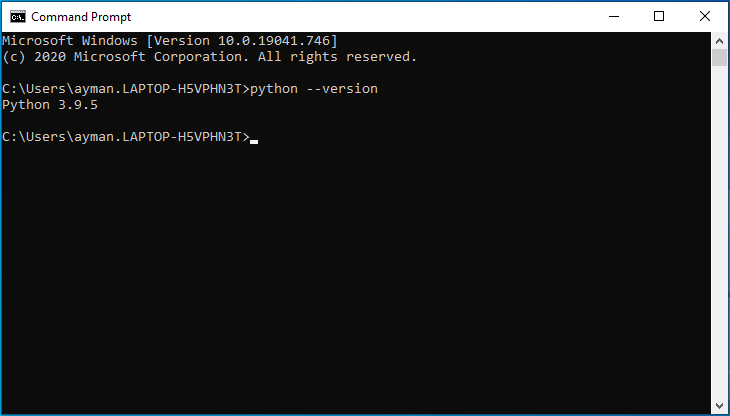
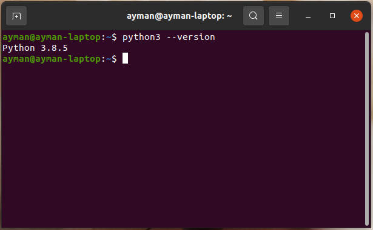
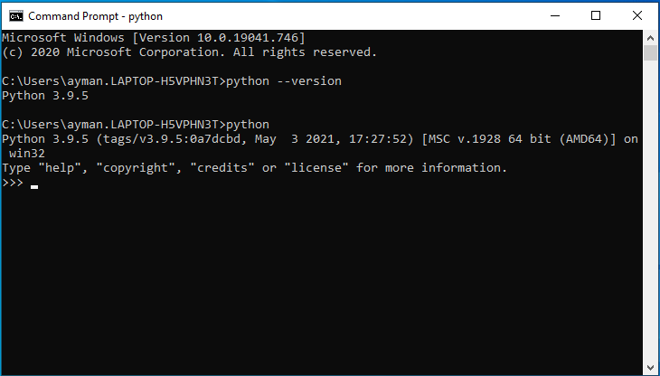
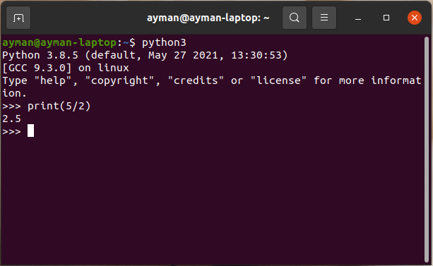
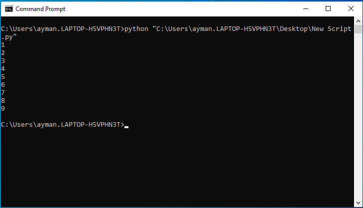
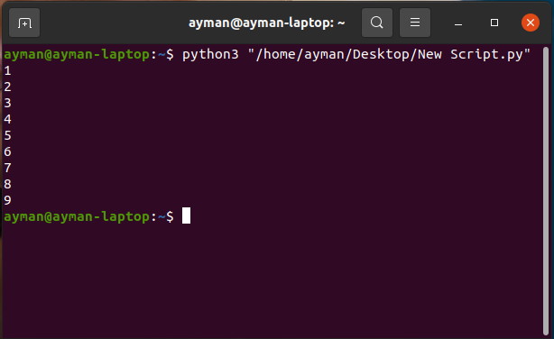

Installation and IDE Setup
==========================

.. role:: python(code)
   :language: python

**By the end of this section, students should be able to:**

- Install Python and troubleshoot the Path variable issue
- Use a terminal window to run Python code through the interpreter or from a script

Installing Python
-----------------

Python is available for different environments, including Windows, Mac, and Linux. Python 3 distributions can be downloaded from the official Python website.

**Windows**

#. Go to the `official Python website <https://www.python.org>`_

#. From the Downloads menu, click Windows

   .. figure:: ../_static/images/python_website.png
    :align: center

#. Under Stable Releases, click to download the Windows installer (32-bit or 64-bit depending on your system) for the Python release you want. Ideally, you would want to download the latest stable release

   .. figure:: ../_static/images/download_windows.png
    :align: center

#. When downloading is done, double-click the file to run the installer

#. Check the box that says “Add Python 3.x.x to PATH”. This allows Windows to find the Python interpreter when running Python code

   .. figure:: ../_static/images/install_windows_1.png
    :align: center

#. Click Install Now

   .. figure:: ../_static/images/install_windows_2.png
    :align: center

**Mac**

#. Go to the `official Python website <https://www.python.org>`_

#. From the Downloads menu, click Mac OS X

#. Under Stable Releases, click to download the macOS 64-bit installer. Ideally, you would want to download the latest stable release. If your Macbook is uses an Intel processor (Macbook version 2019 or older), download the Intel installer. If it is using Apple Silicon (Macbook version 2020 or newer), opt for the Universal2 installer

#. When downloading is done, double-click the file to run the installer

#. Follow the instructions and click Continue until it shows the installation destination

#. Click Install

**Ubuntu**

#. Open a new terminal window

#. Type the following command to install Python 3.
   .. code-block:: bash

    sudo apt-get install python3.x

   Replace x with the desired Python release. You can find the latest release number on the `official Python website <https://www.python.org>`_

   .. figure:: ../_static/images/install_ubuntu.png
    :align: center

**Other Linux Systems**

Check `this <https://opensource.com/article/20/4/install-python-linux>`_ tutorial on how to configure and build Python from the source code

Setting Up Python
-----------------

Python should be set up and ready to use after installation. To make sure Python is set up correctly, try to check the installed Python version using a terminal window.

**Windows**

#. Open the start menu

#. Search for Command Prompt and open a new window

#. Type the following command and press enter

   .. code-block:: python

    python --version

**Mac**

#. Click on the magnifying glass in the top bar to open the Spotlight finder

#. Type Terminal and open a new window

#. Type the following command and press enter

   .. code-block:: python

    python3 --version

**Linux**

#. Depending on your system, search for Terminal in the applications menu. Common shortcuts include Ctrl+Alt+T or Alt+T

#. Type the following command and press enter

   .. code-block:: python

    python3 --version

The command should output “Python 3.x.x”, the version of Python you installed. If you get any errors, a probable cause is that Python is not added to the system’s PATH variable. Check `this <https://www.techwalla.com/articles/how-to-set-your-python-path>`_ tutorial on how to solve this issue on Windows, Mac, and Linux.

Running Python Code
-------------------

You can interact directly with the Python interpreter through a terminal. To do that, open a new terminal/cmd window, type the following command, and press enter.

**Windows**

.. code-block:: python

  python

**Mac/Linux**

.. code-block:: python

  python3

You can then write code to be directly executed by the interpreter. Try entering :python:`print(5/2)` and check the output.

**Windows**

**Linux**

This method is quick for testing commands, but we will be writing Python scripts in files as it is more organized.

**Windows**

#. Open a new Notepad window

#. Type in the following code

   .. code-block:: python

    for n in range (1, 10):
      print (n)

#. Save the file, selecting “All Files” for file type and changing the extension to .py

   .. figure:: ../_static/images/run_windows_3.png
      :align: center

#. Open the cmd, and enter the following command, replacing C:\\path with the path to your Python script

   .. code-block:: python

    python C:\path

**Mac/Linux**

#. Open a new Text Edit window

#. Type in the following code

   .. code-block:: python

    for n in range (1, 10):
      print (n)

#. Save the file, and change the extension to .py

   .. figure:: ../_static/images/run_ubuntu_2.png
    :align: center

#. Open the terminal, and enter the following command, replacing /path with the path to your Python script

   .. code-block:: python

    python3 /path

Python IDEs and Code Editors
----------------------------

A code editor is a software application that allows programmers to write and edit code. The difference between a code editor and a regular text editor, like Notepad, is that code editors have built-in features that aid in writing code, like syntax highlighting, indentation, and brace matching. Some code editors can execute code and display preview windows, but most code editors are kept simple and lightweight.

An integrated development environment (IDE) is a special program that bundles various programming tools to facilitate the software development process. These tools include a code editor (usually supports code autocomplete), compilers, debuggers, and build, deployment, and testing tools. Most IDEs support more than one programming language. Because of the many tools provided, IDEs are larger to download and take more space and memory than standalone code editors.

Below are some of the most common Python IDEs and code editors.

IDLE
^^^^

IDLE is a straightforward code editor for Python. It is added by default to the Python installer on the official python.org website, so it is already installed on your Windows/Mac machine (you can search your applications menu for IDLE).

IDLE offers a clean editor window with syntax highlighting. This is the main window that appears when you start IDLE. There is also a Python shell included to run Python scripts directly from the code editor window. When you finish writing a script, click …. from the “Run” tab in the menu bar. A terminal window will open where the code is executed by the interpreter.

The simple interface makes IDLE perfect for use by beginners and testing code snippets fast.

PyCharm
^^^^^^^

PyCharm is a powerful IDE dedicated to Python development. It is created by JetBrains, a well-known software development company. PyCharm is available in a free community version and a paid version that offers more professional development tools. The IDE can be easily set up on Windows, Mac, and Linux using the `official installer <https://www.jetbrains.com/pycharm/download>`_. 

Besides having a code editor, PyCharm provides advanced features that speed up software development like code completion, inspections, and error-highlighting and fixing. There are also debugging tools and a version control system for managing large projects.

With all these features, PyCham is easily the favorite Python IDE for professional developers. However, it is a resource-intensive application, so it is not recommended for low-end machines.

Atom
^^^^

Atom is a free, open-source code editor from Github. It is one of the best editors available on all platforms (Windows, Mac, Linux) and can be downloaded `here <https://atom.io>`_. The interface is elegant, and you can choose to change the theme between light and dark modes. There is also a directory tree viewer for managing multiple projects at the same time.

Named the Hackable Editor for the 21st century, Atom is very customizable, which sets it apart from other code editors. Atom offers a package manager that allows users to install various packages to extend Atom’s functionalities. Thousands of packages are available to add features like syntax highlighting for many languages, autocomplete, real-time preview windows, custom terminals, and much more. Also, the built-in Github package allows developers to easily create branches, commit, and push their code to Github directly from the code editor.

Adding packages to Atom is straightforward. From the Packages menu, select Settings view and click Manage packages. There you can search packages by name and install/remove packages. Some of the useful packages for Python development are:

- **script** provides a terminal window to run Python code directly in Atom
- **linter-python** a linter tool for flagging syntax errors and bugs in Python scripts, great for beginners
- **atom-material-syntax** provides another syntax highlighting theme to better apprehend the code

Atom provides a lot of the IDE features in a lightweight form. There is even an Atom IDE package that adds diagnostic features to show errors and warnings, as well as references and information for methods.

Spyder
^^^^^^

`Spyder <https://www.spyder-ide.org>`_ is another well-known Python IDE that is often used for scientific purposes. Spyder provides tools that facilitate data analysis and visualization. These include a variable explorer for modifying variables in real-time, a plot that supports graphs and 3D models, and a console that interacts with the data plot.

Spyder is mainly used by scientists and engineers for analyzing complex data and visualizing information for case studies and project reports.

**Exercise**

#. How do you check the currently installed version of Python on your machine?

#. Predict the output of the following code.

   .. code-block:: python

    print("5 Times Table")
    for n in range (1, 10):
      s = "5x" + str(n) + "=" + str(5*n)
      print(s)

   After that, type the script into a file and run it on your machine. Verify your prediction is correct.
