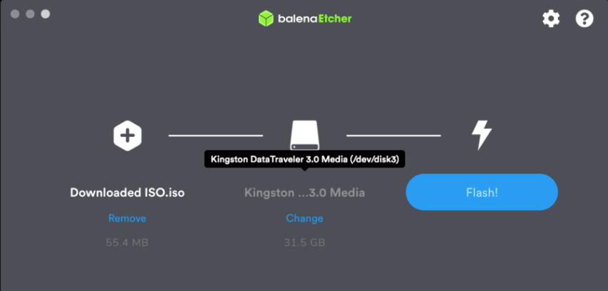
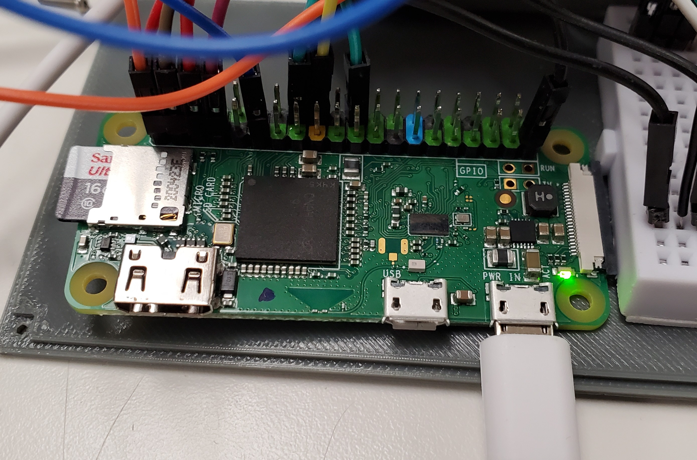
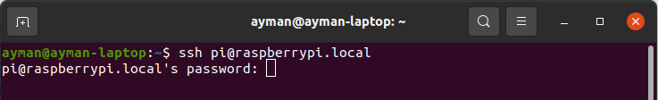
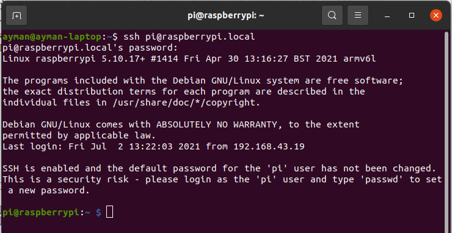
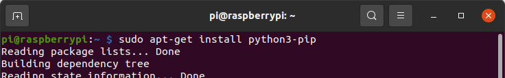

Installation and Setup
======================

Before we proceed into programming and creating the circuit, we first need to set up the environment to code the Raspberry Pi.

Installing Raspberry Pi OS
--------------------------

The Raspberry Pi OS Lite image is available on the official `raspberrypi.org website <https://www.raspberrypi.org/software>`_. After downloading it, the image needs to be flashed to the Raspberry Pi’s micro Secure Digital (SD) card. There are many image flashing programs available for free, like Etcher, an open-source flasher for Windows, Mac, and Linux.

To flash the image with Etcher:

- Download the official installer from `balena.io <https://www.balena.io/etcher>`_ and run it on a PC.

- Plug the Raspberry Pi micro SD card to the PC.

- Open Etcher, and select the image to flash and the device to flash to (in this case, the micro SD card).

- Click Flash, and Etcher will copy the image to the micro SD card.

.. _Configure Pi:

Enabling SSH
------------

When flashing, Etcher creates two partitions on the target device:

- **Boot partition:** contains the boot loader that allows the OS to boot and start.

- **Root partition:** contains the OS files, folders, and any user data.

To use SSH on the Raspberry Pi, simply create an empty text file named *"ssh.txt"* and place it in the boot partition. This instructs the OS to enable SSH at startup.

Since SSH works over a network, the Raspberry Pi needs to be connected to WiFi for SSH to work. WiFi is configured through wpa_supplicant, the program that controls wireless connections in Linux.

To configure the network parameters at startup, create a text file named *"wpa_supplicant.conf"* in the boot partition. The network’s name (called the Service Set Identifier or SSID), password, and authentication type are then placed in that file using the following format:

.. code-block:: none

  country=CA
  ctrl_interface=DIR=/var/run/wpa_supplicant
  GROUP=netdev
  update_config=1
  network={
  	ssid="YOUR_SSID_HERE"
  	scan_ssid=1
  	psk="YOUR_PASSWORD_HERE"
  	key_mgmt=WPA-PSK
  }

Connecting to the Raspberry Pi
------------------------------

Eject the micro SD card and insert it into the Raspberry Pi, then power the board can through its micro USB port. The Raspberry Pi takes around 30 seconds to boot up and connect to the WiFi network specified in the *"wpa_supplicant.conf"* file. An on-board LED flashes during the booting process and stops when Pi is ready.

The SSH connection is then established through a terminal/command line window using the device’s hostname and password. For the Raspberry Pi, the default hostname on a local network is *"pi@raspberrypi.local"*, and the password is *"raspberry"*.

Enter the command :python:`ssh <host name>` to start a connection. This command will prompt for the password.

.. code-block:: none

  ssh pi@raspberrypi.local

A successful SSH connection will cause the terminal/command line to switch to the Raspberry Pi user, and any commands entered after that will be executed on the Raspberry Pi terminal instead of the PC's.

Installing libraries
--------------------

There are three libraries required to be installed for the project:

- **python3-pip:** it is the package manager for Python 3 which allows users to access and install thousands of Python packages and libraries from the Python Package Index.

- **anvil-uplink:** this is the official Anvil Python package used to connect a device to Anvil server through an uplink key. Using this package, a device can call server functions and receive responses. The package also allows a two-way connection that permits the server to call functions offered by the device. This package is available via pip.

- **adafruit-circuitpython-ht16k33:** Adafruit’s library for managing displays that use an HT16K33 controller like the 14-segment display used in this project. The package handles the I2C connection to the display and facilitates typing text and numbers with one-line commands. This package is also available via pip.

The three packages are installed using the Pi’s terminal (recall that is it accessed through an SSH connection from your PC). Since the last two packages are accessed through pip, it is important to first install pip using the following command:

.. code-block:: none

  sudo apt-get install python3-pip

After pip is successfully set up, install anvil-uplink and adafruit-circuitpython-ht16k33:

.. code-block:: none

  sudo pip3 install anvil-uplink

  sudo pip3 install adafruit-circuitpython-ht16k33
