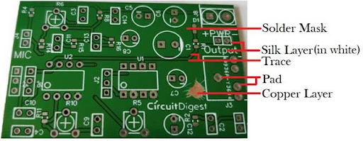

Introduction
=====================

In this guide, you will learn the basics of creating a printed circuit board (PCB) design in KiCAD. You will start by creating a schematic, 
assigning and creating/editing footprints, and finally creating the layout of the PCB. Designing PCBs is something that you get better at over 
time, so the more you do the better you will be!

This is not a tutorial for how to design a power distribution board. The final design of the PCB shown in this tutorial does not function as intended.
This tutorial should be used as a guide on how to use the tools of KiCAD, not how to design a PCB layout.

What is a PCB?
--------------
A printed circuit board (PCB) is a board with different materials stacked together.
The pads on the board, as seen below, are connected to the components and copper traces, which carry current around the board. 

A Simple PCB
     
Depending on the complexity of the circuit, the amount of materials stacked together on the PCB can be increased. On single layer PCBs, there are electrical connections on only one side of the board, double layer PCBs have electrical connections on both top and bottom, and more than 2 layer PCBs have electrical connections on top, bottom, and internal layers within the board of the PCB. This introduces how PCBs can be manufactured with multiple copper layers (from 1, 2, 4 … all the way to 16 copper layers for more complicated applications). 

The **substrate** is the solid core of the board, then other layers like the copper, soldermask, and silkscreen are glued to this substrate. 

.. figure:: ../_static/images/pcb2.png
    :figwidth: 700px
    :target: ../_static/images/pcb2.png
Single layer vs double layer PCB
    
The **copper layer/traces** electrically connect the components;
The **solder mask** gives the PCB the green coating that is seen and insulates the copper coating; 
The **silk layer** is where annotations go on i.e. letters and words. 

PCB Layers on KiCAD
-------------------

In KiCAD, there are multiple layers for the PCB board. The most important layers are the **copper, silk screen, edge cuts, and fabrication layers**. For some layers, there exist a front and a back i.e. the front and back copper layers. These simply mean the corresponding layer can appear on both the top and bottom of the board, just like the copper layer in the Single layer vs double layer PCB figure.

.. figure:: ../_static/images/pcb3.png
    :figwidth: 900px
    :target: ../_static/images/pcb3.png
PCB Layers on KiCAD