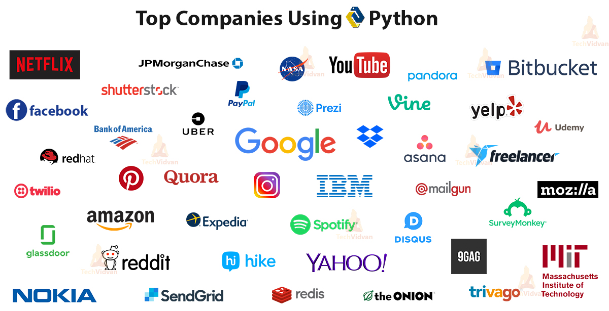

Introduction to Python
======================

.. figure:: ../_static/images/python_intro.jpeg
  :align: center

  *src: https://javarevisited.blogspot.com/2018/12/10-free-python-courses-for-programmers.html*

**By the end of this section, students should be able to:**

- Explain what Python is, its features, and its applications 
- Understand why Python has become very popular
- Mention examples of existing software that use Python
- Briefly describe the different programming approaches (procedural, functional, and object-oriented)
- Appreciate the importance of open-source development

About Python
------------

Python is a high-level interactive programming language with various applications, from short console scripts to complex web applications. Python is also an interpreted language, meaning that it is executed at runtime by an interpreter and, thus, is not compiled. That is why Python codes, like PHP files, are called scripts. Python is relatively new compared to other programming languages like Java and C++. Although it has only been around for 30 years, Python is emerging very fast, and it became one of the most popular programming languages. According to the `Stack Overflow's Developer Survey <insights.stackoverflow.com/survey/2020#technology-programming-scripting-and-markup-languages>`_, Python is ranked as the fourth most commonly used programming language in 2020. Indeed, professors now choose to teach students Python for their future careers, especially that big companies like Google and NASA actually use it.

Why Python
----------
The main reasons why Python became so popular are:

- **Python scripts are clearer and have fewer lines than codes in other languages**

  Python was designed with readability in mind. The syntax is straightforward, intuitive, and uses fewer symbols and more descriptive words. A person who has no experience in programming would probably be able to understand simple Python codes. That is why Python is common among beginners and is taught in introductory programming courses.

- **Python facilitates development, testing, and prototyping**

  Python's numerous libraries extend its capabilities, allowing almost any program to be implemented in Python. Combined with its readability and ease to use, Python is ideal for rapid development and prototyping. For large projects, functions and algorithms can be written, tested, and optimized in Python. The scripts can then be used as a blueprint to implement the same code in other languages as required, which reduces development costs.

  As an interpreted programming language, Python speeds up the software development process. In a compiled language like C++, the source code needs to be compiled into machine code before running on a computer system, and the compiling process fails if any errors are found. Since a compiler cannot detect logic errors, the developers have to re-compile the code whenever an edit is done during the testing process. On the other hand, Python, being an interpreted language, is executed in runtime, so developers can run the code while fixing errors.

- **Python is very flexible**

  The success of Python in many programming fields originates from the fact that it supports three major programming approaches: procedural programming, functional programming, and object-oriented programming. In a procedural approach, a program is a combination of selection and iteration blocks. It is a single structure, and instructions are run one by one. Thus, the code is easier to read, maintain, and trace. Functional programming, on the other hand, focuses on dividing a program into pure functions that output certain expected results. The modularity of functional programming facilitates solving complex problems and enhances code reusability.

  In object-oriented programming, a program is structured into objects and classes. Classes have their own attributes and functions and can be used to instantiate objects with the same properties as the class. Object-oriented programming allows for abstraction using encapsulation, polymorphism, and inheritance. You can read more about object-oriented programming `here <www.freecodecamp.org/news/object-oriented-programming-concepts-21bb035f7260>`_.

  Using these three programming approaches, developers can leverage the power of Python and expand its applications.

Applications of Python
----------------------

Python is supported by a rigid open-source development community that is continually maintaining and innovating new libraries and frameworks. Developers use these tools to expand the applications of Python and leverage its power in data analysis, web development, graphics, and much more. However, Python really stands out in machine learning and artificial intelligence. There are numerous Python libraries and modules that strongly abstract AI algorithms and data visualization computations.
Thus, developers have the base level components to implement functions like object detection and pattern recognition using concise and readable code.

Examples of well-known applications that rely on Python for their back-end services include Reddit, Instagram, and Quora. In addition, Google utilizes Python in their AI robotics projects, and in 2010, they completely switched YouTube from using PHP to Python. Also, some of the popular video games like Battlefield 2 use Python as a modeling language. Finally, Python is the official programming language of the Raspberry Pi, one of the powerful tools in embedded systems prototyping and development.

You can check `this Wikipedia list <en.wikipedia.org/wiki/List_of_Python_software>`_ for other software and programs that utilize Python in their services.

  *src: https://techvidvan.com/tutorials/python-tutorial*

Python Versions
---------------

.. role:: python(code)
   :language: python

There are two main versions of Python: Python 2 and Python 3. Python 2 was introduced in 2000, and the latest release is 2.7. However, support for Python 2.7 stopped in 2018. Python 3 was released in 2008, and its current most up-to-date version is Python 3.9. Since Python 2 is no longer maintained, most projects nowadays would use Python 3. Legacy software which cannot be upgraded to the newer version might still use Python 2.

The main differences between the two versions are:

- The syntax to print in Python 2, :python:`print`, is replaced in Python 3 by :python:`print()`

- The function :python:`xrange()`, which returns a list in Python 2, no longer exists in Python 3. The new equivalent is :python:`range()`

- Dividing two integers in Python 2 would return an integer value, but it would return a float value in Python 3

Example:

*Python 2*

.. code-block:: python

  for n in xrange(1, 10):
    print n/2

  '''

  Output:
  0
  1
  1
  2
  2
  3
  3
  4
  4

  '''

*Python 3*

.. code-block:: python

  for n in range(1, 10):
    print(n/2)

  '''

  Output:
  0.5
  1.0
  1.5
  2.0
  2.5
  3.0
  3.5
  4.0
  4.5

  '''

- Strings in Python 2 are stored in ASCII format, while in Python 3, the default encoding is Unicode.

- Many libraries from one version will not work with the other. Python 3 is not backward-compatible with Python 2.

**Exercise**

#. What are the main differences between compiled and interpreted programming languages?

#. What role does Python play in facilitating software development?

#. List four fields of software development where Python is utilized, giving examples of existing Python software for each.

#. Think about the three main programming approaches mentioned in this section. What method would be suitable in developing each of the following and why:

   - A calculator app that can solve complex mathematical functions.
   - A school registration system for saving and searching students’ data.
   - A sensor that logs the temperature every hour and notifies the user if it is too cold outside.

#. What would be the output if the following code is executed in Python 2 and 3?

   .. code-block:: python

    print 5/2
