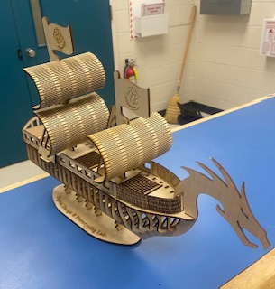

Introduction
============

So... you want to cut things using a

.. figure:: ../_static/images/laser.png
  :align: center

Luckily, this machine is fairly straightforward to use. By the end of this tutorial, you’ll be able to etch an image and cut a profile using the Trotec Speedy 300 Flexx.

Laser cutting is the process of cutting and etching different materials to a custom design using a small, high power beam. Below are some examples of what can be accomplished using this machine:

.. figure:: ../_static/images/laser2.png
  :align: center

If you’d like to know more about the machine itself, the manual can be found `here <https://www.troteclaser.com/fileadmin/content/images/Contact_Support/Manuals/8020-Speedy-20300-flexx-Manual-EN.pdf>`_.

**A Quick Note on Safety: Please reference the Approved Materials page before cutting any material. There are materials that can generate dangerous chemicals and gasses when processed by laser. Do not process any material that is not on the approved list without first consulting the Engineer in Residence or a lab technician.

