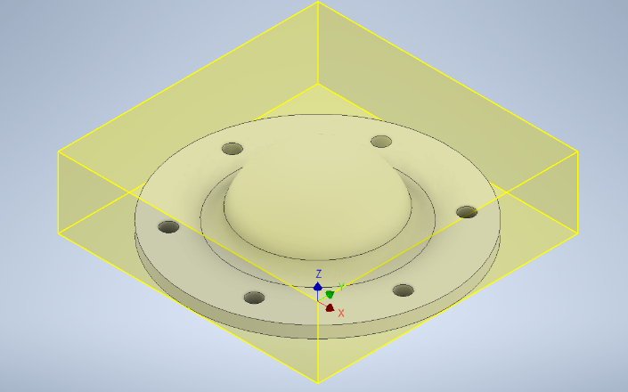
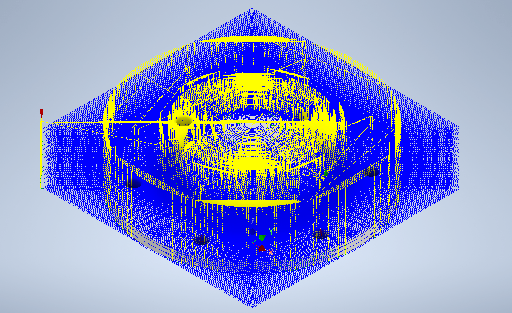

InventorCAM
===========

Introduction
------------
Inventor, like AUTOCAD is a computer aided design software application that supports 3D mechanical design, simulation, visualization, and documentation. 
This software enables users to construct accurate 3D models to aid in simulation and visualization before building products. 
Inventor operates on both Windows and Mac systems and comes in different file types like IAM, DW, IPN, IPTs.

This tutorial will discuss the computer-Aided Manufacturing steps using Inventor. For this tutorial, it is assumed that you have already created a part 
to be machined. With Inventor CAM you can generate and simulate toolpaths to create machine ready parts. 

.. figure:: ../_static/images/INVENTORCAM1.png
    :figwidth: 1600px
    :target: ../_static/images/INVENTORCAM1.png

Set Up
------
One of the most important parts of InventorCAM is the Set up. When setting up make sure to take into consideration the part that you intend to 
machine and the things holding the parts down. Set up is a very important first step to consider when starting your manufacturing process. 
The selections available will help you define the working model stock size, fixtures and also set the World Coordinate System (WCS) zero.

Start by heading over to the CAM section and clicking the Set up option.

.. raw:: html

    

        <iframe src="https://youtu.be/embed/A-LIbgqnzbY" frameborder="0" allowfullscreen style="position: absolute; top: 0; left: 0; width: 100%; height: 100%;"></iframe>
    
 

Tool Set Up
-----------
Setting up the tools used for manufacturing the part is also very important. The tool library is where you can manage tools for your individual operations, 
it also contains predefined tools

.. raw:: html

    

        <iframe src="https://youtu.be/embed/xruJwmf5PYw" frameborder="0" allowfullscreen style="position: absolute; top: 0; left: 0; width: 100%; height: 100%;"></iframe>
    
 

Drill
------
This section provides a wide range of drilling, tapping and hole making machine operations. Here you can select the holes that need to be machined
and create operations for these processes.

.. raw:: html

    

        <iframe src="https://youtu.be/embed/VzPNHVd-NU8" frameborder="0" allowfullscreen style="position: absolute; top: 0; left: 0; width: 100%; height: 100%;"></iframe>
    
 

2D Mill
-------
This is a milling process used in clearing stock on a 2D plane. There is therefore no stepdown as it only works on one plane

.. raw:: html

    

        <iframe src="https://youtu.be/embed/VzPNHVd-NU8" frameborder="0" allowfullscreen style="position: absolute; top: 0; left: 0; width: 100%; height: 100%;"></iframe>
    
 

3D Mill
-------
This process on the other hand is a milling process that clears stock on a 3D plane. It starts from the top of the stock and steps down
 to a certain depth (depending on user input) to clear another plane of the stock

.. raw:: html

    

        <iframe src="https://youtu.be/embed/61CfQTriqr8" frameborder="0" allowfullscreen style="position: absolute; top: 0; left: 0; width: 100%; height: 100%;"></iframe>
    
 

.. raw:: html

    

        <iframe src="https://youtu.be/embed/lNEDOysaFzA" frameborder="0" allowfullscreen style="position: absolute; top: 0; left: 0; width: 100%; height: 100%;"></iframe>
    
 

Adaptive
--------
This is a strategy us to clear a large proportion of the stock material effectively. It guarnatees a maximum tool load at all 
stages of the machining cycle and makes it possible to cut deep with the flank of the tool without the risk of breakage. 
It combines multiple milling processes into one continuous step and effectively cuts most of the stock in one process. 
The process clears stock by making a series of constant Z-layer movements and steps down, then clearing the immediate layers 
and proceeding into the shallower layers.

.. raw:: html

    

        <iframe src="https://youtu.be/embed/e9dpszUOZmc" frameborder="0" allowfullscreen style="position: absolute; top: 0; left: 0; width: 100%; height: 100%;"></iframe>
    
 

Simulate
--------
This helps to preview and simulate the various milling process toolpaths and stock material removal. It possesses various 
controls like the simulation speed and direction, visibility of tool, shaft and tool holder, as well as the coloring of 
the rapid moves, lead moves, and cutting moves.

.. raw:: html

    

        <iframe src="https://youtu.be/embed/3In9iN-6zxs" frameborder="0" allowfullscreen style="position: absolute; top: 0; left: 0; width: 100%; height: 100%;"></iframe>
    
 

Post Process
------------
This converts the machine-independent cutter location data into machine-specific NC code. It turns the movement of the 
tool into independent G-code that is specific to the machine that is selected.

.. raw:: html

    

        <iframe src="https://youtu.be/embed/4ym6yfcRceI" frameborder="0" allowfullscreen style="position: absolute; top: 0; left: 0; width: 100%; height: 100%;"></iframe>
    
 

