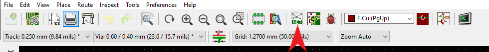
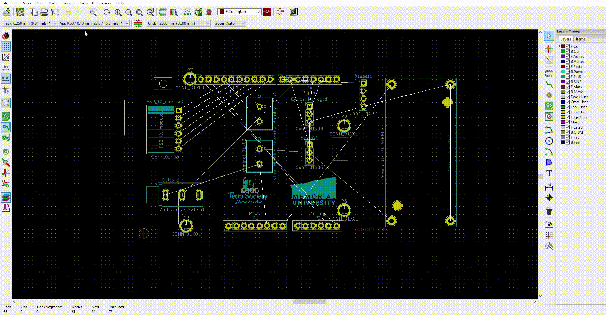

Layout and Routing
==================

Now that you have the schematic made, you can begin the layout and routing of your PCB. To begin, I recommend watching this short video going over some basics layout and routing:

.. raw:: html

   <iframe width="560" height="315" src="https://www.youtube.com/embed/pwZ3zbqxIo4" title="YouTube video player" frameborder="0" allow="accelerometer; autoplay; clipboard-write; encrypted-media; gyroscope; picture-in-picture" allowfullscreen></iframe>

Below is a summary of the key points in the video:

To start, open PCBnew from the project window. Once opened click "Load netlist" at the top of the screen. This will import all the footprints that you just assigned to your components. You can then begin to move the footprints
apart and arrange them in a way that suits your design needs.

You can now create the shape and size of the board. Select **"Edge.Cuts"** on the Layers Manager to the right of the window and the select "Add graphic lines". You can then draw a shape around the componets which will reflect
the physical shape and layout of the board.

Once you do this, you can view a 3D model of the board by pressing **ALT+3** or navigating to **View > 3D model**.

Now you can begin routing. Simply select the **route tracks** tool on the right side toolbar and connect the pads according to the connections indicated by the ratsnest (the white lines). 

.. figure:: ../_static/images/KiCAD16.gif
    :figwidth: 500px
    :target: ../_static/images/KiCAD16.gif

Once all your tracks are routed, you are essentially finished! For certain designs, you can utilize copper pours/filles to clean up your routing. I recommend `this page <https://www.wayneandlayne.com/blog/2013/02/26/kicad-tutorial-copper-pours-fills/>`_ 
for a detailed explanation of how to do them and how they work.

Lastly, you can add any text to your board using the text tool on the right side toolbar and adding images is also fairly straight forward; simply open **Bitmap to Component Converter** in the KiCAD project window, loan and image, and then
adjust the resolution to until you reach your desired size. You image will be saved as a footprint and you can then add it your board using the **"Add footprints"** located on the ride side tool bar.

If you are having trouble with adding images, refer to the following video:

.. raw:: html

   <iframe width="560" height="315" src="https://www.youtube.com/embed/w_7iRCyau7w?start=66" title="YouTube video player" frameborder="0" allow="accelerometer; autoplay; clipboard-write; encrypted-media; gyroscope; picture-in-picture" allowfullscreen></iframe>

Once you are happy with the design of your board, you can now order some for testing! Please refer to our other tutorials on this page to learn how to order your boards through JLCPCB!
