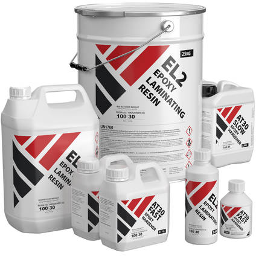
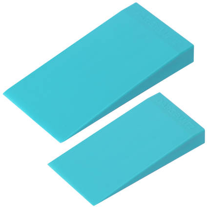

Mold Making Tools and Materials List
====================================

Please ensure you abide by the :ref:`PPE and Safety` notes. 

While some of the common items found here can be found at your local hardware store, some products and materials need to be specially ordered. For purposes of this tutorial, all non-generic products can be found on https://www.easycomposites.co.uk/. 

* Painters Tape

* Corrugated Plastic Board

* Hot Glue Gun and Glue

* Soft fileting and filling wax

* CR1 Easy Lease Chemical Release Agent

.. figure:: ../_static/images/CR1.jpg 
   :figwidth: 700px 
   :target: ../_static/images/CR1.jpg

* Lint Free Solvent Application Wipes

.. figure:: ../_static/images/wipe.jpg 
   :figwidth: 700px 
   :target: ../_static/images/wipe.jpg

* EG60 Epoxy Tooling Gelcoat and Epoxy Hardener

* Calibrated Mixing cups (1000mL or more)

.. figure:: ../_static/images/cup.jpg 
   :figwidth: 700px 
   :target: ../_static/images/cup.jpg

* Long Mixing sticks

* 1”-2” Brushes

.. figure:: ../_static/images/brush.jpg 
   :figwidth: 700px 
   :target: ../_static/images/brush.jpg

* ½” Foam Board

* Glass Bubbles (Microspheres)

* 25g Plain Weave Ultra Light Woven Glass Cloth

* 300g Chopped Strand Mat - Powder Bound

* EL2 Epoxy Laminating Resin and AT30 SLOW Epoxy Hardener

* De-moulding wedge

* Dremel

