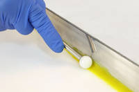
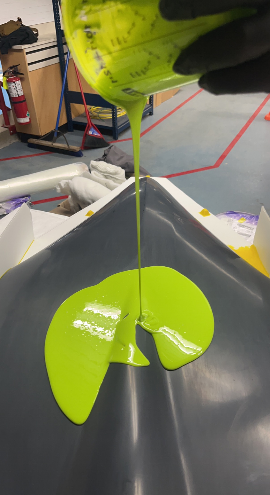

Mold Making Using Fiberglass
============================

In order to create a composite part, you need to have a starting point. There are many different ways that you can manufacture with composites, but for the purposes of this tutorial, we will be creating a mold with fiberglass. 

To make a fiberglass mold, the first step is to make sure you have a plug. The plug seen in this tutorial was previously 3D printed and sanded repeatedly until the perfect finish was created. 

-----------------------

To begin the mold making process, there are a variety of materials you will need. Please see :ref:`Mold Making Tools and Materials List` for the complete list.

Preparing the Plug
__________________

To begin, you must prepare your plug for the mold. Typically, the mold is created in 2 parts, a top, and a bottom.

Please Note: This is a time-sensitive process, so it may take some time, and you may need to return to work after specific periods of time (i.e., 3h, 8h). 

The first step in preparing the plug is to begin taping about halfway down the plug. You want to do this to ensure no resin leaks through the flanges onto the bottom half of the plug. 

Next, you will cut and prepare your flanges.
1. Take your corrugated plastic and trace the plug. 
2. Carefully cut the plastic to this shape.
3. Cut some extra squares that are about 2” by 1”. Using a hot glue gun and these squares, attach the flange to the plug (gluing the flange on the side that the tape was placed.
4. Ensure the flange is secure. Add some more glue for extra security if needed.
5. Repeat this for the other side of the plug (left or right).

When your flanges are prepared, you need to fill in any gaps between the plug and flanges. To do this:
1. Take the yellow fileting and filling wax and apply it to any spaces. 
2. Next, go over it with a popsicle stick or fileting tool to create small filets between the plug and flanges.

Next, we will need to create small registration indexes to make the separation process (after the second side) easier. To make these little indexes, you can use yellow fileting and filling wax. 

When ready, create several mountain-like indexes on top of the flanges. They should be approximately 1”x1” with shallow walls and a flat top.

When this is done, using Lint-free wipes, apply CR1 Easy-Lease Chemical Release Agent over the ENTIRE surface (plug and flanges) at least three times. We found that five coats worked the best. 

Creating the Mold
__________________

After the plug has been prepared, you may move on to the first step in creating the mold. The Gelcoat:

1. Mix enough Epoxy Tooling Gelcoat and Epoxy Hardener for your surface into a mixing cup with a mixing stick. Make sure to follow the ratio listed on both containers: 100g gelcoat:10g hardener. Scale this to however much you need (for example, if you pour 300g of Gelcoat, make sure to use 30g of hardener).
2. Mix this well, scraping the sides and bottom so that everything is mixed up.
3. Using a 1”-2” brush, apply this green gel coat to the entire surface, leaving it relatively thick. 

4. When this is done, leave it for approximately 3 hours.

After 3 hours, check the gel coat, it should be a tacky texture. This means that the next Gelcoat is ready to be applied. 
1. Mix an appropriate amount of  Epoxy Tooling Gelcoat and Epoxy Hardener. This can be judged based on the amount previously mixed. (ie. If last time was enough, mix the same amount. If it was too much, mix less and vise versa.)
2. Mix well. Make sure to scrape bottom and sides. 
3. Using a 1”-2” brush, apply this green gel coat to the entire surface, leaving it relatively thick. 
4. When this is done, leave it for approximately 3 hours.

After the two Gelcoats have been applied, you must first create reinforcements. Then, you can begin laying the fiberglass:

1. Using pink insulation foam, create 2-3 reinforcements that go: Down the middle of the plug and across the plug in two different places. Secure these by gluing them to the flanges with hot glue. 
2. Mix Glass Bubbles (Microspheres) and Epoxy until a thick white paste has been created. 
3. Apply this over the gel-covered ‘mountains’ that we created with the wax to make slopes that are much less steep than before. This is to make sure the fiberglass will form to it easy. 
4. Mix a larger amount of Epoxy Laminating Resin and Epoxy Hardener into a mixing cup. Make sure to follow the ratio listed on the containers, 100g epoxy:30g hardener.
**Note:** This mixture has a pot life of 20 minutes. 
5. Lay a thin layer of this epoxy on the top of the gel coat. Try not to let any drip. 
6. Lay the 25g Plain Weave Ultra Light Woven Glass Cloth on top of the already spread resin. Make sure this cloth covers every inch of the plug and flanges. 
7. Using a 1"-2" Brush, apply more epoxy to the surface of the cloth to ensure all parts have been soaked. 
8. When you are sure all the cloth has been covered in epoxy, let it sit for 8h before continuing on to the next step. 

The next step is to lay a final layer of fiberglass. 

1. Mix Epoxy Laminating Resin and Epoxy Hardener into a mixing cup. Make sure to follow the ratio listed on the containers, 100g epoxy:30g hardener. Make sure to mix well. 
**Note:** This mixture has a pot life of 20 minutes.
2. Lay pieces of Chopped Strand Mat over the entire surface. Make sure to cover every inch.
3. Using a 1"-2" Brush, apply more epoxy to the surface of the cloth to ensure all parts have been soaked. 
4. When you are sure all the twill has been covered in epoxy, let it sit for a final curing time of 12-24 hours.

**After 12-24 hours, you may repeat the process for the other half of the mold. Leave the first half of the mold on the plug and then repeat the entire process.**

After both sides have been completed, leave the mold for 24h and then, you may remove the plug from your mold.

Removing Mold
_____________

1. Slide the demolding wedges, in between the two sides of the mold.
2. It may take a bit of effort but after working them around, the mold should break loose.
3. When done, remove the mold. You may want to use a dremel to sand the edges down so fiberglass is not sticking out anywhere. Now, we are ready to move on to the carbon fiber process via vacuum bagging. 
