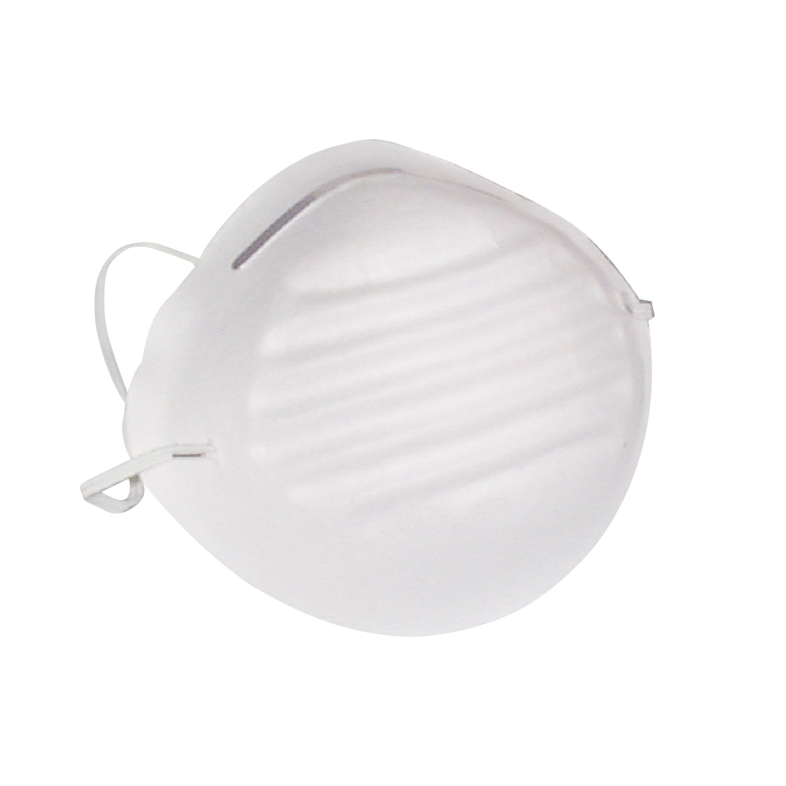

PPE and Safety
==============

As always, there are many safety considerations when working with composites. Remember to follow these as epoxy resins and carbon fiber can harm your health and safety. 

1. Always wear nitrile gloves. This is to ensure no resin gets on your hands.

2. Wear coveralls. This ensures you do not ruin your clothing, as resin does not come out. 

3. When sanding carbon fiber, make sure to wear a dust mask or respirator. Carbon fiber dust can be very bad for your health, and repeated exposure without respiratory protection can lead to serious health effects. 

4. If you notice any rash, hives, or swelling, stop work immediately and do not continue. (Speaking from experience…)

5. Work in a well ventilated area.
