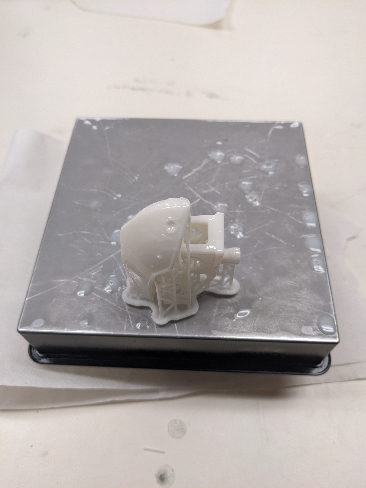
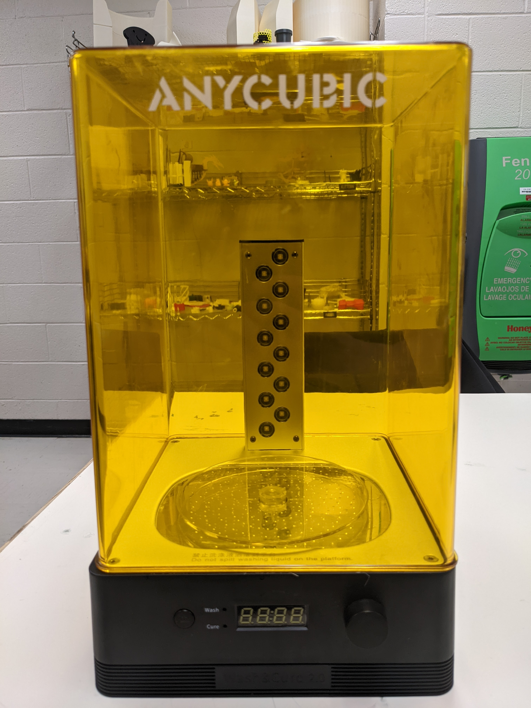
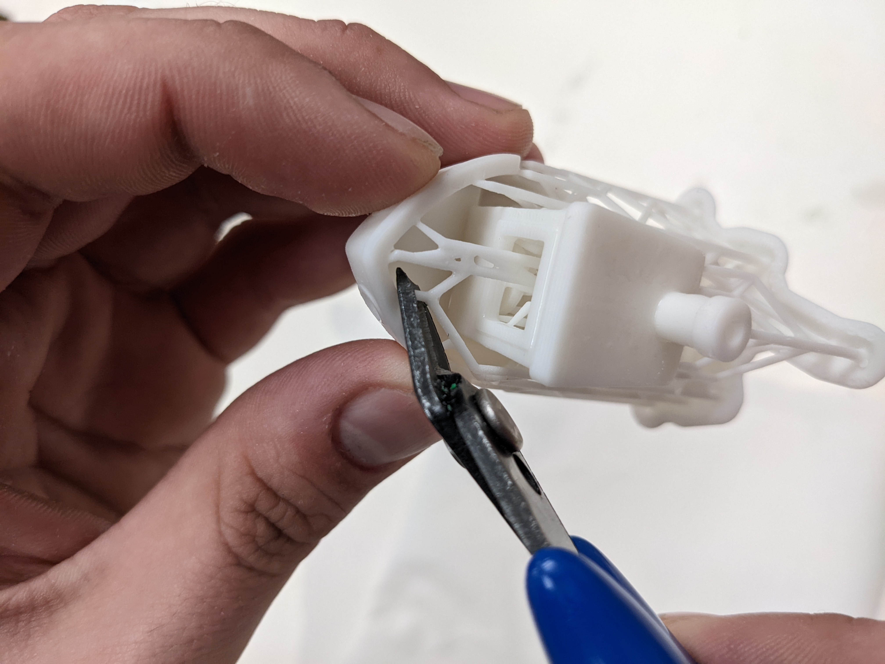

Post Processing
===============

In contrast to FDM prints, resin will always require post processing. Once the print has completed it is best to let it 
sit for a few minutes to allow excess resin to drip down into the resin vat. 

.. figure:: ../_static/images/RESIN15.jpg
    :figwidth: 500px
    :target: ../_static/images/RESIN15.jpg

After the part has sat for an appropriate amount of time it is time for post processing!

Washing
^^^^^^^
The part must first be washed with isopropyl alcohol to remove excess surface resin. The ANYCUBIC wash and cure station 
makes post processing significantly easier. The alcohol must be poured into the station and there is a small holder 
for the part to sit. Pour the alcohol until the 1000 or 1500 line, or however much you need for the part to sit submerged. 
Place the part inside the metal frame inside the tub and hit start. Small parts should only need a few minutes to be washed. 
After the part is washed the plastic tub containing the alcohol must be removed and the part is taken out to be dried. 

DO NOT leave the part submerged in alcohol for an extended time. The part will lose integrity and become mushy. 

.. figure:: ../_static/images/RESIN16.1.jpg
    :figwidth: 500px
    :target: ../_static/images/RESIN16.1.jpg

.. figure:: ../_static/images/RESIN17.jpg
    :figwidth: 500px
    :target: ../_static/images/RESIN17.jpg

.. figure:: ../_static/images/RESIN17.1.jpg
    :figwidth: 500px
    :target: ../_static/images/RESIN17.1.jpg

Support Removal
^^^^^^^^^^^^^^^
Dry the part with a paper towel. Supports can be removed before or after the curing process but it is advisable to do it before curing. 
The resin before curing is softer and easier to remove. Supports must be removed with caution; a support can take a piece of the 
part with it when removed. Use a flush cutter or snipper when removing supports; take time to ensure they are removed as close 
to the surface as possible to minimize surface imperfections. If the supports can be removed with ease then manually 
removing them with gloves will work; this however is not best practice. 

.. figure:: ../_static/images/RESIN18.jpg
    :figwidth: 500px
    :target: ../_static/images/RESIN18.jpg

Submerging the part in hot water (60-70C) before curing the part and after washing will allow the supports to be removed
with little or no damage to the part. There is an electric kettle below the Form 2 where the resin cartridges are stored. 
Be careful not to leave the part submerged for too long or have the water temperature too high; 
this can damage the small details on the part. This water is now a solution with resin and must be cured and disposed of 
the same way as isopropyl alcohol (Leave in a container exposed to UV). There is a sink and a kettle located in the DDPL 
but DO NOT allow the water and resin solution to flow down the drain.  This method can be used to remove supports if 
using cutters and sanding tools is not viable.

^^Curing^^
The turntable is then attached to the station and it must be switched to cure mode. If the turntable is not next to the 
Form 2 or  the wash and cure station, check below where the resin cartridges are stored. Place the part on the 
turntable and let it cure. The wash process should take about 5 minutes while the curing time can vary between 5-20 minutes 
based on the part. It is important not to overcure the part as overcuring will reduce the integrity of the part, 
can introduce warping and alter the color. Curing the part will harden the surface layers. If a resin part is sticky to 
the touch then it is not done curing.  

.. figure:: ../_static/images/RESIN19.jpg
    :figwidth: 500px
    :target: ../_static/images/RESIN19.jpg

.. figure:: ../_static/images/RESIN19.1.jpg
    :figwidth: 500px
    :target: ../_static/images/RESIN19.1.jpg

^^Sanding^^
Sanding is not always necessary. The supports can come off cleanly in some instances but the majority of the time will 
require a small amount of sanding to get a perfect finish. The parts are typically small and can be sanded by hand or even a rotary tool. 
Resin is fragile and prone to surface mark; try using a higher grit first to test. It is important to be in a well ventilated area 
or wear a respirator due to the resin particles. 

.. figure:: ../_static/images/RESIN20.jpg
    :figwidth: 500px
    :target: ../_static/images/RESIN20.jpg

The benchy has small surface imperfections on the back where supports were placed.
