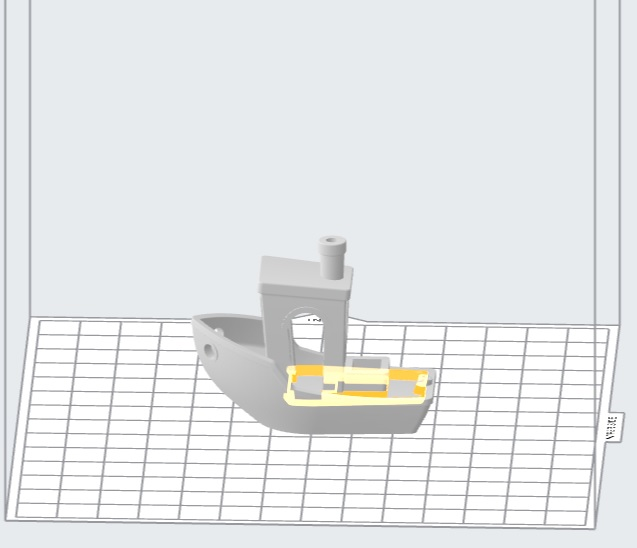
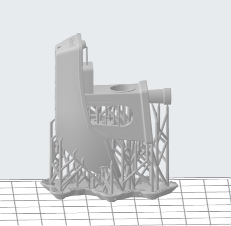

Preform Slicer
==============

Preform is the slicer that must be used with the Formlabs 2, any other slicer will not communicate with the printer. 
Very little work must be done to slice the model. On start up the slicer will ask for the printer model and type of resin 
being used. The printer will be a Form 2 named “UbiquitousSwan” and choose the resin you are using, in this case; it is white. 
The version can be found on the resin cartridge. The layer thickness should be selected for the highest resolution to get 
the highest amount of detail.

.. figure:: ../_static/images/RESIN9.jpg
    :figwidth: 500px
    :target: ../_static/images/RESIN9.jpg

Import the STL file by using the import function in the file settings or by dragging and dropping the file into the slicer window. 

One Click Print
^^^^^^^^^^^^^^^

The Preform slicer has a unique feature, the one click print. After importing the model click the magic wand icon in the tabs
in the top left corner of the program. This feature will automatically select an orientation for the part as 
well as automatically support it. The orientation may not be optimal, so try it a few times! One click printing will give 
worse results than manual orientation and support.

.. figure:: ../_static/images/RESIN11.jpg
    :figwidth: 500px
    :target: ../_static/images/RESIN11.jpg

Case Against One Click Printing
^^^^^^^^^^^^^^^^^^^^^^^^^^^^^^^
The one-click print is a very quick and easy method to get decent resin prints. However to get the best quality possible 
the part must be orientated and supported manually. This can be done by following the part orientation and support 
placement guides below. Make sure to check every layer for unsupported islands to ensure the print will succeed. 

Uploading and Starting Your Part
^^^^^^^^^^^^^^^^^^^^^^^^^^^^^^^^

Once the slicer has finished the part can be uploaded to the printer using WIFI or Ethernet. Then select the job (print) 
on the printer and hit print, it may ask you to go through a couple of checks including inspection of the build 
platform as well as opening the small tab on top of the resin cartridge.

.. figure:: ../_static/images/RESIN14.jpg
    :figwidth: 500px
    :target: ../_static/images/RESIN14.jpg

.. figure:: ../_static/images/RESIN14.1.jpg
    :figwidth: 500px
    :target: ../_static/images/RESIN14.1.jpg

Once the print has started the Form 2 will heat the resin up to the proper printing temperature and mix it with the wiper.
